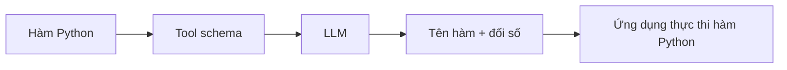

# 001 - Manual JSON Schemas và lớp trừu tượng Tool của LangChain

## 1. Tóm tắt

Khi bỏ lớp trừu tượng của LangChain và gọi trực tiếp Ollama bằng Python SDK, các hàm Python không còn tự động trở thành công cụ mà mô hình ngôn ngữ lớn có thể gọi. Developer phải tự mô tả công cụ theo định dạng mà nhà cung cấp yêu cầu hoặc dùng cơ chế chuyển đổi do chính SDK hỗ trợ.

Bài này tập trung vào hai cách biểu diễn công cụ cho Ollama: tự viết JSON schema và truyền trực tiếp hàm Python. Qua đó, ta thấy rõ giá trị của lớp trừu tượng Tool trong LangChain: chuẩn hóa cách mô tả công cụ và giảm phần tích hợp đặc thù theo từng nhà cung cấp.

## 2. Mục tiêu học tập

Sau bài này, người học có thể:

- Giải thích vì sao raw function calling cần một mô tả có cấu trúc cho từng công cụ.
- Xây dựng được JSON schema cơ bản cho một hàm Python dùng làm tool.
- Phân biệt hai cách cung cấp tool cho Ollama: JSON schema và hàm Python.
- Giải thích vai trò của Google-style docstring khi Ollama chuyển đổi trực tiếp hàm Python thành tool.
- Phân tích được lợi ích của lớp trừu tượng Tool trong LangChain khi chuyển đổi giữa nhiều nhà cung cấp mô hình.

## 3. Bối cảnh: điều gì thay đổi khi bỏ LangChain?

Trong cách triển khai dùng LangChain, `tool` decorator có thể lấy thông tin từ hàm Python và tạo biểu diễn tool phù hợp cho mô hình. Khi chuyển sang dùng trực tiếp Ollama Python SDK, lớp chuyển đổi này không còn tự động được LangChain thực hiện.

Các hàm như `get_product_price` hoặc `apply_discount` lúc này vẫn chỉ là hàm Python thông thường. Muốn LLM có thể chọn và gọi chúng, ứng dụng phải cung cấp cho mô hình một mô tả có cấu trúc về:

- tên hàm;
- mục đích của hàm;
- các tham số;
- kiểu dữ liệu của từng tham số;
- những tham số bắt buộc.

Đây chính là vai trò của tool schema.

## 4. Mô tả tool bằng JSON schema

### 4.1. Cấu trúc cốt lõi

Một tool dạng function cần mô tả được loại tool, thông tin của function và cấu trúc tham số. Với `get_product_price`, biểu diễn có thể được tổ chức như sau:

```json
{
  "type": "function",
  "function": {
    "name": "get_product_price",
    "description": "Tra cứu giá của một sản phẩm trong danh mục.",
    "parameters": {
      "type": "object",
      "properties": {
        "product": {
          "type": "string",
          "description": "Sản phẩm, ví dụ: laptop, tai nghe hoặc bàn phím."
        }
      },
      "required": ["product"]
    }
  }
}
```

Điểm quan trọng không nằm ở việc ghi nhớ từng dấu ngoặc, mà ở việc hiểu rằng schema là hợp đồng giữa ứng dụng và mô hình. Mô hình cần biết tên công cụ nào có sẵn và cần tạo ra những đối số nào khi quyết định gọi công cụ đó.

### 4.2. Danh sách tool gửi cho LLM

Khi có nhiều công cụ, các schema có thể được gom vào một danh sách như `tools_for_llm`. Mỗi phần tử mô tả một công cụ mà mô hình có quyền lựa chọn.

Luồng dữ liệu có thể hình dung như sau:



Schema không tự chạy hàm. Nó chỉ giúp LLM tạo ra một yêu cầu gọi hàm có cấu trúc. Phần thực thi vẫn do ứng dụng kiểm soát.

## 5. Hai cách cung cấp tool cho Ollama

Ollama có thể nhận tool dưới nhiều dạng. Hai cách quan trọng trong bài này là dùng JSON schema dạng dictionary hoặc truyền trực tiếp hàm Python.

### 5.1. Cách 1: tự viết JSON schema

Developer chủ động tạo schema cho từng hàm và gửi các schema này cùng lời gọi chat. Cách này làm lộ rõ toàn bộ cơ chế mà lớp abstraction thường che đi.

Ưu điểm là cấu trúc tool được nhìn thấy và kiểm soát trực tiếp. Nhược điểm là developer phải tự duy trì schema, và phần tích hợp dễ trở nên đặc thù theo từng nhà cung cấp.

### 5.2. Cách 2: truyền trực tiếp hàm Python

Ollama có thể chuyển đổi một hàm Python thành tool. Tuy nhiên, trong cách được trình bày ở bài này, hàm cần có docstring theo phong cách Google để SDK có đủ thông tin mô tả hàm, tham số và giá trị trả về.

Một Google-style docstring thường thể hiện ba nhóm thông tin:

- mô tả mục đích của hàm;
- `Args` để mô tả tham số;
- `Returns` để mô tả kết quả trả về.

Điều này cho thấy việc "tự động tạo tool" vẫn cần metadata có cấu trúc. LangChain hoặc SDK chỉ thay developer thực hiện bước chuyển đổi metadata đó sang định dạng mà mô hình cần.

## 6. Vì sao abstraction của LangChain hữu ích?

Vấn đề trở nên rõ hơn khi ứng dụng không chỉ dùng Ollama. Một nhà cung cấp khác như Anthropic cũng yêu cầu mô tả tool có cấu trúc, nhưng tên trường và hình thức schema có thể khác.

Nếu ứng dụng tự tích hợp từng provider, mỗi lần chuyển model hoặc provider có thể kéo theo việc sửa:

- tool schema;
- định dạng message;
- quy ước tên role;
- cách đọc tool call từ response;
- logic tracing và adapter liên quan.

LangChain giảm phần việc này bằng cách tạo lớp giao diện chung. Developer mô tả tool ở một mức trừu tượng cao hơn, còn LangChain chịu trách nhiệm chuyển đổi sang định dạng phù hợp với provider.

| Cách tiếp cận | Developer tự làm | Mức phụ thuộc provider |
| --- | --- | --- |
| Raw SDK + JSON schema | Schema, message format, response parsing, thực thi tool | Cao |
| Raw SDK + Python function | Docstring/metadata và logic agent | Vẫn phụ thuộc SDK/provider |
| LangChain Tool abstraction | Mô tả tool ở giao diện LangChain | Thấp hơn ở tầng ứng dụng |

## 7. Tracing khi dùng raw SDK

Khi bỏ các object LangChain, một số tích hợp tự động cũng không còn đi theo luồng cũ. Trong phần triển khai, các hàm Python vẫn có thể được bọc bằng `traceable` của LangSmith để quan sát quá trình chạy trong trace riêng.

Điểm cần ghi nhớ là abstraction không chỉ giúp tạo schema. Nó còn có thể gom nhiều tiện ích tích hợp như tracing vào một luồng làm việc thống nhất.

## 8. Những điểm dễ nhầm

### 8.1. Tool schema không phải là hàm thực thi

Schema chỉ mô tả công cụ. Ứng dụng vẫn phải ánh xạ tên tool mà LLM chọn về đúng hàm Python và gọi hàm đó.

### 8.2. Tự động chuyển đổi không có nghĩa là không cần metadata

Khi truyền trực tiếp hàm Python cho Ollama, thông tin trong docstring vẫn đóng vai trò quan trọng để SDK xây dựng tool representation.

### 8.3. Định dạng của một provider không nên được coi là chuẩn chung

Ollama và Anthropic có thể dùng các quy ước khác nhau. Viết toàn bộ ứng dụng bám cứng vào một định dạng provider sẽ làm tăng chi phí chuyển đổi sau này.

## 9. Tổng kết

Raw function calling làm lộ rõ một trách nhiệm mà framework thường xử lý tự động: chuyển hàm của ứng dụng thành mô tả tool mà LLM có thể hiểu. Với Ollama, developer có thể tự viết JSON schema hoặc truyền trực tiếp hàm Python với docstring phù hợp. LangChain giải quyết cùng bài toán ở mức abstraction cao hơn bằng cách tự sinh biểu diễn tool theo từng provider, qua đó giảm lượng mã tích hợp đặc thù và giúp việc thay đổi nhà cung cấp dễ quản lý hơn.
