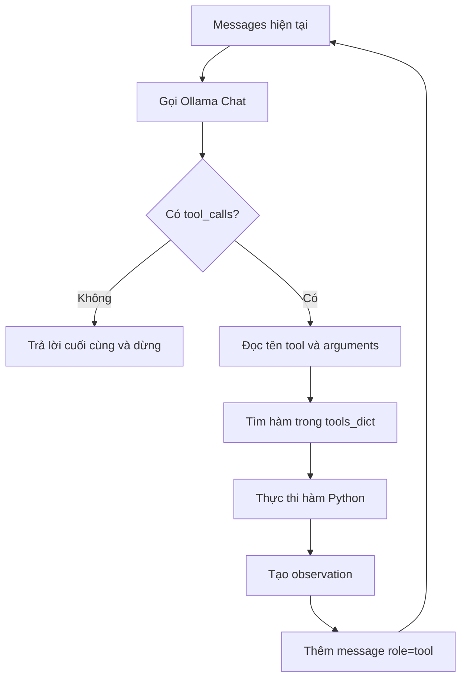

# 002 - Xây dựng vòng lặp ReAct bằng Raw Ollama SDK

## 1. Tóm tắt

Sau khi đã có tool schema, bước tiếp theo là tự xây dựng vòng lặp agent mà không dựa vào các object của LangChain. Ứng dụng phải trực tiếp quản lý message, gọi Ollama Chat, đọc `tool_calls`, ánh xạ tên tool sang hàm Python, thực thi hàm, đưa observation trở lại lịch sử hội thoại và lặp lại cho đến khi mô hình không còn yêu cầu gọi tool.

Bài này cho thấy chính xác những công việc mà một agent framework thường che đi phía sau abstraction.

## 2. Mục tiêu học tập

Sau bài này, người học có thể:

- Mô tả được các bước của một ReAct-style agent loop dùng raw Ollama SDK.
- Tổ chức message bằng các role phù hợp với Ollama.
- Tạo mapping từ tên tool sang hàm Python để thực thi động.
- Đọc tên hàm và arguments từ `tool_calls` trong phản hồi Ollama.
- Đưa kết quả thực thi tool trở lại vòng lặp dưới dạng observation.
- Xác định điều kiện dừng khi mô hình không còn trả về tool call.
- Giải thích vì sao code raw SDK phụ thuộc provider nhiều hơn code dùng LangChain abstraction.

## 3. Gọi Ollama Chat và giữ khả năng tracing

Trong triển khai raw SDK, lời gọi chat không còn đi qua chat model của LangChain. Vì vậy, một hàm phụ được dùng để gọi Ollama Chat và được bọc bằng `traceable` của LangSmith để trace có thể hiển thị rõ từng lần gọi LLM.

Hàm chat nhận danh sách message, model và danh sách tool schema. Model được sử dụng trong phần triển khai là Qwen3.

Điểm khác biệt ở đây là tracing phải được gắn rõ vào lời gọi raw SDK. Khi dùng LangChain, phần tích hợp với LangSmith đã được framework xử lý ở mức cao hơn.

## 4. Tạo `tools_dict` để ánh xạ tên tool sang hàm Python

Khi dùng LangChain Tool, code có thể dựa vào metadata của object tool. Với raw Ollama, phần triển khai tạo một dictionary thủ công để tìm hàm Python theo tên mà LLM trả về.

Về mặt ý tưởng:

```text
"get_product_price" -> hàm get_product_price
"apply_discount"    -> hàm apply_discount
```

`tools_dict` là cầu nối giữa hai thế giới:

- phía LLM chỉ biết tên tool dưới dạng dữ liệu;
- phía chương trình cần một callable Python thực sự để chạy.

Nếu thiếu bước ánh xạ này, ứng dụng có thể biết LLM muốn gọi tool nào nhưng chưa có cách an toàn và rõ ràng để chuyển tên đó thành hàm cần thực thi.

## 5. Message format khi không dùng LangChain

LangChain cung cấp các object message như human message hoặc system message và xử lý phần chuyển đổi sang định dạng provider. Khi gọi trực tiếp Ollama, message được biểu diễn theo cấu trúc mà Ollama hiểu.

Ví dụ về các role xuất hiện trong vòng lặp:

- `system`: chứa system prompt;
- `user`: chứa câu hỏi của người dùng;
- `assistant`: phản hồi của mô hình;
- `tool`: chứa observation sau khi ứng dụng thực thi công cụ.

Điểm quan trọng là tên role không phải lúc nào cũng giống nhau giữa các provider. Một hệ thống dùng raw SDK phải tự chịu trách nhiệm với khác biệt này.

## 6. Cấu trúc phản hồi và `tool_calls`

Kết quả trả về từ Ollama không phải là LangChain `AIMessage`. Response chứa một message của Ollama, và message này có thể chứa `tool_calls`.

Mỗi tool call cung cấp thông tin cần để thực thi công cụ, đặc biệt là:

- tên function được chọn;
- arguments cần truyền vào function.

Trong phần triển khai, thông tin này được lấy từ object `tool_call`, đi qua phần `function`, sau đó đọc `name` và `arguments`.

Đây là điểm abstraction thường giúp chuẩn hóa: cùng một ý nghĩa "mô hình muốn gọi hàm X với tham số Y" nhưng object và đường dẫn truy cập dữ liệu có thể khác giữa LangChain và raw Ollama.

## 7. Vòng lặp ReAct ở mức raw SDK

Luồng xử lý tổng quát có thể biểu diễn như sau:



### 7.1. Bước suy luận

Ứng dụng gửi toàn bộ message hiện tại cùng danh sách tool cho Ollama. Mô hình quyết định trả lời trực tiếp hay yêu cầu gọi một hoặc nhiều tool.

### 7.2. Bước chọn và thực thi tool

Nếu có `tool_calls`, ứng dụng đọc tên function và arguments, dùng `tools_dict` để lấy đúng hàm Python rồi gọi hàm với các tham số tương ứng.

Kết quả của lần thực thi này là observation.

### 7.3. Đưa observation trở lại LLM

Observation được thêm vào lịch sử hội thoại bằng một message có role `tool`. Ở vòng lặp kế tiếp, mô hình nhận được cả câu hỏi ban đầu lẫn kết quả của tool vừa chạy để quyết định bước tiếp theo.

### 7.4. Điều kiện dừng

Khi response không còn `tool_calls`, agent không cần thực thi thêm công cụ. Nội dung trả lời lúc đó trở thành kết quả cuối cùng và vòng lặp kết thúc.

## 8. Ví dụ chuỗi xử lý nhiều bước

Truy vấn minh họa yêu cầu xác định giá laptop sau khi áp dụng ưu đãi vàng. Agent không hoàn thành bằng một tool duy nhất mà đi qua nhiều vòng:

1. LLM chọn `get_product_price` với sản phẩm là laptop.
2. Ứng dụng thực thi tool và đưa giá nhận được trở lại LLM.
3. Ở vòng tiếp theo, LLM chọn `apply_discount` với các đối số phù hợp.
4. Ứng dụng thực thi tool giảm giá và đưa observation mới trở lại LLM.
5. Ở vòng thứ ba, mô hình không yêu cầu tool call mới nên agent kết thúc.

Kết quả được quan sát trong phần triển khai là `1.099`, và trace xác nhận cả `get_product_price` lẫn `apply_discount` đã được gọi.

Ví dụ này thể hiện bản chất của agent loop: LLM không trực tiếp thực thi code. Nó chọn hành động; ứng dụng thực thi hành động; kết quả được trả lại cho LLM để tiếp tục suy luận.

## 9. So sánh trách nhiệm của raw SDK và LangChain

| Thành phần | Raw Ollama SDK | Khi dùng LangChain abstraction |
| --- | --- | --- |
| Message format | Tự tạo theo quy ước Ollama | Được abstraction chuẩn hóa |
| Tool mapping | Tự tạo `tools_dict` | Tool object cung cấp metadata ở mức framework |
| Parse tool call | Đọc object Ollama trực tiếp | Giao diện LangChain thống nhất hơn |
| Thực thi tool | Tự gọi hàm Python | Có abstraction hỗ trợ |
| Tool observation | Tự tạo message role `tool` | Có message/tool abstractions |
| Tracing | Chủ động bọc raw call bằng `traceable` | Tích hợp thuận tiện hơn |
| Chuyển provider | Phải sửa nhiều phần đặc thù | Giảm mã phụ thuộc provider |

## 10. Lỗi dễ gặp khi tự viết agent loop

### 10.1. Nhầm response Ollama với LangChain `AIMessage`

Hai object có cấu trúc khác nhau. Code parse tool call phải phù hợp với object do Ollama SDK trả về.

### 10.2. Có tên tool nhưng không có mapping thực thi

LLM chỉ trả về tên và arguments. Ứng dụng phải có `tools_dict` hoặc cơ chế tương đương để lấy được callable thật.

### 10.3. Quên đưa observation trở lại message history

Nếu kết quả tool không được gửi lại cho LLM, mô hình không có dữ liệu để tiếp tục bước suy luận kế tiếp.

### 10.4. Không có điều kiện dừng rõ ràng

Vòng lặp phải kiểm tra việc không còn `tool_calls` để kết thúc đúng lúc.

## 11. Tổng kết

Một ReAct agent loop dùng raw Ollama SDK gồm bốn trách nhiệm cốt lõi: gọi LLM, đọc tool call, thực thi hàm Python và đưa observation trở lại LLM. Chu trình lặp cho đến khi mô hình không còn yêu cầu công cụ. Việc tự triển khai cho thấy rõ những khác biệt về message, response object, tool mapping và tracing mà LangChain thường chuẩn hóa thay cho developer.
