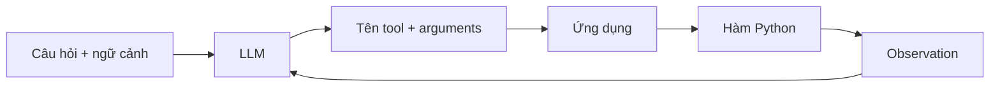

# 003 - Tổng kết Layer 2: Raw Function Calling

## 1. Mục tiêu ôn tập

Sau phần tổng kết này, người học có thể:

- Giải thích được function calling ở mức cơ chế thay vì xem nó như một tính năng "tự động" của framework.
- Mô tả vai trò của LLM và vai trò của ứng dụng trong quá trình gọi tool.
- Phân biệt phần logic agent cốt lõi với các lớp abstraction do LangChain cung cấp.
- Liên hệ việc tự triển khai raw Ollama SDK với lợi ích của LangChain Tool và message abstraction.

## 2. Từ agent loop đến raw function calling

Mục tiêu của phần học là bóc tách dần các lớp abstraction để nhìn thấy những gì thực sự xảy ra khi một agent hoạt động.

Ở cách triển khai dùng LangChain, agent loop có thể làm việc thông qua các object như chat model, message và tool. Khi chuyển sang raw Ollama SDK, cùng một luồng logic vẫn tồn tại, nhưng developer phải tự thực hiện nhiều bước mà framework trước đó xử lý tự động.

Điều này cho thấy abstraction không thay đổi bản chất của agent. Nó chủ yếu chuẩn hóa giao diện và giảm phần mã tích hợp lặp lại.

## 3. Function calling không phải là phép thuật

Trong cả cách triển khai dùng LangChain lẫn raw SDK, function calling dựa trên cùng một chu trình cơ bản:

LLM chịu trách nhiệm chọn công cụ phù hợp và tạo arguments có cấu trúc. Ứng dụng chịu trách nhiệm đọc yêu cầu đó, gọi hàm thật và đưa kết quả trở lại mô hình.

Vì vậy, mô hình không trực tiếp chạy `get_product_price` hay `apply_discount`. Mô hình tạo ra quyết định có cấu trúc để ứng dụng thực thi.

## 4. Những gì LangChain giải quyết

Qua việc tự triển khai raw function calling, có thể nhìn thấy rõ các trách nhiệm mà abstraction của LangChain giúp giảm bớt:

- chuyển hàm Python thành mô tả tool;
- chuẩn hóa message ở tầng ứng dụng;
- chuẩn hóa cách biểu diễn tool call;
- giảm khác biệt giữa các provider;
- tích hợp tracing thuận tiện hơn;
- cung cấp các object và interface thống nhất để xây agent loop.

Giá trị của framework vì thế không nằm ở việc tạo ra một cơ chế hoàn toàn khác, mà ở việc đóng gói và chuẩn hóa những thao tác lặp lại, dễ sai và phụ thuộc provider.

## 5. Chuỗi kiến thức của Layer 2

Layer này có thể được hệ thống hóa theo ba bước:

1. **Mô tả tool**: biến thông tin về hàm Python thành schema mà LLM có thể hiểu.
2. **Xây agent loop**: nhận tool call, thực thi hàm và trả observation về cho LLM.
3. **Nhìn lại abstraction**: so sánh phần phải tự làm với những gì LangChain đã xử lý tự động.

Hai cách triển khai khác nhau ở mức công cụ và API, nhưng cùng dựa trên function calling để nhận được tên hàm và arguments trong định dạng có cấu trúc.

## 6. Điểm cần ghi nhớ

- Function calling là giao thức phối hợp giữa LLM và ứng dụng, không phải việc LLM trực tiếp thực thi code.
- Tool schema giúp mô hình biết những hành động nào có sẵn và cách tạo arguments.
- Agent loop phải có logic thực thi tool và đưa observation trở lại mô hình.
- Raw SDK làm lộ rõ các chi tiết phụ thuộc provider.
- LangChain giảm phần mã tích hợp bằng các lớp abstraction chung.
- Hiểu các lớp bên dưới giúp đánh giá framework dựa trên vấn đề mà nó giải quyết, thay vì chỉ học cách gọi API.

## 7. Tự kiểm tra

1. Vì sao LLM cần tool schema nếu hàm Python đã tồn tại trong code?
2. Trong function calling, phần nào do LLM quyết định và phần nào do ứng dụng thực thi?
3. Vì sao `tools_dict` cần thiết trong triển khai raw Ollama SDK?
4. Observation phải được đưa trở lại agent loop vì lý do gì?
5. Những phần nào của raw implementation làm tăng chi phí khi chuyển sang provider khác?

## 8. Tổng kết

Layer 2 cho thấy function calling từ góc nhìn implementation: tool phải được mô tả, LLM phải trả về lời gọi có cấu trúc, ứng dụng phải thực thi công cụ và vòng lặp phải tiếp tục bằng observation. Khi các bước này được nhìn thấy trực tiếp, vai trò của LangChain trở nên rõ ràng hơn: framework cung cấp abstraction để chuẩn hóa và giảm mã phụ thuộc provider, nhưng logic agent nền tảng vẫn là chu trình suy luận, hành động và quan sát.
