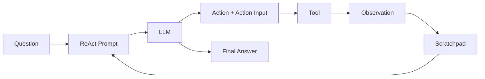

# 001 - Nền tảng ReAct và Function Calling

## 1. Tóm tắt

ReAct prompt là nền tảng để xây dựng một agent có khả năng **suy luận về bước tiếp theo, lựa chọn công cụ, nhận kết quả từ công cụ và tiếp tục xử lý** mà không cần dùng function calling native của mô hình.

Trong cách tiếp cận này, LLM không nhận một schema function-call được hệ thống xử lý sẵn. Thay vào đó, chương trình cung cấp cho LLM:

- danh sách công cụ;
- mô tả chi tiết từng công cụ;
- định dạng đầu ra bắt buộc;
- câu hỏi của người dùng;
- lịch sử các bước đã thực hiện.

LLM trả về văn bản theo định dạng ReAct. Chương trình phía ngoài sẽ phân tích văn bản đó, xác định công cụ cần gọi, thực thi công cụ rồi đưa kết quả trở lại vòng lặp.

## 2. Mục tiêu học tập

Sau bài này, người học có thể:

- giải thích được vai trò của ReAct prompt trong một agent;
- phân biệt mô tả công cụ với danh sách tên công cụ;
- mô tả được chu trình `Thought → Action → Action Input → Observation`;
- giải thích vai trò của `agent_scratchpad`;
- mô tả được cách ReAct tạo nền tảng cho manual tool calling.

## 3. Bài toán cần giải quyết

Một LLM chỉ nhận văn bản không tự biết các hàm Python đang tồn tại trong chương trình. Nếu hệ thống có hai công cụ như:

- `get_product_price`;
- `apply_discount`;

thì mô hình cần biết ít nhất:

- tên công cụ;
- tham số đầu vào;
- kiểu dữ liệu của tham số;
- giá trị trả về;
- mục đích sử dụng;
- trường hợp nên chọn công cụ.

ReAct prompt biến những thông tin này thành ngữ cảnh để LLM có thể quyết định bước tiếp theo bằng đầu ra văn bản có cấu trúc.

## 4. Cấu trúc cốt lõi của ReAct prompt

Một ReAct prompt điển hình sử dụng luồng:

```text
Question
Thought
Action
Action Input
Observation
...
Final Answer
```

Ý nghĩa của từng thành phần:

| Thành phần | Vai trò |
|---|---|
| `Question` | Câu hỏi hoặc yêu cầu cần giải quyết |
| `Thought` | Bước lập kế hoạch/suy luận của agent theo định dạng prompt |
| `Action` | Tên công cụ agent muốn sử dụng |
| `Action Input` | Dữ liệu cần truyền cho công cụ |
| `Observation` | Kết quả thực thi công cụ |
| `Final Answer` | Câu trả lời cuối cùng khi agent đã đủ thông tin |

Chu trình từ `Thought` đến `Observation` có thể lặp lại nhiều lần. Đây chính là cơ sở của **agent loop**.

## 5. Hai phần thông tin về công cụ

ReAct prompt sử dụng hai loại dữ liệu khác nhau về công cụ.

**Danh sách tên công cụ** giúp giới hạn giá trị hợp lệ của `Action`. Ví dụ:

```text
[get_product_price, apply_discount]
```

**Mô tả công cụ** chứa nhiều thông tin hơn, chẳng hạn chữ ký hàm, tham số, kiểu dữ liệu, giá trị trả về và docstring.

Sự tách biệt này giúp prompt vừa quy định rõ tên action hợp lệ, vừa cung cấp đủ ngữ nghĩa để LLM lựa chọn đúng công cụ.

## 6. Agent scratchpad

`agent_scratchpad` lưu lịch sử hoạt động của agent qua các vòng lặp.

Scratchpad có thể chứa:

- công cụ đã được chọn;
- đầu vào đã truyền cho công cụ;
- observation nhận được;
- lịch sử các bước đã thực hiện.

Khi bắt đầu vòng lặp tiếp theo, scratchpad được ghép trở lại prompt. Nhờ đó, mô hình không chỉ nhìn thấy câu hỏi ban đầu mà còn nhìn thấy trạng thái làm việc đã tích lũy.

Luồng tổng quát:



Nếu LLM yêu cầu một action, chương trình gọi tool và bổ sung observation vào scratchpad. Nếu LLM đã có câu trả lời cuối cùng, vòng lặp kết thúc.

## 7. Tại sao cách tiếp cận này quan trọng

Manual ReAct giúp người học nhìn rõ những thành phần mà function calling hiện đại thường che giấu:

- LLM cần được cung cấp thông tin về tool;
- đầu ra của LLM phải được phân tích;
- chương trình phải ánh xạ tên tool sang hàm thật;
- observation phải được đưa trở lại model;
- hệ thống cần xác định khi nào tiếp tục và khi nào dừng.

Vì vậy, ReAct không chỉ là một mẫu prompt. Nó còn mô tả một **giao thức phối hợp giữa LLM và chương trình điều khiển**.

## 8. Điểm cần ghi nhớ

ReAct prompt không tự thực thi công cụ. LLM chỉ tạo ra quyết định dưới dạng văn bản. Phần thực thi vẫn do chương trình bên ngoài đảm nhiệm.

Mô hình tổng quát là:

```text
LLM quyết định
    ↓
Program phân tích
    ↓
Program thực thi
    ↓
Program trả Observation
    ↓
LLM quyết định tiếp
```

Đây là nền tảng để các bài sau triển khai mô tả công cụ động, stop sequence, parsing và agent loop.
