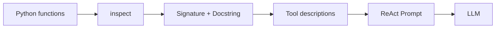

# 002 - Tạo mô tả công cụ động bằng Python

## 1. Tóm tắt

Khi không dùng function calling native, LLM không tự nhận được schema của các hàm. Chương trình phải chuyển metadata của các hàm Python thành văn bản rồi chèn văn bản đó vào ReAct prompt.

Bài này xây dựng cơ chế tạo **tool descriptions động** bằng `inspect`, từ đó giúp LLM biết công cụ nào tồn tại, nhận tham số gì và được dùng trong trường hợp nào.

## 2. Mục tiêu học tập

Sau bài này, người học có thể:

- tổ chức các công cụ trong một dictionary ánh xạ tên sang hàm;
- dùng `inspect.signature()` để lấy chữ ký hàm;
- dùng `inspect.getdoc()` để lấy docstring;
- truy cập hàm gốc qua `__wrapped__` khi hàm đã được decorator bọc;
- ghép metadata của nhiều công cụ thành chuỗi đưa vào ReAct prompt;
- tạo danh sách tên công cụ dùng để giới hạn `Action`.

## 3. Từ native function calling sang mô tả văn bản

Trong function calling native, hệ thống có thể nhận dữ liệu cấu trúc mô tả function và arguments. Ở cách triển khai ReAct thô, phản hồi từ LLM chỉ là văn bản.

Do đó, chương trình cần tự làm hai việc:

1. chuyển thông tin về hàm thành prompt;
2. về sau phân tích đầu ra văn bản của LLM để xác định hàm cần gọi.

Bài này tập trung vào bước thứ nhất.

## 4. Tạo bảng tra cứu công cụ

Các công cụ được tổ chức thành dictionary:

```python
tools = {
    "get_product_price": get_product_price,
    "apply_discount": apply_discount,
}
```

Cấu trúc này giải quyết hai nhu cầu:

- tra cứu hàm thật từ `tool_name`;
- lặp qua toàn bộ công cụ để sinh metadata.

Khi LLM trả về một action như `apply_discount`, chương trình có thể dùng tên đó để tìm đúng callable trong dictionary.

## 5. Lấy metadata bằng inspect

Python cung cấp module `inspect` để đọc thông tin của callable khi chương trình đang chạy.

Hai phần metadata quan trọng là:

```python
inspect.signature(function)
inspect.getdoc(function)
```

`inspect.signature()` cho biết cấu trúc lời gọi của hàm, bao gồm tham số và annotation kiểu dữ liệu nếu có.

`inspect.getdoc()` lấy docstring. Trong agent, docstring đặc biệt quan trọng vì nó mô tả **mục đích và trường hợp sử dụng công cụ**, giúp LLM quyết định nên chọn tool nào.

## 6. Làm việc với hàm đã được decorator bọc

Trong nội dung triển khai, các công cụ được theo dõi bằng decorator `traceable` của LangSmith. Vì vậy, object hiện tại là wrapper chứ không phải trực tiếp hàm gốc.

Để lấy metadata của hàm gốc, truy cập:

```python
original_function = tool.__wrapped__
```

Sau đó mới đọc:

```python
signature = inspect.signature(original_function)
docstring = inspect.getdoc(original_function)
```

Điểm này quan trọng vì metadata cần phản ánh đúng callable mà tool đại diện.

## 7. Xây dựng get_tool_descriptions()

Luồng của hàm `get_tool_descriptions()` gồm:

1. nhận dictionary công cụ;
2. lặp qua từng cặp `tool_name`, `tool`;
3. lấy hàm gốc;
4. lấy `signature`;
5. lấy `docstring`;
6. định dạng thành chuỗi;
7. ghép tất cả mô tả thành một khối văn bản.

Một phiên bản bám sát cơ chế của bài học:

```python
import inspect

def get_tool_descriptions(tools):
    descriptions = []

    for tool_name, tool in tools.items():
        original_function = tool.__wrapped__
        signature = inspect.signature(original_function)
        docstring = inspect.getdoc(original_function)

        descriptions.append(
            f"{tool_name}{signature}\n{docstring}"
        )

    return "\n".join(descriptions)
```

Kết quả không phải JSON. Đây là một chuỗi văn bản dài được đưa thẳng vào ReAct prompt.

## 8. Tạo danh sách tên công cụ

Ngoài mô tả chi tiết, ReAct prompt còn cần danh sách các tên action hợp lệ.

Có thể tạo từ các key của dictionary:

```python
tool_names = ", ".join(tools.keys())
```

Hai biến phục vụ hai mục đích khác nhau:

```text
tool_descriptions
→ giúp LLM hiểu từng công cụ

tool_names
→ quy định những Action nào được phép chọn
```

## 9. Chèn dữ liệu vào ReAct prompt

ReAct prompt được tạo dưới dạng chuỗi động. Hai placeholder quan trọng là:

- mô tả các công cụ;
- tên các công cụ.

Ngoài ra, khi chương trình chạy, câu hỏi của người dùng cũng được chèn động vào prompt.

Có thể hình dung:

```text
Available tools:
{tool_descriptions}

Action must be one of:
[{tool_names}]

Question:
{question}
```

Mục tiêu không phải để LLM thực thi Python trực tiếp. Prompt chỉ cung cấp đủ thông tin để mô hình **chọn tool và sinh Action Input**.

## 10. Vì sao cần tạo mô tả động

Nếu mô tả công cụ được viết tay ở nhiều nơi, code và prompt có thể lệch nhau khi chữ ký hàm hoặc docstring thay đổi.

Sinh mô tả từ chính function metadata giúp giảm sự lặp lại và giữ prompt gần với implementation hơn.

Luồng dữ liệu là:



## 11. Điểm dễ sai

Không nên nhầm `tool_names` với `tool_descriptions`. Chỉ cung cấp tên là chưa đủ để LLM hiểu mục đích hoặc tham số của tool.

Khi function bị decorator bọc, metadata của wrapper có thể không phản ánh đúng hàm gốc. Trong triển khai của bài, cần dùng `__wrapped__`.

Docstring cũng không chỉ là tài liệu cho developer. Trong kiến trúc này, nó trở thành một phần dữ liệu điều khiển hành vi chọn tool của LLM.

## 12. Tổng kết

Bài này đã hoàn thiện phần **tool metadata → prompt** của manual tool calling.

Pipeline hiện tại:

```text
Tool dictionary
    ↓
inspect.signature()
inspect.getdoc()
    ↓
tool_descriptions
tool_names
    ↓
ReAct Prompt
```

Bước tiếp theo là dùng prompt này để nhận đầu ra văn bản từ LLM, kiểm soát điểm dừng và phân tích action cần thực thi.
