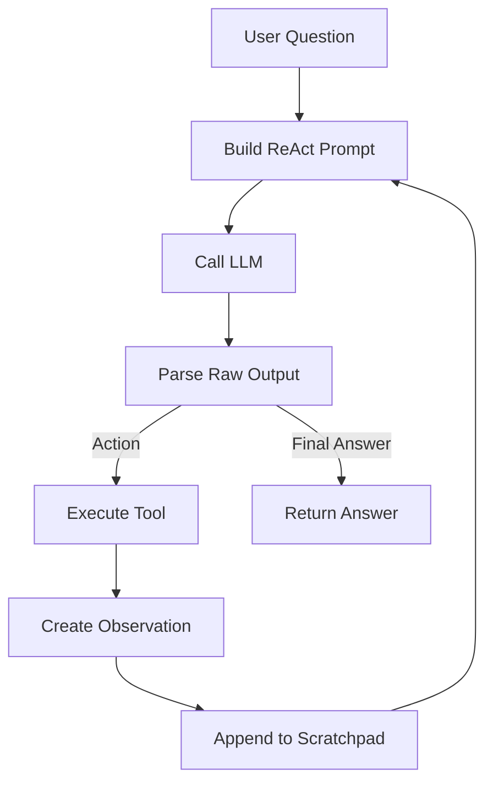

# 003 - Hiểu ReAct Prompt và Agent không dùng Function Calling

## 1. Tóm tắt

Một agent không nhất thiết phải phụ thuộc vào function calling native. Với ReAct, LLM có thể được hướng dẫn bằng prompt để tạo ra các bước có cấu trúc, còn chương trình bên ngoài chịu trách nhiệm phân tích và thực thi công cụ.

Bài này hệ thống hóa các thành phần chính của cơ chế đó: **ReAct prompt format, stop sequence, output parsing, manual tool calling và agent loop**.

## 2. Mục tiêu học tập

Sau bài này, người học có thể:

- mô tả ranh giới trách nhiệm giữa LLM và chương trình điều khiển;
- giải thích được vì sao đầu ra ReAct cần định dạng ổn định;
- liên hệ `Action`, `Action Input`, `Observation` với quá trình gọi tool;
- mô tả vai trò của parser và stop sequence trong agent không dùng function calling;
- mô tả được chu trình tổng quát của một agent loop.

## 3. LLM không trực tiếp gọi hàm

Trong kiến trúc manual tool calling, LLM chỉ tạo văn bản.

Ví dụ về ý nghĩa của một phản hồi ReAct:

```text
Action: get_product_price
Action Input: laptop
```

Đoạn văn bản này chưa làm cho `get_product_price()` chạy. Chương trình phải:

- đọc output;
- trích xuất tên action;
- trích xuất action input;
- tra cứu hàm tương ứng;
- thực thi hàm;
- lấy kết quả làm observation.

Do đó, LLM đóng vai trò **ra quyết định**, còn chương trình đóng vai trò **thực thi và điều phối**.

## 4. Định dạng là giao diện giữa LLM và chương trình

Khi không có JSON function-call do model API cung cấp, định dạng ReAct trở thành giao diện giao tiếp.

Các nhãn như:

```text
Action:
Action Input:
Observation:
Final Answer:
```

giúp chương trình nhận biết LLM đang yêu cầu tool hay đã hoàn tất câu trả lời.

Nếu output không tuân thủ format, parser phía chương trình có thể không xác định được bước tiếp theo.

## 5. Vai trò của stop sequence

Một vấn đề của mô hình sinh văn bản là nó có thể tiếp tục tự tạo cả phần `Observation`, dù observation thực tế phải đến từ tool.

Stop sequence được dùng để chặn việc sinh tiếp tại ranh giới thích hợp.

Ý tưởng là:

```text
LLM sinh:
Thought
Action
Action Input

→ dừng trước Observation
```

Sau đó chương trình mới thực thi tool và tự bổ sung observation thật vào lịch sử.

## 6. Vai trò của output parsing

Vì đầu ra là raw text, hệ thống cần parser để xác định:

- đây là yêu cầu gọi tool hay final answer;
- action name là gì;
- action input là gì.

Trong module này, regular expression được đưa vào như công cụ để phân tích output thô.

Parser là cầu nối:

```text
LLM text
   ↓
Parser
   ↓
Structured decision
   ↓
Tool execution hoặc Final Answer
```

## 7. Agent loop hoàn chỉnh

Khi ghép các thành phần lại, agent hoạt động theo vòng lặp:



ReAct prompt định nghĩa cách model giao tiếp. Parser đọc quyết định. Tool executor thực hiện hành động. Scratchpad lưu trạng thái. Vòng lặp tiếp tục cho đến khi có `Final Answer`.

## 8. Điều cần phân biệt

**ReAct prompt** là quy tắc và format điều khiển cách model trả lời.

**Manual tool calling** là cơ chế chương trình đọc action và tự gọi hàm.

**Agent loop** là vòng lặp kết nối model, parser, tool và observation.

Ba khái niệm liên quan chặt chẽ nhưng không đồng nhất.

## 9. Tổng kết

Một agent ReAct không dùng native function calling vẫn có thể lựa chọn công cụ nếu hệ thống cung cấp:

- tool descriptions;
- tool names;
- format đầu ra;
- parser;
- tool lookup;
- observation;
- scratchpad;
- điều kiện dừng.

Bài tiếp theo tập trung vào phần triển khai LLM call, `stop sequence` và cách lấy raw output để chuẩn bị cho parser.
