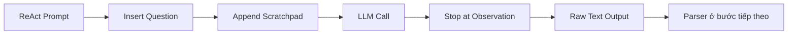

# 004 - Triển khai Manual Tool Calling cho LLM

## 1. Tóm tắt

Sau khi đã có ReAct prompt và mô tả công cụ, bước tiếp theo là gọi LLM theo cách không dùng native tool calling.

Điểm quan trọng của triển khai này là:

- gửi toàn bộ ReAct prompt dưới dạng văn bản;
- duy trì `scratchpad`;
- đặt `stop sequence` tại `\nObservation`;
- dùng `temperature = 0` để tăng tính nhất quán;
- lấy raw text output để chuẩn bị cho bước parsing.

## 2. Mục tiêu học tập

Sau bài này, người học có thể:

- cấu hình lời gọi LLM mà không truyền native tools;
- giải thích được vai trò của `stop = "\nObservation"`;
- mô tả cách câu hỏi và scratchpad được ghép vào ReAct prompt;
- phân biệt raw text output với một AI message đã được framework chuẩn hóa;
- giải thích vì sao output cần được dừng trước khi model tự sinh observation.

## 3. Loại bỏ native tool calling

Trong phiên bản trước, lời gọi model có thể nhận thông tin tools trực tiếp. Với ReAct thủ công, phần đó được loại bỏ.

Hàm gọi model chỉ cần các thành phần chính:

- model;
- message/prompt;
- options.

Thông tin công cụ đã nằm trong ReAct prompt dưới dạng văn bản nên không cần truyền lại như native tool schema.

## 4. Tạo prompt cho mỗi lần lặp

Khi chạy agent, câu hỏi của người dùng được chèn động vào ReAct prompt.

Scratchpad ban đầu là danh sách rỗng:

```python
scratchpad = []
```

Sau khi agent thực hiện các bước, lịch sử được nối vào prompt cho vòng tiếp theo.

Có thể hình dung full prompt như:

```text
ReAct instructions
+ tool descriptions
+ tool names
+ user question
+ scratchpad
```

Toàn bộ nội dung được gửi đến LLM như một khối văn bản.

## 5. Dùng stop sequence để bảo vệ ranh giới Observation

Cấu hình quan trọng của lời gọi model là:

```python
options = {
    "stop": ["\nObservation"],
    "temperature": 0,
}
```

Mục đích của stop sequence là ngăn LLM tiếp tục tự sinh phần observation.

Agent chỉ nên để LLM tạo tới:

```text
Thought: ...
Action: ...
Action Input: ...
```

Sau đó chương trình dừng generation, thực thi tool thật và cung cấp observation thật.

## 6. Điều gì xảy ra nếu bỏ stop sequence

Khi không có điểm dừng, LLM có thể tiếp tục sinh:

```text
Observation: ...
```

Dữ liệu đó không đến từ tool thật mà chỉ là nội dung do model tự tạo.

Điều này phá vỡ kiến trúc agent vì observation phải phản ánh kết quả thực thi của chương trình, không phải phỏng đoán của mô hình.

Vì vậy, stop sequence ở đây không chỉ để rút ngắn output. Nó tạo **ranh giới quyền hạn**:

```text
LLM
→ quyết định Action và Action Input

Program
→ thực thi tool và tạo Observation
```

## 7. Temperature và tính nhất quán

Trong triển khai, `temperature` được đặt bằng `0`.

Mục tiêu là làm cho output theo format ổn định hơn, từ đó giảm biến động cho parser ở bước sau.

Với manual parsing, tính nhất quán của cấu trúc đầu ra rất quan trọng vì chương trình sẽ dựa vào các nhãn như `Action` và `Action Input`.

## 8. Lấy raw output

Phản hồi của model được lấy từ trường nội dung của message và được xem như raw text.

Điểm cần phân biệt: ở giai đoạn này, output chưa phải một đối tượng AI message có ngữ nghĩa tool-call hoàn chỉnh. Nó chỉ là văn bản do LLM sinh ra.

Đó là lý do biến kết quả được xem như `output` để chuẩn bị cho bước parser.

## 9. Luồng dữ liệu của một lần gọi LLM



Ở thời điểm này, tool chưa được gọi. Hệ thống mới chỉ thu được quyết định từ LLM.

## 10. Điểm dễ sai

Không nên để model tự tạo observation. Nếu observation do model sinh, agent không còn phản ánh trạng thái thật của hệ thống.

Không nên nhầm raw text với function-call object. Trong cách làm này, parser phải tự chuyển text thành quyết định có cấu trúc.

Scratchpad không phải dữ liệu tĩnh. Nó được cập nhật qua từng vòng lặp để model biết những gì đã xảy ra trước đó.

## 11. Tổng kết

Sau bài này, agent đã có khả năng:

1. tạo full ReAct prompt;
2. chèn câu hỏi;
3. chèn scratchpad;
4. gọi LLM không dùng native tools;
5. dừng generation trước `Observation`;
6. lấy raw output.

Bước tiếp theo là phân tích output để rẽ nhánh sang **tool execution** hoặc **Final Answer**, từ đó hoàn thiện agent loop.
