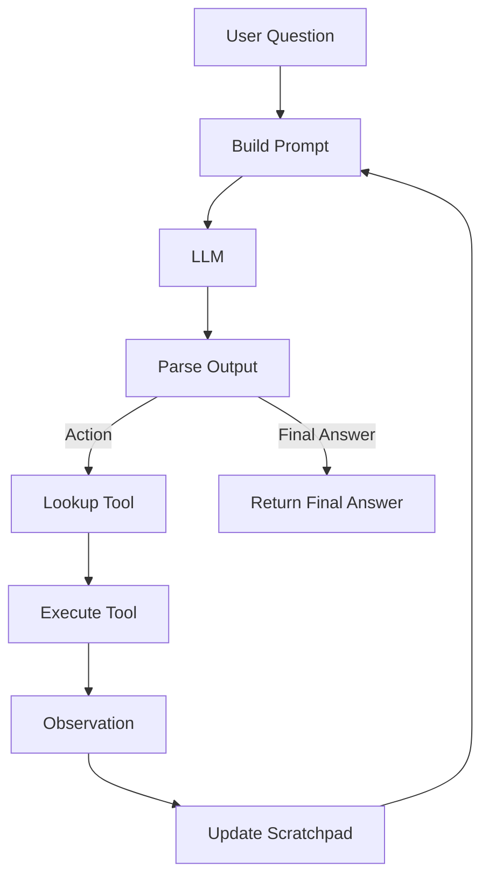

# 005 - Agent Loop với ReAct Prompt

## 1. Tóm tắt

Agent loop là lớp điều phối ghép các thành phần đã xây dựng trong module thành một quy trình lặp hoàn chỉnh.

Mỗi vòng lặp cần trả lời một câu hỏi:

> LLM đã có câu trả lời cuối cùng, hay đang yêu cầu chương trình thực thi một công cụ?

Nếu là tool action, chương trình thực thi tool, tạo observation và cập nhật scratchpad. Nếu là final answer, vòng lặp kết thúc.

## 2. Mục tiêu học tập

Sau bài này, người học có thể:

- mô tả được cấu trúc điều khiển của một ReAct agent loop;
- phân biệt nhánh `Action` và nhánh `Final Answer`;
- giải thích vai trò của parser, tool lookup, observation và scratchpad;
- mô tả cách dữ liệu ở vòng lặp trước ảnh hưởng đến vòng lặp sau;
- trình bày được luồng agent không dùng native function calling.

## 3. Các thành phần của vòng lặp

Một agent loop ReAct cần tối thiểu:

- ReAct prompt;
- tool descriptions;
- tool names;
- user question;
- scratchpad;
- LLM call;
- stop sequence;
- output parser;
- tool dictionary;
- logic xác định final answer.

Mỗi thành phần chỉ giải quyết một phần của bài toán. Agent xuất hiện khi chúng được nối thành vòng điều khiển.

## 4. Nhánh Action

Nếu parser xác định output yêu cầu một tool, hệ thống cần:

1. lấy `Action`;
2. lấy `Action Input`;
3. tra cứu callable trong tool dictionary;
4. thực thi tool;
5. lấy kết quả;
6. chuyển kết quả thành `Observation`;
7. thêm bước vừa thực hiện vào scratchpad;
8. gọi LLM lại với trạng thái mới.

Luồng này có thể lặp nhiều lần.

## 5. Nhánh Final Answer

Nếu output thể hiện rằng LLM đã có `Final Answer`, hệ thống không gọi thêm tool.

Kết quả cuối cùng được trả về cho người dùng và vòng lặp dừng.

Vì vậy, parser không chỉ đọc dữ liệu. Nó còn quyết định **control flow** của agent.

## 6. Scratchpad là trạng thái của agent

Nếu không có scratchpad, mỗi lần gọi LLM gần như bắt đầu lại từ đầu.

Scratchpad giúp vòng sau biết:

- trước đó agent đã chọn tool nào;
- input đã dùng là gì;
- observation nhận được là gì;
- còn thiếu thông tin nào để trả lời.

Có thể xem scratchpad như state được chuyển từ iteration này sang iteration tiếp theo.

## 7. Sơ đồ agent loop



Sơ đồ này cho thấy LLM không trực tiếp sở hữu quyền thực thi. Chương trình điều khiển luôn đứng giữa model và tool.

## 8. Quan hệ giữa các bài trong module

Toàn bộ module có thể ghép thành pipeline:

```text
Bài 001
ReAct format và scratchpad
        ↓
Bài 002
Sinh tool descriptions và tool names
        ↓
Bài 003
Hiểu parser, stop sequence và manual tool calling
        ↓
Bài 004
Gọi LLM và lấy raw output có kiểm soát
        ↓
Bài 005
Ghép tất cả thành agent loop
```

## 9. Các điểm cần kiểm tra khi triển khai

Một agent loop chỉ đúng khi các ranh giới trách nhiệm rõ ràng:

- LLM chọn action;
- parser đọc action;
- program thực thi tool;
- tool tạo dữ liệu thật;
- program đưa dữ liệu đó thành observation;
- scratchpad lưu trạng thái;
- LLM quyết định bước tiếp theo.

Nếu model tự sinh observation hoặc chương trình không cập nhật scratchpad, loop có thể đi lệch trạng thái thực tế.

## 10. Tổng kết

ReAct agent loop biến một LLM sinh văn bản thành một hệ thống có khả năng sử dụng công cụ thông qua orchestration bên ngoài.

Cơ chế cốt lõi là:

```text
Prompt
→ LLM
→ Parse
→ Tool
→ Observation
→ Scratchpad
→ Prompt
```

Vòng lặp kết thúc khi parser xác định `Final Answer`.
