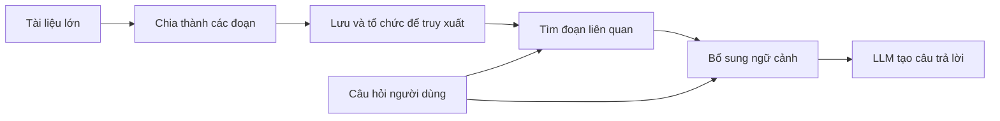

# 001 - Giới thiệu Retrieval-Augmented Generation (RAG)

## 1. Tóm tắt

Retrieval-Augmented Generation, viết tắt là `RAG`, là cách kết hợp khả năng sinh ngôn ngữ của mô hình ngôn ngữ lớn với một bước truy xuất thông tin liên quan từ nguồn dữ liệu bên ngoài.

RAG đặc biệt hữu ích khi câu trả lời nằm trong tài liệu dài, dữ liệu riêng tư hoặc dữ liệu mà mô hình không được huấn luyện trực tiếp. Thay vì đưa toàn bộ tài liệu vào prompt, hệ thống tìm những đoạn có liên quan nhất đến câu hỏi, bổ sung chúng vào ngữ cảnh rồi mới yêu cầu mô hình tạo câu trả lời.

## 2. Mục tiêu học tập

Sau bài này, người học có thể:

- giải thích vấn đề mà RAG giải quyết;
- phân tích hạn chế của cách nhồi toàn bộ tài liệu vào prompt;
- mô tả ba ý chính của RAG: retrieval, augmentation và generation;
- giải thích vì sao tài liệu cần được chia thành các đoạn nhỏ trước khi truy xuất;
- nhận diện các rủi ro cơ bản của bước chunking và retrieval.

## 3. Bài toán: hỏi đáp trên tài liệu lớn

Giả sử có một tài liệu dài hàng trăm trang. Câu trả lời cho một câu hỏi có thể chỉ nằm trong một đoạn rất nhỏ của tài liệu.

Ví dụ, người dùng có thể muốn:

- hỏi một chi tiết cụ thể trong một cuốn sách dài;
- tìm một điều khoản trong tài liệu tài chính;
- hỏi về dữ liệu nội bộ hoặc dữ liệu riêng tư mà LLM chưa từng được huấn luyện.

Trong những trường hợp này, vấn đề không chỉ là khả năng sinh câu trả lời. Hệ thống còn phải xác định **phần dữ liệu nào thực sự liên quan đến câu hỏi**.

## 4. Vì sao không nên đưa toàn bộ tài liệu vào prompt

Cách đơn giản nhất là ghép toàn bộ tài liệu với câu hỏi của người dùng rồi gửi tất cả cho LLM. Cách này có thể hoạt động với tài liệu nhỏ, nhưng khó mở rộng.

Có bốn vấn đề chính.

**Giới hạn ngữ cảnh.** Mỗi mô hình có giới hạn lượng văn bản có thể xử lý trong một lần gọi. Tài liệu đủ lớn có thể vượt quá giới hạn này.

**Hiệu quả suy luận giảm khi ngữ cảnh quá dài.** Ngay cả khi cửa sổ ngữ cảnh rất lớn, thông tin quan trọng vẫn có thể bị chìm trong lượng nội dung không liên quan. Đây là trực giác của bài toán “kim trong đống cỏ”.

**Chi phí tăng.** Prompt càng dài thì càng nhiều token phải được xử lý.

**Độ trễ tăng.** Lượng đầu vào lớn làm thời gian xử lý dài hơn.

Vì vậy, một cửa sổ ngữ cảnh lớn không tự động làm cho cách “đưa tất cả vào prompt” trở thành chiến lược tối ưu.

## 5. Trực giác của RAG

Thay vì gửi toàn bộ tài liệu, hệ thống thực hiện thêm một bước tiền xử lý và một bước tìm kiếm.



Luồng này làm giảm lượng văn bản phải gửi đến mô hình. LLM nhận câu hỏi cùng một số đoạn có khả năng chứa câu trả lời, thay vì toàn bộ kho dữ liệu.

## 6. Ba thành phần trong tên RAG

**Retrieval — truy xuất.** Hệ thống tìm các đoạn dữ liệu có liên quan nhất đến truy vấn.

**Augmentation — tăng cường ngữ cảnh.** Các đoạn vừa truy xuất được ghép vào prompt cùng câu hỏi ban đầu.

**Generation — sinh câu trả lời.** LLM sử dụng câu hỏi và ngữ cảnh đã tăng cường để tạo phản hồi.

Có thể mô tả ngắn gọn:

```text
User Query
   ↓
Retrieve relevant chunks
   ↓
Question + Retrieved Context
   ↓
LLM
   ↓
Grounded Answer
```

## 7. Vì sao phải chia tài liệu thành các đoạn

Nếu tài liệu chỉ tồn tại như một khối rất lớn, hệ thống khó chọn ra chính xác phần cần thiết. Vì vậy, tài liệu thường được chia thành nhiều `chunk`.

Một chunk tốt cần đủ nhỏ để phục vụ truy xuất chính xác, nhưng vẫn đủ lớn để giữ được ý nghĩa.

Việc chia đoạn không hoàn toàn cơ học. Các câu hỏi quan trọng gồm:

- nên cắt theo ký tự, token, đoạn văn hay cấu trúc tài liệu;
- kích thước chunk nên là bao nhiêu;
- có cần chồng lấn giữa các chunk hay không;
- làm sao giữ các ý liên quan về mặt ngữ nghĩa trong cùng một chunk;
- mã nguồn, PDF, tài liệu tài chính hay văn bản tự do có cần chiến lược chia khác nhau hay không.

Nếu chia không tốt, bước retrieval có thể tìm đúng vị trí nhưng lại trả về một đoạn thiếu ngữ cảnh.

## 8. Lợi ích và đánh đổi

RAG giải quyết trực tiếp bốn hạn chế của prompt quá dài:

- giảm nguy cơ vượt giới hạn ngữ cảnh;
- giảm lượng nội dung không liên quan;
- giảm chi phí token;
- giảm độ trễ xử lý.

Tuy nhiên, hệ thống trở nên phức tạp hơn vì cần thêm:

- pipeline tiền xử lý tài liệu;
- chiến lược chunking;
- cơ chế truy xuất;
- cách đánh giá mức độ liên quan của kết quả retrieval.

RAG không loại bỏ mọi lỗi. Nếu retrieval lấy sai đoạn, LLM vẫn có thể nhận ngữ cảnh không phù hợp.

## 9. Tổng kết

RAG không bắt đầu từ việc “làm LLM thông minh hơn”, mà từ việc **đưa đúng thông tin vào đúng thời điểm**.

Mẫu tư duy cốt lõi là:

```text
Không gửi tất cả dữ liệu
→ tìm phần liên quan
→ bổ sung phần đó vào prompt
→ để LLM trả lời dựa trên ngữ cảnh
```

Đây là nền tảng cho các bài tiếp theo về document loader, text splitter, embeddings, vector store và retrieval.
