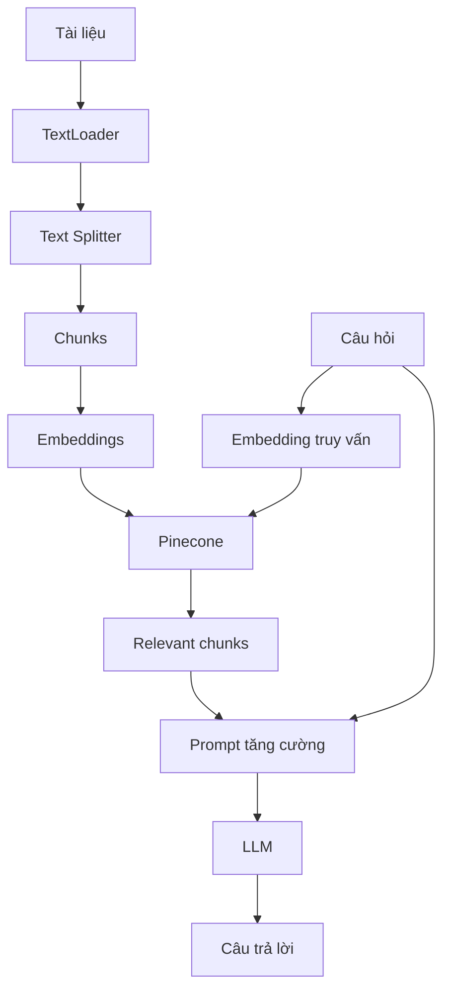

# 002 - Tổng quan triển khai RAG

## 1. Tóm tắt

Một pipeline RAG hoàn chỉnh cần biến dữ liệu thô thành dữ liệu có thể truy xuất, sau đó dùng kết quả truy xuất để tăng cường prompt gửi đến LLM.

Trong phần triển khai của khóa học, các thành phần trọng tâm gồm `TextLoader`, `RecursiveCharacterTextSplitter`, `OpenAIEmbeddings`, `Pinecone` và bước naive retrieval.

## 2. Mục tiêu học tập

Sau bài này, người học có thể:

- xác định vai trò của từng thành phần trong pipeline RAG;
- mô tả thứ tự từ nạp dữ liệu đến truy xuất;
- phân biệt giai đoạn ingestion với giai đoạn retrieval;
- giải thích vì sao embedding và vector store phải được dùng nhất quán giữa lúc lập chỉ mục và lúc tìm kiếm.

## 3. Hai nửa của pipeline RAG

Có thể chia triển khai RAG thành hai nửa chính.

**Ingestion** chuẩn bị dữ liệu để tìm kiếm:

```text
Raw document
→ Load
→ Split
→ Embed
→ Store vectors
```

**Retrieval và generation** xử lý câu hỏi:

```text
User question
→ Embed query
→ Retrieve similar chunks
→ Add chunks to prompt
→ Ask LLM
→ Return answer
```

Hai nửa này liên kết với nhau bằng không gian embedding và vector store.

## 4. Các thành phần chính

`TextLoader` đưa nội dung tệp vào cấu trúc tài liệu mà pipeline có thể xử lý thống nhất.

`RecursiveCharacterTextSplitter` đại diện cho bước chia tài liệu thành các đoạn nhỏ hơn. Mục tiêu là tạo các chunk đủ nhỏ để truy xuất nhưng vẫn giữ đủ ngữ nghĩa.

`OpenAIEmbeddings` biến văn bản thành vector số. Những đoạn có ý nghĩa gần nhau được kỳ vọng có biểu diễn gần nhau trong không gian vector.

`Pinecone` đóng vai trò vector store trong pipeline của khóa học. Hệ thống lưu các vector của chunk và hỗ trợ tìm kiếm các vector gần với vector truy vấn.

Naive retrieval là bước lấy một số chunk có độ tương đồng cao nhất với câu hỏi rồi đưa chúng trực tiếp vào ngữ cảnh cho LLM.

## 5. Luồng dữ liệu tổng thể



Điểm quan trọng là retrieval không tìm trực tiếp trên văn bản thô. Nó dựa trên biểu diễn vector của dữ liệu đã được ingestion trước đó.

## 6. Thứ tự triển khai nên kiểm tra

Khi hiện thực pipeline, nên kiểm tra từng checkpoint:

1. Loader có đọc được dữ liệu hay không.
2. Splitter có tạo ra các chunk có ý nghĩa hay không.
3. Embedding có được tạo cho các chunk hay không.
4. Vector store có nhận dữ liệu hay không.
5. Query có truy xuất đúng các chunk mong đợi hay không.
6. Prompt cuối cùng có chứa cả câu hỏi và ngữ cảnh liên quan hay không.

Nếu bỏ qua các checkpoint và chỉ kiểm tra câu trả lời cuối cùng, lỗi retrieval rất dễ bị nhầm với lỗi của LLM.

## 7. Tổng kết

Triển khai RAG là một chuỗi biến đổi dữ liệu:

```text
document → chunks → vectors → retrieval → context → answer
```

Các bài sau sẽ đi sâu vào từng thành phần và cách chúng phối hợp trong dự án Medium Analyzer.
