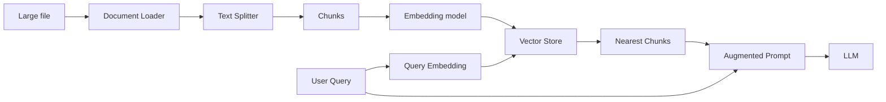

# 003 - Nền tảng RAG: Document Loader, Text Splitter, Embeddings và Vector Store

## 1. Tóm tắt

RAG cần bốn nhóm khả năng nền tảng: nạp tài liệu, chia văn bản, biểu diễn văn bản bằng vector và lưu các vector để tìm kiếm. LangChain cung cấp các lớp trừu tượng giúp nhiều nguồn dữ liệu và nhiều nhà cung cấp có thể dùng chung một kiểu pipeline.

## 2. Mục tiêu học tập

Sau bài này, người học có thể:

- giải thích vai trò của document loader và document abstraction;
- giải thích vì sao văn bản dài phải được chia thành chunk;
- mô tả embedding như một biểu diễn vector của nội dung;
- giải thích trực giác của semantic similarity;
- mô tả vai trò của vector database trong RAG;
- nối bốn thành phần thành pipeline ingestion và retrieval hoàn chỉnh.

## 3. Document Loader và abstraction `Document`

Nguồn dữ liệu cho ứng dụng LLM có thể đến từ hệ thống tệp, Google Drive, Notion, PDF, tin nhắn hoặc nhiều nguồn khác.

Điểm quan trọng là pipeline không nên phải viết lại toàn bộ logic cho từng nguồn. Document loader đóng vai trò lớp chuyển đổi: đọc dữ liệu theo đặc thù của nguồn rồi trả về dạng tài liệu thống nhất cho các bước phía sau.

Tư duy này tạo ra một abstraction:

```text
Nhiều nguồn khác nhau
        ↓
Document Loader tương ứng
        ↓
Document
        ↓
Pipeline xử lý chung
```

Nhờ đó, text splitter, embedding và retrieval không cần quan tâm tài liệu ban đầu đến từ đâu.

## 4. Text Splitter và giới hạn ngữ cảnh

Tài liệu dài không nên được đưa nguyên khối vào LLM. Text splitter chia văn bản thành các đoạn nhỏ hơn để:

- kiểm soát kích thước ngữ cảnh;
- tạo đơn vị dữ liệu phù hợp cho embedding;
- giúp retrieval tìm đúng vùng thông tin;
- giảm số lượng dữ liệu không liên quan phải gửi vào mô hình.

Chunking không chỉ là cắt mỗi N ký tự. Một chiến lược tốt còn phải cân nhắc ranh giới câu, đoạn, cấu trúc tài liệu và mối liên hệ ngữ nghĩa.

## 5. Embedding là gì

Embedding biến một đối tượng như từ, câu hoặc đoạn văn thành một vector — tức một dãy số trong không gian nhiều chiều.

Mục tiêu không phải để con người đọc các con số này, mà để hệ thống có thể so sánh các biểu diễn.

Trong một mô hình embedding tốt, các câu có ý nghĩa gần nhau sẽ nằm gần nhau trong không gian vector, kể cả khi cách diễn đạt khác nhau.

Ví dụ, các câu diễn đạt ý “gọi một cốc cà phê lớn” có thể có biểu diễn gần nhau dù ngôn ngữ hoặc từ ngữ khác nhau.

## 6. Từ semantic similarity đến retrieval

Giả sử câu hỏi của người dùng được biến thành một vector `q`.

Mỗi chunk trong tài liệu cũng có vector riêng:

```text
chunk_1 → v1
chunk_2 → v2
chunk_3 → v3
...
```

Hệ thống tìm các vector có khoảng cách nhỏ hoặc độ tương đồng cao với `q`. Các vector gần nhất đại diện cho những chunk có khả năng liên quan nhất tới câu hỏi.

Đây là cầu nối giữa embedding và retrieval.

## 7. Vector Database

Vector database lưu các embedding và hỗ trợ tìm kiếm các vector gần nhất với vector truy vấn.

Trong khóa học, Pinecone được dùng làm vector store. Vai trò của nó gồm:

- lưu vector của các chunk;
- giữ dữ liệu hoặc metadata gắn với vector;
- nhận vector truy vấn;
- trả về các chunk gần nhất trong không gian vector.

Vector database không thay thế LLM. Nó giải quyết bài toán **tìm ngữ cảnh**, còn LLM giải quyết bài toán **sinh câu trả lời**.

## 8. Pipeline hoàn chỉnh



Ở giai đoạn ingestion, toàn bộ dữ liệu được chuẩn bị trước. Khi có truy vấn, hệ thống chỉ cần nhúng câu hỏi, tìm hàng xóm gần nhất và lấy các chunk phù hợp.

## 9. Điểm dễ nhầm

**Embedding không phải câu trả lời.** Nó là biểu diễn số dùng cho so sánh và tìm kiếm.

**Vector store không phải LLM.** Nó lưu và tìm vector.

**Chunk càng nhỏ không phải lúc nào cũng càng tốt.** Chunk quá nhỏ có thể làm mất ý nghĩa.

**Chunk càng lớn cũng không phải lúc nào cũng tốt.** Chunk quá lớn làm retrieval kém chính xác và đưa thêm nội dung thừa vào prompt.

## 10. Tổng kết

Bốn thành phần kết nối với nhau như sau:

```text
Loader tạo Document
→ Splitter tạo Chunks
→ Embedding tạo Vectors
→ Vector Store lưu và truy xuất Vectors
```

Đây là nền tảng để triển khai ingestion và retrieval cho Medium Analyzer.
