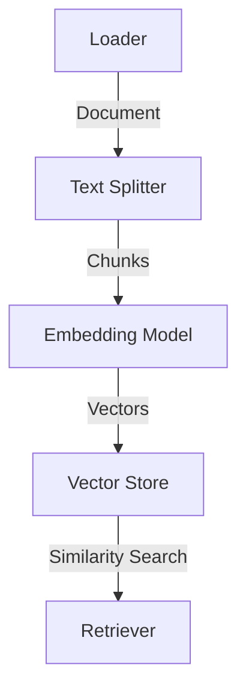

# 004 - Class Review: TextLoader, TextSplitter, OpenAIEmbeddings và Pinecone

## 1. Tóm tắt

Bài này hệ thống hóa các lớp và trách nhiệm cần dùng để đưa nội dung Medium vào vector store. Pipeline gồm bốn bước: load tài liệu, split thành chunk, embed từng chunk và lưu vector vào Pinecone.

## 2. Mục tiêu học tập

Sau bài này, người học có thể:

- giải thích chức năng của document loader;
- mô tả ý nghĩa của `chunk_size`, `chunk_overlap` và hàm đo độ dài;
- giải thích vai trò của `OpenAIEmbeddings`;
- mô tả vì sao vector store cần lưu cả vector và thông tin nguồn;
- nhận diện sự khác nhau giữa abstraction của LangChain và logic thực tế bên dưới.

## 3. Document Loader

Document loader là lớp bọc quanh logic đọc dữ liệu.

Với một tệp văn bản, logic nền tảng có thể đơn giản chỉ là:

```text
file path
→ open file
→ read text
→ attach metadata
→ return Document list
```

Với nguồn khác như WhatsApp, loader có thể phải đọc tệp, tách người gửi, người nhận, nội dung và thời gian rồi chuẩn hóa lại trước khi trả về `Document`.

Điểm quan trọng là các nguồn khác nhau có thể cung cấp cùng một interface cho pipeline phía sau.

Trong cấu hình được trình bày ở bài học, loader từ gói cộng đồng cũ được thay bằng `UnstructuredLoader` từ gói `LangChain Unstructured`. Ý nghĩa kiến trúc của thay đổi này là tách integration theo từng package chuyên biệt, giúp phạm vi dependency và bảo trì rõ ràng hơn.

## 4. Text Splitter

Text splitter xử lý văn bản dài bằng cách chia thành nhiều chunk.

Các tham số cần hiểu:

- `chunk_size`: kích thước mục tiêu của mỗi chunk;
- `chunk_overlap`: lượng nội dung được lặp giữa hai chunk liền nhau;
- separator: ranh giới được ưu tiên khi chia;
- length function: cách đo kích thước, thường có thể dựa trên `len`, hoặc một hàm đếm token.

Trong ví dụ của bài học, tài liệu minh họa một cấu hình với kích thước khoảng `1000` và có thể dùng overlap để tránh làm đứt mạch ngữ cảnh.

Overlap hữu ích khi một ý quan trọng nằm ngay trên ranh giới hai chunk. Nếu không có overlap, mỗi chunk độc lập hoàn toàn; nếu overlap quá lớn, dữ liệu bị lặp nhiều và tăng chi phí lưu trữ cũng như truy xuất.

## 5. Embedding

`OpenAIEmbeddings` cung cấp interface biến văn bản thành vector.

Từ góc nhìn pipeline, có thể coi embedding model là một hàm:

```text
text → vector
```

Điều quan trọng không phải là đọc từng chiều của vector, mà là tính chất: các đoạn có ý nghĩa gần nhau nên có vector gần nhau.

LangChain cung cấp abstraction để thay đổi nhà cung cấp embedding mà không phải viết lại toàn bộ pipeline.

## 6. Pinecone và vector storage

Sau khi tạo embedding, hệ thống cần một nơi lưu trữ lâu dài và một cơ chế tìm kiếm gần nhất.

Pinecone đóng vai trò đó trong dự án:

```text
chunk
→ embedding vector
→ Pinecone
```

Khi truy vấn:

```text
query
→ query embedding
→ similarity search
→ nearest chunks
```

Vector store cần gắn vector với dữ liệu gốc hoặc metadata để khi tìm được vector, hệ thống có thể trả lại nội dung có ý nghĩa thay vì chỉ trả một dãy số.

## 7. Abstraction giúp giảm boilerplate

Nếu tự hiện thực mọi thứ, ứng dụng phải:

- lặp qua từng chunk;
- gọi embedding API;
- quản lý batch;
- xử lý giới hạn tốc độ;
- upsert vector;
- ánh xạ vector với nội dung và metadata.

LangChain cung cấp interface chung để giảm phần mã lặp lại này.

Lợi ích quan trọng không chỉ là ít code hơn mà còn là khả năng thay thế thành phần: loader, embedding model hoặc vector store có thể đổi mà pipeline tổng thể vẫn giữ cấu trúc gần giống nhau.

## 8. Sơ đồ trách nhiệm



Mỗi lớp nên có trách nhiệm rõ ràng. Nếu một bước thất bại, cần debug ngay tại boundary đó thay vì chỉ nhìn câu trả lời cuối cùng của LLM.

## 9. Tổng kết

Bốn thành phần của bài này tạo thành xương sống của ingestion:

```text
Load → Split → Embed → Store
```

Hiểu rõ từng abstraction giúp người học không bị phụ thuộc vào “magic” của framework và có thể debug pipeline theo từng bước.
