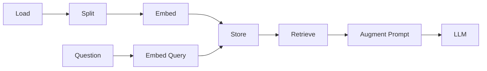

# 005 - Medium Analyzer: Triển khai Ingestion

## 1. Tóm tắt

Ingestion là giai đoạn chuẩn bị dữ liệu cho retrieval. Trong Medium Analyzer, pipeline đọc tệp blog, chuyển nó thành `Document`, chia thành chunk, tạo embedding và lưu các vector vào Pinecone.

Bài triển khai dùng các checkpoint để kiểm tra từng bước thay vì chỉ chạy toàn bộ pipeline rồi chờ kết quả cuối.

## 2. Mục tiêu học tập

Sau bài này, người học có thể:

- triển khai logic ingestion theo thứ tự load → split → embed → store;
- giải thích vai trò của `page_content` và metadata;
- xử lý lỗi encoding thường gặp khi tải tệp;
- phân tích ảnh hưởng của `chunk_size` và `chunk_overlap`;
- mô tả cách `from_documents` đưa các chunk vào vector store;
- kiểm tra dữ liệu sau ingestion.

## 3. Bước 1: tải tài liệu

Pipeline bắt đầu bằng loader nhận đường dẫn tới tệp Medium blog.

Sau khi gọi `loader.load`, kết quả là một danh sách các `Document`.

Mỗi `Document` cần quan tâm ít nhất hai phần:

- nội dung trang, thường được dùng làm dữ liệu để split và embed;
- metadata, dùng để giữ nguồn hoặc thông tin phụ trợ.

Metadata nguồn rất quan trọng vì RAG không chỉ cần tìm đoạn liên quan; hệ thống còn có thể cần chỉ ra đoạn đó đến từ đâu hoặc dùng metadata để lọc retrieval sau này.

## 4. Xử lý lỗi encoding

Khi đọc tệp văn bản trên các hệ điều hành hoặc locale khác nhau, có thể gặp lỗi Unicode decode.

Hai hướng xử lý được nêu trong bài:

- đặt encoding thành UTF-8;
- nếu vẫn không phù hợp, dùng `autodetect_encoding=True`.

Điểm cần rút ra là ingestion phải ổn định ngay từ bước đọc dữ liệu. Một loader đọc sai ký tự sẽ làm hỏng toàn bộ các bước phía sau.

## 5. Bước 2: chia tài liệu thành chunk

Ví dụ triển khai sử dụng:

- `chunk_size = 1000` ký tự;
- `chunk_overlap = 0`.

Kích thước `1000` ở đây là heuristic cho ví dụ, không phải một hằng số tối ưu cho mọi hệ thống.

Chunk phải đạt hai yêu cầu cân bằng:

1. đủ nhỏ để retrieval có thể tập trung vào vùng thông tin liên quan;
2. đủ lớn để nội dung còn mang ý nghĩa khi đọc độc lập.

Nếu chunk quá nhỏ, thông tin bị rời rạc. Nếu quá lớn, mỗi kết quả retrieval chứa nhiều nội dung thừa.

`chunk_overlap = 0` làm các chunk không lặp dữ liệu. Trong hệ thống khác, overlap có thể hữu ích để giữ ngữ cảnh ở ranh giới giữa hai đoạn.

Sau khi gọi `split_documents`, kết quả vẫn là danh sách `Document`, nhưng mỗi `Document` chỉ chứa một phần nhỏ của nội dung ban đầu và vẫn mang metadata nguồn.

## 6. Bước 3: tạo embedding

Mỗi chunk được đưa qua đối tượng embedding.

```text
Document chunk
→ page content
→ embedding model
→ vector
```

Vector là biểu diễn được dùng cho similarity search. Chất lượng retrieval phụ thuộc vào việc chunk và query được biểu diễn trong cùng không gian embedding phù hợp.

## 7. Bước 4: lưu vào Pinecone

`PineconeVectorStore` cung cấp phương thức `from_documents`.

Về mặt logic, phương thức này thực hiện:

```text
for each document chunk:
    embed chunk
    associate metadata
    upsert vector into vector store
```

Framework che giấu phần lặp, batching, async và xử lý các chi tiết tích hợp.

Trong ví dụ của bài học, sau khi split có `20` chunk và sau ingestion Pinecone hiển thị `20` vector. Con số này là checkpoint của ví dụ, không phải yêu cầu chung cho mọi tài liệu.

## 8. Kiểm tra dữ liệu đã lưu

Sau ingestion, không nên dừng ở việc “không có exception”.

Cần kiểm tra:

- số lượng vector có hợp lý so với số chunk;
- trường văn bản có chứa đúng nội dung chunk;
- metadata nguồn có được giữ lại;
- vector đã thực sự được upsert vào đúng index.

Một bản ghi trong vector store về mặt khái niệm gồm:

```text
vector
+ chunk text
+ source metadata
```

## 9. Quan hệ giữa ingestion và retrieval

Ingestion chỉ là nửa đầu của RAG.



Giai đoạn retrieval sẽ lấy câu hỏi, tạo vector truy vấn, tìm các vector gần nhất rồi dùng các chunk tương ứng làm context.

## 10. Checklist debug

Trước khi chuyển sang retrieval, cần xác nhận:

- loader đọc đúng tệp;
- nội dung không lỗi encoding;
- metadata nguồn tồn tại;
- chunk có kích thước hợp lý và đọc vẫn hiểu;
- số chunk hợp lý;
- embedding chạy thành công;
- vector đã xuất hiện trong index;
- text và source metadata đi cùng vector.

## 11. Tổng kết

Pipeline ingestion của Medium Analyzer có thể cô đọng thành:

```text
File
→ loader.load()
→ Documents
→ split_documents()
→ Chunks
→ Embeddings
→ PineconeVectorStore.from_documents()
→ Indexed vectors
```

Khi dữ liệu đã được lập chỉ mục đúng, hệ thống mới sẵn sàng cho bước retrieval.
