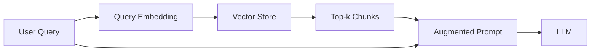

# 006 - Ôn tập: Từ Ingestion sang Retrieval

## 1. Mục tiêu ôn tập

Sau phần ingestion, cần nắm rõ điểm chuyển tiếp sang retrieval.

Người học cần có thể:

- mô tả dữ liệu đã được lập chỉ mục như thế nào;
- giải thích cách một câu hỏi trở thành vector truy vấn;
- giải thích ý nghĩa của tham số `k`;
- mô tả cách các chunk được đưa vào LLM làm context.

## 2. Trạng thái hệ thống sau ingestion

Sau ingestion, vector store đã chứa các biểu diễn của những chunk trong tài liệu.

Mỗi chunk có:

- nội dung văn bản;
- vector embedding;
- metadata cần thiết.

Hệ thống chưa trả lời câu hỏi ở bước này. Nó chỉ chuẩn bị một không gian có thể tìm kiếm.

## 3. Luồng retrieval

Khi người dùng gửi câu hỏi:

1. câu hỏi được nhúng thành vector;
2. vector store so sánh vector truy vấn với các vector đã lưu;
3. hệ thống lấy `k` chunk có độ tương đồng cao nhất;
4. các chunk được đưa vào prompt cùng câu hỏi;
5. LLM tạo câu trả lời dựa trên ngữ cảnh đó.

## 4. Ý nghĩa của `k`

`k` là số lượng kết quả retrieval được giữ lại.

Nếu `k` quá nhỏ, hệ thống có thể bỏ sót ngữ cảnh cần thiết.

Nếu `k` quá lớn, prompt có thể chứa nhiều nội dung thừa, làm tăng token, chi phí và nhiễu.

Vì vậy, `k` là một tham số của retrieval cần được đánh giá theo dữ liệu và loại câu hỏi.

## 5. Tổng kết

Ingestion trả lời câu hỏi:

> Dữ liệu phải được chuẩn bị và lưu như thế nào?

Retrieval trả lời câu hỏi:

> Với truy vấn hiện tại, đoạn dữ liệu nào nên được đưa vào LLM?

Hai giai đoạn kết hợp tạo nên lõi của pipeline RAG.
