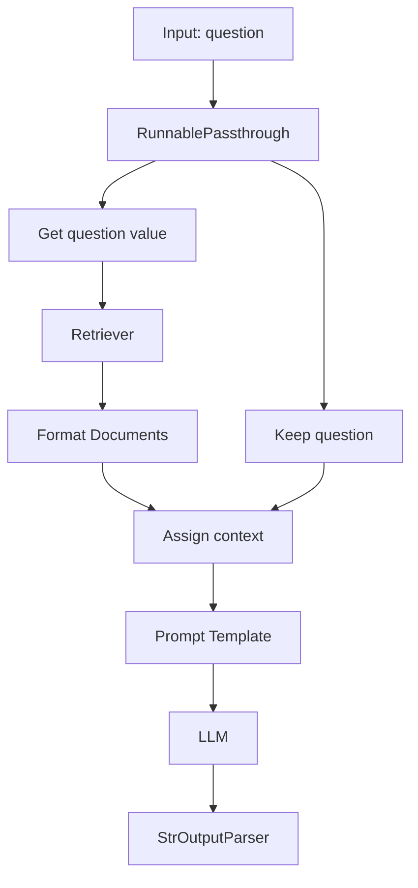

# 008 - Medium Analyzer: 2-Step RAG bằng LangChain Expression Language

## 1. Tóm tắt

Sau khi hiểu phiên bản function-based, pipeline được tổ chức lại thành một chain theo LangChain Expression Language (LCEL).

Mục tiêu không phải thay đổi kết quả RAG, mà thay đổi cách các bước được ghép lại để có interface runnable thống nhất, hỗ trợ streaming, async, batch và quan sát trace tốt hơn.

## 2. Mục tiêu học tập

Sau bài này, người học có thể:

- giải thích lợi ích của LCEL so với các lời gọi hàm rời rạc;
- mô tả vai trò của `StrOutputParser`;
- giải thích `RunnablePassthrough`;
- giải thích ý nghĩa của `RunnablePassthrough.assign`;
- mô tả cách lấy `question`, truy xuất tài liệu, format context rồi đưa vào prompt;
- theo dõi dữ liệu thay đổi qua từng stage của chain.

## 3. Từ function-based sang runnable chain

Pipeline cũ:

```text
query
→ retriever
→ format docs
→ prompt
→ LLM
```

LCEL giữ nguyên logic nhưng biến các bước thành một chuỗi có thể `invoke`.

Lợi ích được nhấn mạnh trong bài gồm:

- streaming;
- async;
- batch processing;
- interface runnable thống nhất;
- khả năng quan sát và trace tốt hơn.

## 4. `StrOutputParser`

Sau khi LLM trả về message object, pipeline thường chỉ cần phần nội dung văn bản.

`StrOutputParser` đóng vai trò chuyển output của model thành chuỗi để đầu ra cuối của chain gọn hơn.

Có thể hình dung:

```text
Prompt
→ LLM
→ AI Message
→ StrOutputParser
→ String
```

## 5. `RunnablePassthrough`

`RunnablePassthrough` cho phép dữ liệu đầu vào đi qua mà không bị thay đổi.

Điều này hữu ích khi cần giữ `question` gốc đồng thời tính thêm một trường mới như `context`.

Đầu vào:

```text
{
  question: "..."
}
```

Sau passthrough, `question` vẫn còn nguyên.

## 6. `RunnablePassthrough.assign`

`assign` tạo một từ điển mới bằng cách giữ dữ liệu đầu vào và thêm trường tính toán.

Trong pipeline RAG, mục tiêu là tạo:

```text
{
  question: <original question>,
  context: <retrieved and formatted documents>
}
```

Giá trị `context` không có sẵn ngay từ đầu. Nó được tính bằng chuỗi con:

```text
question
→ retriever
→ format documents
→ context
```

Sau đó dictionary có đủ hai khóa để điền vào prompt template.

## 7. Lấy trường `question`

Pipeline cần truyền riêng chuỗi câu hỏi cho retriever.

Bài học sử dụng một utility từ `operator` để lấy giá trị theo key thay vì viết lambda thủ công. Về mặt logic, thao tác chỉ là:

```text
input dictionary
→ take input["question"]
→ send to retriever
```

Điểm quan trọng là hiểu data shape, không phải thuộc lòng cú pháp.

## 8. Python function trong LCEL

Hàm format document ban đầu là một hàm Python thông thường, không có `invoke`.

Trong LCEL, hàm callable có thể được framework bọc thành runnable phù hợp để tham gia pipeline.

Nhờ đó, chuỗi con có thể giữ hình thức:

```text
retriever
→ format_documents
```

mà vẫn hoạt động trong chain.

## 9. Pipeline hoàn chỉnh



Dữ liệu trung gian quan trọng nhất là dictionary có cả `question` và `context`.

## 10. Vì sao khả năng quan sát tốt hơn

Khi các bước nằm trong một runnable chain, trace có thể thể hiện:

- input của toàn chain;
- output của từng stage;
- thời gian của từng bước;
- retriever nhận query gì;
- retriever trả document nào;
- context được tạo ra thế nào;
- prompt cuối cùng đi vào LLM;
- output cuối cùng.

Điều này giúp tìm bottleneck và debug thuận tiện hơn phiên bản function-based, nơi các thao tác rời rạc tạo trace phân mảnh.

## 11. So sánh hai cách triển khai

| Tiêu chí | Function-based | LCEL |
| --- | --- | --- |
| Logic RAG | Rõ, thủ công | Rõ sau khi hiểu data flow |
| `invoke` thống nhất | Không | Có |
| Streaming / async / batch | Phải tự tổ chức | Hỗ trợ qua runnable interface |
| Ghép chain | Khó hơn | Tự nhiên hơn |
| Observability | Phân mảnh | Tập trung hơn |
| Mục đích học | Hiểu từng bước | Tổ chức pipeline tốt hơn |

Hai cách có thể cho kết quả tương tự. Sự khác biệt chính nằm ở cấu trúc thực thi và khả năng vận hành.

## 12. Tổng kết

LCEL không thay đổi ba bước cốt lõi của RAG:

```text
retrieve
→ augment
→ generate
```

Nó cung cấp một cách ghép các bước thành pipeline có cấu trúc, có thể quan sát và mở rộng tốt hơn.
