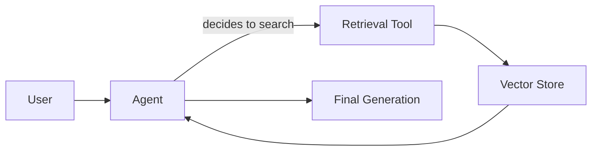
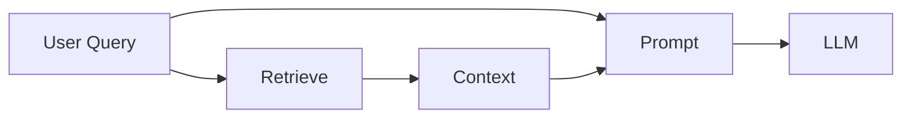

# 009 - Đọc hiểu và đánh giá kiến trúc RAG trong LangChain

## 1. Tóm tắt

Tài liệu RAG có thể trình bày nhiều mức abstraction khác nhau: semantic search, retriever, 2-step RAG, RAG agent và các kiến trúc agentic phức tạp hơn.

Khi đọc tài liệu framework, điều quan trọng không phải là sao chép cú pháp, mà là xác định rõ kiến trúc nào đang được dùng, quyền quyết định nằm ở đâu và mỗi lựa chọn đánh đổi điều gì.

## 2. Mục tiêu học tập

Sau bài này, người học có thể:

- nhận diện các khối nền tảng của semantic search và RAG;
- phân biệt 2-step RAG với agentic retrieval;
- giải thích trade-off giữa tính xác định, độ trễ và tính linh hoạt;
- phân tích khi nào việc biến retrieval thành tool có thể tạo overhead;
- đọc tài liệu framework theo góc nhìn kiến trúc thay vì chỉ theo snippet code.

## 3. Từ semantic search đến ứng dụng RAG

Các khái niệm nền tảng thường xuất hiện riêng lẻ:

- document;
- text splitting;
- embeddings;
- vector store;
- retriever;
- similarity search.

Những thành phần này chỉ trở thành RAG khi được ghép thành ứng dụng:

```text
Index data
→ Retrieve relevant context
→ Generate answer with context
```

Vì vậy, khi đọc một trang hướng dẫn, cần hỏi:

> Đoạn code này đang giải quyết ingestion, retrieval hay generation?

## 4. Hai kiến trúc retrieval phổ biến

Một hướng là **agentic retrieval**: retrieval được đóng gói thành tool và agent quyết định có gọi tool hay không.

Hướng còn lại là **2-step RAG**: ứng dụng luôn thực hiện retrieval trước, sau đó thực hiện một lần generation với context đã lấy.

Hai kiến trúc không thể đánh giá chỉ bằng số dòng code. Chúng khác nhau ở quyền điều phối.

## 5. Agentic retrieval

Luồng khái niệm:



Ưu điểm là agent có thể bỏ qua retrieval khi không cần hoặc thực hiện các bước tìm kiếm linh hoạt hơn.

Đánh đổi:

- LLM phải ra quyết định có tìm kiếm hay không;
- có thể phát sinh thêm model call hoặc tool call;
- độ trễ và token có thể tăng;
- hành vi ít xác định hơn;
- việc kiểm soát business flow cần được thiết kế cẩn thận.

## 6. 2-Step RAG

Trong 2-step RAG, retrieval là một bước cố định.



Ưu điểm:

- luồng dễ dự đoán;
- retrieval luôn xảy ra;
- thường chỉ cần một lần generation sau retrieval;
- dễ trace và debug.

Đánh đổi là ít linh hoạt hơn vì hệ thống luôn tìm kiếm, kể cả khi một số input đơn giản có thể không cần.

## 7. Trade-off cần phân tích

Khi chọn kiến trúc, nên đánh giá ít nhất bốn yếu tố.

**Control.** Ai quyết định có retrieval hay không: code hay LLM?

**Latency.** Bao nhiêu lần gọi model và tool cần thực hiện?

**Cost.** Mỗi bước thêm có làm tăng token hoặc inference không?

**Predictability.** Pipeline có luôn đi theo cùng một flow hay thay đổi theo quyết định của agent?

Không có một abstraction duy nhất phù hợp cho mọi ứng dụng.

## 8. Đừng để framework che mất data flow

Một API cấp cao có thể rất tiện lợi nhưng cũng làm người học khó thấy bên trong:

```text
query
→ search
→ context
→ prompt
→ model
```

Khi dùng helper hoặc agent factory, cần vẫn trả lời được:

- dữ liệu đầu vào là gì;
- retrieval xảy ra ở bước nào;
- query nào thực sự được embed;
- context nào được đưa vào prompt;
- có bao nhiêu lần gọi model;
- thành phần nào quyết định bước tiếp theo.

Nếu không trả lời được các câu hỏi này, việc debug production sẽ khó hơn.

## 9. Cách đọc tài liệu RAG hiệu quả

Thay vì đọc từng snippet độc lập, hãy lập bản đồ:

| Thành phần | Câu hỏi cần trả lời |
| --- | --- |
| Loader | Dữ liệu vào từ đâu? |
| Splitter | Chunk được tạo thế nào? |
| Embedding | Text được biểu diễn bằng model nào? |
| Vector store | Vector và metadata lưu ở đâu? |
| Retriever | Query nào được tìm và lấy bao nhiêu kết quả? |
| Prompt | Context được ghép vào đâu? |
| LLM | Có bao nhiêu lần inference? |
| Agent | Model được phép quyết định những bước nào? |

## 10. Tổng kết

Kỹ năng quan trọng khi làm RAG không chỉ là biết API LangChain. Người triển khai cần nhìn thấy kiến trúc phía sau abstraction.

Với pipeline đơn giản và cần tính xác định cao, 2-step RAG cho data flow rõ ràng. Khi bài toán thực sự cần model quyết định thời điểm và cách tìm kiếm, agentic retrieval mở ra nhiều khả năng hơn nhưng đi kèm chi phí kiểm soát, độ trễ và quan sát.
