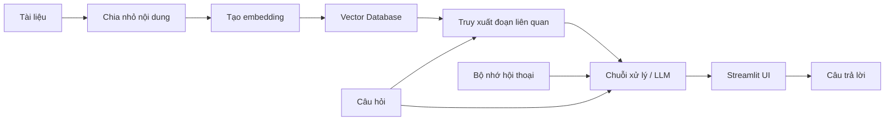

# 001 - Tổng quan Documentation Assistant với RAG

## 1. Tóm tắt

Mục tiêu của dự án là xây dựng một **trợ lý hỏi đáp tài liệu**. Hệ thống tiếp nhận tài liệu hướng dẫn của một thư viện hoặc gói phần mềm, biến nội dung tài liệu thành dữ liệu có thể tìm kiếm theo ngữ nghĩa, sau đó dùng mô hình ngôn ngữ lớn để trả lời câu hỏi dựa trên những đoạn tài liệu liên quan.

Dự án được triển khai theo hướng end-to-end: từ thu thập tài liệu, chia nhỏ nội dung, tạo embedding, lưu vector, truy xuất các đoạn phù hợp, tạo câu trả lời, xây dựng giao diện bằng `Streamlit`, cho đến bổ sung bộ nhớ hội thoại.

## 2. Mục tiêu học tập

Sau bài này, người học có thể:

- Giải thích được bài toán mà Documentation Assistant cần giải quyết.
- Mô tả được luồng dữ liệu từ tài liệu thô đến câu trả lời của mô hình ngôn ngữ.
- Phân biệt vai trò của chunking, embedding, vector database, retrieval và memory trong hệ thống.
- Giải thích được vì sao giao diện người dùng và bộ nhớ hội thoại là hai lớp bổ sung quan trọng cho trải nghiệm hỏi đáp tài liệu.

## 3. Bài toán cần giải quyết

Một bộ tài liệu kỹ thuật thường chứa nhiều trang, ví dụ sử dụng, hướng dẫn API và mô tả khái niệm. Khi người dùng đặt câu hỏi, việc đưa toàn bộ tài liệu vào một lần không phải là cách tổ chức phù hợp cho hệ thống này. Thay vào đó, tài liệu được xử lý thành các đoạn nhỏ và lưu dưới dạng vector để hệ thống có thể tìm đúng phần liên quan đến câu hỏi.

Documentation Assistant vì vậy cần thực hiện hai công việc chính:

1. **Chuẩn bị tri thức**: thu thập tài liệu, chia nhỏ, tạo embedding và lưu vào vector database.
2. **Trả lời câu hỏi**: nhận câu hỏi, truy xuất các đoạn liên quan rồi dùng các đoạn đó làm ngữ cảnh để tạo câu trả lời.

## 4. Kiến trúc tổng thể

### 4.1. Giai đoạn chuẩn bị dữ liệu

Tài liệu được tải về và xử lý theo từng trang hoặc từng phần. Nội dung sau đó được chia thành các đoạn nhỏ hơn. Mỗi đoạn được chuyển thành một vector embedding và lưu vào kho vector.

Các bước chính gồm:

1. Tải tài liệu.
2. Tách nội dung thành các đoạn nhỏ.
3. Tạo embedding cho từng đoạn.
4. Lưu embedding cùng nội dung tương ứng vào vector database.

### 4.2. Giai đoạn truy xuất và trả lời

Khi có câu hỏi, hệ thống sử dụng vector database để tìm những đoạn có nội dung phù hợp nhất. Các đoạn được truy xuất trở thành ngữ cảnh để chuỗi xử lý tạo câu trả lời.

Đây là phần cốt lõi của mô hình **Retrieval-Augmented Generation (RAG)** trong dự án: mô hình ngôn ngữ không chỉ nhận câu hỏi mà còn nhận thêm nội dung đã được truy xuất từ tài liệu.

### 4.3. Giai đoạn giao diện và hội thoại

Sau khi luồng truy xuất hoạt động, dự án bổ sung giao diện bằng `Streamlit` để người dùng có thể đặt câu hỏi thuận tiện hơn.

Cuối cùng, hệ thống được tích hợp bộ nhớ hội thoại. Mục đích là cho phép câu hỏi sau tham chiếu đến thông tin đã xuất hiện trong các lượt trao đổi trước, thay vì mỗi câu hỏi luôn bị xử lý như một cuộc hội thoại hoàn toàn mới.

## 5. Luồng dữ liệu của hệ thống

Luồng trên cho thấy vector database không trực tiếp tạo câu trả lời. Nó đảm nhiệm việc tìm dữ liệu phù hợp. Phần tạo câu trả lời thuộc về chuỗi xử lý sử dụng mô hình ngôn ngữ và ngữ cảnh đã được truy xuất.

## 6. Vai trò của các thành phần chính

### 6.1. Chunking và embedding

**Chunking** chia tài liệu lớn thành các đơn vị nhỏ hơn để việc tìm kiếm có thể tập trung vào đúng phần nội dung cần thiết.

**Embedding** biến mỗi đoạn văn bản thành một vector số. Nhờ biểu diễn này, hệ thống có thể so sánh mức độ tương đồng giữa câu hỏi và các đoạn tài liệu.

### 6.2. Vector database và retrieval

Vector database lưu các vector đã tạo từ tài liệu. Khi nhận câu hỏi, lớp retrieval tìm các đoạn gần với câu hỏi nhất theo không gian vector.

Mục tiêu của bước này là đưa đúng thông tin vào ngữ cảnh trước khi mô hình ngôn ngữ tạo câu trả lời.

### 6.3. Streamlit và memory

`Streamlit` được dùng để xây dựng giao diện tương tác cho ứng dụng. Nó không thay thế phần retrieval hay mô hình ngôn ngữ; nó là lớp giao diện để người dùng làm việc với hệ thống.

Memory bổ sung khả năng giữ thông tin hội thoại. Thành phần này giúp hệ thống xử lý các câu hỏi nối tiếp có tham chiếu đến nội dung đã hỏi trước đó.

## 7. Tổng kết

Documentation Assistant được xây dựng như một pipeline gồm hai trục chính: **lập chỉ mục tài liệu** và **truy xuất để trả lời**. Tài liệu được chia nhỏ, chuyển thành vector và lưu vào vector database. Khi có câu hỏi, hệ thống tìm các đoạn liên quan, đưa chúng vào chuỗi xử lý cùng câu hỏi, sau đó tạo câu trả lời. `Streamlit` cung cấp giao diện sử dụng, còn memory giúp cuộc hội thoại duy trì được ngữ cảnh qua nhiều lượt hỏi đáp.
