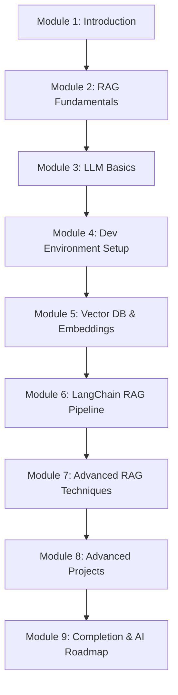

# 002 - Outline

## Section

Introduction

## Duration

5 minutes

## Main Idea

The instructor walks through the full course roadmap, showing how each module builds on the previous one. Students see the progression from RAG fundamentals to LLM basics, through vector databases and LangChain pipelines, and finally into advanced RAG techniques and production projects.

## Course Roadmap

## Module Summary

| Module | Topic | Duration |
|---|---|---|
| 1 | Introduction | 7min |
| 2 | RAG Fundamentals | 14min |
| 3 | Large Language Models | 31min |
| 4 | VS Code & GitHub Setup | 4min |
| 5 | Vector Databases & Embeddings | 37min |
| 6 | LangChain & Basic RAG Pipeline | 22min |
| 7 | Advanced RAG Techniques | 8min |
| 8 | Advanced Projects | 28min |
| 9 | Completion | 8min |

## Learning Objectives

By the end of this lesson, you should be able to:

- Describe the five learning phases of the course.
- Identify which modules correspond to which phase.
- Understand what tools and technologies will be covered (LangChain, Pinecone, Ollama, DeepSeek-R1, Streamlit).

## Review Questions

1. In which module does the first hands-on coding begin?
2. What three capstone projects are built in Module 8?
3. Which module covers vector databases in depth?

## Summary

The course roadmap moves from conceptual understanding (modules 1–3) through environment setup (module 4), deep technical foundations (module 5), pipeline construction (module 6), and advanced production work (modules 7–8), closing with forward-looking guidance on the 2025 AI landscape.
