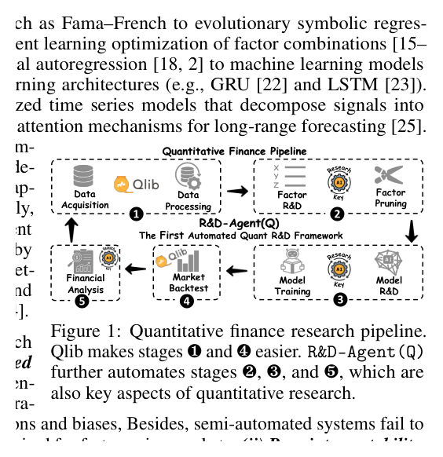
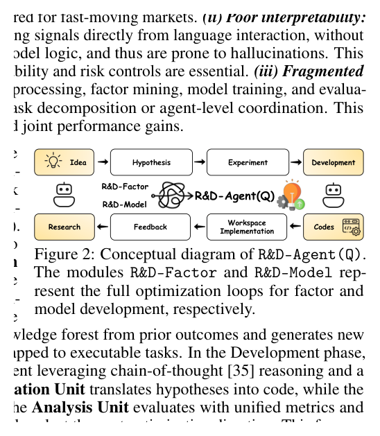

# Bài 01 — Bài toán và bối cảnh của R&D-Agent(Q)

## Mục tiêu

Sau bài này, người học hiểu vì sao paper không chỉ “dùng LLM để giao dịch”, mà xây một **hệ R&D tự động** cho hai lõi quan trọng của quantitative research: **factor mining** và **model innovation**.

## 1. Vì sao dự báo return khó?

Paper bắt đầu từ ba đặc tính của thị trường tài chính: dữ liệu có chiều cao, quan hệ phi tuyến; phân phối return có đuôi dày và volatility thay đổi theo thời gian; tài sản còn có phụ thuộc chéo lẫn nhau. Vì vậy, một pipeline tốt không thể chỉ chọn một mô hình dự báo rồi cố định mãi.

Trong quantitative investing, chuỗi giá trị thường là:

**data → factors/features → predictive model → ranking/portfolio → backtest → analysis**.

Qlib đã giảm nhiều phần engineering quanh xử lý dữ liệu và backtest. Paper tập trung tự động hóa thêm ba chỗ khó: **factor R&D**, **model R&D**, và **financial analysis/feedback**.

*Hình: pipeline nghiên cứu định lượng, trích từ Fig. 1, trang 2 của paper.*

## 2. Ba khoảng trống mà paper muốn giải quyết

### 2.1 Tự động hóa còn hạn chế

Workflow thủ công cần con người liên tục tạo hypothesis, viết code, sửa lỗi, tuning và đọc backtest. Điều này làm vòng lặp chậm và phụ thuộc kinh nghiệm cá nhân.

### 2.2 Khả năng giải thích yếu

Một số agent tài chính dựa trực tiếp vào hội thoại/ngôn ngữ để sinh quyết định giao dịch. Paper cho rằng cách này khó kiểm chứng hơn so với việc sinh **factor có định nghĩa cụ thể** và **model có code thực thi được**.

### 2.3 Tối ưu bị chia cắt

Nếu factor team và model team tối ưu riêng, feedback giữa hai phía bị mất. Một factor yếu với mô hình A có thể hữu ích với mô hình B; ngược lại, model mạnh cũng có thể bị giới hạn bởi feature set nghèo.

## 3. Ý tưởng trung tâm

R&D-Agent(Q) chia toàn bộ quá trình thành hai pha lớn:

- **Research**: xác định bối cảnh, sinh hypothesis, chuyển hypothesis thành task.
- **Development**: viết code, chạy thực nghiệm, đánh giá, lưu feedback và quyết định vòng tiếp theo.

Hai nhánh factor và model không chạy độc lập hoàn toàn. Một scheduler chọn lúc nào nên đầu tư budget vào factor, lúc nào nên tối ưu model.

*Hình: hai vòng R&D-Factor/R&D-Model và feedback, trích Fig. 2, trang 2.*

## 4. Điểm khác biệt quan trọng

R&D-Agent(Q) không coi LLM là “oracle dự đoán giá”. LLM chủ yếu đảm nhiệm **information gathering, hypothesis generation, task formulation, code generation và analysis**. Hiệu quả cuối cùng được kiểm tra bằng code chạy thật và backtest trên dữ liệu thị trường.

Đây là tư duy quan trọng để thiết kế agent cho khoa học dữ liệu: **LLM đề xuất — môi trường xác minh**.

## 5. Ba chế độ nghiên cứu

Paper đánh giá ba cấu hình:

1. **R&D-Factor**: cố định model (LightGBM), tối ưu factor set.
2. **R&D-Model**: cố định factor set (Alpha 20), tối ưu model.
3. **R&D-Agent(Q)**: luân phiên tối ưu cả factor và model.

Điểm cần nhớ là joint optimization không đơn giản bằng “chạy hai hệ song song”; Analysis Unit còn phải quyết định **hướng tối ưu tiếp theo** dựa trên trạng thái chiến lược.

## 6. Kết luận bài

Paper chuyển trọng tâm từ “LLM sinh tín hiệu” sang “LLM điều phối quy trình R&D có thể thực thi và kiểm chứng”. Đây là nền tảng cho các bài sau: trước hết phải chuẩn hóa pipeline định lượng, sau đó mới đặt các agent vào đúng interface.
