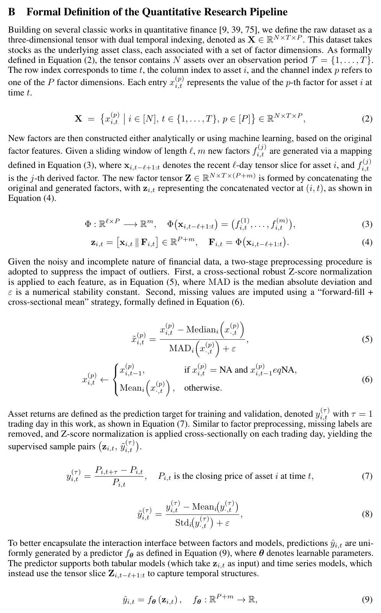
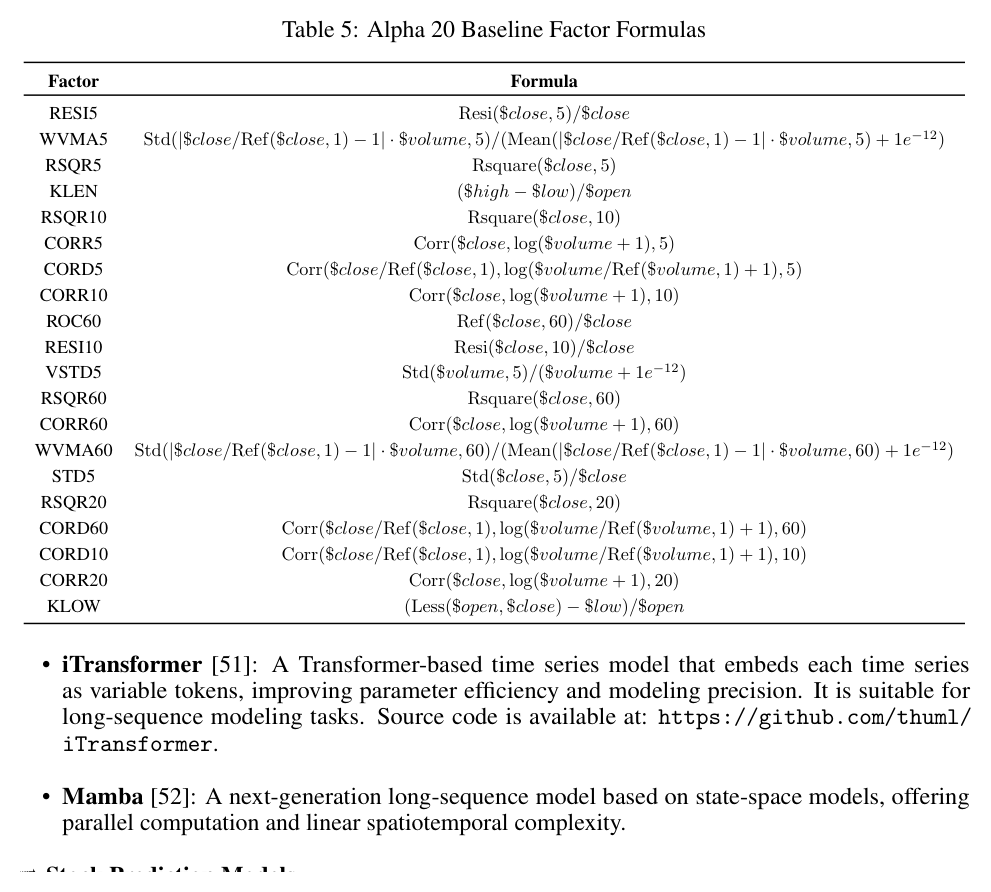

# Bài 02 — Pipeline định lượng chuẩn hóa

## Mục tiêu

Hiểu Appendix B: cách paper mô hình hóa dữ liệu, tạo factor mới, preprocessing, target return và predictor. Đây là “hợp đồng toán học” mà các agent phải tuân thủ.

## 1. Biểu diễn dữ liệu gốc

Paper mô hình hóa dữ liệu bằng tensor:

\[
X \in \mathbb{R}^{N\times T\times P}
\]

với:

- \(N\): số tài sản/cổ phiếu;
- \(T\): số mốc thời gian;
- \(P\): số chiều factor ban đầu.

Một phần tử \(x^{(p)}_{i,t}\) là giá trị factor thứ \(p\) của tài sản \(i\) tại thời điểm \(t\).

## 2. Tạo factor mới bằng sliding window

Với cửa sổ dài \(\ell\), một phép biến đổi \(\Phi\) sinh \(m\) factor mới từ lát dữ liệu gần nhất:

\[
\Phi: \mathbb{R}^{\ell\times P}\rightarrow \mathbb{R}^{m}.
\]

Sau đó factor gốc và factor mới được nối lại thành vector \(z_{i,t}\). Ý tưởng này làm rõ nhiệm vụ của factor agent: nó không “nói một ý tưởng chung chung”, mà phải tạo ra phép biến đổi có đầu vào/đầu ra khớp pipeline.

*Hình: định nghĩa formal của pipeline, Appendix B, trang 18.*

## 3. Robust normalization và missing values

Paper dùng hai bước chính:

1. **Cross-sectional robust Z-score**, dùng median và MAD để giảm ảnh hưởng outlier.
2. **Missing-value handling**: ưu tiên forward-fill; nếu không có giá trị trước đó thì dùng cross-sectional mean.

Trong hệ agent, preprocessing phải được khóa trong specification để các factor/model candidate không tự ý dùng cách xử lý khác và tạo ra so sánh thiếu công bằng.

## 4. Target return

Target là return sau \(\tau\) ngày; paper dùng \(\tau=1\) ngày giao dịch:

\[
y^{(\tau)}_{i,t}=\frac{P_{i,t+\tau}-P_{i,t}}{P_{i,t}}.
\]

Label sau đó được chuẩn hóa cross-sectionally theo ngày. Với tài chính, điều này quan trọng vì bài toán thường quan tâm **xếp hạng tương đối giữa cổ phiếu** hơn là dự đoán chính xác một mức giá tuyệt đối.

## 5. Predictor thống nhất

Mọi model đều được đưa về interface:

\[
\hat y_{i,t}=f_\theta(z_{i,t}).
\]

Tabular model nhận vector feature tại \((i,t)\). Time-series model có thể nhận cả lát \(Z_{i,t-\ell+1:t}\). Nhờ interface chung, Validation Unit có thể thay factor hoặc thay model mà không phải viết lại toàn bộ pipeline.

## 6. Walk-forward training

Paper mô tả model training theo walk-forward validation và tối ưu MSE trên tập train. Ý nghĩa kỹ thuật:

- tránh trộn tương lai vào quá khứ;
- giữ cách đánh giá nhất quán giữa candidate;
- phù hợp dữ liệu tài chính có regime thay đổi.

## 7. Alpha 20 làm điểm xuất phát

Một số thực nghiệm dùng **Alpha 20** làm factor library ban đầu. Appendix C liệt kê 20 công thức như residual, correlation, ROC, volatility/volume statistics.

*Hình: Table 5, các công thức Alpha 20, trang 22.*

## 8. Bài học thiết kế hệ thống

Một agent R&D chỉ đáng tin khi có **I/O schema, preprocessing, target và evaluation environment ổn định**. Nếu mỗi agent tự thay những thành phần này, “cải thiện” có thể chỉ là thay luật chơi.
