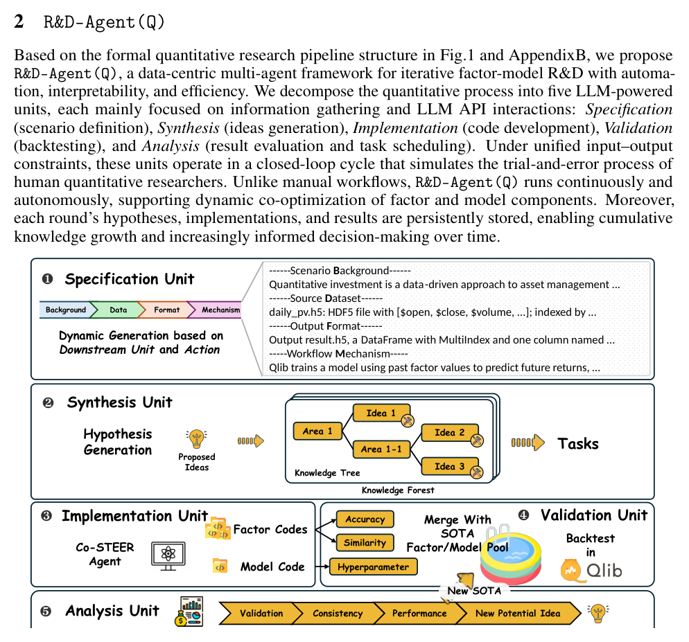

# Bài 03 — Kiến trúc R&D-Agent(Q)

## Mục tiêu

Nắm được năm unit và cách chúng tạo thành một vòng lặp tự động, có memory và có feedback.

## 1. Năm unit

R&D-Agent(Q) gồm:

1. **Specification Unit** — đóng gói scenario, dữ liệu, format và execution environment.
2. **Synthesis Unit** — sinh hypothesis mới dựa trên tri thức và feedback cũ.
3. **Implementation Unit** — biến task thành code bằng Co-STEER.
4. **Validation Unit** — kiểm tra/deduplicate/chạy backtest.
5. **Analysis Unit** — đánh giá kết quả, cập nhật SOTA, sinh feedback và chọn hướng tối ưu tiếp theo.



*Hình: Fig. 3, trang 3.*

## 2. Research và Development

### Research phase

Specification và Synthesis giải quyết câu hỏi: **“Ta nên thử gì tiếp theo, trong những ràng buộc nào?”**

### Development phase

Implementation và Validation giải quyết: **“Ý tưởng có thể chuyển thành code hợp lệ và tạo kết quả thực nghiệm không?”**

Analysis đứng ở điểm nối, biến kết quả thành feedback và quyết định iteration mới.

## 3. Persistent memory

Paper nhấn mạnh mỗi vòng lưu lại:

- hypothesis;
- implementation;
- execution result;
- feedback.

Do đó hệ không bắt đầu lại từ đầu sau mỗi loop. Memory giúp hai việc: Synthesis tránh lặp ý tưởng vô ích, Co-STEER tái sử dụng kinh nghiệm sửa code.

## 4. Vòng lặp logic

Một iteration có thể mô tả như sau:

```text
optimization target
      ↓
Specification
      ↓
Synthesis → hypothesis → task(s)
      ↓
Implementation / Co-STEER
      ↓
Validation / Qlib backtest
      ↓
Analysis → feedback + SOTA update
      ↓
action scheduler: factor or model?
      └────────────────────────────→ next iteration
```

## 5. Factor task và model task không giống nhau

Factor hypothesis có thể tách thành nhiều factor nhỏ, dẫn đến nhiều task có dependency. Model hypothesis thường có cấu trúc đồng bộ hơn và được triển khai như một task lớn cho toàn pipeline training/inference.

Đây là lý do Co-STEER cần scheduler ở mức task: **factor R&D có tính “multi-task” rõ hơn model R&D**.

## 6. Hai tầng feedback

- **Local feedback**: Analysis Unit nhìn experiment hiện tại, chỉ ra lỗi cụ thể.
- **Global memory**: Synthesis Unit nhìn lịch sử rộng hơn, cân bằng refine hướng cũ và mở hướng mới.

Cách tách này tránh hai cực đoan: chỉ chăm sửa thử nghiệm vừa thất bại, hoặc chỉ sinh ý tưởng mới mà quên bài học gần nhất.
