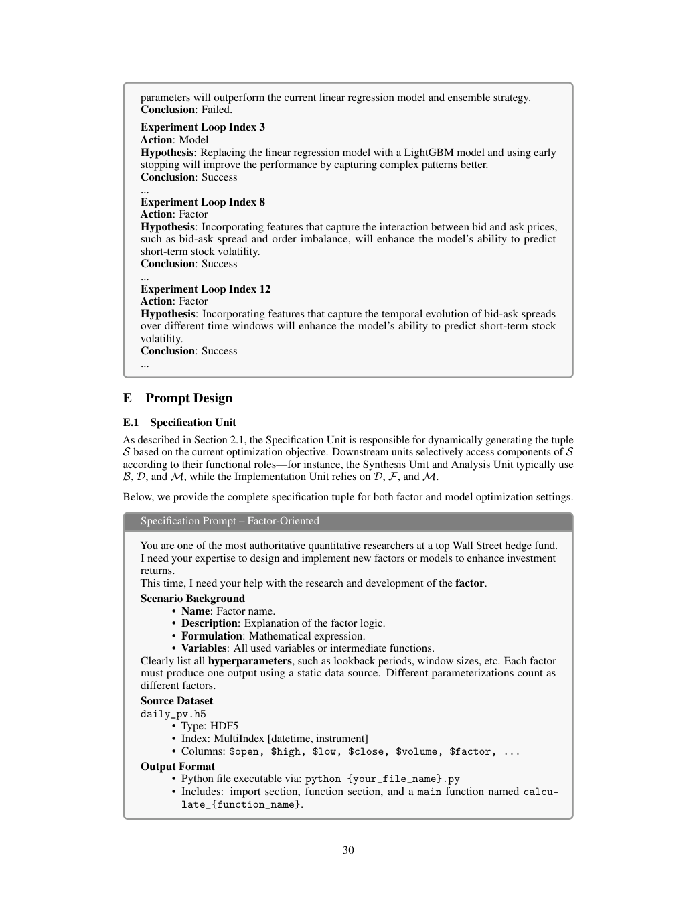

# Bài 04 — Specification Unit: biến bài toán thành contract thực thi

## Mục tiêu

Hiểu vì sao Specification Unit là lớp “khóa luật chơi” cho toàn hệ.

## 1. Tuple specification

Paper ký hiệu:

\[
S=(B,D,F,M)
\]

trong đó:

- \(B\): background assumptions và prior knowledge;
- \(D\): data interface/schema;
- \(F\): output format kỳ vọng;
- \(M\): execution environment, ví dụ Qlib backtest.

Một candidate \(f_\theta\) chỉ hợp lệ nếu đầu vào từ \(D\), đầu ra thuộc \(F\), và code chạy được trong \(M\).

## 2. Hai trục: theoretical và empirical

### Theoretical

Specification chứa định nghĩa bài toán, ý nghĩa factor/model, schema và constraints. Điều này giúp agent hiểu “đang giải quyết gì”.

### Empirical

Specification còn nêu rõ môi trường thực thi và interface kiểm tra. Điều này giúp agent hiểu “kết quả phải chạy được như thế nào”.

## 3. Vì sao dynamic specification quan trọng?

Factor iteration và model iteration cần context khác nhau. Ví dụ:

- factor task cần biết data fields, output DataFrame format, frequency;
- model task cần biết input factor tensor, train/validation interface, prediction format.

Paper dùng Specification Unit để sinh context phù hợp cho downstream action hiện tại thay vì dùng một prompt khổng lồ cố định.

## 4. Prompt contract trong Appendix E

Appendix E.1 cung cấp specification prompt riêng cho factor-oriented và model-oriented scenario. Prompt có các phần kiểu:

- scenario background;
- source dataset;
- output format;
- workflow mechanism;
- constraints.

*Hình: trang 30, ví dụ prompt Specification Unit.*

## 5. Quy tắc thiết kế có thể áp dụng ngoài finance

Khi xây agent nghiên cứu dữ liệu, specification tốt nên trả lời đủ 5 câu:

1. **Input là gì?** Kiểu dữ liệu, index, fields.
2. **Output là gì?** Schema, dtype, naming, shape.
3. **Code được chạy ở đâu?** Runtime, package, API.
4. **Kết quả được kiểm tra thế nào?** Validator/backtest/test.
5. **Điều gì bị cấm?** Leakage, dùng dữ liệu tương lai, thay đổi target, phá interface.

Specification Unit vì vậy giống một lớp kết hợp giữa **problem statement + API contract + reproducibility protocol**.
