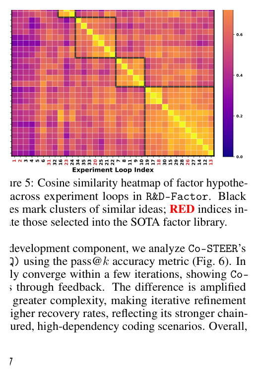
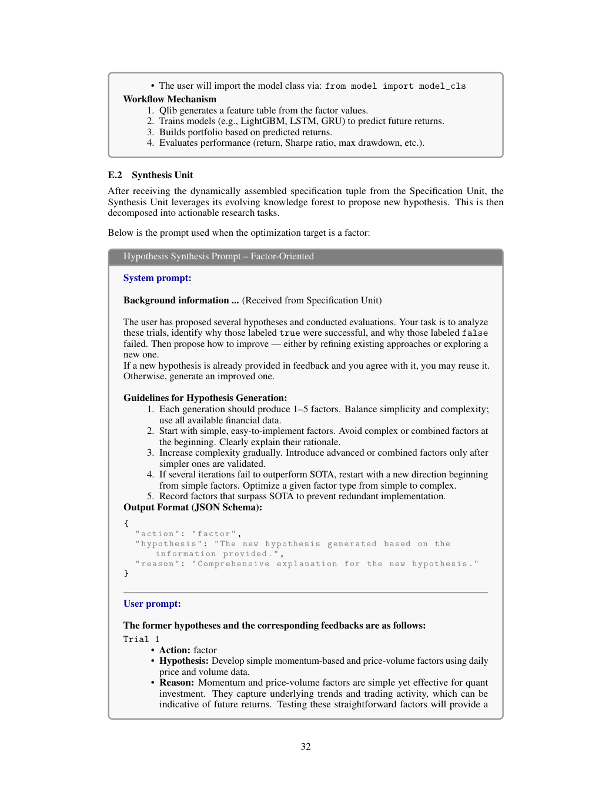

# Bài 05 — Synthesis Unit: từ lịch sử thử nghiệm đến hypothesis mới

## Mục tiêu

Hiểu cách Synthesis Unit dùng lịch sử, SOTA và feedback để tạo hypothesis mới thay vì random prompting.

## 1. Action-conditioned memory

Ở vòng \(t\), action \(a_t\) là `factor` hoặc `model`. Synthesis Unit lấy lịch sử hypothesis \(H_t\) và feedback \(F_t\), sau đó chọn phần liên quan tới action hiện tại cùng các nghiệm SOTA.

Ý tưởng: khi đang tối ưu factor, hệ không cần nhồi toàn bộ lịch sử model vào prompt; nhưng vẫn giữ các nghiệm tốt quan trọng để duy trì phối hợp giữa hai phía.

## 2. Generative mapping

Paper mô tả một ánh xạ sinh:

\[
h^{(t+1)} = G(H_t^{(a)},F_t^{(a)}).
\]

\(G\) kết hợp prior chuyên môn và empirical feedback. Output không dừng ở “ý tưởng hay”, mà phải đủ cụ thể để ánh xạ thành task executable.

## 3. Khi thành công và khi thất bại

Paper mô tả chiến lược thích nghi:

- nếu feedback tốt: tăng độ phức tạp hoặc mở rộng scope của hypothesis;
- nếu chưa tốt: thay cấu trúc, biến số hoặc hướng tiếp cận.

Nhờ đó hình thành **idea forest**: nhiều nhánh ý tưởng, có refine cục bộ nhưng cũng có shift sang hướng khác.

## 4. Bằng chứng từ factor similarity

Paper embedding các factor hypothesis bằng Sentence-BERT, tính cosine similarity rồi hierarchical clustering. Fig. 5 cho thấy ba pattern:

- refine cục bộ một chuỗi ý tưởng rồi đổi hướng;
- quay lại các hướng cũ có tiềm năng;
- SOTA cuối cùng lấy tín hiệu từ nhiều cluster khác nhau.



*Hình: Fig. 5, trang 7.*

## 5. Hypothesis → task

Với factor, một hypothesis có thể tạo nhiều task, ví dụ:

```text
Hypothesis: kết hợp momentum dài hạn + liquidity + volatility clustering
→ Task A: cumulative return 30d
→ Task B: turnover ratio 20d
→ Task C: volatility clustering proxy
```

Với model, hypothesis thường ánh xạ vào một task lớn như thay backbone, thay temporal encoder, thêm cross-sectional interaction, v.v.

## 6. Prompt Synthesis

Appendix E.2 cho thấy prompt yêu cầu agent đọc prior experiment, SOTA và scenario rồi sinh hypothesis có reasoning và task definitions.



*Hình: trang 32, ví dụ prompt Synthesis Unit.*

## 7. Nguyên tắc thực hành

Một Synthesis Unit tốt phải đạt đồng thời:

- **Novelty**: không chỉ lặp factor đã có.
- **Grounding**: hypothesis có cơ sở domain/data.
- **Executability**: có thể biến thành task code.
- **Traceability**: biết hypothesis xuất phát từ feedback nào.
