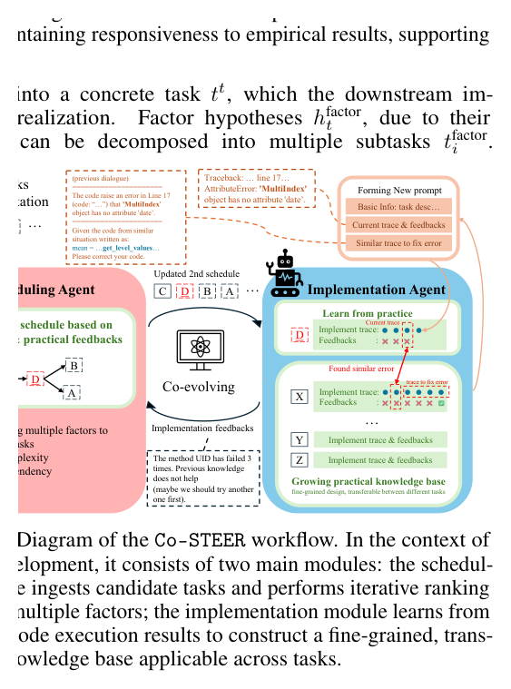
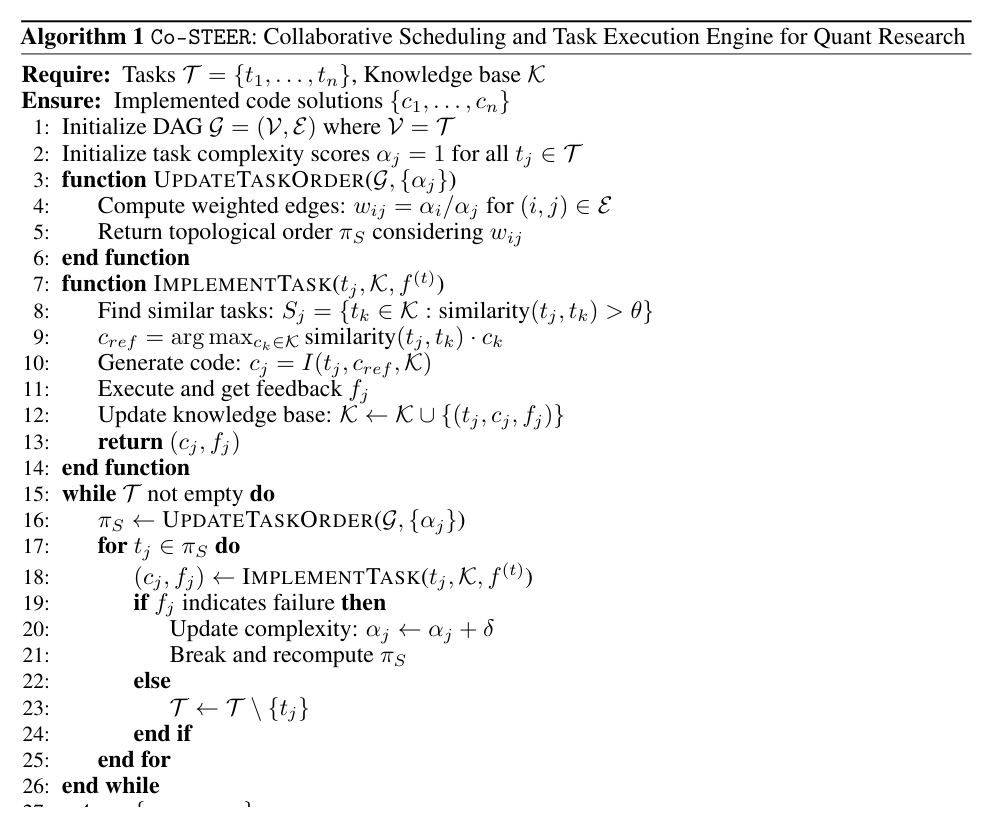
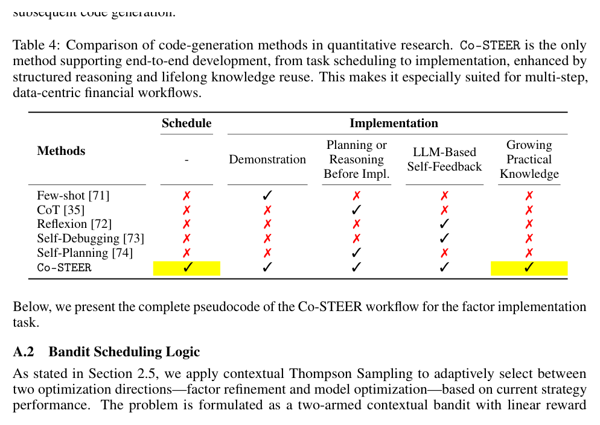
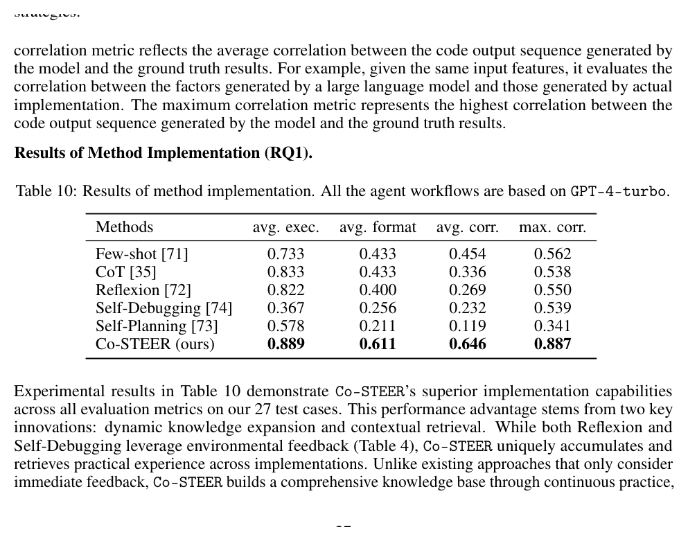

# Bài 06 — Implementation Unit và Co-STEER

## Mục tiêu

Hiểu Co-STEER như một code-generation agent có **scheduler + implementation + practical memory**, không chỉ là “prompt LLM viết code”.

## 1. Vấn đề của factor implementation

Một hypothesis factor có thể tạo nhiều task liên quan nhau. Nếu thực hiện sai thứ tự, agent dễ thất bại hoặc thiếu context. Paper biểu diễn dependency bằng DAG:

\[
G=(V,E)
\]

với cạnh \(A\rightarrow B\) nghĩa là nên làm A trước B vì dependency hoặc knowledge flow.

*Hình: Fig. 4, trang 4.*

## 2. Scheduling có học từ feedback

Ban đầu mỗi task có complexity score. Sau khi thực thi:

- task thành công → loại khỏi hàng đợi;
- task thất bại → tăng complexity, recompute order;
- scheduler có xu hướng ưu tiên task dễ/nền tảng để tích lũy knowledge trước.

Đây là khác biệt với random order hoặc một topological order bất biến.

## 3. Practical knowledge base

Co-STEER lưu tuple:

\[
(t_j,c_j,f_j)
\]

trong đó task, code và feedback được giữ lại. Khi gặp task mới, agent retrieval các task tương tự và dùng code/trace cũ làm tham chiếu.

Điểm mạnh nằm ở **cross-task knowledge reuse**. Một lỗi pandas `MultiIndex`, format mismatch hay schema violation đã gặp ở factor trước có thể giúp sửa factor sau nhanh hơn.

## 4. Algorithm 1

Algorithm 1 mô tả vòng lặp:

1. Khởi tạo DAG và complexity.
2. Tính lại task order.
3. Tìm task tương tự trong knowledge base.
4. Sinh code, execute, nhận feedback.
5. Cập nhật knowledge base.
6. Nếu fail, tăng complexity rồi schedule lại.
7. Lặp tới khi hết task.

*Hình: Algorithm 1, trang 17.*

## 5. So sánh với các kỹ thuật code generation khác

Paper so Co-STEER với Few-shot, CoT, Reflexion, Self-Debugging và Self-Planning. Điểm khác là Co-STEER kết hợp đủ scheduling, demonstration/retrieval, planning/reasoning, self-feedback và growing practical knowledge.

*Hình: Table 4, trang 16.*

## 6. Kết quả implementation benchmark

Trong Appendix D.4, paper báo cáo 27 test cases và dùng các metric như execution success, format correctness, average correlation, maximum correlation. Co-STEER đạt kết quả cao hơn các workflow đối chiếu trong Table 10.

*Hình: Table 10, trang 27.*

## 7. Ý nghĩa kiến trúc

Co-STEER gợi ý một pattern tổng quát cho coding agent:

**decompose → schedule → retrieve similar experience → implement → execute → capture failure → update memory → reschedule**.

Điểm quan trọng là feedback phải đến từ môi trường chạy thật, không chỉ self-critique bằng ngôn ngữ.
