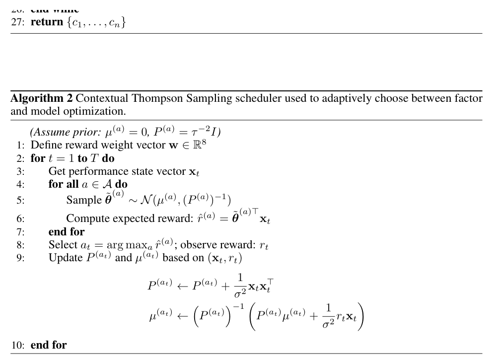

# Bài 08 — Analysis Unit và contextual Thompson sampling

## Mục tiêu

Hiểu hai nhiệm vụ của Analysis Unit: đánh giá experiment và chọn nhánh tối ưu tiếp theo.

## 1. Đánh giá experiment

Sau mỗi vòng, Analysis Unit nhận:

- hypothesis \(h_t\);
- task \(t_t\);
- result \(r_t\).

Nếu candidate vượt tiêu chuẩn SOTA cho action hiện tại, nó được thêm vào SOTA set. Analysis còn chẩn đoán lý do thất bại và tạo feedback cho Synthesis Unit.

## 2. Local vs global reasoning

Analysis Unit tập trung vào experiment vừa chạy. Synthesis Unit giữ góc nhìn toàn lịch sử. Cặp này tạo ra sự cân bằng:

- Analysis: phản ứng nhanh, cụ thể;
- Synthesis: định hướng dài hạn, tránh bị “kẹt” vào một lỗi cục bộ.

## 3. Trạng thái 8 chiều

Scheduler nhìn state vector:

\[
x_t=[IC,ICIR,RankIC,RankICIR,ARR,IR,-MDD,SR]^\top.
\]

MDD được đổi dấu để mọi chiều đều cùng hướng “lớn hơn là tốt hơn”.

## 4. Hai action

\[
A=\{factor,model\}.
\]

Mỗi action có Bayesian linear model riêng. Ở mỗi vòng, Thompson Sampling lấy mẫu hệ số reward từ posterior, ước lượng reward cho state hiện tại và chọn action có sampled reward lớn hơn.



*Hình: Algorithm 2, trang 17.*

## 5. Vì sao không để LLM tự chọn action hoàn toàn?

Ablation trong paper so ba lựa chọn: random, LLM-based và bandit. Bandit cho kết quả tổng thể tốt hơn trong thiết lập chính của paper; lý do được tác giả nêu là nó khai thác trực tiếp context định lượng và cập nhật posterior theo reward quan sát được.


*Hình: Table 9, trang 26.*

## 6. Pseudocode trực giác

```text
for each iteration:
    x = current_metrics()
    score_factor = sample_posterior(factor) · x
    score_model  = sample_posterior(model)  · x
    action = argmax(score_factor, score_model)
    run(action)
    reward = improvement_after_run()
    update_posterior(action, x, reward)
```

## 7. Guardrail chống exploration loop

Discussion nêu thêm giới hạn số vòng liên tiếp theo một hướng để tránh hệ kẹt mãi ở factor hoặc model. Đây là ví dụ cho thấy bandit thực tế thường cần constraint, không chỉ thuật toán textbook.
