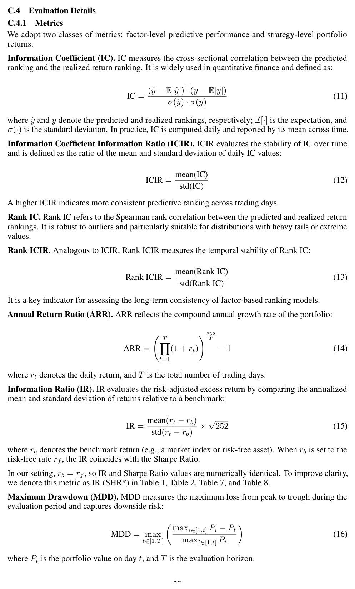
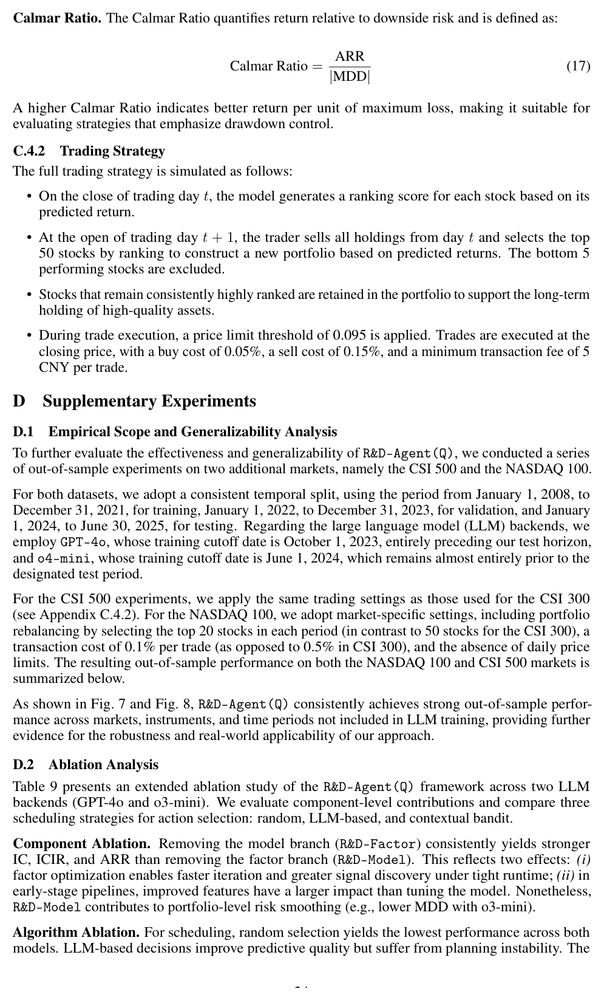

# Bài 09 — Thiết kế thực nghiệm, metrics và trading protocol

## Mục tiêu

Đọc đúng thực nghiệm của paper và hiểu mỗi metric trả lời câu hỏi nào.

## 1. Dataset chính: CSI 300

Paper dùng CSI 300 với split:

- train: 2008-01-01 → 2014-12-31;
- validation: 2015-01-01 → 2016-12-31;
- test: 2017-01-01 → 2020-08-01.

Ba cấu hình: R&D-Factor, R&D-Model, R&D-Agent(Q). Baseline gồm machine learning, deep learning, stock-specific models và factor libraries.

## 2. Thiết lập compute

Appendix C báo cáo server dùng dual Intel Xeon Gold 6348 và bốn RTX A6000 48 GiB. R&D-Factor và R&D-Model chạy 6 giờ; joint framework chạy 12 giờ. Baseline được tuning và chạy 5 seed; paper báo median ARR.

Đây là chi tiết cần nhớ khi so kết quả: budget thực thi là một phần của experimental condition.

## 3. Metrics factor-level

### IC

Đo cross-sectional correlation giữa prediction và realized return. IC cao nghĩa ordering dự đoán có quan hệ tuyến tính tốt hơn với kết quả.

### ICIR

\[
ICIR=\frac{mean(IC)}{std(IC)}.
\]

Nó đo **độ ổn định theo thời gian**, không chỉ độ mạnh trung bình.

### Rank IC / Rank ICIR

Dùng Spearman rank correlation và stability của rank correlation. Phù hợp khi phân phối có outlier/heavy tail.

## 4. Metrics strategy-level

### ARR

Annualized compound return.

### IR (SHR*)

Paper dùng benchmark bằng risk-free rate, nên IR và Sharpe Ratio trùng số học trong thiết lập này.

### MDD

Maximum drawdown — rủi ro suy giảm từ đỉnh tới đáy.

### Calmar Ratio

\[
CR=\frac{ARR}{|MDD|}.
\]

Nó giúp nhìn lợi nhuận so với drawdown thay vì chỉ return.

*Hình: Appendix C.4.1, trang 23.*

## 5. Trading strategy trong backtest

Theo Appendix C.4.2:

- cuối ngày \(t\), model sinh ranking score;
- đầu ngày \(t+1\), portfolio được cập nhật theo ranking;
- chọn top 50 stocks trong CSI setting, với retention cho cổ phiếu vẫn xếp hạng cao;
- áp dụng price-limit threshold và transaction cost;
- paper nêu buy cost 0.05%, sell cost 0.15%, minimum fee 5 CNY/trade cho setting này.

*Hình: phần trading strategy và mở đầu OOS evaluation, trang 24.*

## 6. Cách đọc một kết quả tài chính đúng

Không nên chỉ nhìn ARR. Ví dụ hai strategy có ARR tương tự nhưng strategy có MDD thấp hơn và IR/CR cao hơn có profile rủi ro khác. Ngược lại, IC cao không đảm bảo ARR cao vì mapping từ prediction đến portfolio còn phụ thuộc ranking, turnover, cost và market regime.
