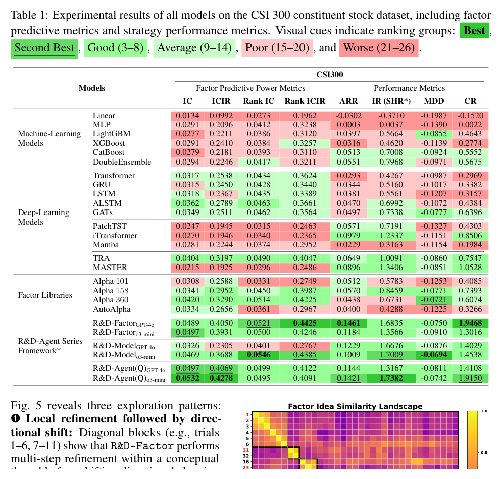
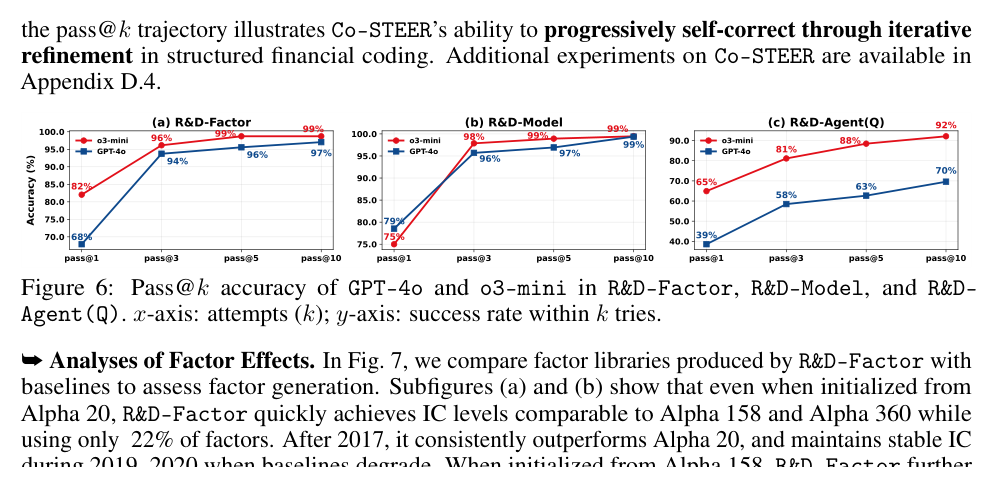
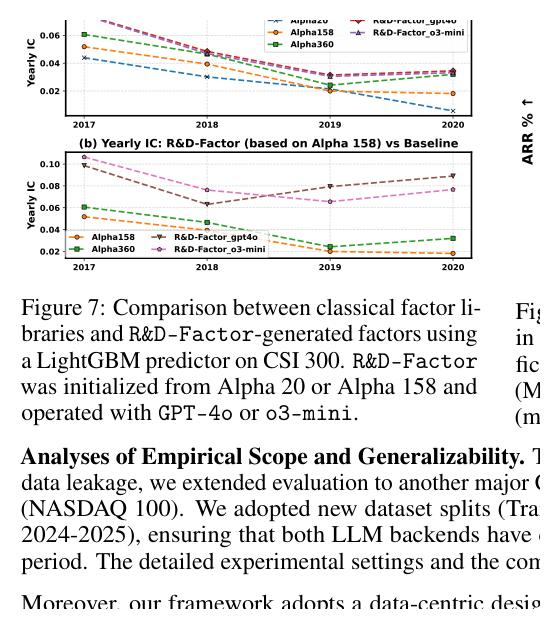
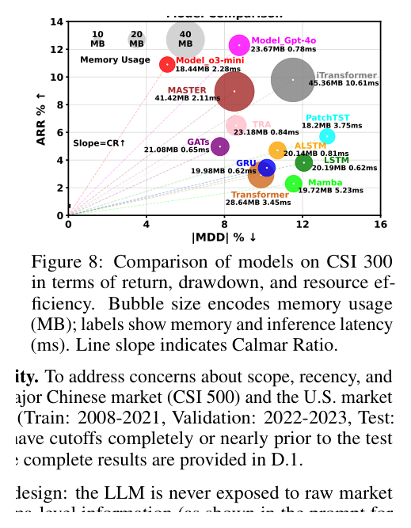

# Bài 10 — Kết quả chính trên CSI 300

## Mục tiêu

Đọc Table 1 và các figure phân tích mà không nhầm giữa predictive metrics và strategy metrics.

## 1. Bảng tổng hợp

Table 1 so sánh machine learning, deep learning, factor libraries và R&D-Agent series trên CSI 300.

*Hình: Table 1, trang 7.*

## 2. R&D-Factor

Paper báo cáo R&D-Factor với GPT-4o đạt IC 0.0489, ARR 0.1461; biến thể o3-mini đạt IC 0.0497, ARR 0.1184. Tác giả nhấn mạnh factor set được tạo động có thể đạt hoặc vượt baseline library lớn hơn trong khi dùng ít factor hơn.

Điểm học thuật quan trọng không phải một con số đơn lẻ, mà là **feedback-driven factor refinement + dedup + accumulation**.

## 3. R&D-Model

R&D-Model giữ Alpha 20 cố định rồi tìm model. Bản o3-mini trong Table 1 có Rank IC 0.0546 và MDD -0.0694. Paper diễn giải rằng các stock-specific structure và adaptive model design phù hợp hơn một số generic time-series architecture trong thiết lập này.

## 4. Joint R&D-Agent(Q)

R&D-Agent(Q) o3-mini trong Table 1 có:

- IC: 0.0532;
- ICIR: 0.4278;
- ARR: 0.1421;
- IR: 1.7382;
- MDD: -0.0742;
- Calmar Ratio: 1.9150.

Paper dùng kết quả này để lập luận factor–model co-optimization tạo cải thiện bổ sung giữa representation và model architecture.

## 5. Pass@k của Co-STEER

Fig. 6 cho thấy success rate tăng nhanh khi cho phép nhiều attempt. Full-stack R&D-Agent(Q) khó hơn factor/model riêng nên iterative repair quan trọng hơn.

*Hình: Fig. 6, trang 8.*

## 6. Factor effects

Fig. 7 so R&D-Factor với các factor library qua nhiều năm. Paper nhấn mạnh khả năng nhanh chóng đạt mức IC cạnh tranh dù bắt đầu từ Alpha 20, và độ ổn định tốt hơn ở một số giai đoạn baseline suy giảm.

## 7. Model effects

Fig. 8 đặt model lên không gian return–drawdown và mã hóa resource use bằng bubble size. Đây là cách trực quan để tránh kết luận chỉ từ ARR.

## 8. Cách diễn giải thận trọng

Kết quả này là empirical evidence dưới dataset, split, cost model và runtime cụ thể của paper. Không nên suy rộng thành “framework luôn thắng trên mọi thị trường”. Bài 11 xem các kiểm tra OOS và ablation mà tác giả dùng để mở rộng bằng chứng.
