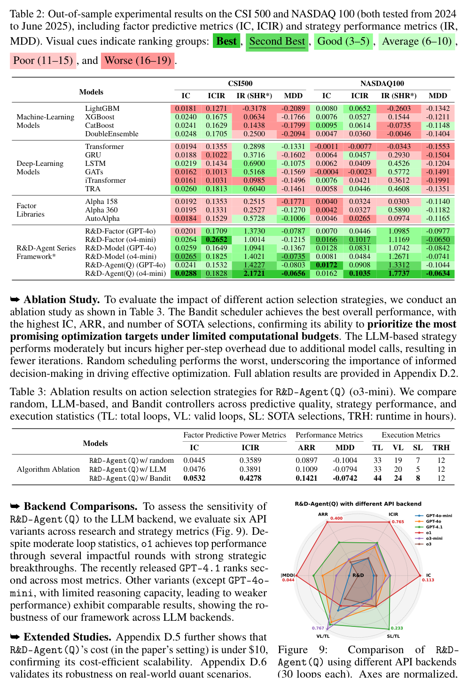
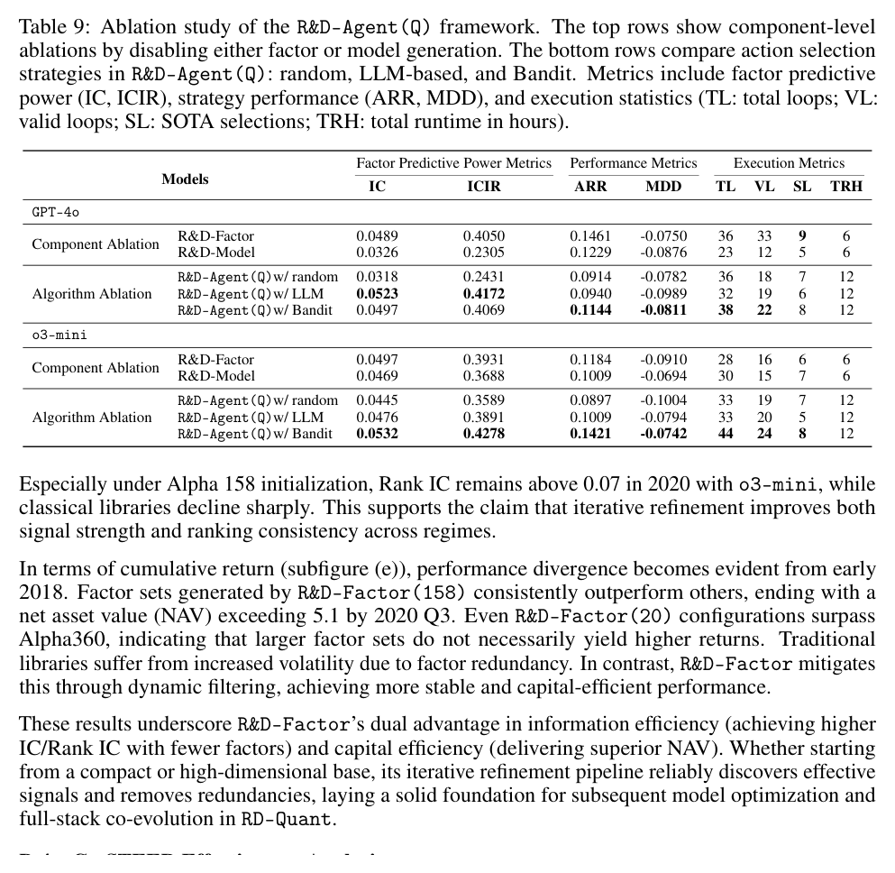
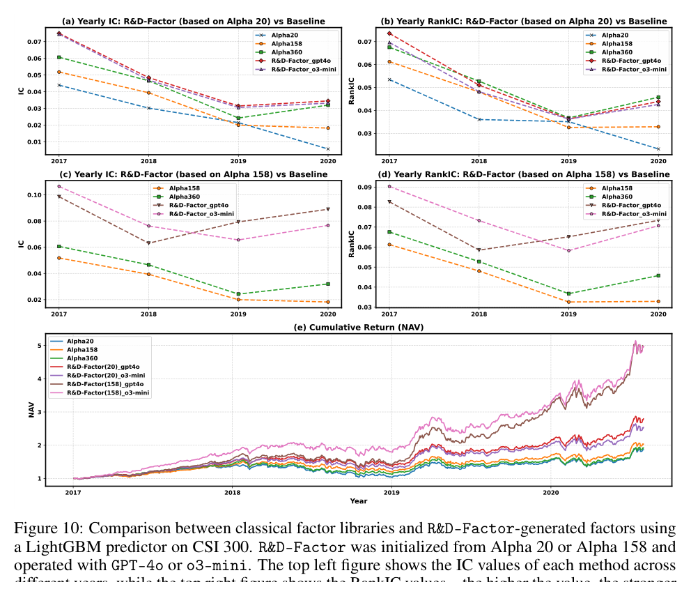
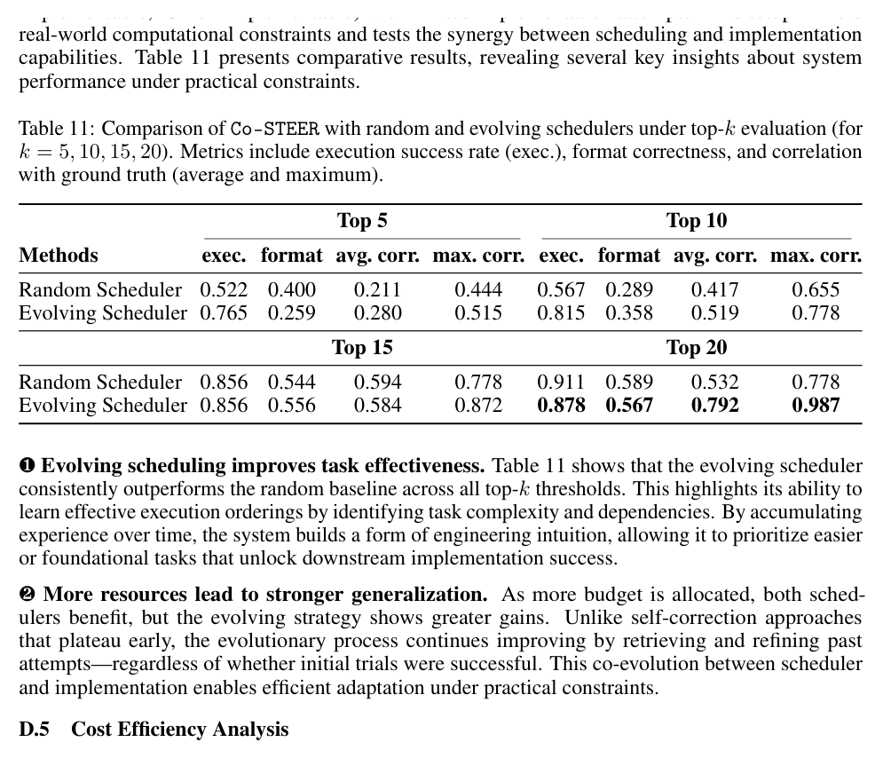
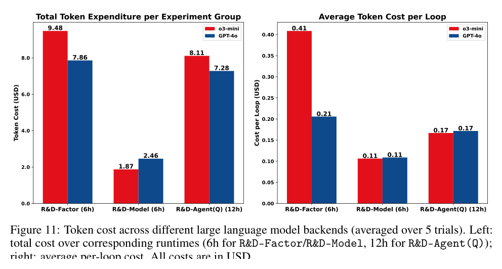
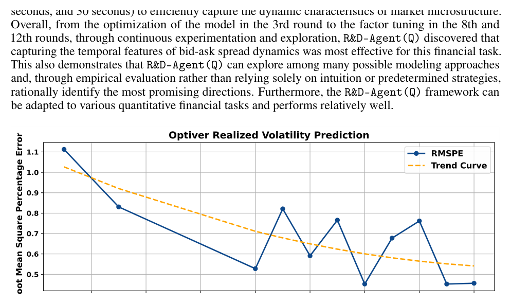

# Bài 11 — Generalization, ablation, cost và case study Optiver

## Mục tiêu

Hiểu các thí nghiệm bổ sung dùng để kiểm tra framework ngoài CSI 300 và tách đóng góp từng thành phần.

## 1. Out-of-sample trên CSI 500 và NASDAQ 100

Appendix D.1 dùng split mới:

- train: 2008–2021;
- validation: 2022–2023;
- test: 2024 → 2025-06-30.

Paper dùng GPT-4o và o4-mini cho nhóm thí nghiệm này, đồng thời nhấn mạnh test horizon phần lớn hoặc hoàn toàn sau cutoff mà tác giả nêu cho backend. LLM không được xem raw market series hay explicit temporal split; agent chỉ thấy schema-level context.

*Hình: trang 9, bảng OOS và ablation tóm tắt.*

## 2. NASDAQ 100 có trading rule riêng

Paper điều chỉnh setting theo thị trường Mỹ: top 20 stocks, transaction cost riêng và không có daily price limit. Điều này nhắc ta rằng generalization không đồng nghĩa copy nguyên execution protocol giữa các market.

## 3. Component ablation

Appendix D.2 cho thấy factor-only và model-only đều có đóng góp khác nhau. Tác giả quan sát factor optimization có thể iterate nhanh và khám phá signal tốt dưới runtime chặt, trong khi model optimization có thể giúp risk smoothing ở một số setting.

## 4. Scheduler ablation

Random, LLM-based và Bandit được so sánh. Bandit đạt trade-off tốt hơn trong bảng ablation của paper và thu được nhiều SOTA selections hơn trong setting chính.

## 5. Factor library evolution

Fig. 10 kiểm tra khởi tạo từ Alpha 20 và Alpha 158. Paper dùng kết quả để lập luận hệ có thể cải thiện cả baseline nhỏ lẫn baseline mạnh hơn.

## 6. Co-STEER scheduling under budget

Table 11 so random scheduler với evolving scheduler theo top-k budget. Mục tiêu không chỉ code đúng, mà chọn task order hiệu quả khi số attempt bị giới hạn.

## 7. Cost efficiency

Fig. 11 báo cáo token cost cho các backend trong runtime cố định. Paper cho biết tổng chi phí API trong các workflow được khảo sát dưới 10 USD theo pricing/setting tại thời điểm nghiên cứu.

Con số này không nên xem là định mức cố định vì giá API và implementation có thể thay đổi.

## 8. Optiver case study

Paper áp dụng framework cho Kaggle Optiver Realized Volatility Prediction. Qua các vòng thử nghiệm, hệ chuyển từ model improvement sang factor engineering; hypothesis thành công tập trung vào bid–ask spread, order imbalance và evolution của spread qua nhiều time window.

*Hình: Fig. 12, trang 29.*

Case study minh họa triết lý của framework: **không khóa cứng một loại cải tiến; dùng empirical feedback để chọn hướng tiếp theo**.
