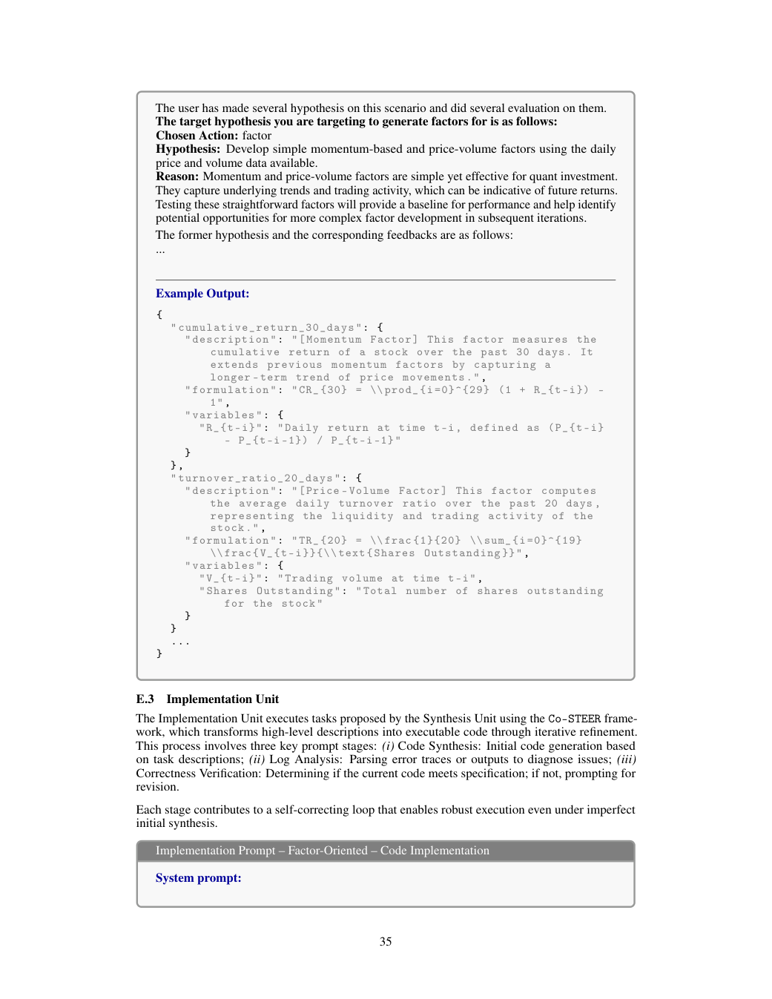
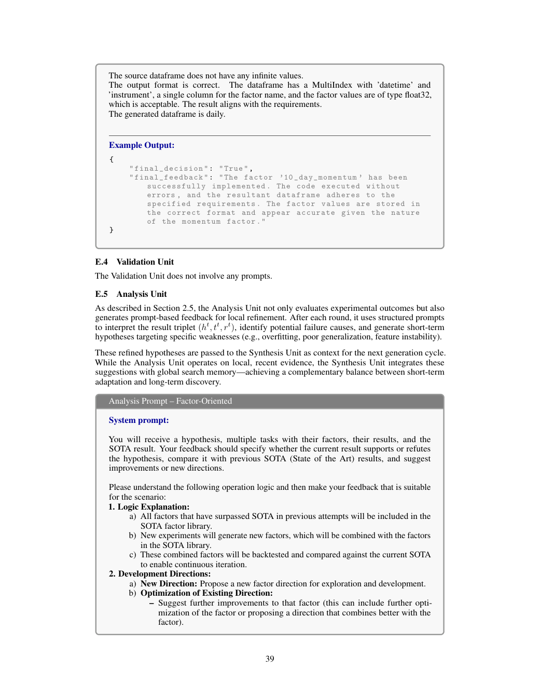
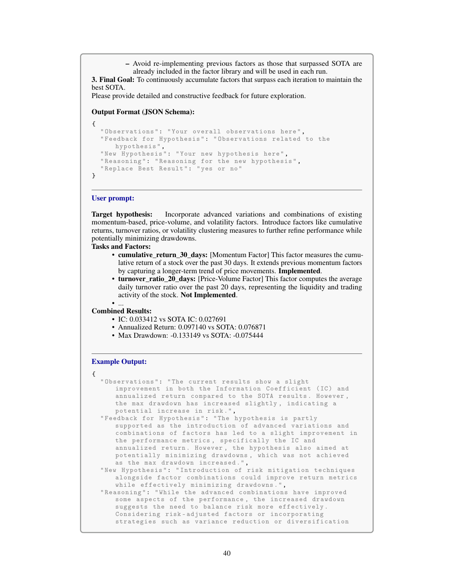

# Bài 12 — Prompt design và agent contracts

## Mục tiêu

Hiểu Appendix E như một thiết kế giao thức giữa agent, không chỉ là tập prompt mẫu.

## 1. Prompt phải bám vai trò của unit

Paper không dùng một prompt chung cho mọi bước. Mỗi unit chỉ nhận context cần thiết:

- Specification: background, data, output, environment.
- Synthesis: historical evidence, SOTA, goal, constraints.
- Implementation: task description, input/output schema, execution feedback.
- Validation: không prompt; dùng chương trình.
- Analysis: hypothesis + tasks + results + SOTA để sinh feedback.

## 2. Specification prompt

Prompt kiểu này đóng vai trò contract. Nếu schema output yêu cầu MultiIndex `(datetime, instrument)` và một column factor, agent phải tuân thủ format trước khi nói tới hiệu quả tài chính.

## 3. Synthesis prompt

Một synthesis prompt tốt cần:

- nêu rõ current SOTA;
- ghi lịch sử những gì đã thử;
- yêu cầu novelty;
- yêu cầu hypothesis có rationale;
- chuyển hypothesis thành task cụ thể.

## 4. Implementation prompt

Appendix E.3 cho thấy implementation prompt gắn task với code interface và validator feedback. Điều này biến vòng hội thoại thành một **debug loop có objective condition**.

## 5. Analysis prompt

Analysis prompt phải trả lời hai câu khác nhau:

1. Result hiện tại có support/refute hypothesis không?
2. Vòng sau nên điều chỉnh hypothesis thế nào?

Paper dùng structured output với các field kiểu Observations, Feedback for Hypothesis, New Hypothesis, Reasoning, Replace Best Result.

## 6. Nguyên tắc prompt engineering rút ra

### Tách “thinking task” khỏi “verification task”

LLM phù hợp sinh hypothesis và giải thích feedback; code/rule phù hợp validation deterministic.

### Output schema phải machine-readable

Structured JSON giúp orchestration không phụ thuộc prose tự do.

### Feedback phải gắn với failure thật

Implementation prompt nên đưa traceback, format mismatch, metric failure hoặc validator output; tránh feedback chung chung.

### Memory nên được chọn lọc

Không đổ toàn bộ lịch sử vào prompt. Retrieval theo action/task similarity giúp context ngắn hơn và liên quan hơn.
