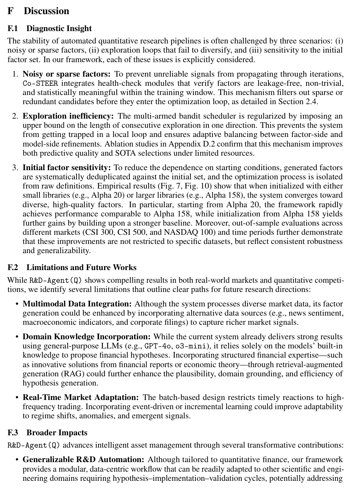

# Bài 13 — Discussion, limitations và bài học thiết kế hệ thống

## Mục tiêu

Tổng hợp các failure mode mà paper tự nêu và chuyển chúng thành checklist khi xây agent R&D.

## 1. Ba rủi ro vận hành

Appendix F nêu ba tình huống gây mất ổn định:

1. **Noisy/sparse factors** — signal không đáng tin đi vào loop.
2. **Exploration không đa dạng** — hệ lặp mãi một hướng.
3. **Nhạy với factor set ban đầu** — kết quả phụ thuộc seed/library khởi tạo.

Paper ứng phó bằng health checks, giới hạn consecutive exploration, dedup và thực nghiệm với nhiều initialization.

*Hình: trang 41, phần Diagnostic Insight và Limitations.*

## 2. Hạn chế được tác giả nêu

### Multimodal data integration

Framework hiện chủ yếu dùng dữ liệu thị trường/fundamental; tác giả đề xuất thêm news sentiment, macro indicators, filings.

### Domain knowledge incorporation

Hypothesis hiện dựa nhiều vào kiến thức nội tại của LLM. Paper đề xuất retrieval-augmented generation với tài liệu tài chính/economic theory để tăng grounding.

### Real-time market adaptation

Batch design chưa phù hợp phản ứng tần suất cao. Event-driven hoặc incremental learning là hướng mở rộng.

## 3. Reproducibility là yêu cầu kiến trúc

Một điểm đáng chú ý là output cuối cùng phải là **code thực thi được**, không chỉ natural-language suggestion. Điều này giúp:

- kiểm tra lại;
- chuyển dataset;
- chạy benchmark;
- audit failure;
- triển khai trong môi trường khác với điều chỉnh tối thiểu.

## 4. Agent system checklist

Khi xây hệ tương tự, hãy tự hỏi:

- Có standardized data/output contract chưa?
- Hypothesis có novelty check không?
- Code có chạy trong sandbox/runtime thật không?
- Validator có tách correctness và performance không?
- Memory có lưu cả success lẫn failure không?
- Scheduler có tránh starvation/local loop không?
- Experiment có budget/time/cost log không?
- Có out-of-sample test và ablation không?
- Có kiểm soát leakage không?

## 5. Kết luận khóa học

R&D-Agent(Q) đáng học ở **kiến trúc vòng lặp nghiên cứu**: specification → synthesis → implementation → validation → analysis → scheduling. Finance là domain cụ thể; pattern tổng quát có thể áp dụng cho nhiều bài toán data-centric R&D khác miễn là có môi trường thực thi và metric khách quan.
