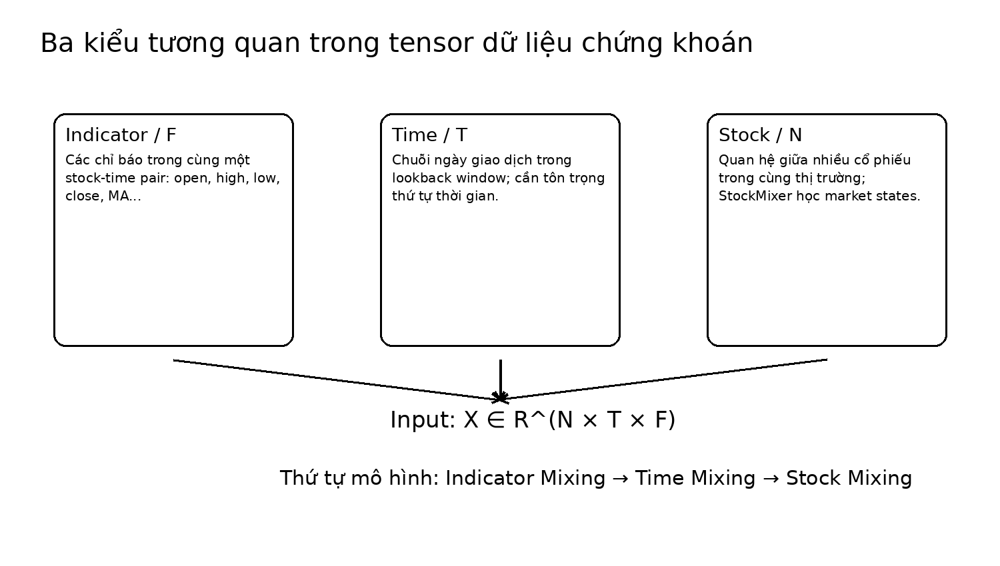

# Bài 01 - Bài toán và động lực của StockMixer

## 1. Bài toán paper muốn giải quyết

StockMixer xem dự báo chứng khoán như một bài toán **multivariate time-series forecasting ở cấp thị trường**. Ở mỗi thời điểm, mô hình không chỉ nhìn một mã cổ phiếu độc lập mà nhận lịch sử của `N` cổ phiếu, mỗi cổ phiếu có `T` ngày quan sát và `F` chỉ báo.

Ký hiệu chính:

\[
X = \{X_1, X_2, \ldots, X_N\}, \qquad X_i \in \mathbb{R}^{T \times F}
\]

Do đó toàn bộ input có thể được nhìn như:

\[
X \in \mathbb{R}^{N \times T \times F}
\]

Mô hình dự đoán closing price ngày kế tiếp và từ đó tính 1-day return:

\[
r_i^t = \frac{p_i^t - p_i^{t-1}}{p_i^{t-1}}
\]

## 2. Ba loại tương quan

### Indicator correlation

Mỗi ngày của một cổ phiếu có nhiều chỉ báo. Paper nêu các ví dụ như open, high, low, close và 5-day average close price. Các chỉ báo không độc lập: chênh lệch open-close hoặc quan hệ giữa các giá có thể chứa tín hiệu về chuyển động tiếp theo.

### Temporal correlation

Các ngày lân cận có liên hệ về xu hướng. Tuy nhiên dữ liệu cổ phiếu động, nhiễu và thiếu tính chu kỳ ổn định như điện năng hay giao thông. Vì thế chỉ dùng một MLP fully-connected trên toàn chuỗi thời gian dễ học những liên hệ không phù hợp.

### Stock correlation

Các cổ phiếu cùng nằm trong một thị trường và chịu ảnh hưởng của trạng thái thị trường. Paper nhấn mạnh rằng quan hệ này không nhất thiết nên mô hình hóa bằng cách nối trực tiếp mọi stock với mọi stock. Tương quan có thể thay đổi theo trạng thái chung như bull market hoặc các yếu tố ngành.

## 3. Vì sao tác giả muốn kiến trúc đơn giản?

Paper chỉ ra ba khó khăn của mô hình hybrid phức tạp:

1. Dữ liệu trading day hữu hạn: khoảng 250 ngày giao dịch mỗi năm, nên mô hình lớn có nguy cơ overfit.
2. Ghép RNN/GNN/attention tạo nhiều cơ chế trao đổi thông tin khác nhau, làm tối ưu khó hơn.
3. Inductive bias của một số module có thể sai với dữ liệu cổ phiếu. Ví dụ graph-based smoothing có thể giả định các stock liên quan phải có pattern tương tự trong khi thực tế có thể dị biệt.

Ý tưởng chính của StockMixer là giữ một backbone MLP gọn nhưng **thay đổi cách mixing cho đúng bản chất từng trục**.

## 4. Hai thách thức kỹ thuật chính

Paper xác định hai điểm mà MLP-Mixer chuẩn xử lý chưa tốt:

- **Time mixing point-wise là chưa đủ**: xu hướng trong một vùng thời gian ngắn có thể quan trọng hơn từng điểm riêng lẻ.
- **Direct stock-to-stock mixing dễ mong manh**: một ma trận learned dense giữa mọi stock có thể học cả quan hệ ngẫu nhiên hoặc không bền vững.

Từ đó sinh ra hai thiết kế đặc trưng của StockMixer: **multi-scale time patches** và **stock-to-market-to-stock mixing**.

## 5. Câu hỏi tự kiểm tra

1. Vì sao input cần cả ba chiều `N`, `T`, `F`?
2. Một mô hình chỉ chạy LSTM độc lập từng stock bỏ lỡ loại tương quan nào?
3. Vì sao fully connected giữa tất cả stock có thể overfit?
4. Tại sao paper không chỉ dùng MLP-Mixer chuẩn ba lần?
