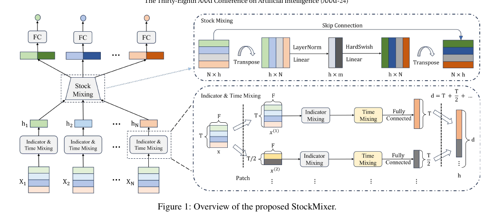
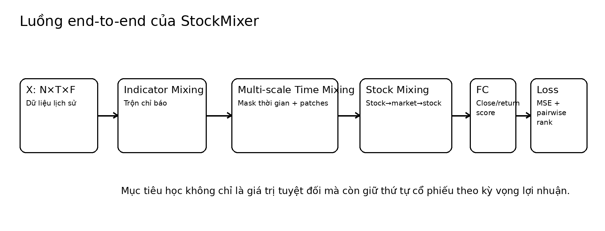

# Bài 03 - Kiến trúc StockMixer tổng thể

## 1. Chuỗi xử lý

Paper sắp xếp các module theo cấu trúc dữ liệu:

\[
\text{Indicator Mixing} \rightarrow \text{Time Mixing} \rightarrow \text{Stock Mixing}
\]

Indicator + Time Mixing đóng vai trò encoder cho từng stock. Sau đó Stock Mixing mới gom các biểu diễn của toàn thị trường để tạo ảnh hưởng liên-stock.

## 2. Input và output

Input toàn thị trường:

\[
X \in \mathbb{R}^{N \times T \times F}
\]

Output ban đầu là predicted closing price cho `N` stock, rồi đổi sang 1-day return. Trong training, paper dùng return làm ground truth cho loss.

## 3. Encoder cấp từng stock

Với một stock `x ∈ R^(T×F)`:

- Indicator Mixing trao đổi thông tin giữa các feature tại từng thời điểm.
- Time Mixing trao đổi thông tin theo trục thời gian với causal-like triangular mask.
- Nhiều scale được tạo bởi AvgPool hoặc 1D convolution theo patch size, sau đó kết quả các scale được concatenated.

Nếu `T=16` và `k ∈ {1,2,4}`, dimension cuối của temporal representation được mô tả là:

\[
d = T + T/2 + T/4 = 16 + 8 + 4 = 28
\]

## 4. Encoder cấp thị trường

Sau khi mỗi stock có vector `h_i`, gom lại thành:

\[
H = \{h_1,\ldots,h_N\} \in \mathbb{R}^{N \times d}
\]

Stock Mixing nén thông tin của `N` cổ phiếu xuống `m` market states rồi chiếu lại về `N` cổ phiếu. Đây là cách paper thay cho direct all-to-all stock mixing.

## 5. Dự đoán cuối

Paper concatenates biểu diễn riêng `H` với biểu diễn chịu ảnh hưởng thị trường `Ĥ`, sau đó dùng fully connected layer để giảm chiều và cho prediction.

## 6. Tư duy quan trọng

StockMixer không đơn giản là “MLP thay RNN/GNN”. Điểm chính là **mỗi chiều dữ liệu được mixing bằng inductive bias riêng**, nhưng vẫn giữ building block MLP gọn.
