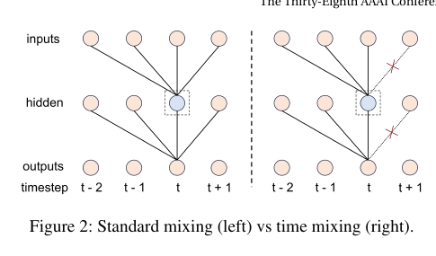
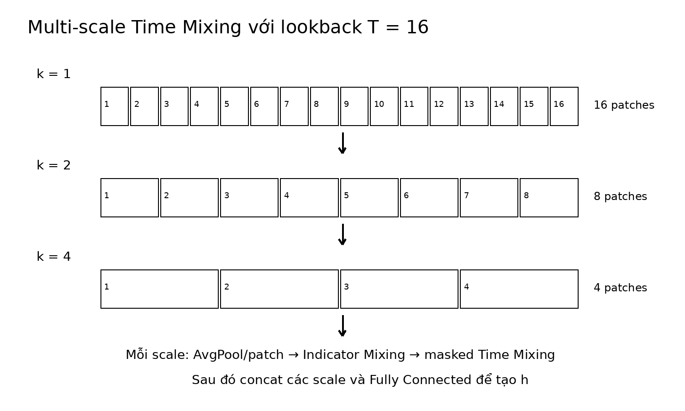

# Bài 05 - Time Mixing và Multi-scale Patches

## 1. Vì sao time mixing chuẩn chưa đủ?

Thời gian có thứ tự. Nếu một time step sớm được phép dùng thông tin từ tương lai trong cùng lookback representation, module không phản ánh đúng hướng phụ thuộc thời gian mà paper mong muốn. Tác giả sửa fully connected weights bằng **upper-triangular trainable structure** để giới hạn đường truyền thông tin.

## 2. Công thức masked time mixing

\[
h = \hat{x} + U_2\sigma\left(U_1\mathrm{LayerNorm}(\hat{x})\right)
\]

với:

\[
U_1 \in \mathbb{R}^{H_t \times T}, \qquad U_2 \in \mathbb{R}^{T \times H_t}
\]

Paper đặt `H_t = T` và chỉ cho phần tam giác trên của các weight matrix có thể học để đạt hiệu ứng mask.

## 3. Vì sao cần multi-scale?

Dữ liệu stock không có periodicity ổn định. Lookback phải tương đối ngắn, nhưng nếu chỉ nhìn từng time point thì representation dễ nhạy với dao động nhỏ. Paper gom các time step thành patch ở nhiều độ phân giải để khai thác xu hướng cục bộ.

\[
x^{(k)} = \mathrm{AvgPool}(x)_{kernel=k}
\]

với các patch size:

\[
k \in \{T/2, T/4, \ldots, 1\}
\]

Trong thí nghiệm, `T=16` và tác giả dùng:

\[
k \in \{1,2,4\}
\]

## 4. Xử lý mỗi scale

Mỗi `x^(k)` đi qua cùng kiểu pipeline:

\[
h^{(k)} = \mathrm{TimeMixing}(\mathrm{IndicatorMixing}(x^{(k)}))
\]

Sau đó concatenate các scale và dùng fully connected:

\[
h = \mathrm{FC}(\mathrm{concat}(h^{(k)}))
\]

Với `T=16`, các chiều thời gian là `16`, `8`, `4`; paper ký hiệu tổng dimension:

\[
d = 16 + 8 + 4 = 28
\]

## 5. Đây là module quan trọng nhất theo ablation

Bỏ Time Mixing làm performance rơi mạnh nhất:

- NASDAQ: `IC 0.043 → 0.018`, `RIC 0.501 → 0.164`.
- NYSE: `IC 0.029 → 0.016`, `RIC 0.351 → 0.161`.

Paper kết luận thứ tự tác động của ba thành phần là **time > stock > indicator**.

## 6. Điều cần tránh khi tự code

Paper mô tả upper-triangular trainable weights, nhưng không cung cấp toàn bộ chi tiết tensor implementation trong bài báo. Khi tái hiện, cần kiểm tra repository gốc hoặc code chính thức nếu muốn khớp bit-level; không nên suy diễn orientation của mask chỉ dựa vào trực giác mà không kiểm tra shape thực tế.
