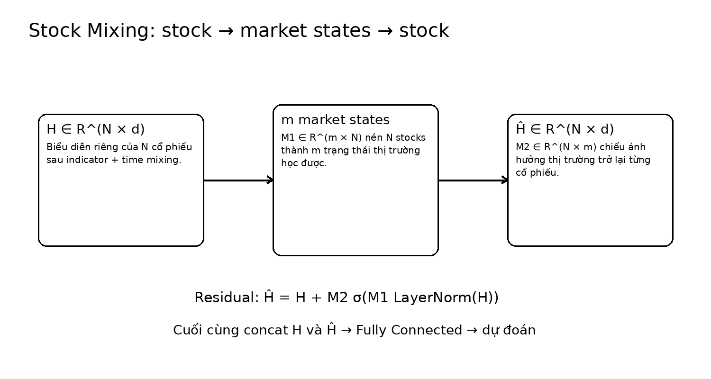

# Bài 06 - Stock Mixing: từ cổ phiếu đến trạng thái thị trường

## 1. Vấn đề của direct stock-to-stock mixing

Nếu dùng MLP-Mixer chuẩn trên dimension `N`, hidden dimension cũng cỡ `N`. Điều đó tương đương việc cho mỗi stock có đường trao đổi dày đặc với các stock khác. Paper cho rằng cách này dễ hấp thụ cả quan hệ không đáng kể hoặc ngẫu nhiên, đặc biệt khi dataset không lớn.

## 2. Bottleneck qua market states

Sau temporal encoder:

\[
H \in \mathbb{R}^{N \times d}
\]

StockMixer thay hidden dimension liên quan đến stocks bằng hyperparameter `m`:

\[
\hat{H} = H + M_2\sigma\left(M_1\mathrm{LayerNorm}(H)\right)
\]

với:

\[
M_1 \in \mathbb{R}^{m \times N}, \qquad M_2 \in \mathbb{R}^{N \times m}
\]

## 3. Cách hiểu trực giác

- `M1`: gom thông tin từ `N` stock thành `m` trạng thái thị trường tiềm ẩn.
- phi tuyến: cho phép market representation không chỉ là linear average.
- `M2`: truyền ảnh hưởng của market states ngược về từng stock.
- residual `+ H`: không xóa representation riêng của stock.

Paper liên hệ cơ chế này với hypergraph: node information được gom lên hyperedge rồi truyền lại node, nhưng ở đây “hyperedges”/market states được mô hình tự học, không cần graph hay industry prior.

## 4. Hyperparameter m trong thí nghiệm

Grid search cho ra:

- NASDAQ: `m = 20`
- NYSE: `m = 25`
- S&P500: `m = 8`

Sensitivity cho thấy market lớn hơn có xu hướng cần `m` lớn hơn. Paper nêu NYSE hoạt động tốt quanh 30 trong sensitivity plot, còn S&P500 giảm đáng kể khi dimension tăng quá cao.

## 5. Ablation

Bỏ Stock Mixing:

- NASDAQ: `IC 0.043 → 0.037`, `RIC 0.501 → 0.376`.
- NYSE: `IC 0.029 → 0.026`, `RIC 0.351 → 0.285`.

Thêm Stock Mixing vào LSTM cũng cải thiện mạnh NASDAQ (`IC 0.032 → 0.041`, `RIC 0.354 → 0.476`) và NYSE (`IC 0.024 → 0.030`, `RIC 0.256 → 0.307`). Điều này tách được giá trị của stock-mixing khỏi riêng MLP temporal encoder.
