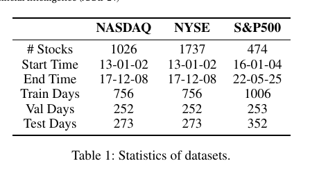

# Bài 08 - Experimental Setup

## 1. Ba benchmark

Paper đánh giá trên ba thị trường Mỹ:

| Dataset | Stocks | Train | Val | Test |
|---|---:|---:|---:|---:|
| NASDAQ | 1026 | 756 ngày | 252 | 273 |
| NYSE | 1737 | 756 ngày | 252 | 273 |
| S&P500 | 474 | 1006 ngày | 253 | 352 |

NASDAQ/NYSE trong paper có khoảng thời gian 2013-01-02 đến 2017-12-08. S&P500 từ 2016-01-04 đến 2022-05-25.

## 2. Thiết lập chính

- Framework: PyTorch.
- Lookback window: `T = 16` trading days.
- Temporal scales: `k ∈ {1, 2, 4}`.
- Số Stock Mixing block: 1.
- Learning rate: `1e-3`.
- Ranking-loss weight: `α = 0.1`.
- Market dimension: NASDAQ `20`, NYSE `25`, S&P500 `8`.
- Mỗi experiment lặp 3 lần và báo cáo trung bình.

## 3. Hardware paper dùng

- Intel Xeon Silver 4110 CPU
- 128 GB RAM
- NVIDIA GeForce RTX 2080 Ti 12 GB

Thông tin này hữu ích khi so sánh runtime/memory, nhưng paper không cung cấp đủ mọi chi tiết để đảm bảo tái lập thời gian chạy chính xác trên máy khác.

## 4. Baselines

Paper so với:

- RNN: LSTM, ALSTM
- GNN: RGCN, GAT, RSR-I
- HGNN: STHAN-SR, ESTIMATE
- MLP: Linear

Các graph/hypergraph baselines dùng preprocessing market relation theo paper gốc của từng baseline.

## 5. Công bằng thực nghiệm

Paper nói các baseline được dùng với original settings và cùng optimization loss để so sánh công bằng. Khi tự tái hiện, cần đặc biệt kiểm tra preprocessing và split vì đây là nơi rất dễ làm sai benchmark time-series.
