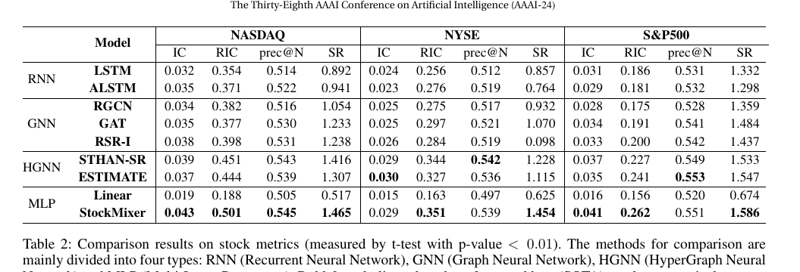
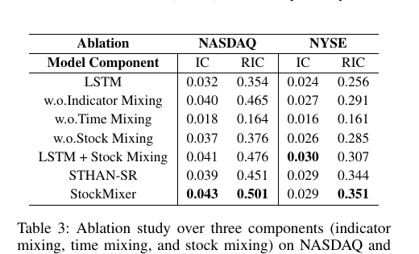

# Bài 09 - Đọc kết quả benchmark và ablation

## 1. Kết quả chính

StockMixer đạt kết quả nổi bật trên nhiều metric:

- **NASDAQ**: IC `0.043`, RIC `0.501`, Precision@N `0.545`, SR `1.465`.
- **NYSE**: IC `0.029`, RIC `0.351`, Precision@N `0.539`, SR `1.454`.
- **S&P500**: IC `0.041`, RIC `0.262`, Precision@N `0.551`, SR `1.586`.

Paper báo cáo average relative gain `7.6%`, `10.8%` và `10.9%` đối với hai rank metrics và risk-adjusted returns, với `p < 0.01` theo mô tả của tác giả.

## 2. Đọc bảng đúng cách

Không nên chỉ nói “StockMixer thắng tất cả”. Bảng có các nuance:

- NYSE IC của StockMixer là `0.029`, bằng STHAN-SR và thấp hơn ESTIMATE `0.030`.
- NYSE Precision@N `0.539` thấp hơn STHAN-SR `0.542`.
- S&P500 Precision@N `0.551` thấp hơn ESTIMATE `0.553`.
- Tuy vậy StockMixer rất mạnh ở RIC và Sharpe Ratio, đặc biệt trên NASDAQ/S&P500.

Dữ liệu chi tiết nằm trong `data/table2_main_results.csv`.

> Lưu ý nguồn: giá trị NYSE SR của RSR-I được bảng paper in là `0.098`; course giữ nguyên giá trị này thay vì tự sửa.

## 3. Ablation

Ablation cho thấy ba block đều đóng góp, nhưng mức độ khác nhau.

### Bỏ Time Mixing

Giảm mạnh nhất. NASDAQ RIC giảm từ `0.501` xuống `0.164`; NYSE giảm từ `0.351` xuống `0.161`. Đây là bằng chứng thực nghiệm chính cho thiết kế temporal của paper.

### Bỏ Stock Mixing

Giảm đáng kể: NASDAQ RIC `0.376`, NYSE `0.285`. Điều này cho thấy market-aware relation modeling hữu ích.

### Bỏ Indicator Mixing

Giảm nhẹ hơn nhưng nhất quán, đặc biệt ở RIC.

## 4. Một ablation rất đáng chú ý

`LSTM + Stock Mixing` đạt:

- NASDAQ `IC 0.041 / RIC 0.476`;
- NYSE `IC 0.030 / RIC 0.307`.

Điều này cho thấy Stock Mixing có thể cải thiện ngay cả khi temporal encoder là LSTM. Nó hỗ trợ lập luận rằng market-aware bottleneck là một contribution riêng, không phụ thuộc hoàn toàn vào MLP encoder.

## 5. Cách viết nhận xét khoa học

Khi báo cáo kết quả nên tách:

- **observed fact**: con số trong bảng;
- **author interpretation**: cách paper giải thích;
- **your hypothesis**: suy luận riêng, nếu có, phải đánh dấu là suy luận.

Course này giữ phần lý thuyết chính ở mức hai loại đầu.
