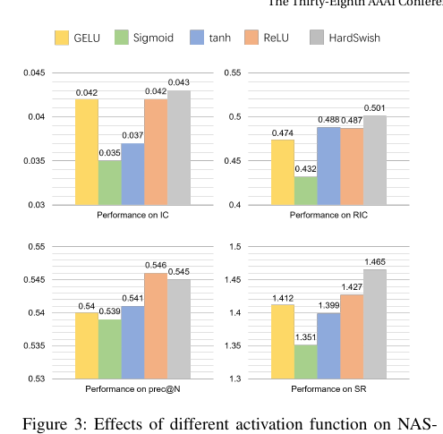
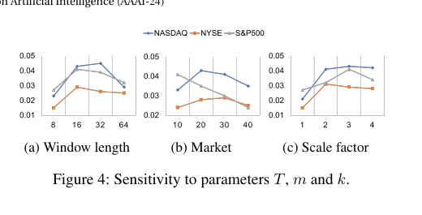

# Bài 10 - Activation, hyperparameter sensitivity và giới hạn

## 1. Activation function

Trên NASDAQ, paper thử GELU, Sigmoid, tanh, ReLU và HardSwish. Các giá trị trong Figure 3 cho thấy ReLU/HardSwish nhìn chung tốt hơn Sigmoid/tanh; HardSwish đạt IC `0.043`, RIC `0.501` và SR `1.465`, trong khi ReLU đạt Precision@N cao nhất `0.546` trong hình.

Paper cũng nói thử nghiệm LayerNorm không cho khác biệt đáng kể, nhưng không cung cấp bảng chi tiết trong nội dung chính.

## 2. Lookback length T

Xu hướng chung: window quá ngắn thiếu thông tin; quá dài tăng learning cost và thêm thông tin xa có ích hạn chế. Các dataset đạt peak ở vùng trung bình thay vì cực trị.

## 3. Market dimension m

Optimal `m` phụ thuộc số lượng stock/độ phức tạp thị trường. Paper dùng grid search và chọn 20/25/8 cho NASDAQ/NYSE/S&P500. Sensitivity plot cho thấy S&P500 không cần bottleneck lớn như NYSE.

## 4. Number of scales k

Paper báo cáo kết quả tốt nhất khi dùng 3 scale factors. Trong implementation setup, đó là `{1,2,4}` cho `T=16`.

## 5. Giới hạn có thể rút ra trực tiếp từ paper

- Tác giả quan sát performance degradation nhẹ trên NYSE, dataset có nhiều stock nhất (1737), và gợi ý rằng inductive bias hiện tại có thể chưa đủ cho candidate pool lớn hơn.
- Hyperparameter selection vẫn cần grid search; phần future work của paper nói sẽ tối ưu quy trình chọn hyperparameter.
- Paper mới kiểm chứng trên ba benchmark thị trường Mỹ trong phạm vi thí nghiệm nêu trên; không cung cấp bằng chứng trong bài về generalization sang mọi thị trường khác.

## 6. Những gì paper không chứng minh

Course không suy ra rằng StockMixer chắc chắn sinh lợi trong trading thực tế sau transaction cost, slippage hoặc regime shift. Bài báo dùng các metric dự báo/đầu tư đã mô tả, nhưng không phải một nghiên cứu deployment trading đầy đủ.
