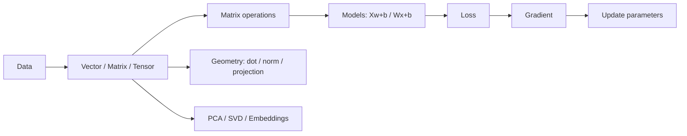

# 001 — Linear Algebra: Bộ bài luyện tập
> **Nguồn:** Bài `001 — Linear Algebra for AI and Data Science` do người học cung cấp.
> **Mục tiêu:** Ôn từ biểu diễn dữ liệu bằng vector/matrix/tensor đến matrix multiplication, linear regression, gradient descent, transformations, rank, determinant, eigenvectors, PCA, SVD, embeddings và neural networks.

## Cách sử dụng
- Làm toàn bộ câu hỏi trước khi mở phần đáp án.
- Với câu tính toán, nên viết phép tính tay rồi mới kiểm tra.
- Với câu sắp xếp, ghi lại thứ tự bằng số `1 → 2 → ...`.
- Với tình huống thực tế, ưu tiên giải thích *vì sao* chọn đáp án.

## Sơ đồ ôn nhanh

---

## Trắc nghiệm

### Câu 1

Trong AI/Data Science, một hàng (row) của dataset thường được biểu diễn tốt nhất bằng đối tượng nào?
- A. Scalar
- B. Vector
- C. Matrix
- D. Tensor bậc 4

### Câu 2

Một dataset có m mẫu và n đặc trưng thường có shape nào?
- A. n × m
- B. m × n
- C. m × m
- D. n × n

### Câu 3

Ảnh RGB kích thước 224 × 224 thường được biểu diễn dưới dạng tensor có shape nào?
- A. 224 × 224
- B. 3 × 224
- C. 224 × 224 × 3
- D. 1 × 224 × 3

### Câu 4

Giá trị uᵀv của u = [2, 3] và v = [4, 1] bằng bao nhiêu?
- A. 8
- B. 10
- C. 11
- D. 14

### Câu 5

Nếu dot product của hai vector bằng 0, cách diễn giải hình học phù hợp nhất là gì?
- A. Cùng hướng
- B. Vuông góc
- C. Ngược hướng
- D. Hai vector bằng nhau

### Câu 6

Chuẩn L2 của vector [3, 4] bằng bao nhiêu?
- A. 5
- B. 7
- C. 12
- D. 25

### Câu 7

Với A có shape (m × n) và B có shape (n × p), shape của A @ B là gì?
- A. n × n
- B. m × n
- C. m × p
- D. p × m

### Câu 8

Trong mô hình hồi quy tuyến tính dạng vector hóa, công thức dự đoán cho nhiều mẫu là gì?
- A. ŷ = X + w + b
- B. ŷ = Xw + b
- C. ŷ = wX − b
- D. ŷ = XᵀX

### Câu 9

MSE đo điều gì trong bài toán regression?
- A. Số đặc trưng
- B. Sai số bình phương trung bình giữa dự đoán và giá trị thật
- C. Góc giữa hai vector
- D. Rank của ma trận

### Câu 10

Phép cập nhật gradient descent nào đúng?
- A. w_new = w_old + α∇L
- B. w_new = αw_old
- C. w_new = w_old − α∇L
- D. w_new = ∇L − w_old

### Câu 11

Determinant bằng 0 cho biết điều gì quan trọng?
- A. Ma trận chắc chắn trực giao
- B. Không gian bị collapse và ma trận vuông không khả nghịch
- C. Rank luôn tối đa
- D. Mọi eigenvalue đều bằng 1

### Câu 12

Eigenvector v của A thỏa mãn điều kiện nào?
- A. Av = 0 với mọi v
- B. Av = λv
- C. Aᵀv = vᵀA
- D. A + v = λ

### Câu 13

Mục tiêu trực giác chính của PCA là gì?
- A. Tăng số chiều
- B. Tìm các hướng giữ nhiều phương sai và chiếu dữ liệu xuống ít chiều hơn
- C. Đảo ma trận
- D. Thay mọi feature bằng 0

### Câu 14

SVD phân rã ma trận A theo dạng nào?
- A. A = LU
- B. A = QR
- C. A = UΣVᵀ
- D. A = Xw+b

### Câu 15

Một dense neural network layer trước activation được mô tả bằng biểu thức nào?
- A. z = Wx + b
- B. z = x/W
- C. z = det(W)
- D. z = ||x||

---

## Đúng / Sai

### Câu 16

Scalar là một số đơn lẻ như learning rate hoặc loss.
- [ ] Đúng
- [ ] Sai

### Câu 17

Matrix multiplication và element-wise multiplication luôn giống nhau.
- [ ] Đúng
- [ ] Sai

### Câu 18

Khi nhân hai ma trận, các inner dimensions phải bằng nhau.
- [ ] Đúng
- [ ] Sai

### Câu 19

Nhân vector với scalar âm có thể đảo hướng vector.
- [ ] Đúng
- [ ] Sai

### Câu 20

Rank thấp thường gợi ý có thông tin dư thừa giữa các cột.
- [ ] Đúng
- [ ] Sai

### Câu 21

Ma trận có determinant khác 0 thì không thể có inverse.
- [ ] Đúng
- [ ] Sai

### Câu 22

Eigenvector luôn giữ nguyên độ dài sau phép biến đổi.
- [ ] Đúng
- [ ] Sai

### Câu 23

Cosine similarity gần 1 cho biết hai embedding có hướng rất giống nhau.
- [ ] Đúng
- [ ] Sai

### Câu 24

PCA trong bài được mô tả như một kỹ thuật tăng chiều dữ liệu.
- [ ] Đúng
- [ ] Sai

### Câu 25

Trong gradient descent mini-project, loss curve được dùng để quan sát quá trình tối ưu.
- [ ] Đúng
- [ ] Sai

---

## Trả lời ngắn

### Câu 26

Cho u = [2, 1] và v = [1, 3]. Tính u + v. Nhập theo dạng 3,4.

**Trả lời:** `____________________________`

### Câu 27

Cho v = [2, 1]. Tính 3v. Nhập theo dạng 6,3.

**Trả lời:** `____________________________`

### Câu 28

Tính A x với A = [[1,2],[3,4]] và x = [5,6]. Nhập theo dạng 17,39.

**Trả lời:** `____________________________`

### Câu 29

Nếu X có shape 120 × 8 và w có 8 phần tử, vector dự đoán Xw có bao nhiêu phần tử?

**Trả lời:** `____________________________`

### Câu 30

Tính determinant của ma trận [[2,1],[3,4]].

**Trả lời:** `____________________________`

### Câu 31

Trong ví dụ dự đoán điểm thi của bài, Xw bằng [28, 41, 54] và b = 10. ŷ bằng gì? Nhập dạng 38,51,64.

**Trả lời:** `____________________________`

### Câu 32

Điền thuật ngữ: Tập các vector có thể tạo ra từ mọi tổ hợp tuyến tính của v₁, v₂, ... được gọi là ______.

**Trả lời:** `____________________________`

### Câu 33

Điền thuật ngữ: Một tập vector vừa linearly independent vừa sinh toàn bộ không gian được gọi là ______.

**Trả lời:** `____________________________`

---

## Sắp xếp

### Câu 34

Sắp xếp pipeline gradient descent cơ bản theo đúng thứ tự.
- [ ] Khởi tạo w và b
- [ ] Dự đoán ŷ = Xw + b
- [ ] Tính MSE
- [ ] Tính gradient
- [ ] Cập nhật w và b
- [ ] Lặp qua nhiều epoch

### Câu 35

Sắp xếp pipeline PCA trực giác.
- [ ] Dữ liệu thô X
- [ ] Center dữ liệu
- [ ] Tính covariance hoặc SVD
- [ ] Tìm principal directions
- [ ] Chiếu xuống không gian ít chiều hơn
- [ ] Thu representation nén

### Câu 36

Sắp xếp ý nghĩa biến đổi SVD theo trực giác.
- [ ] Input space
- [ ] Vᵀ: rotate / reflect
- [ ] Σ: stretch / compress
- [ ] U: rotate / reflect
- [ ] Output space

### Câu 37

Sắp xếp luồng embedding search.
- [ ] Text query
- [ ] Tạo query embedding
- [ ] Tạo document embeddings
- [ ] Tính cosine similarity
- [ ] Chọn top-k kết quả

### Câu 38

Sắp xếp một dense neural network layer đơn.
- [ ] Input vector x
- [ ] Linear transform z = Wx + b
- [ ] Activation a = σ(z)
- [ ] Output vector a

---

## Tình huống thực tế

### Câu 39

Bạn có 10.000 khách hàng, mỗi khách hàng có 20 đặc trưng. Cách biểu diễn X phù hợp nhất là gì?
- A. Vector 20 phần tử
- B. Matrix 10.000 × 20
- C. Tensor 20 × 20 × 20
- D. Scalar 200.000

### Câu 40

Bạn muốn đo độ giống nhau giữa embedding câu truy vấn và embedding tài liệu. Phép đo nào phù hợp nhất theo bài?
- A. Determinant
- B. Cosine similarity
- C. Matrix inverse
- D. Rank

### Câu 41

Dataset có 200 features, nhiều feature tương quan mạnh và bạn muốn nén còn vài hướng quan trọng. Công cụ nào phù hợp nhất?
- A. PCA
- B. Scalar multiplication
- C. Determinant đơn lẻ
- D. Identity matrix

### Câu 42

Một phép biến đổi 2D làm mọi điểm rộng gấp đôi theo trục x nhưng giữ nguyên y. Ma trận nào phù hợp?
- A. [[2,0],[0,1]]
- B. [[1,0],[0,-1]]
- C. [[1,1],[0,1]]
- D. [[0,-1],[1,0]]

### Câu 43

Trong training, loss tăng dần sau mỗi epoch dù công thức gradient đúng. Điều nào nên kiểm tra đầu tiên trong tinh thần bài học?
- A. Learning rate α có thể quá lớn
- B. Tăng determinant
- C. Đổi vector thành scalar
- D. Luôn tính inverse của X

### Câu 44

Bạn có ma trận feature với nhiều cột gần như là bản sao tuyến tính của nhau. Khái niệm nào cảnh báo redundancy trực tiếp nhất?
- A. Rank thấp
- B. Norm lớn
- C. Bias dương
- D. Batch size

### Câu 45

Bạn cần giải thích trong 1 cụm từ vì sao neural network dùng linear algebra. Điền phần còn thiếu: mỗi layer thực hiện ______ rồi mới qua activation.

**Trả lời:** `____________________________`

---

# Đáp án và giải thích

## Trắc nghiệm

**Câu 1: B**  
Một hàng dữ liệu thường là một vector đặc trưng xᵢ.

**Câu 2: B**  
Theo quy ước trong bài: rows = samples, columns = features, nên X ∈ R^(m×n).

**Câu 3: C**  
Ảnh RGB có chiều cao H, chiều rộng W và 3 kênh màu.

**Câu 4: C**  
uᵀv = 2×4 + 3×1 = 11.

**Câu 5: B**  
Dot product bằng 0 tương ứng với cos(θ)=0, tức hai vector vuông góc.

**Câu 6: A**  
||x||₂ = √(3²+4²)=5.

**Câu 7: C**  
Hai chiều trong n phải khớp; kết quả giữ hai chiều ngoài: m × p.

**Câu 8: B**  
Bài dùng công thức ŷ = Xw + b.

**Câu 9: B**  
MSE = (1/m) Σ(ŷᵢ−yᵢ)².

**Câu 10: C**  
Gradient descent đi ngược hướng gradient để giảm loss.

**Câu 11: B**  
det(A)=0 nghĩa là phép biến đổi làm mất ít nhất một chiều; ma trận vuông không invertible.

**Câu 12: B**  
Eigenvector giữ nguyên phương sau biến đổi: Av = λv.

**Câu 13: B**  
PCA tìm principal directions giữ nhiều biến thiên hữu ích.

**Câu 14: C**  
Trong bài: A = UΣVᵀ.

**Câu 15: A**  
Dense layer là một linear transformation cộng bias: z = Wx + b.

## Đúng / Sai

**Câu 16: Đúng**  
Đúng. Bài dùng learning_rate, loss, accuracy làm ví dụ scalar.

**Câu 17: Sai**  
Sai. Bài nhấn mạnh A*B và A@B không phải cùng một phép toán.

**Câu 18: Đúng**  
Đúng: (m×n) @ (n×p) hợp lệ.

**Câu 19: Đúng**  
Đúng. Ví dụ −v có hướng ngược v.

**Câu 20: Đúng**  
Đúng. Bài liên hệ low rank với redundancy và compression.

**Câu 21: Sai**  
Sai. Với ma trận vuông, det(A) ≠ 0 là điều kiện để khả nghịch.

**Câu 22: Sai**  
Sai. Hướng được giữ (hoặc đảo nếu λ<0), độ dài có thể thay đổi theo |λ|.

**Câu 23: Đúng**  
Đúng theo phần Embeddings as Vectors.

**Câu 24: Sai**  
Sai. PCA dùng để giảm chiều bằng cách chiếu lên các hướng quan trọng.

**Câu 25: Đúng**  
Đúng. Cấu trúc notebook yêu cầu plot loss curve.

## Trả lời ngắn

**Câu 26: [3, 4]**  
Cộng theo từng phần tử: [2+1, 1+3] = [3,4].

**Câu 27: [6, 3]**  
Nhân từng phần tử với 3.

**Câu 28: [17, 39]**  
Hàng 1: 1×5+2×6=17; hàng 2: 3×5+4×6=39.

**Câu 29: 120**  
(120×8) @ (8×1) → (120×1).

**Câu 30: 5**  
det = 2×4 − 1×3 = 5.

**Câu 31: [38, 51, 64]**  
Cộng bias 10 cho mỗi dự đoán.

**Câu 32: span**  
Span là tập tất cả linear combinations.

**Câu 33: basis**  
Đó là định nghĩa basis trong bài.

## Sắp xếp

**Câu 34: Khởi tạo w và b → Dự đoán ŷ = Xw + b → Tính MSE → Tính gradient → Cập nhật w và b → Lặp qua nhiều epoch**  
Đây là flow của mini-project gradient descent trong bài.

**Câu 35: Dữ liệu thô X → Center dữ liệu → Tính covariance hoặc SVD → Tìm principal directions → Chiếu xuống không gian ít chiều hơn → Thu representation nén**  
Bài mô tả đúng pipeline này ở phần PCA.

**Câu 36: Input space → Vᵀ: rotate / reflect → Σ: stretch / compress → U: rotate / reflect → Output space**  
Đây là trực giác decomposition của A = UΣVᵀ.

**Câu 37: Text query → Tạo query embedding → Tạo document embeddings → Tính cosine similarity → Chọn top-k kết quả**  
Bài biểu diễn embedding retrieval bằng query vector, document vectors, cosine similarity và top-k.

**Câu 38: Input vector x → Linear transform z = Wx + b → Activation a = σ(z) → Output vector a**  
Đúng theo sơ đồ one-layer neural network trong bài.

## Tình huống thực tế

**Câu 39: B**  
Mỗi hàng là khách hàng, mỗi cột là một feature.

**Câu 40: B**  
Bài dùng cosine similarity cho embedding comparison.

**Câu 41: A**  
PCA giảm chiều bằng cách giữ các principal directions chứa nhiều variance.

**Câu 42: A**  
Đây là scaling với sₓ=2, sᵧ=1.

**Câu 43: A**  
Gradient descent phụ thuộc learning rate; bước quá lớn có thể làm optimization diverge.

**Câu 44: A**  
Low rank gắn với ít independent directions và feature redundancy.

**Câu 45: matrix multiplication / linear transformation**  
Trong bài: z = Wx + b rồi activation.

---

## Bảng tự đánh giá
| Mức | Tiêu chí gợi ý |
|---|---|
| 90–100% | Nắm chắc khái niệm và áp dụng tốt vào AI/Data Science |
| 75–89% | Hiểu phần lớn, nên xem lại các câu tính toán hoặc PCA/SVD/eigen |
| 60–74% | Cần ôn lại shape rules, dot/norm, transformation và gradient descent |
| <60% | Nên học lại theo chuỗi: vector → matrix → multiplication → model → loss → gradient |

