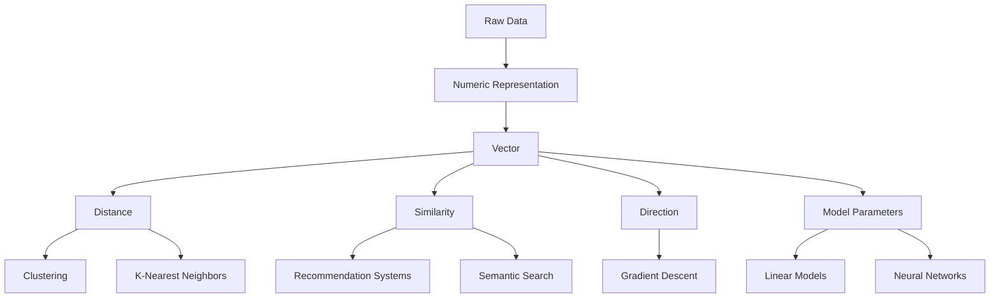
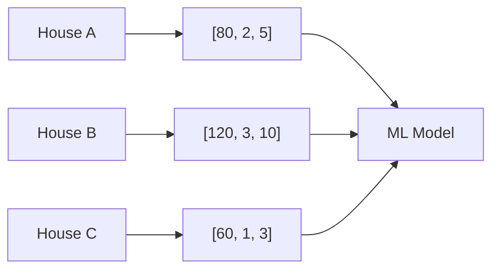
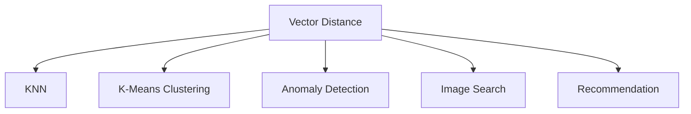
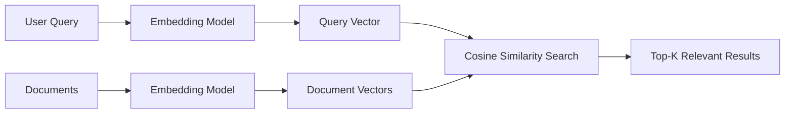
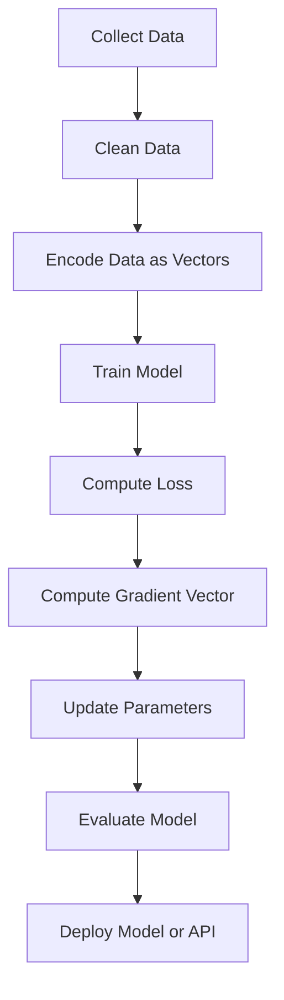
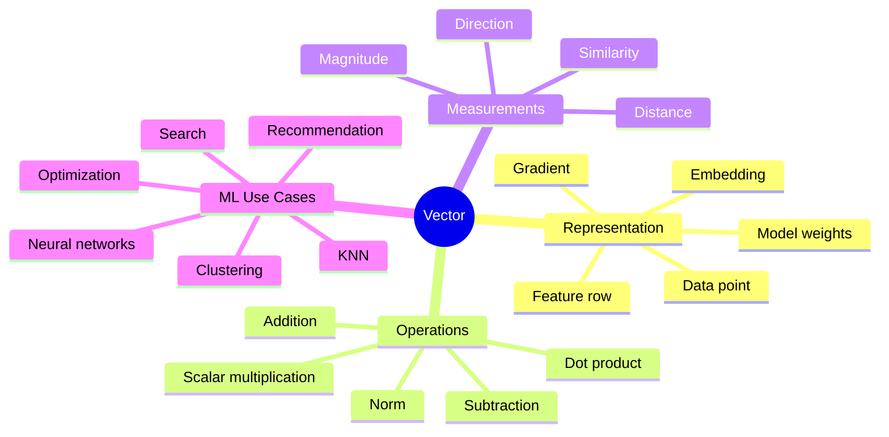
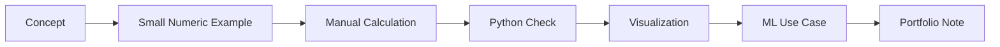

# 002 - Vector

**Course:** 01 - Math, Statistics and Econometrics
**Module:** Module 01 - Mathematics for AI and Data Science
**Content Group:** Linear Algebra
**Roadmap Source:** Mathematics for AI and Data Science / Linear Algebra
**Lesson Type:** Mathematics
**Order in Module:** 002
**Suggested Duration:** 24 minutes

---

## 1. Summary

A **vector** is one of the most important mathematical objects in AI and Data Science.
At the simplest level, a vector is an ordered list of numbers.

In machine learning, vectors are used to represent:

* A data point
* A row in a dataset
* A feature list
* A word embedding
* An image embedding
* A model parameter set
* A gradient direction
* A recommendation profile

After this lesson, you should understand how vectors help answer practical data questions such as:

* How similar are two users?
* How far is one data point from another?
* Which image/text/product is closest to this query?
* In which direction should a model update its parameters?
* How can raw data be represented numerically for ML models?

---

## 2. Learning Objectives

By the end of this lesson, you should be able to:

* Explain what a vector is in your own words.
* Represent simple data as vectors.
* Understand vector magnitude, direction, distance, and similarity.
* Connect vectors to ML concepts such as embeddings, clustering, k-nearest neighbors, gradient descent, and neural networks.
* Create a small Python demo that computes vector operations.
* Identify at least one real AI/Data Science use case where vectors are used.

---

## 3. Big Picture



A vector is the bridge between **real-world data** and **mathematical computation**.

For example:

| Real-world object | Vector representation                                                        |
| ----------------- | ---------------------------------------------------------------------------- |
| A house           | `[price, area, bedrooms, distance_to_center]`                                |
| A user            | `[age, clicks, purchases, rating_average]`                                   |
| A word            | `[embedding_dimension_1, embedding_dimension_2, ..., embedding_dimension_n]` |
| An image          | `[visual_feature_1, visual_feature_2, ..., visual_feature_n]`                |
| A model           | `[weight_1, weight_2, ..., weight_n]`                                        |

---

## 4. What Is a Vector?

A vector is an ordered list of numbers.

Example:

$$
\vec{x} = [2, 3]
$$

This is a 2-dimensional vector.

Another example:

$$
\vec{x} = [1.5, 70, 3, 0.82]
$$

This is a 4-dimensional vector.

In Data Science, each number usually represents a **feature**.

Example:

```text
Person A = [height_cm, weight_kg, age]
Person A = [170, 65, 25]
```

So the vector `[170, 65, 25]` represents one person using three numerical features.

---

## 5. Vector as Coordinates

A 2D vector can be visualized as a point or an arrow.

Example:

$$
\vec{v} = [3, 2]
$$

This means:

* Move 3 units on the x-axis.
* Move 2 units on the y-axis.

```text
y
↑
5 |
4 |
3 |
2 |            ● v = [3, 2]
1 |
0 +----+----+----+----+----→ x
     1    2    3    4    5
```

As an arrow:

```text
y
↑
3 |
2 |          ●
1 |        /
0 |------/----------------→ x
        [3,2]
```

The vector has:

* **Magnitude:** how long it is.
* **Direction:** where it points.

---

## 6. Vector as Features in Data Science

Suppose we have a small dataset of houses:

| House | Area | Bedrooms | Distance to city center |
| ----- | ---: | -------: | ----------------------: |
| A     |   80 |        2 |                       5 |
| B     |  120 |        3 |                      10 |
| C     |   60 |        1 |                       3 |

Each row can be represented as a vector:

$$
A = [80, 2, 5]
$$

$$
B = [120, 3, 10]
$$

$$
C = [60, 1, 3]
$$

The machine learning model does not understand the concept of a “house” directly.
It understands the numeric vector representation.



---

## 7. Core Vector Operations

### 7.1 Vector Addition

If:

$$
\vec{a} = [2, 3]
$$

$$
\vec{b} = [4, 1]
$$

Then:

$$
\vec{a} + \vec{b} = [2 + 4, 3 + 1] = [6, 4]
$$

Interpretation:

```text
Vector addition combines movement or feature values component by component.
```

---

### 7.2 Vector Subtraction

$$
\vec{a} - \vec{b} = [2 - 4, 3 - 1] = [-2, 2]
$$

In Data Science, vector subtraction is often used to measure difference between data points.

Example:

```text
User A = [5, 3, 2]
User B = [2, 3, 4]

Difference = [3, 0, -2]
```

This means User A is higher on the first feature, equal on the second feature, and lower on the third feature.

---

### 7.3 Scalar Multiplication

A scalar is a single number.

If:

$$
\vec{v} = [3, 2]
$$

Then:

$$
2\vec{v} = [6, 4]
$$

Scalar multiplication changes the vector magnitude.

```text
v      = [3, 2]
2v     = [6, 4]
0.5v   = [1.5, 1]
-v     = [-3, -2]
```

---

### 7.4 Vector Magnitude

The magnitude, or length, of a vector is written as:

$$
|\vec{v}|
$$

For a 2D vector:

$$
\vec{v} = [x, y]
$$

The magnitude is:

$$
|\vec{v}| = \sqrt{x^2 + y^2}
$$

Example:

$$
\vec{v} = [3, 4]
$$

$$
|\vec{v}| = \sqrt{3^2 + 4^2}
$$

$$
|\vec{v}| = \sqrt{9 + 16} = \sqrt{25} = 5
$$

So the vector `[3, 4]` has length `5`.

---

## 8. Distance Between Vectors

Distance measures how far two vectors are from each other.

Given:

$$
\vec{a} = [a_1, a_2]
$$

$$
\vec{b} = [b_1, b_2]
$$

The Euclidean distance is:

$$
d(\vec{a}, \vec{b}) = \sqrt{(a_1 - b_1)^2 + (a_2 - b_2)^2}
$$

Example:

$$
\vec{a} = [1, 2]
$$

$$
\vec{b} = [4, 6]
$$

$$
d(\vec{a}, \vec{b}) = \sqrt{(1 - 4)^2 + (2 - 6)^2}
$$

$$
d(\vec{a}, \vec{b}) = \sqrt{(-3)^2 + (-4)^2}
$$

$$
d(\vec{a}, \vec{b}) = \sqrt{9 + 16} = 5
$$

### ML Use Cases

Distance is used in:

* K-Nearest Neighbors
* Clustering
* Anomaly detection
* Image retrieval
* Recommendation systems



---

## 9. Dot Product

The dot product combines two vectors into a single number.

Given:

$$
\vec{a} = [a_1, a_2, a_3]
$$

$$
\vec{b} = [b_1, b_2, b_3]
$$

The dot product is:

$$
\vec{a} \cdot \vec{b} = a_1b_1 + a_2b_2 + a_3b_3
$$

Example:

$$
\vec{a} = [1, 2, 3]
$$

$$
\vec{b} = [4, 5, 6]
$$

$$
\vec{a} \cdot \vec{b} = 1 \times 4 + 2 \times 5 + 3 \times 6
$$

$$
\vec{a} \cdot \vec{b} = 4 + 10 + 18 = 32
$$

### Why Dot Product Matters

The dot product is used in:

* Linear regression
* Logistic regression
* Neural network layers
* Attention mechanisms
* Cosine similarity
* Search ranking

A simple linear model can be written as:

$$
\hat{y} = \vec{w} \cdot \vec{x} + b
$$

Where:

| Symbol    | Meaning              |
| --------- | -------------------- |
| $\vec{x}$ | Input feature vector |
| $\vec{w}$ | Weight vector        |
| $b$       | Bias                 |
| $\hat{y}$ | Prediction           |

---

## 10. Cosine Similarity

Cosine similarity measures how similar two vectors are in direction.

Formula:

$$
\cos(\theta) = \frac{\vec{a} \cdot \vec{b}}{|\vec{a}| |\vec{b}|}
$$

Interpretation:

| Cosine value | Meaning                    |
| -----------: | -------------------------- |
|          `1` | Same direction             |
|          `0` | Unrelated or perpendicular |
|         `-1` | Opposite direction         |

Cosine similarity is very important in:

* Text embeddings
* Semantic search
* Recommendation systems
* Retrieval-Augmented Generation
* Vector databases

Example:

```text
Query vector:      [0.21, 0.53, 0.77]
Document vector:   [0.20, 0.50, 0.80]

High cosine similarity → document is semantically close to the query.
```



---

## 11. Vector in AI and Data Science Workflow



Vectors appear in almost every step:

| Workflow step       | Vector role                                 |
| ------------------- | ------------------------------------------- |
| Data cleaning       | Convert raw values into numeric features    |
| Feature engineering | Build meaningful vectors                    |
| Model training      | Input vectors go into models                |
| Optimization        | Gradients are vectors                       |
| Evaluation          | Predictions and errors can be vectors       |
| Deployment          | APIs receive vectors or generate embeddings |
| Search              | Vector databases retrieve similar vectors   |

---

## 12. Practical Example

### Problem

We have two users represented by three features:

```text
Feature 1: Number of movies watched
Feature 2: Average rating given
Feature 3: Number of action movies watched
```

User vectors:

$$
\vec{u}_1 = [10, 4.5, 7]
$$

$$
\vec{u}_2 = [8, 4.0, 6]
$$

We want to measure how similar they are.

### Step 1: Difference

$$
\vec{u}_1 - \vec{u}_2 = [10 - 8, 4.5 - 4.0, 7 - 6]
$$

$$
\vec{u}_1 - \vec{u}_2 = [2, 0.5, 1]
$$

### Step 2: Distance

$$
d(\vec{u}_1, \vec{u}_2) = \sqrt{2^2 + 0.5^2 + 1^2}
$$

$$
d(\vec{u}_1, \vec{u}_2) = \sqrt{4 + 0.25 + 1}
$$

$$
d(\vec{u}_1, \vec{u}_2) = \sqrt{5.25} \approx 2.29
$$

The smaller the distance, the more similar the users are.

---

## 13. Python Check

```python
import numpy as np

u1 = np.array([10, 4.5, 7])
u2 = np.array([8, 4.0, 6])

difference = u1 - u2
distance = np.linalg.norm(difference)

dot_product = np.dot(u1, u2)
cosine_similarity = dot_product / (np.linalg.norm(u1) * np.linalg.norm(u2))

print("User 1:", u1)
print("User 2:", u2)
print("Difference:", difference)
print("Euclidean distance:", distance)
print("Dot product:", dot_product)
print("Cosine similarity:", cosine_similarity)
```

Expected idea:

```text
Difference: [2.  0.5 1. ]
Euclidean distance: about 2.29
Cosine similarity: close to 1 if the users have similar direction/pattern
```

---

## 14. Visual Intuition

### Vector Distance

```text
Two points far apart:

User A ●                              ● User B

Large distance → less similar
```

```text
Two points close together:

User A ●  ● User B

Small distance → more similar
```

### Vector Direction

```text
Same direction:

A:  ------>
B:  -------->

High cosine similarity
```

```text
Different direction:

A:  ------>
B:  ↑

Low cosine similarity
```

---

## 15. Vector Tree Map



---

## 16. Common ML Connections

### 16.1 Linear Regression

A linear regression model uses vectors:

$$
\hat{y} = \vec{w} \cdot \vec{x} + b
$$

Example:

```text
x = [area, bedrooms, distance]
w = [0.8, 0.3, -0.2]
b = 10
```

The model predicts house price using a dot product.

---

### 16.2 Gradient Descent

In gradient descent, the gradient is a vector that tells the model how to update parameters.

$$
\vec{w}_{new} = \vec{w}_{old} - \alpha \nabla L(\vec{w})
$$

Where:

| Symbol              | Meaning                              |
| ------------------- | ------------------------------------ |
| $\vec{w}_{old}$     | Current weight vector                |
| $\vec{w}_{new}$     | Updated weight vector                |
| $\alpha$            | Learning rate                        |
| $\nabla L(\vec{w})$ | Gradient vector of the loss function |

Simple intuition:

```text
Gradient vector = direction of steepest increase
Negative gradient = direction to reduce loss
```

---

### 16.3 Embeddings

An embedding is a vector representation of complex data.

Examples:

| Object   | Embedding vector   |
| -------- | ------------------ |
| Word     | Word embedding     |
| Sentence | Sentence embedding |
| Image    | Image embedding    |
| User     | User embedding     |
| Product  | Product embedding  |

Example:

```text
"king"   → [0.12, -0.45, 0.88, ...]
"queen"  → [0.10, -0.40, 0.91, ...]
"banana" → [-0.70, 0.15, 0.05, ...]
```

Words with similar meanings usually have vectors close to each other.

---

## 17. Mini Demo Flow

```text
concept -> small numeric example -> Python check -> visual intuition -> ML use case
```

Expanded version:



---

## 18. Practice Exercises

### Exercise 1: Manual Vector Operations

Given:

$$
\vec{a} = [3, 4]
$$

$$
\vec{b} = [1, 2]
$$

Calculate:

1. $\vec{a} + \vec{b}$
2. $\vec{a} - \vec{b}$
3. $2\vec{a}$
4. $|\vec{a}|$
5. Distance between $\vec{a}$ and $\vec{b}$

---

### Exercise 2: Python Check

Write 5-10 lines of Python to verify your manual answers.

Suggested functions:

```python
np.array()
np.dot()
np.linalg.norm()
```

---

### Exercise 3: ML Connection

Choose one of the following use cases:

* Movie recommendation
* House price prediction
* Semantic document search
* Customer segmentation
* Image similarity search

Then answer:

```text
What does one vector represent?
What does each feature mean?
Which vector operation is useful?
What metric can be used: distance or similarity?
```

---

## 19. Common Mistakes

### Mistake 1: Memorizing the Definition Only

Bad approach:

```text
A vector is just a list of numbers.
```

Better approach:

```text
A vector is a numeric representation of an object, data point, direction, parameter set, or embedding.
```

---

### Mistake 2: Ignoring Feature Scale

Example:

```text
House vector = [price, bedrooms]
House A = [500000, 2]
House B = [600000, 3]
```

The price feature is much larger than the bedroom feature, so it can dominate distance calculations.

Common solution:

```text
Normalize or standardize features before distance-based models.
```

---

### Mistake 3: Confusing Distance and Similarity

Distance:

```text
Smaller distance = more similar
```

Similarity:

```text
Larger similarity = more similar
```

Example:

| Metric             | More similar means |
| ------------------ | ------------------ |
| Euclidean distance | Smaller value      |
| Cosine similarity  | Larger value       |

---

### Mistake 4: Thinking Vectors Are Only 2D or 3D

In AI, vectors often have hundreds or thousands of dimensions.

Examples:

| Vector type          |    Possible dimension |
| -------------------- | --------------------: |
| Tabular row          |                 5-500 |
| Word embedding       |             100-1,024 |
| Sentence embedding   |             384-3,072 |
| Image embedding      |             512-4,096 |
| Neural network layer | Thousands or millions |

---

## 20. Assumptions, Limitations, and Caveats

### Assumptions

* Data can be represented numerically.
* Similar objects should have similar vector representations.
* Distance or similarity metrics are meaningful for the chosen features.

### Limitations

* Poor feature engineering creates poor vectors.
* Different scales can distort distance.
* High-dimensional vectors can become difficult to interpret.
* Similarity depends heavily on the embedding model or feature design.

### Caveat

A vector is not automatically meaningful.
The quality of a vector depends on how it was created.

```text
Good representation → useful vector operations
Bad representation  → misleading distance/similarity
```

---

## 21. Portfolio Artifact Idea

### Mini Project: Vector Similarity Search

Build a small notebook that:

1. Creates 5-10 sample items.
2. Represents each item as a vector.
3. Computes Euclidean distance.
4. Computes cosine similarity.
5. Finds the most similar item to a query.
6. Visualizes the result using a simple chart.

Example project:

```text
Movie Recommendation with Vector Similarity
```

Each movie can be represented as:

```text
movie = [action_score, comedy_score, romance_score, drama_score]
```

Then compare a user preference vector with movie vectors.

---

## 22. Connection to the Main Project

Related project:

```text
Gradient Descent from Scratch with MSE Loss and a Loss Curve over Epochs
```

Vectors appear in this project as:

| Component        | Vector role                                        |
| ---------------- | -------------------------------------------------- |
| Input data       | Feature vectors                                    |
| Model weights    | Weight vector                                      |
| Prediction       | Dot product between input vector and weight vector |
| Error            | Difference between prediction and target           |
| Gradient         | Direction vector for updating weights              |
| Training process | Repeated vector updates                            |

Gradient descent update:

$$
\vec{w}_{new} = \vec{w}_{old} - \alpha \nabla L(\vec{w})
$$

This is one of the most important vector-based operations in machine learning.

---

## 23. Completion Checklist

* [ ] I can explain what a vector is in 1-2 minutes.
* [ ] I can represent a data row as a vector.
* [ ] I can calculate vector addition, subtraction, scalar multiplication, and magnitude.
* [ ] I can compute distance between two vectors.
* [ ] I can explain cosine similarity.
* [ ] I understand why vectors matter in ML, DL, embeddings, and optimization.
* [ ] I have written a small Python demo.
* [ ] I have recorded at least one assumption, limitation, or caveat.
* [ ] I can connect this lesson to a mini project or portfolio artifact.

---

## 24. Final Summary

A **vector** is a numeric representation of data, direction, features, parameters, or embeddings.

In AI and Data Science, vectors are everywhere:

* Dataset rows are vectors.
* Model weights are vectors.
* Gradients are vectors.
* Text embeddings are vectors.
* Image embeddings are vectors.
* Recommendation profiles are vectors.
* Search queries can become vectors.

The most important idea is:

```text
Vectors allow real-world objects to become computable.
```

Once data becomes a vector, we can calculate:

* Distance
* Similarity
* Direction
* Magnitude
* Prediction
* Optimization updates

This is why vectors are a foundation for linear algebra, machine learning, deep learning, recommendation systems, semantic search, PCA, neural networks, and gradient descent.

---

# Bài luyện tập

## Mục tiêu


## Đề bài


## Yêu cầu hoàn thành

- [ ] 
- [ ] 
- [ ] 

## Kết quả / lời giải


## Ghi chú
