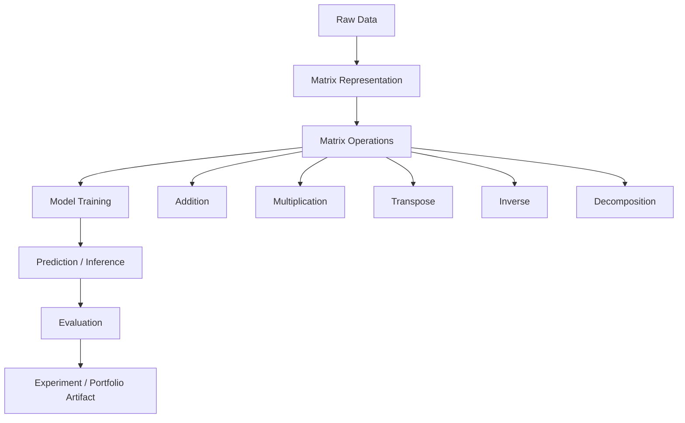
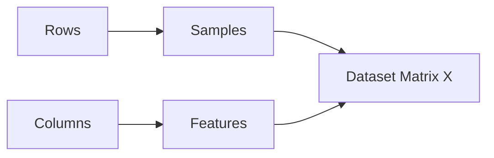
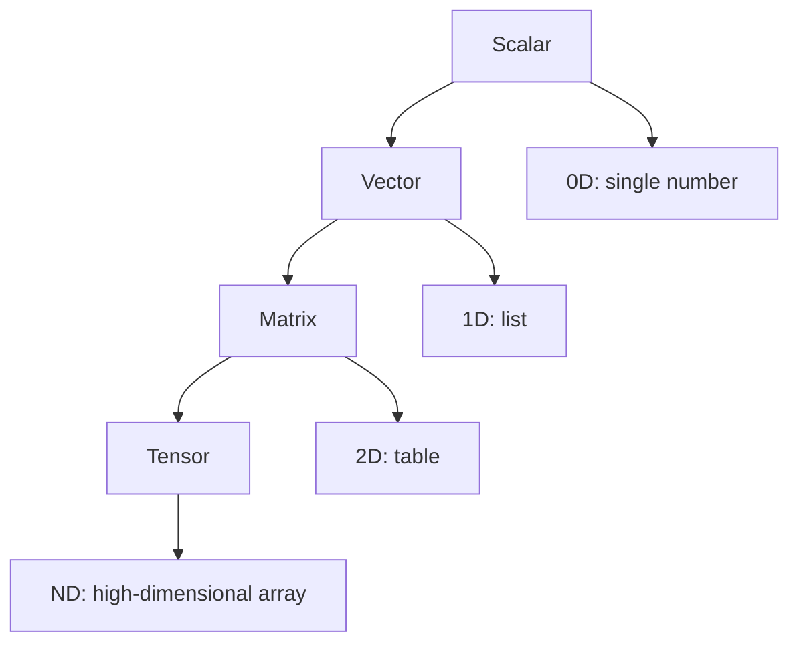
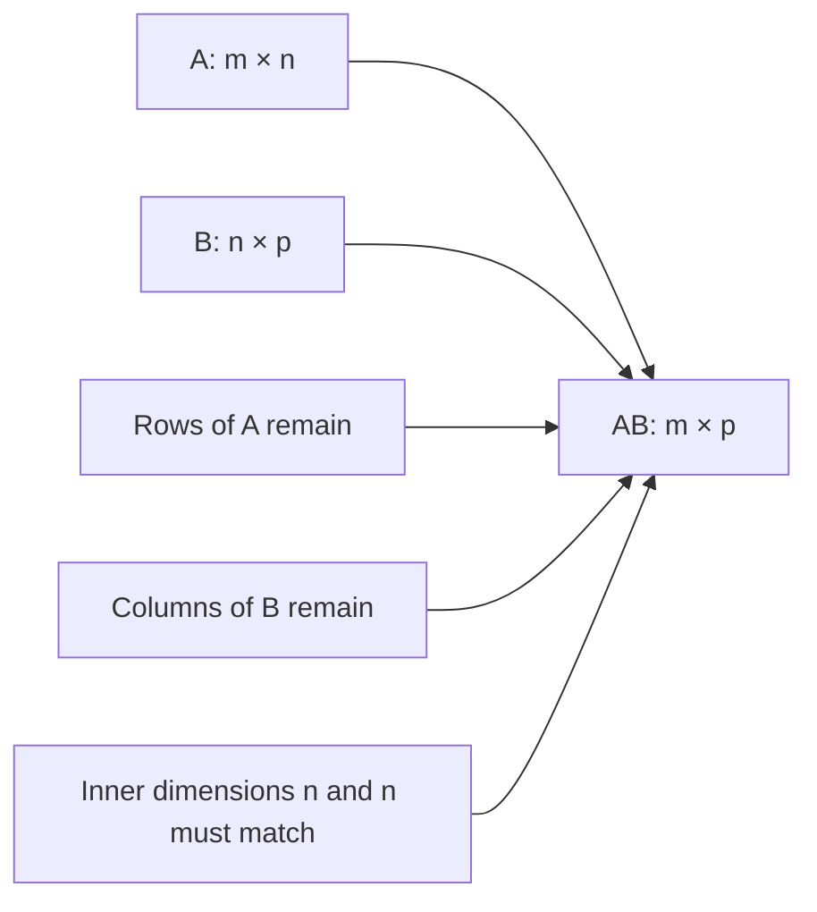
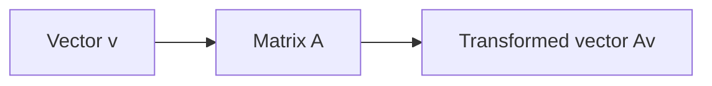
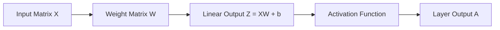
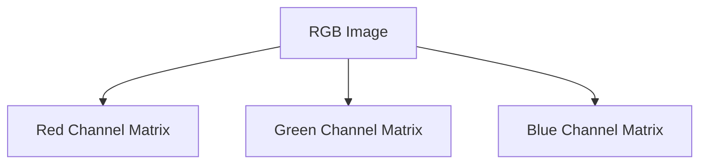
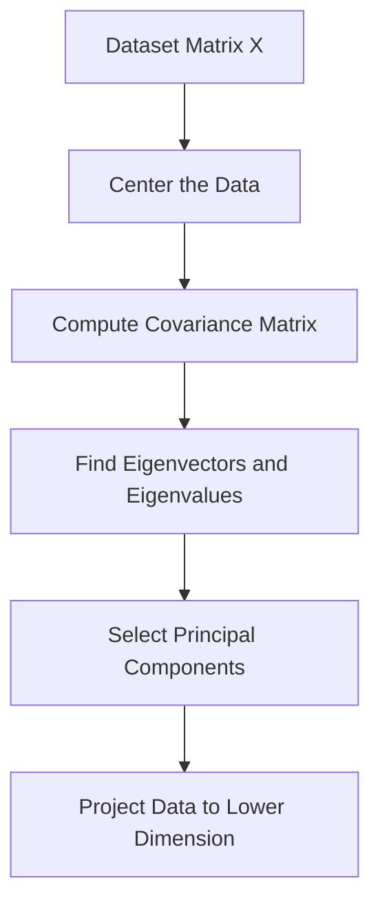
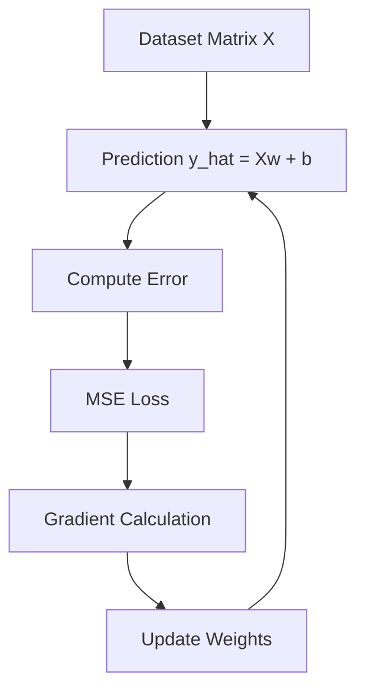

# 003 - Matrix

**Course:** 01 - Math, Statistics and Econometrics
**Module:** Module 01 - Mathematics for AI and Data Science
**Content Group:** Linear Algebra
**Roadmap Source:** Mathematics for AI and Data Science / Linear Algebra
**Lesson Type:** Mathematics
**Order in Module:** 003
**Suggested Duration:** 24 minutes

---

## 1. Summary

A **matrix** is a rectangular table of numbers arranged in rows and columns.

In AI and Data Science, matrices are everywhere:

* A dataset can be represented as a matrix.
* Images can be represented as pixel matrices.
* Neural networks use matrix multiplication to process many samples efficiently.
* PCA, linear regression, embeddings, recommender systems, and transformers all rely on matrix operations.

After this lesson, you should understand how a matrix helps represent data, transform vectors, train models, and build practical AI/Data Science artifacts.

---

## 2. Learning Objectives

By the end of this lesson, you should be able to:

* Explain what a matrix is in your own words.
* Understand rows, columns, shape, and matrix notation.
* Represent a dataset as a matrix.
* Perform basic matrix operations.
* Understand why matrix multiplication is important in machine learning.
* Connect matrices to linear regression, PCA, neural networks, images, and embeddings.
* Build a small notebook or portfolio note using matrix operations.

---

## 3. Big Picture



A matrix is one of the main mathematical languages used to represent and process structured data.

---

## 4. What Is a Matrix?

A **matrix** is a 2D array of numbers.

A matrix with $m$ rows and $n$ columns is called an $m \times n$ matrix.

Example:

$$
A =
\begin{bmatrix}
1 & 2 & 3 \
4 & 5 & 6
\end{bmatrix}
$$

This matrix has:

* 2 rows
* 3 columns
* Shape: $2 \times 3$

So we say:

$$
A \in \mathbb{R}^{2 \times 3}
$$

This means matrix $A$ contains real numbers and has shape $2 \times 3$.

---

## 5. Matrix Structure

```text
Matrix A

        Column 1   Column 2   Column 3
          ↓          ↓          ↓
Row 1 →   1          2          3
Row 2 →   4          5          6
```

In notation:

$$
A =
\begin{bmatrix}
a_{11} & a_{12} & a_{13} \
a_{21} & a_{22} & a_{23}
\end{bmatrix}
$$

Where:

* $a_{11}$ means row 1, column 1
* $a_{12}$ means row 1, column 2
* $a_{21}$ means row 2, column 1

---

## 6. Matrix as a Dataset

In Data Science, a dataset is often stored as a matrix.

Suppose we have 3 people and 4 features:

| Person | Age | Height | Weight | Income |
| ------ | --: | -----: | -----: | -----: |
| A      |  20 |    170 |     65 |    500 |
| B      |  25 |    175 |     70 |    700 |
| C      |  30 |    180 |     80 |    900 |

This can be written as a feature matrix:

$$
X =
\begin{bmatrix}
20 & 170 & 65 & 500 \
25 & 175 & 70 & 700 \
30 & 180 & 80 & 900
\end{bmatrix}
$$

Here:

* Rows = samples / observations
* Columns = features / variables
* $X$ = feature matrix



---

## 7. Matrix Vocabulary

| Term   | Meaning                           | Example                 |
| ------ | --------------------------------- | ----------------------- |
| Scalar | A single number                   | $5$                     |
| Vector | A 1D list of numbers              | $[1, 2, 3]$             |
| Matrix | A 2D table of numbers             | $[[1,2],[3,4]]$         |
| Tensor | A general multi-dimensional array | Image batch, video data |



---

## 8. Common Matrix Shapes in AI

| Object                 | Shape                   | Meaning                                |
| ---------------------- | ----------------------- | -------------------------------------- |
| One data sample        | $1 \times n$            | One row with many features             |
| Dataset                | $m \times n$            | $m$ samples, $n$ features              |
| Weight vector          | $n \times 1$            | One weight per feature                 |
| Image grayscale        | $H \times W$            | Pixel intensity matrix                 |
| Image RGB              | $H \times W \times 3$   | Red, green, blue channels              |
| Word embedding matrix  | $V \times d$            | Vocabulary size by embedding dimension |
| Neural network weights | $d_{in} \times d_{out}$ | Input dimension to output dimension    |

---

## 9. Basic Matrix Operations

### 9.1 Matrix Addition

Two matrices can be added if they have the same shape.

$$
A =
\begin{bmatrix}
1 & 2 \
3 & 4
\end{bmatrix}
,\quad
B =
\begin{bmatrix}
5 & 6 \
7 & 8
\end{bmatrix}
$$

$$
A + B = \begin{bmatrix} 1+5 & 2+6 \ 3+7 & 4+8 \end{bmatrix} = \begin{bmatrix} 6 & 8 \ 10 & 12 \end{bmatrix}
$$

---

### 9.2 Scalar Multiplication

A matrix can be multiplied by a scalar.

$$
2A = 2 \begin{bmatrix} 1 & 2 \ 3 & 4 \end{bmatrix} = \begin{bmatrix} 2 & 4 \ 6 & 8 \end{bmatrix}
$$

---

### 9.3 Matrix Transpose

The transpose flips rows into columns.

If:

$$
A =
\begin{bmatrix}
1 & 2 & 3 \
4 & 5 & 6
\end{bmatrix}
$$

Then:

$$
A^T =
\begin{bmatrix}
1 & 4 \
2 & 5 \
3 & 6
\end{bmatrix}
$$

Shape changes from:

$$
2 \times 3 \rightarrow 3 \times 2
$$

```text
Original A:              Transpose Aᵀ:

[1  2  3]                [1  4]
[4  5  6]       →        [2  5]
                          [3  6]
```

---

## 10. Matrix Multiplication

Matrix multiplication is one of the most important operations in AI.

If:

$$
A \in \mathbb{R}^{m \times n}
$$

and

$$
B \in \mathbb{R}^{n \times p}
$$

Then:

$$
AB \in \mathbb{R}^{m \times p}
$$

The inner dimensions must match:

$$
(m \times n)(n \times p) = m \times p
$$

Example:

$$
A =
\begin{bmatrix}
1 & 2 \
3 & 4
\end{bmatrix}
,\quad
B =
\begin{bmatrix}
5 \
6
\end{bmatrix}
$$

$$
AB = \begin{bmatrix} 1 \cdot 5 + 2 \cdot 6 \ 3 \cdot 5 + 4 \cdot 6 \end{bmatrix} = \begin{bmatrix} 17 \ 39 \end{bmatrix}
$$

---

## 11. Matrix Multiplication Shape Diagram



Example:

```text
A shape: 3 × 4
B shape: 4 × 2

A @ B shape: 3 × 2
```

Because:

$$
(3 \times 4)(4 \times 2) = 3 \times 2
$$

---

## 12. Matrix Multiplication Intuition

Matrix multiplication combines:

* Rows from the first matrix
* Columns from the second matrix
* Dot products between them

```text
A row × B column = one output value

[1  2] · [5] = 1×5 + 2×6 = 17
         [6]
```

Each value in the output matrix is created from one row-column dot product.

---

## 13. Matrix as a Linear Transformation

A matrix can transform vectors.

For example:

$$
A =
\begin{bmatrix}
2 & 0 \
0 & 1
\end{bmatrix}
$$

and

$$
v =
\begin{bmatrix}
1 \
1
\end{bmatrix}
$$

Then:

$$
Av =
\begin{bmatrix}
2 \
1
\end{bmatrix}
$$

This matrix stretches the vector in the x-direction.



Geometrically, matrices can:

* Scale
* Rotate
* Shear
* Reflect
* Project
* Change coordinate systems

---

## 14. Matrix in Linear Regression

Linear regression can be written using matrices.

For one sample:

$$
\hat{y} = w_1x_1 + w_2x_2 + ... + w_nx_n + b
$$

For many samples:

$$
\hat{y} = Xw + b
$$

Where:

* $X$ is the feature matrix
* $w$ is the weight vector
* $b$ is the bias
* $\hat{y}$ is the prediction vector

Example:

$$
X =
\begin{bmatrix}
20 & 170 \
25 & 175 \
30 & 180
\end{bmatrix}
,\quad
w =
\begin{bmatrix}
0.5 \
0.1
\end{bmatrix}
$$

$$
Xw = \begin{bmatrix} 20(0.5) + 170(0.1) \ 25(0.5) + 175(0.1) \ 30(0.5) + 180(0.1) \end{bmatrix} = \begin{bmatrix} 27 \ 30 \ 33 \end{bmatrix}
$$

---

## 15. Matrix in Neural Networks

A simple neural network layer can be written as:

$$
Z = XW + b
$$

Where:

* $X$ = input data
* $W$ = weight matrix
* $b$ = bias vector
* $Z$ = output before activation

Then the activation function is applied:

$$
A = f(Z)
$$



This is why matrix multiplication is the core operation behind deep learning.

---

## 16. Matrix in Images

A grayscale image is a matrix of pixel values.

Example:

$$
I =
\begin{bmatrix}
0 & 50 & 100 \
120 & 180 & 220 \
255 & 200 & 150
\end{bmatrix}
$$

Each number represents pixel brightness:

* 0 = black
* 255 = white
* Values between 0 and 255 = gray levels

```text
Pixel Matrix:

0     50    100
120   180   220
255   200   150
```

For RGB images, we usually have 3 matrices:



So an RGB image has shape:

$$
H \times W \times 3
$$

---

## 17. Matrix in PCA

PCA uses matrices to reduce dimensionality.

Main idea:



PCA answers this question:

> Which directions explain the most variance in the data?

The dataset matrix $X$ is transformed into a smaller matrix that preserves important information.

---

## 18. Matrix in Embeddings

In NLP and recommendation systems, embeddings are usually stored in a matrix.

Example:

$$
E \in \mathbb{R}^{V \times d}
$$

Where:

* $V$ = vocabulary size or number of items
* $d$ = embedding dimension

Example:

```text
Embedding Matrix E

           dim1   dim2   dim3   ...   dim_d
word_1     0.12   0.34   0.55   ...   0.18
word_2     0.77   0.21   0.09   ...   0.44
word_3     0.31   0.92   0.13   ...   0.60
```

Each row is a vector representation of a word, item, user, product, or document.

---

## 19. Small Numeric Demo

Suppose we have a dataset with 2 samples and 3 features:

$$
X =
\begin{bmatrix}
1 & 2 & 3 \
4 & 5 & 6
\end{bmatrix}
$$

And a weight vector:

$$
w =
\begin{bmatrix}
0.1 \
0.2 \
0.3
\end{bmatrix}
$$

Prediction:

$$
\hat{y} = Xw
$$

Manual calculation:

$$
\hat{y}_1 = 1(0.1) + 2(0.2) + 3(0.3) = 1.4
$$

$$
\hat{y}_2 = 4(0.1) + 5(0.2) + 6(0.3) = 3.2
$$

So:

$$
\hat{y} =
\begin{bmatrix}
1.4 \
3.2
\end{bmatrix}
$$

---

## 20. Python Check

```python
import numpy as np

X = np.array([
    [1, 2, 3],
    [4, 5, 6]
])

w = np.array([
    [0.1],
    [0.2],
    [0.3]
])

y_hat = X @ w

print("X shape:", X.shape)
print("w shape:", w.shape)
print("y_hat shape:", y_hat.shape)
print(y_hat)
```

Expected output:

```text
X shape: (2, 3)
w shape: (3, 1)
y_hat shape: (2, 1)

[[1.4]
 [3.2]]
```

---

## 21. Matrix Operations in NumPy

```python
import numpy as np

A = np.array([
    [1, 2],
    [3, 4]
])

B = np.array([
    [5, 6],
    [7, 8]
])

print("A + B:")
print(A + B)

print("2A:")
print(2 * A)

print("A transpose:")
print(A.T)

print("A @ B:")
print(A @ B)
```

---

## 22. Common Matrix Use Cases in AI/Data Science

| Area                | Matrix Role                                            |
| ------------------- | ------------------------------------------------------ |
| Tabular ML          | Dataset matrix: rows are samples, columns are features |
| Linear Regression   | $\hat{y} = Xw + b$                                     |
| Logistic Regression | Linear score from matrix multiplication                |
| Neural Networks     | Layer computation: $Z = XW + b$                        |
| CNNs                | Images as matrices or tensors                          |
| PCA                 | Matrix decomposition for dimensionality reduction      |
| NLP                 | Embedding matrices                                     |
| Recommender Systems | User-item interaction matrices                         |
| Graph ML            | Adjacency matrices                                     |
| Optimization        | Gradients and Hessian matrices                         |

---

## 23. Common Mistakes

### Mistake 1: Ignoring Matrix Shape

Many errors happen because dimensions do not match.

Wrong:

$$
A \in \mathbb{R}^{2 \times 3}, \quad B \in \mathbb{R}^{2 \times 2}
$$

$$
AB \text{ is invalid}
$$

Because the inner dimensions do not match:

$$
(2 \times 3)(2 \times 2)
$$

Here, $3 \neq 2$.

---

### Mistake 2: Confusing Element-wise Multiplication and Matrix Multiplication

Element-wise multiplication:

```python
A * B
```

Matrix multiplication:

```python
A @ B
```

They are not the same.

---

### Mistake 3: Forgetting That Matrix Multiplication Is Not Commutative

Usually:

$$
AB \neq BA
$$

Even if both operations are valid, the results may be different.

---

### Mistake 4: Memorizing Definitions Without Building Artifacts

Knowing the definition is not enough.

You should create:

* A small notebook
* A numeric example
* A visualization
* A model demo
* A short portfolio note

---

## 24. Practical Exercise

### Exercise 1: Manual Calculation

Given:

$$
A =
\begin{bmatrix}
2 & 1 \
3 & 4
\end{bmatrix}
,\quad
x =
\begin{bmatrix}
5 \
6
\end{bmatrix}
$$

Compute:

$$
Ax
$$

---

### Exercise 2: Python Verification

Write Python code to verify your result.

```python
import numpy as np

A = np.array([
    [2, 1],
    [3, 4]
])

x = np.array([
    [5],
    [6]
])

print(A @ x)
```

---

### Exercise 3: ML Connection

Explain how this formula relates to one layer of a neural network:

$$
Z = XW + b
$$

Write 3-5 sentences connecting:

* matrix $X$
* weight matrix $W$
* bias $b$
* output $Z$

---

## 25. Mini Portfolio Artifact

Create a notebook titled:

```text
003_matrix_basics_for_ai.ipynb
```

Suggested notebook structure:

```text
1. What is a matrix?
2. Matrix as dataset
3. Matrix addition and transpose
4. Matrix multiplication
5. Linear regression example: y_hat = Xw
6. Neural network layer example: Z = XW + b
7. Common shape errors
8. Reflection: where matrices appear in AI/Data Science
```

---

## 26. Checklist

* [ ] I can explain what a matrix is in 1-2 minutes.
* [ ] I understand rows, columns, and matrix shape.
* [ ] I can represent a dataset as a matrix.
* [ ] I can calculate small matrix operations by hand.
* [ ] I can verify matrix operations with Python.
* [ ] I understand why matrix multiplication matters in ML.
* [ ] I know how matrices appear in linear regression.
* [ ] I know how matrices appear in neural networks.
* [ ] I wrote down at least one caveat, assumption, or open question.
* [ ] I created a notebook, chart, experiment, API, or portfolio note.

---

## 27. Related Outcome

This lesson supports the broader outcome:

> Understand the mathematical language behind vectors, optimization, gradients, PCA, neural networks, and embeddings.

Matrices are a bridge between raw data and machine learning models.

---

## 28. Related Project

**Mini Project:** Gradient Descent from Scratch with MSE Loss and a Loss Curve over Epochs

Matrix connection:



In this project, matrices help you:

* Store input features
* Compute predictions for many samples at once
* Calculate errors
* Update weights efficiently
* Plot the loss curve over epochs

---

## 29. Final Summary

A **matrix** is a 2D array of numbers, but in AI and Data Science it is much more than a table.

It can represent:

* A dataset
* An image
* A transformation
* A neural network layer
* An embedding table
* A covariance matrix
* A user-item interaction table

The most important practical skill is not just knowing the definition, but being able to use matrices to build something: a notebook, model, chart, experiment, API, or portfolio artifact.

If vectors represent individual data points or directions, matrices represent collections of vectors and transformations between spaces.

That is why matrices are one of the core building blocks of modern AI.

---

# Bài luyện tập

## Mục tiêu


## Đề bài


## Yêu cầu hoàn thành

- [ ] 
- [ ] 
- [ ] 

## Kết quả / lời giải


## Ghi chú
