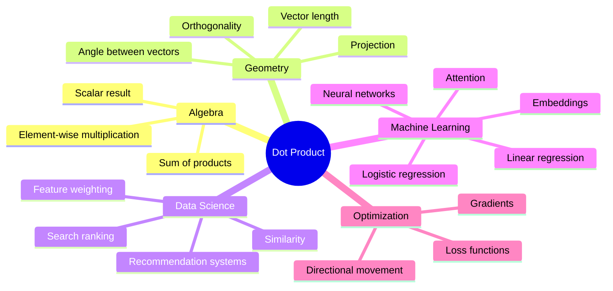
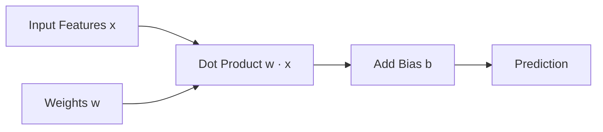
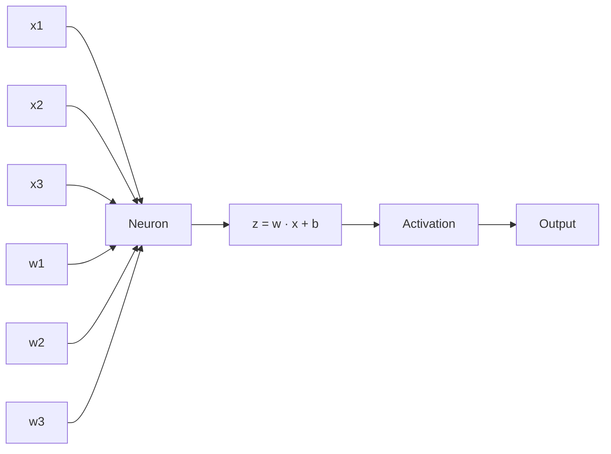
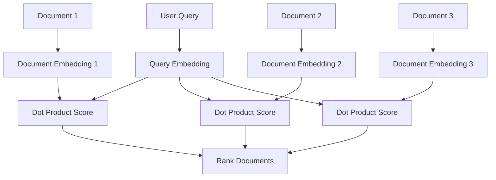
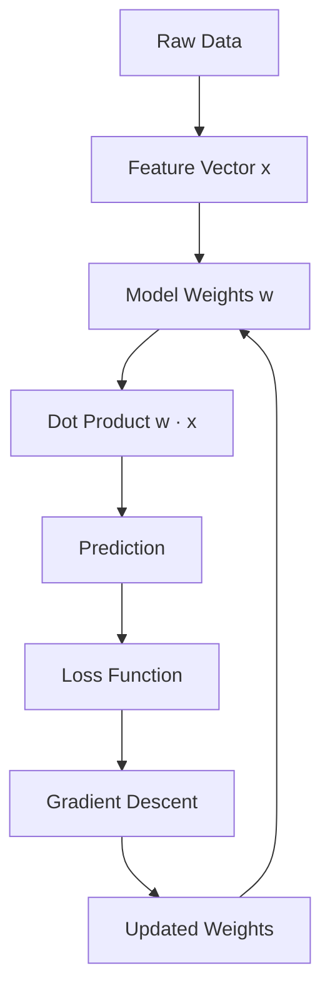
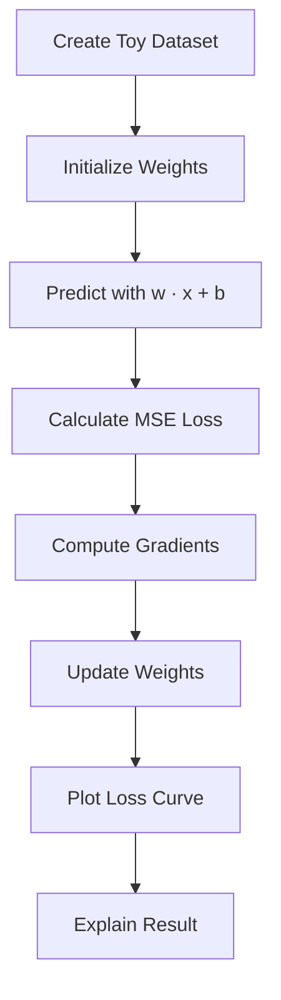

# 004 - Dot Product

**Course:** 01 - Math, Statistics and Econometrics
**Module:** Module 01 - Mathematics for AI and Data Science
**Content Group:** Linear Algebra
**Roadmap Source:** Mathematics for AI and Data Science / Linear Algebra
**Lesson Type:** Mathematics
**Order in Module:** 004
**Suggested Duration:** 24 minutes

---

## 1. Summary

This lesson explains the **Dot Product** in the context of AI and Data Science.

After this lesson, you should understand how the dot product helps answer practical data questions, how it appears in machine learning models, and how it can become a small notebook, metric, chart, API, or portfolio artifact.

The dot product is one of the most important operations in linear algebra because it connects:

* Vector similarity
* Geometry and angles
* Projections
* Linear models
* Neural networks
* Embeddings
* Attention mechanisms
* Optimization and gradients

---

## 2. Learning Objectives

By the end of this lesson, you should be able to:

* Explain the **Dot Product** in your own words.
* Calculate a dot product by hand.
* Understand the geometric meaning of the dot product.
* Recognize where dot products appear in AI and Data Science workflows.
* Use Python to verify dot product calculations.
* Connect the dot product to similarity search, embeddings, neural networks, and gradient descent.

---

## 3. Big Picture

The dot product is a way to combine two vectors into one number.

```text
Two vectors in
      |
      v
Element-wise multiplication
      |
      v
Sum the results
      |
      v
One scalar output
```

Example:

```text
a = [2, 3]
b = [4, 5]

a · b = 2*4 + 3*5
      = 8 + 15
      = 23
```

So the dot product of `a` and `b` is:

```text
23
```

---

## 4. Core Definition

Given two vectors:

```text
a = [a1, a2, ..., an]
b = [b1, b2, ..., bn]
```

The dot product is:

```text
a · b = a1*b1 + a2*b2 + ... + an*bn
```

In compact notation:

```text
a · b = sum(ai * bi)
```

Important condition:

```text
Both vectors must have the same length.
```

Example:

```text
a = [1, 2, 3]
b = [4, 5, 6]

a · b = 1*4 + 2*5 + 3*6
      = 4 + 10 + 18
      = 32
```

---

## 5. Concept Tree



---

## 6. Algebraic View

The dot product multiplies matching components and adds them together.

```text
a = [a1, a2, a3]
b = [b1, b2, b3]

a · b = a1*b1 + a2*b2 + a3*b3
```

Example:

```text
a = [3, -2, 4]
b = [1, 5, -3]

a · b = 3*1 + (-2)*5 + 4*(-3)
      = 3 - 10 - 12
      = -19
```

The result is a scalar:

```text
Dot product result = one number
```

---

## 7. Geometric View

The dot product also tells us how much two vectors point in the same direction.

Formula:

```text
a · b = ||a|| * ||b|| * cos(theta)
```

Where:

```text
||a||      = length of vector a
||b||      = length of vector b
theta      = angle between a and b
cos(theta) = direction similarity
```

---

## 8. Direction Meaning

The sign of the dot product tells us about the angle between vectors.

| Dot Product | Angle Type              | Meaning                              |
| ----------: | ----------------------- | ------------------------------------ |
|    Positive | Less than 90 degrees    | Vectors point in a similar direction |
|        Zero | Exactly 90 degrees      | Vectors are perpendicular            |
|    Negative | Greater than 90 degrees | Vectors point in opposite directions |

```text
Positive dot product:

a ------>
b ---->

They point in a similar direction.
```

```text
Zero dot product:

a ------>

b
|
|
v

They are perpendicular.
```

```text
Negative dot product:

a ------>

b <------

They point in opposite directions.
```

---

## 9. Simple 2D Geometry Example

Let:

```text
a = [1, 0]
b = [0, 1]
```

Calculate:

```text
a · b = 1*0 + 0*1
      = 0
```

So:

```text
a and b are perpendicular.
```

Visual intuition:

```text
y-axis
  ^
  |
b |     b = [0, 1]
  |
  |
  +----------------> x-axis
        a = [1, 0]
```

---

## 10. Dot Product and Angle

Because:

```text
a · b = ||a|| * ||b|| * cos(theta)
```

We can solve for the angle:

```text
cos(theta) = (a · b) / (||a|| * ||b||)
```

This is the foundation of **cosine similarity**.

Cosine similarity is widely used in:

* Text embeddings
* Semantic search
* Recommendation systems
* Clustering
* Information retrieval
* RAG systems

---

## 11. Dot Product vs Cosine Similarity

Dot product depends on both:

```text
1. Direction
2. Magnitude
```

Cosine similarity focuses mainly on:

```text
Direction
```

Formula:

```text
cosine_similarity(a, b) = (a · b) / (||a|| * ||b||)
```

Interpretation:

| Cosine Similarity | Meaning                   |
| ----------------: | ------------------------- |
|                 1 | Same direction            |
|                 0 | Perpendicular / unrelated |
|                -1 | Opposite direction        |

---

## 12. Dot Product in Data Science

Imagine each vector represents a user or item.

```text
user_preference = [5, 1, 3]
movie_features  = [4, 0, 2]
```

Dot product:

```text
score = 5*4 + 1*0 + 3*2
      = 20 + 0 + 6
      = 26
```

This score can mean:

```text
How much this user may like this movie.
```

That is why dot products are used in recommendation systems.

---

## 13. Dot Product in Linear Models

A linear model often looks like this:

```text
prediction = w · x + b
```

Where:

```text
w = weights
x = input features
b = bias
```

Example:

```text
x = [hours_studied, previous_score, attendance]
w = [0.5, 0.3, 0.2]
b = 1.0
```

Prediction:

```text
prediction = 0.5*hours_studied
           + 0.3*previous_score
           + 0.2*attendance
           + 1.0
```

The model is using the dot product to combine features and weights.

---

## 14. Linear Model Diagram



Example:

```text
x = [2, 80, 90]
w = [0.5, 0.3, 0.2]
b = 1

w · x = 2*0.5 + 80*0.3 + 90*0.2
      = 1 + 24 + 18
      = 43

prediction = 43 + 1
           = 44
```

---

## 15. Dot Product in Neural Networks

A neuron also uses the dot product.

```text
z = w · x + b
output = activation(z)
```

Diagram:



Inside the neuron:

```text
z = w1*x1 + w2*x2 + w3*x3 + b
```

This is exactly a dot product plus bias.

---

## 16. Dot Product in Embeddings

In modern AI, words, images, users, and documents are often represented as vectors.

Example:

```text
embedding("cat") = [0.2, 0.8, 0.1, ...]
embedding("dog") = [0.3, 0.7, 0.2, ...]
embedding("car") = [0.9, 0.1, 0.4, ...]
```

To measure similarity, we often use:

```text
dot product
```

or:

```text
cosine similarity
```

High similarity:

```text
cat · dog = high score
```

Lower similarity:

```text
cat · car = lower score
```

---

## 17. Dot Product in Search and RAG

In semantic search or RAG, the query and documents are converted into embeddings.



The document with the highest score is considered the most relevant.

---

## 18. Dot Product in Attention

In transformer models, attention uses dot products.

Simplified attention score:

```text
attention_score = query · key
```

In scaled dot-product attention:

```text
score = (Q · K) / sqrt(dk)
```

Meaning:

```text
If a query vector and a key vector point in a similar direction, the attention score is high.
```

This helps the model decide which tokens should pay attention to which other tokens.

---

## 19. Dot Product and Matrix Multiplication

Matrix multiplication is built from many dot products.

Example:

```text
A = [[1, 2],
     [3, 4]]

B = [[5, 6],
     [7, 8]]
```

To compute the first output cell:

```text
C[1,1] = row 1 of A · column 1 of B
       = [1, 2] · [5, 7]
       = 1*5 + 2*7
       = 19
```

Full result:

```text
C = [[19, 22],
     [43, 50]]
```

Diagram:

```text
Row from A           Column from B

[1, 2]        dot       [5]
                        [7]

Result: 1*5 + 2*7 = 19
```

---

## 20. Dot Product in Optimization

In optimization, the dot product helps describe movement in a direction.

For example, in gradient descent:

```text
new_weight = old_weight - learning_rate * gradient
```

The gradient tells the model:

```text
Which direction increases the loss fastest.
```

Gradient descent moves in the opposite direction.

Dot products appear when measuring whether an update direction aligns with the gradient.

```text
If direction · gradient > 0:
    moving in this direction increases the loss

If direction · gradient < 0:
    moving in this direction decreases the loss
```

---

## 21. Python Demo

```python
import numpy as np

a = np.array([1, 2, 3])
b = np.array([4, 5, 6])

dot_product = np.dot(a, b)

print(dot_product)
```

Expected output:

```text
32
```

Manual check:

```text
1*4 + 2*5 + 3*6 = 4 + 10 + 18 = 32
```

---

## 22. Python Demo: Cosine Similarity

```python
import numpy as np

a = np.array([1, 2, 3])
b = np.array([4, 5, 6])

dot = np.dot(a, b)
norm_a = np.linalg.norm(a)
norm_b = np.linalg.norm(b)

cosine_similarity = dot / (norm_a * norm_b)

print(cosine_similarity)
```

This tells us how similar the two vector directions are.

---

## 23. Small Notebook Artifact Idea

You can turn this lesson into a small notebook:

```text
dot_product_demo.ipynb
```

Suggested notebook sections:

```text
1. Define two vectors
2. Compute dot product manually
3. Verify with NumPy
4. Plot the vectors
5. Compute cosine similarity
6. Interpret the result
7. Connect the idea to ML
```

---

## 24. Mini Visualization Code

```python
import numpy as np
import matplotlib.pyplot as plt

a = np.array([2, 1])
b = np.array([1, 3])

dot = np.dot(a, b)

plt.figure(figsize=(6, 6))
plt.quiver(0, 0, a[0], a[1], angles="xy", scale_units="xy", scale=1, label="a")
plt.quiver(0, 0, b[0], b[1], angles="xy", scale_units="xy", scale=1, label="b")

plt.xlim(0, 4)
plt.ylim(0, 4)
plt.grid(True)
plt.xlabel("x")
plt.ylabel("y")
plt.title(f"Dot Product: {dot}")
plt.legend()
plt.show()
```

---

## 25. Practical ML Example

Suppose a model predicts house price using three features:

```text
x = [size, bedrooms, distance_to_center]
w = [3000, 5000, -2000]
b = 10000
```

Prediction:

```text
price = w · x + b
```

If:

```text
x = [80, 3, 10]
```

Then:

```text
w · x = 3000*80 + 5000*3 + (-2000)*10
      = 240000 + 15000 - 20000
      = 235000

price = 235000 + 10000
      = 245000
```

Interpretation:

```text
size increases price
bedrooms increase price
distance_to_center decreases price
```

The dot product combines all feature contributions into one prediction score.

---

## 26. Workflow Connection



The dot product sits directly inside model prediction.

---

## 27. Common Mistakes

### Mistake 1: Confusing Dot Product with Element-wise Multiplication

Element-wise multiplication:

```text
[1, 2, 3] * [4, 5, 6] = [4, 10, 18]
```

Dot product:

```text
[1, 2, 3] · [4, 5, 6] = 4 + 10 + 18 = 32
```

Element-wise multiplication returns a vector.

Dot product returns a scalar.

---

### Mistake 2: Ignoring Vector Length

Dot product requires vectors with the same dimension.

Valid:

```text
[1, 2, 3] · [4, 5, 6]
```

Invalid:

```text
[1, 2] · [4, 5, 6]
```

---

### Mistake 3: Thinking Dot Product Only Means Similarity

Dot product can measure similarity, but it also depends on magnitude.

Example:

```text
a = [100, 100]
b = [1, 1]
```

The dot product can be large because `a` has large magnitude.

For pure direction similarity, use cosine similarity.

---

### Mistake 4: Memorizing the Formula Without Geometry

Do not only memorize:

```text
a · b = sum(ai * bi)
```

Also understand:

```text
a · b = ||a|| * ||b|| * cos(theta)
```

This explains why dot product relates to angles, projection, and similarity.

---

## 28. Assumptions and Caveats

Important caveats:

* Dot product requires equal vector dimensions.
* Large vector magnitudes can dominate the score.
* Dot product is not always the best similarity metric.
* For normalized vectors, dot product and cosine similarity become closely related.
* In ML, feature scaling can strongly affect dot-product-based models.
* In embeddings, whether to use dot product or cosine similarity depends on how the embeddings were trained and normalized.

---

## 29. Practice Exercises

### Exercise 1: Manual Calculation

Given:

```text
a = [2, 4, 6]
b = [1, 3, 5]
```

Calculate:

```text
a · b
```

Solution:

```text
a · b = 2*1 + 4*3 + 6*5
      = 2 + 12 + 30
      = 44
```

---

### Exercise 2: Perpendicular Vectors

Given:

```text
a = [1, 0]
b = [0, 5]
```

Calculate:

```text
a · b
```

Solution:

```text
a · b = 1*0 + 0*5
      = 0
```

Conclusion:

```text
The vectors are perpendicular.
```

---

### Exercise 3: Python Verification

```python
import numpy as np

a = np.array([2, 4, 6])
b = np.array([1, 3, 5])

print(np.dot(a, b))
```

Expected output:

```text
44
```

---

### Exercise 4: ML Interpretation

Given:

```text
x = [10, 2]
w = [3, -1]
b = 5
```

Calculate:

```text
prediction = w · x + b
```

Solution:

```text
w · x = 3*10 + (-1)*2
      = 30 - 2
      = 28

prediction = 28 + 5
           = 33
```

---

## 30. Quick Review Questions

1. What does the dot product return: a vector or a scalar?
2. Why must two vectors have the same length for dot product?
3. What does a dot product of zero mean geometrically?
4. How is dot product related to cosine similarity?
5. Where does dot product appear in linear regression?
6. Why is dot product important in neural networks?
7. How is matrix multiplication related to dot product?
8. Why can large vector magnitudes affect dot product similarity?

---

## 31. Completion Checklist

* [ ] I can explain **Dot Product** in 1-2 minutes.
* [ ] I can calculate a dot product by hand.
* [ ] I can verify a dot product using Python.
* [ ] I understand the geometric meaning of the dot product.
* [ ] I know why a dot product can be positive, zero, or negative.
* [ ] I understand the connection between dot product and cosine similarity.
* [ ] I know how dot product appears in linear models.
* [ ] I know how dot product appears in neural networks.
* [ ] I have written at least one caveat, assumption, or follow-up question.

---

## 32. Related Outcome

This lesson supports the outcome:

```text
Understand the math language behind vectors, optimization, gradients, PCA, neural networks, and embeddings.
```

The dot product is a core building block for:

* Linear algebra
* Machine learning
* Deep learning
* Embedding search
* Recommender systems
* Optimization
* Transformer attention

---

## 33. Related Project

Mini project:

```text
Gradient Descent from Scratch with MSE Loss and a Loss Curve over Epochs
```

Where the dot product appears:

```text
prediction = w · x + b
loss = mean squared error
gradient = direction for updating weights
```

Suggested project flow:



---

## 34. Final Summary

The **Dot Product** is a key milestone in the AI and Data Science roadmap.

At the simplest level:

```text
Dot product = multiply matching vector elements, then sum them.
```

At a deeper level, it helps us understand:

```text
similarity
angles
projection
linear models
neural networks
embeddings
attention
optimization
```

You should not only memorize the formula. You should turn this concept into a small artifact such as:

* A notebook
* A chart
* A vector similarity demo
* A mini linear regression model
* A gradient descent experiment
* A search ranking example
* A portfolio note

The goal is to make the dot product something you can calculate, visualize, explain, and apply inside real AI/Data Science workflows.
