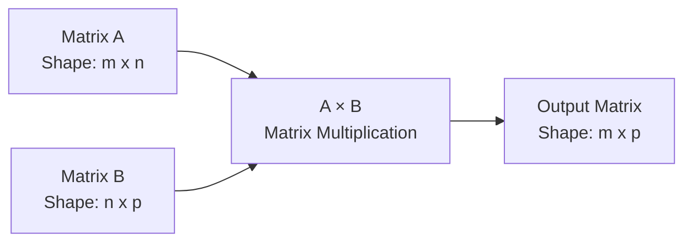
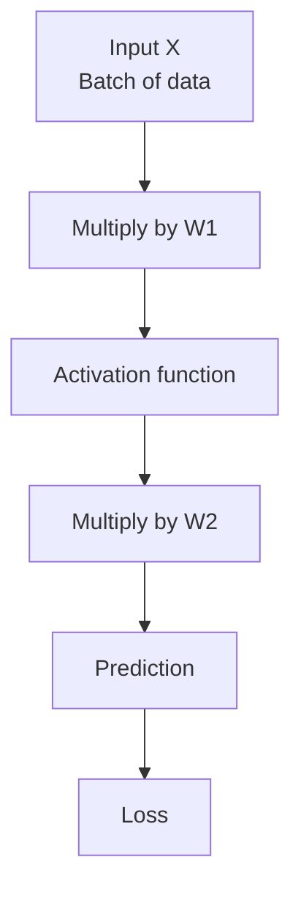
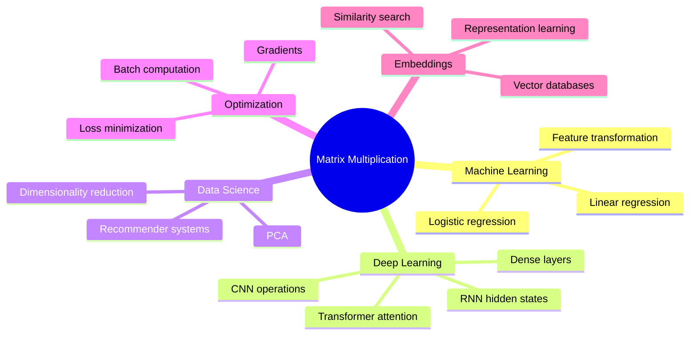

# 005 - Matrix Multiplication

**Course:** 01 - Math, Statistics and Econometrics
**Module:** Module 01 - Mathematics for AI and Data Science
**Content Group:** Linear Algebra
**Roadmap Source:** Mathematics for AI and Data Science / Linear Algebra
**Lesson Type:** Mathematics
**Order in Module:** 005
**Suggested Duration:** 24 minutes

---

## 1. Summary

This lesson explains **Matrix Multiplication** in the context of AI and Data Science.

Matrix multiplication is one of the most important operations in machine learning. It is used to transform data, combine features, compute predictions, train neural networks, calculate attention scores, perform dimensionality reduction, and represent many optimization problems efficiently.

After this lesson, you should understand:

* What matrix multiplication means.
* When two matrices can be multiplied.
* How to compute matrix multiplication by hand.
* Why matrix multiplication is different from element-wise multiplication.
* How matrix multiplication appears in machine learning and deep learning workflows.

---

## 2. Learning Objectives

By the end of this lesson, you should be able to:

* Explain **matrix multiplication** in your own words.
* Check whether two matrices can be multiplied.
* Compute a small matrix multiplication example manually.
* Understand the shape of the output matrix.
* Implement matrix multiplication in Python using NumPy.
* Recognize matrix multiplication in ML formulas such as linear regression, neural networks, PCA, and attention mechanisms.

---

## 3. Big Picture

Matrix multiplication is a way to combine rows from one matrix with columns from another matrix.

In AI and Data Science, it is commonly used to express many computations compactly.

```text
Raw data
   ↓
Feature matrix X
   ↓
Matrix multiplication with weights W
   ↓
Predictions / hidden representations
   ↓
Loss calculation
   ↓
Optimization and model update
```

Example in machine learning:

```text
Prediction = XW + b
```

Where:

| Symbol       | Meaning                                         |
| ------------ | ----------------------------------------------- |
| `X`          | Input data matrix                               |
| `W`          | Weight matrix                                   |
| `b`          | Bias vector                                     |
| `XW`         | Matrix multiplication between input and weights |
| `Prediction` | Model output                                    |

---

## 4. Core Idea

Matrix multiplication combines two matrices by taking the **dot product** between rows and columns.

If:

```text
A has shape: m x n
B has shape: n x p
```

Then:

```text
A × B has shape: m x p
```

The inner dimensions must match:

```text
(m x n) × (n x p) = (m x p)
```

The two `n` values must be the same.

---

## 5. Shape Rule

### Valid Matrix Multiplication

```text
A: 2 x 3
B: 3 x 2

A × B is valid because the inner dimensions match:

(2 x 3) × (3 x 2)
      ↑     ↑
      3  =  3

Result shape:

2 x 2
```

### Invalid Matrix Multiplication

```text
A: 2 x 3
B: 4 x 2

A × B is invalid because the inner dimensions do not match:

(2 x 3) × (4 x 2)
      ↑     ↑
      3  ≠  4
```

---

## 6. Matrix Multiplication Diagram



---

## 7. Manual Example

Let:

```text
A = [1  2  3
     4  5  6]

B = [7   8
     9   10
     11  12]
```

Matrix shapes:

```text
A: 2 x 3
B: 3 x 2
```

So:

```text
A × B = 2 x 2 matrix
```

---

### Step-by-Step Calculation

To calculate each element of the result matrix, take one row from `A` and one column from `B`.

```text
A × B = C
```

Where:

```text
C[1,1] = row 1 of A · column 1 of B
       = (1 × 7) + (2 × 9) + (3 × 11)
       = 7 + 18 + 33
       = 58
```

```text
C[1,2] = row 1 of A · column 2 of B
       = (1 × 8) + (2 × 10) + (3 × 12)
       = 8 + 20 + 36
       = 64
```

```text
C[2,1] = row 2 of A · column 1 of B
       = (4 × 7) + (5 × 9) + (6 × 11)
       = 28 + 45 + 66
       = 139
```

```text
C[2,2] = row 2 of A · column 2 of B
       = (4 × 8) + (5 × 10) + (6 × 12)
       = 32 + 50 + 72
       = 154
```

Final result:

```text
A × B = [58   64
         139  154]
```

---

## 8. Row-by-Column Intuition

Matrix multiplication is built from dot products.

```text
Result cell = one row · one column
```

Visual intuition:

```text
A row:       [1  2  3]

B column:    [7
              9
              11]

Dot product:

(1 × 7) + (2 × 9) + (3 × 11) = 58
```

So the first cell of the output matrix is `58`.

---

## 9. Matrix Multiplication as Feature Combination

Suppose each row of `X` is one data sample.

```text
X = [sample 1 features
     sample 2 features
     sample 3 features]
```

Suppose `W` contains model weights.

```text
W = [weights for output 1
     weights for output 2
     weights for output 3]
```

Then:

```text
XW = model scores or transformed features
```

This is why matrix multiplication is everywhere in machine learning.

---

## 10. Matrix Multiplication in Machine Learning

### 10.1 Linear Regression

A basic linear model can be written as:

```text
y_pred = Xw + b
```

Where:

| Symbol   | Meaning          |
| -------- | ---------------- |
| `X`      | Feature matrix   |
| `w`      | Weight vector    |
| `b`      | Bias             |
| `y_pred` | Predicted output |

Example shape:

```text
X:      100 x 3
w:        3 x 1
Xw:     100 x 1
```

This means:

* 100 data samples.
* 3 features per sample.
* 1 predicted value per sample.

---

### 10.2 Neural Network Layer

A neural network layer often uses:

```text
H = XW + b
```

Where:

| Symbol | Meaning               |
| ------ | --------------------- |
| `X`    | Input matrix          |
| `W`    | Weight matrix         |
| `b`    | Bias vector           |
| `H`    | Hidden representation |

Example:

```text
X: 32 x 784
W: 784 x 128
H: 32 x 128
```

Meaning:

* Batch size: 32 images.
* Each image has 784 input features.
* The layer outputs 128 hidden features.

---

### 10.3 Deep Learning Forward Pass



Matrix multiplication allows neural networks to process many samples at once efficiently.

---

### 10.4 Attention Mechanism

In transformer models, attention uses matrix multiplication heavily.

A simplified attention score calculation is:

```text
Attention scores = Q × Kᵀ
```

Where:

| Symbol | Meaning                          |
| ------ | -------------------------------- |
| `Q`    | Query matrix                     |
| `K`    | Key matrix                       |
| `Kᵀ`   | Transpose of key matrix          |
| `QKᵀ`  | Similarity scores between tokens |

This is one reason transformers can compare many tokens with each other efficiently.

---

## 11. Matrix Multiplication vs Element-Wise Multiplication

Matrix multiplication and element-wise multiplication are different.

### Matrix Multiplication

```text
A @ B
```

Uses row-by-column dot products.

### Element-Wise Multiplication

```text
A * B
```

Multiplies matching positions directly.

Example:

```text
A = [1  2
     3  4]

B = [5  6
     7  8]
```

Element-wise multiplication:

```text
A * B = [1×5  2×6
         3×7  4×8]

      = [5   12
         21  32]
```

Matrix multiplication:

```text
A @ B = [(1×5 + 2×7)   (1×6 + 2×8)
         (3×5 + 4×7)   (3×6 + 4×8)]

      = [19  22
         43  50]
```

---

## 12. Important Properties

### 12.1 Matrix Multiplication Is Usually Not Commutative

In general:

```text
A × B ≠ B × A
```

Example:

```text
A has shape: 2 x 3
B has shape: 3 x 2
```

Then:

```text
A × B has shape: 2 x 2
B × A has shape: 3 x 3
```

The results do not even have the same shape.

---

### 12.2 Matrix Multiplication Is Associative

```text
(A × B) × C = A × (B × C)
```

This matters in optimization because changing the order of multiplication can reduce computation cost.

---

### 12.3 Matrix Multiplication Is Distributive

```text
A × (B + C) = A × B + A × C
```

This property is useful in algebra, optimization, and model derivations.

---

### 12.4 Identity Matrix

The identity matrix acts like the number `1` in matrix multiplication.

```text
A × I = A
I × A = A
```

Example:

```text
I = [1  0
     0  1]
```

---

### 12.5 Transpose Rule

```text
(A × B)ᵀ = Bᵀ × Aᵀ
```

Notice that the order reverses after transpose.

---

## 13. Python Demo

```python
import numpy as np

A = np.array([
    [1, 2, 3],
    [4, 5, 6]
])

B = np.array([
    [7, 8],
    [9, 10],
    [11, 12]
])

C = A @ B

print("A shape:", A.shape)
print("B shape:", B.shape)
print("C shape:", C.shape)
print(C)
```

Expected output:

```text
A shape: (2, 3)
B shape: (3, 2)
C shape: (2, 2)

[[ 58  64]
 [139 154]]
```

---

## 14. Shape Debugging Example

A common ML error:

```text
ValueError: matmul: Input operand has a mismatch in its core dimension
```

This usually means the matrix shapes are not compatible.

Example:

```python
import numpy as np

X = np.random.randn(100, 5)
W = np.random.randn(4, 1)

y = X @ W
```

This fails because:

```text
X: 100 x 5
W:   4 x 1

Inner dimensions:
5 ≠ 4
```

Correct version:

```python
W = np.random.randn(5, 1)
y = X @ W
```

Now:

```text
X: 100 x 5
W:   5 x 1
y: 100 x 1
```

---

## 15. Visual Shape Checklist

Before multiplying two matrices, always check:

```text
Left matrix columns = Right matrix rows
```

```text
A: m x n
B: n x p

A @ B = m x p
```

Memory trick:

```text
Outer dimensions become the output.
Inner dimensions must match.
```

Example:

```text
(100 x 5) @ (5 x 1) = (100 x 1)
 ↑     ↑     ↑   ↑      ↑    ↑
 m     n     n   p      m    p
```

---

## 16. Where This Appears in AI and Data Science



---

## 17. Practical ML Example

Suppose we have 3 users and 4 features per user.

```text
X: 3 x 4
```

Suppose we want to transform each user into 2 prediction scores.

```text
W: 4 x 2
```

Then:

```text
X @ W = 3 x 2
```

Meaning:

```text
3 users → 2 scores per user
```

This is the same idea behind a dense neural network layer.

---

## 18. Mini Project Connection

Related project:

> Gradient Descent from Scratch with MSE Loss and a Loss Curve over Epochs

Matrix multiplication appears in this project when computing predictions for all data samples at once.

For linear regression:

```text
y_pred = Xw + b
```

Loss:

```text
MSE = mean((y_pred - y_true)²)
```

Gradient descent updates:

```text
w = w - learning_rate × gradient
```

Instead of looping over every data point manually, matrix multiplication allows us to compute predictions efficiently for the whole dataset.

---

## 19. Mini Notebook Structure

Use this structure for a small practice notebook:

```text
1. Create a small matrix A
2. Create a small matrix B
3. Check their shapes
4. Multiply A @ B by hand
5. Verify with NumPy
6. Compare matrix multiplication vs element-wise multiplication
7. Use X @ W to simulate a simple ML prediction
8. Plot a small loss curve if connected to gradient descent
```

---

## 20. Practice Exercises

### Exercise 1: Shape Check

For each pair, decide whether multiplication is valid.

| A Shape  | B Shape | Valid? | Output Shape |
| -------- | ------: | -----: | -----------: |
| `2 x 3`  | `3 x 4` |    Yes |      `2 x 4` |
| `5 x 2`  | `3 x 1` |     No |    Not valid |
| `10 x 8` | `8 x 6` |    Yes |     `10 x 6` |
| `4 x 4`  | `4 x 1` |    Yes |      `4 x 1` |
| `7 x 3`  | `7 x 3` |     No |    Not valid |

---

### Exercise 2: Manual Calculation

Given:

```text
A = [1  2
     3  4]

B = [5  6
     7  8]
```

Calculate:

```text
A @ B
```

Solution:

```text
A @ B = [19  22
         43  50]
```

---

### Exercise 3: Python Verification

```python
import numpy as np

A = np.array([
    [1, 2],
    [3, 4]
])

B = np.array([
    [5, 6],
    [7, 8]
])

print(A @ B)
```

Expected output:

```text
[[19 22]
 [43 50]]
```

---

### Exercise 4: ML Shape Reasoning

You have:

```text
X: 500 x 20
W: 20 x 3
```

Question:

```text
What is the shape of X @ W?
```

Answer:

```text
500 x 3
```

Meaning:

* 500 samples.
* 20 features.
* 3 output values per sample.

---

## 21. Common Mistakes

### Mistake 1: Confusing Matrix Multiplication With Element-Wise Multiplication

Wrong assumption:

```text
A @ B is the same as A * B
```

Correct understanding:

```text
A @ B uses rows and columns.
A * B multiplies matching positions.
```

---

### Mistake 2: Ignoring Matrix Shapes

Always check the shape before multiplying.

```text
A: m x n
B: n x p
```

The middle dimensions must match.

---

### Mistake 3: Thinking A × B Always Equals B × A

Usually:

```text
A × B ≠ B × A
```

Matrix multiplication order matters.

---

### Mistake 4: Forgetting Batch Dimension in ML

In ML, the first dimension is often the batch size.

Example:

```text
X: batch_size x number_of_features
```

For a neural network layer:

```text
X @ W
```

Usually:

```text
X: batch_size x input_features
W: input_features x output_features
Output: batch_size x output_features
```

---

### Mistake 5: Memorizing the Formula Without Building an Artifact

Do not only memorize the definition.

You should create at least one of the following:

* A small notebook.
* A manual calculation example.
* A NumPy verification.
* A shape debugging note.
* A simple ML prediction demo.
* A mini gradient descent experiment.

---

## 22. Assumptions and Caveats

Matrix multiplication is powerful, but it requires careful shape management.

Important caveats:

* Matrix multiplication is not always defined.
* The order of multiplication matters.
* Large matrix multiplication can be computationally expensive.
* In ML frameworks, broadcasting may hide shape problems.
* `@`, `np.matmul`, `np.dot`, and `*` may behave differently depending on array dimensions.
* In deep learning, incorrect tensor shapes are one of the most common sources of bugs.

---

## 23. Completion Checklist

You have completed this lesson if:

* [ ] You can explain **matrix multiplication** in 1-2 minutes.
* [ ] You can check whether two matrices can be multiplied.
* [ ] You can calculate a small matrix multiplication example by hand.
* [ ] You can verify the result using Python.
* [ ] You understand why `A @ B` is different from `A * B`.
* [ ] You know that matrix multiplication is usually not commutative.
* [ ] You can identify matrix multiplication in `XW + b`.
* [ ] You can connect this topic to ML, deep learning, PCA, embeddings, or attention.
* [ ] You have created a notebook, chart, model, API, or portfolio note for this topic.
* [ ] You have written down at least one caveat, assumption, or follow-up question.

---

## 24. Related Outcome

This lesson supports the outcome:

> Understand the mathematical language behind vectors, optimization, gradients, PCA, neural networks, and embeddings.

Matrix multiplication helps you read and understand formulas used in:

* Linear regression.
* Logistic regression.
* Gradient descent.
* Neural networks.
* Transformer attention.
* Embedding similarity.
* PCA and dimensionality reduction.
* Recommender systems.

---

## 25. Related Project

### Mini Project: Gradient Descent From Scratch With MSE Loss

Project idea:

Build a simple linear regression model from scratch.

Use matrix multiplication to compute predictions:

```text
y_pred = Xw + b
```

Then calculate MSE loss:

```text
loss = mean((y_pred - y_true)²)
```

Then update weights using gradient descent.

Expected artifact:

```text
gradient_descent_from_scratch.ipynb
```

The notebook should include:

* Dataset creation.
* Matrix shape explanation.
* Manual prediction check.
* NumPy implementation.
* MSE loss calculation.
* Gradient descent loop.
* Loss curve over epochs.
* Final explanation of where matrix multiplication appears.

---

## 26. Final Summary

**Matrix Multiplication** is a core milestone in the AI and Data Scientist roadmap.

It is not just a mathematical operation. It is the language used to describe how data moves through models.

In machine learning, matrix multiplication helps us:

* Transform input data.
* Compute predictions.
* Train models efficiently.
* Represent neural network layers.
* Compare embeddings.
* Build attention mechanisms.
* Optimize large-scale computations.

The key idea is simple:

```text
Matrix multiplication = row-by-column dot products
```

The most important shape rule is:

```text
(m x n) @ (n x p) = (m x p)
```

To make this knowledge practical, turn it into a small artifact:

* A notebook.
* A Python demo.
* A shape debugging guide.
* A mini gradient descent project.
* A portfolio note explaining `XW + b`.

Once you understand matrix multiplication, many machine learning formulas become much easier to read, debug, and implement.

---

# Bài luyện tập

## Mục tiêu


## Đề bài


## Yêu cầu hoàn thành

- [ ] 
- [ ] 
- [ ] 

## Kết quả / lời giải


## Ghi chú
