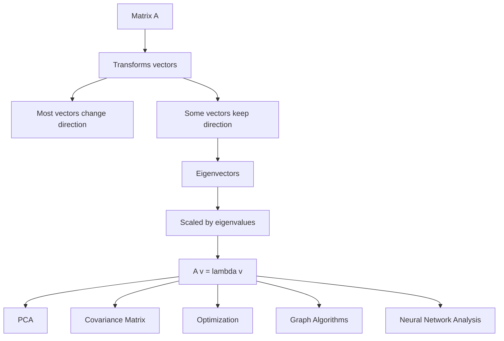
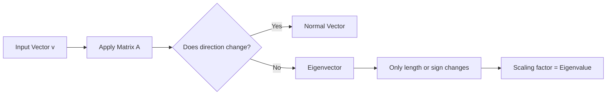
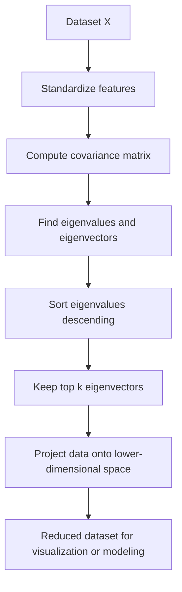

# 006 - Eigenvalues and Eigenvectors

**Course:** 01 - Math, Statistics and Econometrics
**Module:** Module 01 - Mathematics for AI and Data Science
**Content Group:** Linear Algebra
**Roadmap Source:** Mathematics for AI and Data Science / Linear Algebra
**Lesson Type:** Mathematics
**Order in Module:** 006
**Suggested Duration:** 24 minutes

---

## 1. Summary

This lesson explains **Eigenvalues and Eigenvectors** in the context of AI and Data Science.

Eigenvalues and eigenvectors help us understand what happens when a matrix transforms a vector. Most vectors change both **direction** and **length** after a matrix transformation. However, some special vectors only get **stretched, compressed, or flipped**, while keeping the same direction. These special vectors are called **eigenvectors**, and the scaling factors are called **eigenvalues**.

In AI and Data Science, eigenvalues and eigenvectors appear in:

* Principal Component Analysis, or PCA
* Dimensionality reduction
* Covariance matrices
* Optimization and loss landscapes
* Stability analysis
* Graph algorithms
* Embeddings and representation learning

The core idea:

```text
A matrix transformation may change many vectors,
but eigenvectors keep their direction.

The eigenvalue tells how much the eigenvector is scaled.
```

---

## 2. Learning Objectives

After this lesson, you should be able to:

* Explain eigenvalues and eigenvectors in your own words.
* Understand the geometric meaning of the equation `A v = lambda v`.
* Compute eigenvalues and eigenvectors for a small matrix.
* Verify the result using Python.
* Identify where eigenvalues and eigenvectors appear in AI and Data Science workflows.
* Connect this topic to PCA, optimization, gradients, neural networks, and embeddings.

---

## 3. Core Concept

### 3.1 Matrix Transformation

A matrix can be understood as a function that transforms vectors.

Example:

```text
Input vector  --->  Matrix A  --->  Output vector

v             --->     A      --->  A v
```

In 2D space, a matrix can:

* Stretch a vector
* Compress a vector
* Rotate a vector
* Flip a vector
* Shear the space
* Change the direction of most vectors

---

### 3.2 Eigenvector

An **eigenvector** is a non-zero vector that does not change direction after a matrix transformation.

The vector may become longer, shorter, or point in the opposite direction, but it stays on the same line.

```text
Before transformation:

      v
      ↑
      |
      |
------o------>

After transformation:

      A v
      ↑
      |
      |
      |
------o------>

Same direction, different length.
```

---

### 3.3 Eigenvalue

An **eigenvalue** is the scalar that tells how much the eigenvector is scaled.

The main equation is:

```text
A v = lambda v
```

Where:

| Symbol     | Meaning                           |
| ---------- | --------------------------------- |
| `A`        | Matrix transformation             |
| `v`        | Eigenvector                       |
| `lambda`   | Eigenvalue                        |
| `A v`      | Transformed vector                |
| `lambda v` | Scaled version of the same vector |

Important condition:

```text
v must not be the zero vector.
```

The zero vector is not considered an eigenvector because every matrix maps it to zero, so it gives no useful direction.

---

## 4. Visual Intuition

### 4.1 General Matrix Transformation

Most vectors change direction.

```text
Original vector:

      y
      ↑
      |
      |     v
      |    /
      |   /
      |  /
------o----------→ x

After matrix transformation:

      y
      ↑
      |
      |        A v
      |       /
      |      /
      |     /
------o----------→ x

The direction may change.
```

---

### 4.2 Eigenvector Transformation

Eigenvectors keep their direction.

```text
Original eigenvector:

      y
      ↑
      |
      |      v
      |     /
      |    /
      |   /
------o----------→ x

After matrix transformation:

      y
      ↑
      |
      |          A v = lambda v
      |         /
      |        /
      |       /
------o----------→ x

Same line, only scaled.
```

---

## 5. Concept Map



---

## 6. Mathematical Definition

A scalar `lambda` is an eigenvalue of matrix `A` if there exists a non-zero vector `v` such that:

```text
A v = lambda v
```

Rearrange the equation:

```text
A v - lambda v = 0
```

Because `v = I v`, where `I` is the identity matrix:

```text
A v - lambda I v = 0
```

Factor out `v`:

```text
(A - lambda I) v = 0
```

For a non-zero solution `v` to exist, the matrix `(A - lambda I)` must not be invertible.

So we solve:

```text
det(A - lambda I) = 0
```

This equation is called the **characteristic equation**.

---

## 7. Small Numeric Example

Let:

```text
A = [ 2  0 ]
    [ 0  3 ]
```

This matrix scales the x-axis by `2` and the y-axis by `3`.

---

### 7.1 Test Vector on x-axis

Choose:

```text
v1 = [1]
     [0]
```

Compute:

```text
A v1 = [ 2  0 ] [1]
       [ 0  3 ] [0]

     = [2]
       [0]
```

This is the same as:

```text
2 v1 = 2 [1] = [2]
          [0]   [0]
```

So:

```text
A v1 = 2 v1
```

Therefore:

```text
v1 = [1, 0] is an eigenvector
lambda1 = 2 is its eigenvalue
```

---

### 7.2 Test Vector on y-axis

Choose:

```text
v2 = [0]
     [1]
```

Compute:

```text
A v2 = [ 2  0 ] [0]
       [ 0  3 ] [1]

     = [0]
       [3]
```

This is the same as:

```text
3 v2 = 3 [0] = [0]
          [1]   [3]
```

So:

```text
A v2 = 3 v2
```

Therefore:

```text
v2 = [0, 1] is an eigenvector
lambda2 = 3 is its eigenvalue
```

---

## 8. Manual Calculation Example

Let:

```text
A = [ 4  1 ]
    [ 2  3 ]
```

We need to find eigenvalues by solving:

```text
det(A - lambda I) = 0
```

First:

```text
A - lambda I = [ 4 - lambda      1        ]
               [ 2               3 - lambda ]
```

Now compute the determinant:

```text
det(A - lambda I)
= (4 - lambda)(3 - lambda) - (1)(2)
```

Expand:

```text
= 12 - 4lambda - 3lambda + lambda^2 - 2
= lambda^2 - 7lambda + 10
```

Solve:

```text
lambda^2 - 7lambda + 10 = 0
```

Factor:

```text
(lambda - 5)(lambda - 2) = 0
```

So the eigenvalues are:

```text
lambda1 = 5
lambda2 = 2
```

---

### 8.1 Find Eigenvector for lambda = 5

Use:

```text
(A - 5I) v = 0
```

```text
A - 5I = [ -1   1 ]
         [  2  -2 ]
```

Let:

```text
v = [x]
    [y]
```

Then:

```text
-x + y = 0
```

So:

```text
y = x
```

Choose `x = 1`, then `y = 1`.

Therefore:

```text
v1 = [1]
     [1]
```

Check:

```text
A v1 = [ 4  1 ] [1] = [5]
       [ 2  3 ] [1]   [5]

5 v1 = 5 [1] = [5]
          [1]   [5]
```

So:

```text
A v1 = 5 v1
```

---

### 8.2 Find Eigenvector for lambda = 2

Use:

```text
(A - 2I) v = 0
```

```text
A - 2I = [ 2  1 ]
         [ 2  1 ]
```

Then:

```text
2x + y = 0
```

So:

```text
y = -2x
```

Choose `x = 1`, then `y = -2`.

Therefore:

```text
v2 = [ 1]
     [-2]
```

Check:

```text
A v2 = [ 4  1 ] [ 1] = [ 2]
       [ 2  3 ] [-2]   [-4]

2 v2 = 2 [ 1] = [ 2]
          [-2]   [-4]
```

So:

```text
A v2 = 2 v2
```

---

## 9. Python Check

```python
import numpy as np

A = np.array([
    [4, 1],
    [2, 3]
])

eigenvalues, eigenvectors = np.linalg.eig(A)

print("Eigenvalues:")
print(eigenvalues)

print("\nEigenvectors:")
print(eigenvectors)
```

Expected output:

```text
Eigenvalues:
[5. 2.]

Eigenvectors:
[[ 0.70710678 -0.4472136 ]
 [ 0.70710678  0.89442719]]
```

The eigenvectors may look different from the manual result because NumPy returns **normalized eigenvectors**.

Manual eigenvectors:

```text
For lambda = 5: [1, 1]
For lambda = 2: [1, -2]
```

NumPy eigenvectors:

```text
For lambda = 5: [0.707, 0.707]
For lambda = 2: [-0.447, 0.894]
```

They are still correct because eigenvectors can be scaled.

For example:

```text
[1, 1] and [0.707, 0.707] point in the same direction.
```

---

## 10. Why Eigenvectors Can Be Scaled

If `v` is an eigenvector, then any non-zero scalar multiple of `v` is also an eigenvector.

If:

```text
A v = lambda v
```

Then for any non-zero scalar `c`:

```text
A (c v) = c A v = c lambda v = lambda (c v)
```

So:

```text
v, 2v, -v, 0.5v
```

all point along the same eigenvector direction.

---

## 11. Interpretation of Eigenvalue Values

| Eigenvalue       | Meaning                                        |
| ---------------- | ---------------------------------------------- |
| `lambda > 1`     | Eigenvector is stretched                       |
| `0 < lambda < 1` | Eigenvector is compressed                      |
| `lambda = 1`     | Eigenvector stays the same length              |
| `lambda = 0`     | Eigenvector is collapsed to zero               |
| `lambda < 0`     | Eigenvector is flipped and scaled              |
| Complex lambda   | Transformation involves rotation-like behavior |

Example:

```text
lambda = 3     means the vector becomes 3 times longer.
lambda = 0.5   means the vector becomes half as long.
lambda = -2    means the vector flips direction and becomes 2 times longer.
```

---

## 12. Geometric Meaning



---

## 13. Eigenvalues and PCA

Eigenvalues and eigenvectors are central to **Principal Component Analysis**, or **PCA**.

PCA finds the directions where data varies the most.

In PCA:

| PCA Concept                  | Linear Algebra Concept  |
| ---------------------------- | ----------------------- |
| Principal component          | Eigenvector             |
| Amount of variance explained | Eigenvalue              |
| Covariance matrix            | Matrix being decomposed |
| Dimensionality reduction     | Keep top eigenvectors   |

---

### 13.1 PCA Intuition

Suppose we have a dataset with two features:

```text
Feature 1: Study hours
Feature 2: Exam score
```

The data may be spread mostly along one direction.

```text
Exam Score
    ↑
    |
    |          •
    |       •
    |    •
    |  •
    |•
    +----------------→ Study Hours
```

PCA finds the main direction of spread.

```text
Exam Score
    ↑
    |
    |          •
    |       •
    |    •       PC1
    |  •       /
    |•       /
    +----------------→ Study Hours
```

The first principal component is the eigenvector with the largest eigenvalue.

```text
Largest eigenvalue = most important direction of variance.
```

---

## 14. PCA Workflow Diagram



---

## 15. Connection to AI and Data Science

### 15.1 Data Science

Eigenvalues and eigenvectors are used to:

* Understand feature variance
* Reduce dimensionality
* Detect correlated features
* Analyze covariance matrices
* Compress data while preserving important structure

Example:

```text
High-dimensional dataset
        ↓
Covariance matrix
        ↓
Eigenvectors and eigenvalues
        ↓
Principal components
        ↓
Lower-dimensional representation
```

---

### 15.2 Machine Learning

In machine learning, eigenvalues can help explain:

* Why optimization is slow in some directions
* Why some loss landscapes are steep or flat
* How curvature affects gradient descent
* How features interact with each other

In optimization, the Hessian matrix describes local curvature.

```text
Large eigenvalue  -> steep direction
Small eigenvalue  -> flat direction
Negative eigenvalue -> possible saddle point
```

---

### 15.3 Deep Learning

In deep learning, eigenvalues and eigenvectors appear in:

* Weight matrix analysis
* Embedding space structure
* Stability of recurrent neural networks
* Gradient explosion and vanishing gradients
* Loss landscape analysis

Example:

```text
If repeated matrix multiplication keeps stretching vectors too much,
gradients may explode.

If it keeps shrinking vectors too much,
gradients may vanish.
```

---

## 16. Connection to Gradient Descent

The related mini project is:

```text
Gradient Descent from Scratch with MSE Loss and a Loss Curve over Epochs
```

Eigenvalues help explain why gradient descent may behave differently in different directions.

### 16.1 Loss Surface Example

```text
Steep direction:
Gradient changes quickly.

Flat direction:
Gradient changes slowly.
```

```text
Loss
 ↑
 |
 |        steep
 |       /
 |      /
 |_____/____________→ parameter
        flat
```

If the curvature is very different across directions, gradient descent may zigzag.

```text
Start
  *
   \
    *
   /
  *
   \
    *
     \
      Minimum
```

Eigenvalues of the Hessian matrix describe these curvature directions.

---

## 17. Practical Demo Plan

```text
concept
   ↓
small numeric example
   ↓
manual eigenvalue calculation
   ↓
manual eigenvector calculation
   ↓
Python verification
   ↓
visual intuition
   ↓
ML use case: PCA or optimization
```

---

## 18. Mini Notebook Structure

A good practice notebook for this lesson can follow this structure:

```text
01_define_matrix.ipynb
02_manual_eigen_calculation.ipynb
03_numpy_check.ipynb
04_visualize_vectors.ipynb
05_pca_demo.ipynb
06_gradient_descent_connection.ipynb
```

Recommended notebook sections:

```text
1. Define a 2x2 matrix
2. Compute eigenvalues manually
3. Compute eigenvectors manually
4. Verify with NumPy
5. Plot original vectors and transformed vectors
6. Explain which vectors keep direction
7. Connect to PCA or optimization
```

---

## 19. Simple Python Visualization Idea

```python
import numpy as np
import matplotlib.pyplot as plt

A = np.array([
    [4, 1],
    [2, 3]
])

vectors = np.array([
    [1, 1],
    [1, -2],
    [1, 0],
    [0, 1]
])

transformed = vectors @ A.T

plt.figure(figsize=(6, 6))

for v, Av in zip(vectors, transformed):
    plt.arrow(0, 0, v[0], v[1], head_width=0.1, length_includes_head=True)
    plt.arrow(0, 0, Av[0], Av[1], head_width=0.1, length_includes_head=True, linestyle="--")

plt.axhline(0)
plt.axvline(0)
plt.grid(True)
plt.xlim(-5, 6)
plt.ylim(-5, 6)
plt.title("Original vectors and transformed vectors")
plt.show()
```

Observation:

```text
Eigenvectors stay on the same line after transformation.
Other vectors usually change direction.
```

---

## 20. Practice Exercises

### Exercise 1: Manual Calculation

Given:

```text
A = [ 3  0 ]
    [ 0  4 ]
```

Tasks:

1. Find the eigenvalues.
2. Find the eigenvectors.
3. Explain the geometric meaning.

Expected idea:

```text
The x-axis direction is scaled by 3.
The y-axis direction is scaled by 4.
```

---

### Exercise 2: Non-Diagonal Matrix

Given:

```text
A = [ 4  1 ]
    [ 2  3 ]
```

Tasks:

1. Solve `det(A - lambda I) = 0`.
2. Find eigenvalues.
3. Find eigenvectors.
4. Verify with NumPy.

---

### Exercise 3: PCA Connection

Use a small 2D dataset:

```python
import numpy as np

X = np.array([
    [1, 2],
    [2, 3],
    [3, 5],
    [4, 6],
    [5, 8]
])
```

Tasks:

1. Center the data.
2. Compute covariance matrix.
3. Find eigenvalues and eigenvectors.
4. Identify the first principal component.

---

### Exercise 4: ML Reflection

Write short answers:

```text
1. Where do eigenvalues appear in PCA?
2. Why does the largest eigenvalue matter?
3. How can eigenvalues explain slow gradient descent?
4. Why are eigenvectors important for representation learning?
```

---

## 21. Common Mistakes

### Mistake 1: Memorizing the Definition Without Intuition

Bad understanding:

```text
Eigenvectors satisfy A v = lambda v.
```

Better understanding:

```text
Eigenvectors are special directions that a matrix does not rotate away from.
```

---

### Mistake 2: Forgetting That Eigenvectors Are Not Unique

This is correct:

```text
[1, 1]
[2, 2]
[-1, -1]
[0.707, 0.707]
```

All can represent the same eigenvector direction.

---

### Mistake 3: Thinking Every Matrix Has Real Eigenvalues

Some matrices have complex eigenvalues.

Example: a pure rotation matrix in 2D may not have real eigenvectors because every non-zero vector changes direction.

---

### Mistake 4: Ignoring Numerical Precision

Python may return values such as:

```text
2.0000000001
```

instead of:

```text
2
```

This is normal due to floating-point precision.

---

### Mistake 5: Not Connecting to ML

Eigenvalues and eigenvectors are not just abstract math. They are directly connected to:

```text
PCA
Covariance
Optimization
Embeddings
Neural networks
Graph algorithms
```

---

## 22. Assumptions, Limitations, and Caveats

### Assumptions

* The lesson focuses mainly on square matrices.
* Examples use small 2x2 matrices for clarity.
* Python examples use NumPy for verification.

### Limitations

* Real-world matrices can be very large.
* Some matrices are not diagonalizable.
* Some eigenvalues and eigenvectors can be complex.
* Numerical algorithms may return approximations.

### Caveats

```text
Eigenvectors describe directions.
Eigenvalues describe scaling.
But not every matrix has a full set of simple real eigenvectors.
```

---

## 23. Checklist for Completion

You have completed this lesson if:

* [ ] You can explain eigenvalues and eigenvectors in 1-2 minutes.
* [ ] You can explain the equation `A v = lambda v`.
* [ ] You can compute eigenvalues for a small 2x2 matrix.
* [ ] You can compute eigenvectors after finding eigenvalues.
* [ ] You can verify the result with Python.
* [ ] You can explain how eigenvalues and eigenvectors relate to PCA.
* [ ] You can explain how eigenvalues relate to optimization and gradient descent.
* [ ] You have written at least one caveat, assumption, or follow-up question.
* [ ] You have created a notebook, chart, experiment, or portfolio note for this topic.

---

## 24. Portfolio Artifact

A good portfolio artifact for this lesson:

```text
Title:
Eigenvalues and Eigenvectors from Scratch

Artifact:
A notebook that manually computes eigenvalues and eigenvectors for a 2x2 matrix,
verifies the result with NumPy,
visualizes the transformed vectors,
and explains the connection to PCA and gradient descent.
```

Suggested files:

```text
eigenvalues_eigenvectors_from_scratch.ipynb
README.md
plots/eigenvector_transformation.png
```

Suggested README structure:

```text
# Eigenvalues and Eigenvectors from Scratch

## Goal
Understand how matrix transformations scale special vector directions.

## What I Built
- Manual eigenvalue calculation
- Manual eigenvector calculation
- NumPy verification
- Vector transformation visualization
- PCA connection explanation

## Key Learning
Eigenvectors are directions preserved by a matrix transformation.
Eigenvalues are the scaling factors along those directions.

## ML Connection
This concept appears in PCA, covariance analysis, optimization, and neural network stability.
```

---

## 25. Final Summary

**Eigenvalues and Eigenvectors** are a key milestone in the AI and Data Science math roadmap.

They help answer questions such as:

```text
What are the most important directions in the data?
How does a matrix transform space?
Which directions are stretched or compressed?
Why does PCA work?
Why can gradient descent be slow or unstable?
How do matrix operations affect representations?
```

The most important equation is:

```text
A v = lambda v
```

The intuition is:

```text
Eigenvector = direction preserved by the matrix
Eigenvalue = scaling factor along that direction
```

To truly understand this topic, turn it into a small artifact:

```text
manual calculation
+ Python check
+ visualization
+ PCA or optimization use case
```

This makes the concept practical for AI, machine learning, deep learning, and data science workflows.

---

# Bài luyện tập

## Mục tiêu


## Đề bài


## Yêu cầu hoàn thành

- [ ] 
- [ ] 
- [ ] 

## Kết quả / lời giải


## Ghi chú
