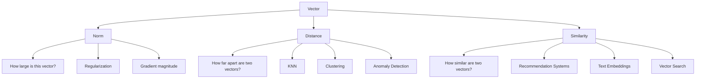
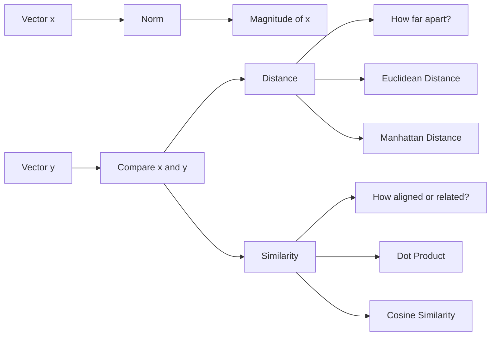
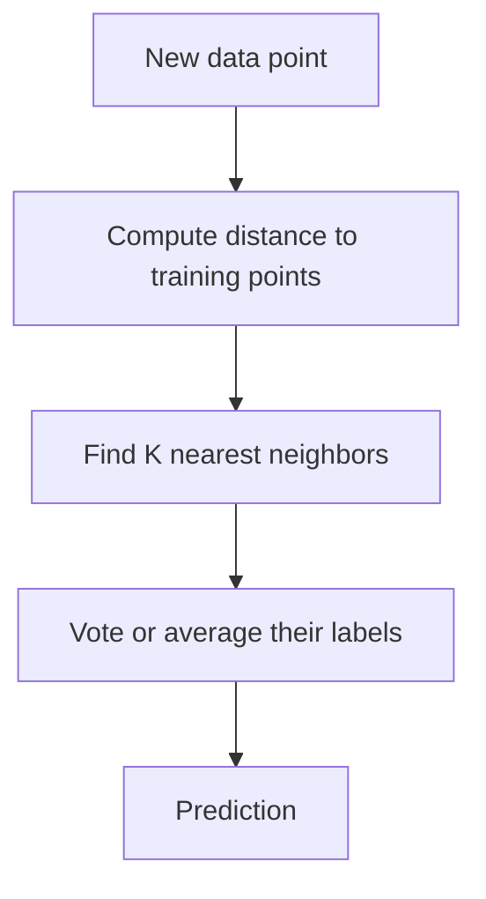
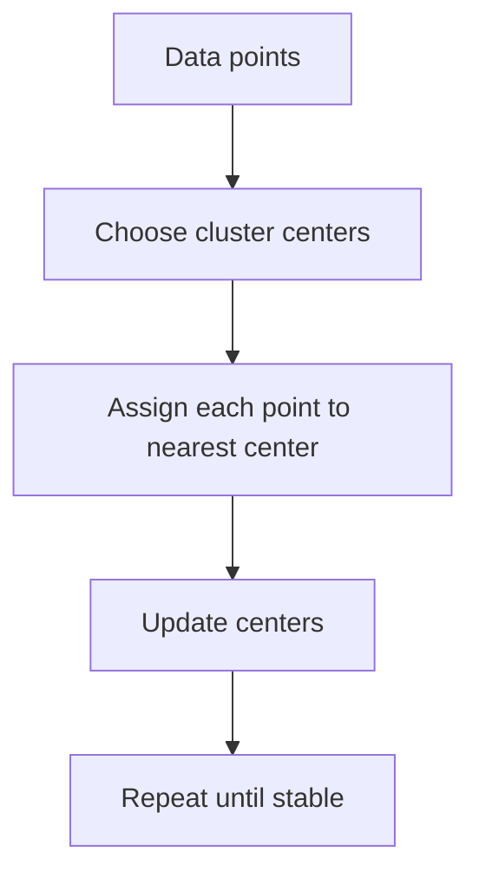
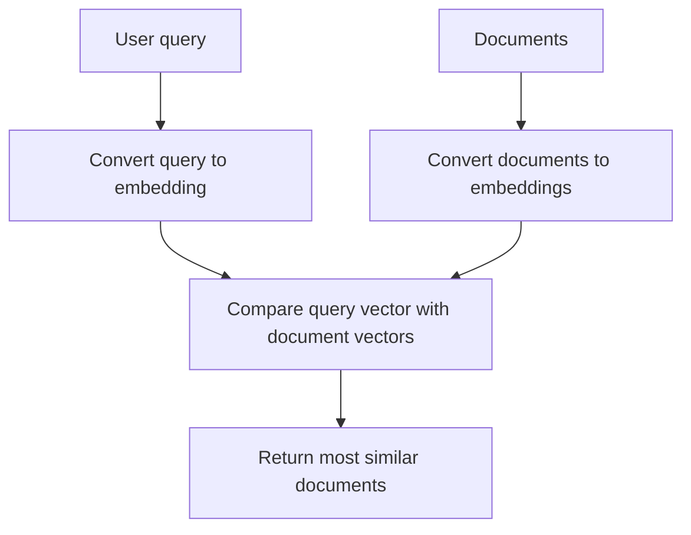
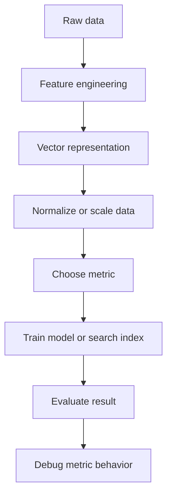

# 007 - Norm, Distance and Similarity

**Course:** 01 - Math, Statistics and Econometrics
**Module:** Module 01 - Mathematics for AI and Data Science
**Content Group:** Linear Algebra
**Roadmap Source:** Mathematics for AI and Data Science / Linear Algebra
**Lesson Type:** Mathematics
**Order in Module:** 007
**Suggested Duration:** 24 minutes

---

## 1. Summary

This lesson explains **Norm, Distance and Similarity** in the context of AI and Data Science.

These concepts help us answer questions such as:

* How large is a vector?
* How far apart are two data points?
* How similar are two users, documents, images, or embeddings?
* How does a machine learning model measure error?
* How do recommendation systems, clustering models, and vector search engines compare data?

In AI and Data Science, **norms** measure magnitude, **distances** measure difference, and **similarities** measure closeness or alignment.

---

## 2. Learning Objectives

After this lesson, you should be able to:

* Explain **Norm, Distance and Similarity** in your own words.
* Understand where these concepts appear in AI/Data Science workflows.
* Compute common norms and distances by hand.
* Use Python to verify small numerical examples.
* Recognize how these concepts are used in embeddings, clustering, recommendation systems, optimization, and model evaluation.

---

## 3. Big Picture



A vector can represent many things:

| Data Type     | Vector Meaning                      |
| ------------- | ----------------------------------- |
| User profile  | Preferences, behavior, clicks       |
| Image         | Pixel values or image embedding     |
| Text          | Word/document embedding             |
| Product       | Features, price, category, metadata |
| Model weights | Parameters learned during training  |

Once data becomes vectors, we can compare them using **norms**, **distances**, and **similarities**.

---

## 4. Core Concepts

### 4.1 Norm

A **norm** measures the size or length of a vector.

For a vector:

$$
x = [x_1, x_2, ..., x_n]
$$

A norm answers:

> How large is this vector?

Common norms:

| Norm    | Formula                       | Intuition        |                  |                            |
| ------- | ----------------------------- | ---------------- | ---------------- | -------------------------- |
| L1 Norm | $|x|_1 = \sum_i               | x_i              | $                | Total absolute value       |
| L2 Norm | $|x|_2 = \sqrt{\sum_i x_i^2}$ | Euclidean length |                  |                            |
| L∞ Norm | $|x|_\infty = \max_i          | x_i              | $                | Largest absolute component |
| Lp Norm | $|x|_p = \left(\sum_i         | x_i              | ^p\right)^{1/p}$ | General form               |

---

## 5. Visual Intuition of Norms

For a 2D vector:

$$
x = [3, 4]
$$

The L2 norm is:

$$
|x|_2 = \sqrt{3^2 + 4^2} = 5
$$

Geometrically:

```text
y
^
|
|          point (3,4)
|             *
|            /|
|           / |
|          /  | 4
|         /   |
|        /    |
|       /     |
|      /      |
|     /       |
|    *-------->
|   origin  3   x

Vector length = sqrt(3² + 4²) = 5
```

The L2 norm is the ordinary geometric length of the vector.

---

## 6. Common Norms

### 6.1 L1 Norm

The **L1 norm** is the sum of absolute values.

For:

$$
x = [3, -4, 2]
$$

$$
|x|_1 = |3| + |-4| + |2| = 9
$$

Intuition:

```text
L1 norm = total movement along axes
```

Example:

```text
Move 3 steps on x-axis
Move 4 steps on y-axis
Move 2 steps on z-axis

Total movement = 3 + 4 + 2 = 9
```

L1 norm is often used in:

* Sparse models
* Lasso regression
* Feature selection
* Manhattan distance

---

### 6.2 L2 Norm

The **L2 norm** is the square root of the sum of squared values.

For:

$$
x = [3, 4]
$$

$$
|x|_2 = \sqrt{3^2 + 4^2} = 5
$$

L2 norm is often used in:

* Euclidean distance
* Gradient descent
* Ridge regression
* Neural network weight decay
* Measuring vector magnitude

---

### 6.3 L∞ Norm

The **L∞ norm** takes the largest absolute value.

For:

$$
x = [3, -8, 2]
$$

$$
|x|_\infty = 8
$$

Intuition:

```text
L∞ norm = biggest single component
```

It is useful when the maximum deviation matters more than the total deviation.

---

## 7. Distance

A **distance** measures how far apart two vectors are.

For two vectors:

$$
x = [x_1, x_2, ..., x_n]
$$

$$
y = [y_1, y_2, ..., y_n]
$$

Distance answers:

> How different are these two vectors?

A general way to think about distance:

$$
distance(x, y) = norm(x - y)
$$

So distance is just the norm of the difference between two vectors.

---

## 8. Common Distance Metrics

### 8.1 Euclidean Distance

Euclidean distance uses the L2 norm.

$$
d(x, y) = \sqrt{\sum_i (x_i - y_i)^2}
$$

Example:

$$
x = [1, 2]
$$

$$
y = [4, 6]
$$

$$
d(x, y) = \sqrt{(4-1)^2 + (6-2)^2}
$$

$$
d(x, y) = \sqrt{3^2 + 4^2} = 5
$$

Visual intuition:

```text
y
^
|
|          y(4,6)
|             *
|            /|
|           / |
|          /  | 4
|         /   |
|        /    |
|       *-----*
|    x(1,2)   3
|
+----------------> x

Euclidean distance = straight-line distance = 5
```

Used in:

* K-Nearest Neighbors
* K-Means clustering
* Computer vision
* Numerical optimization

---

### 8.2 Manhattan Distance

Manhattan distance uses the L1 norm.

$$
d(x, y) = \sum_i |x_i - y_i|
$$

Example:

$$
x = [1, 2]
$$

$$
y = [4, 6]
$$

$$
d(x, y) = |4-1| + |6-2| = 3 + 4 = 7
$$

Visual intuition:

```text
Euclidean distance:
x -------- diagonal -------- y

Manhattan distance:
x ---- horizontal ----
                   |
                   |
                   y
```

Manhattan distance is useful when movement happens along grid-like paths.

Used in:

* City-block distance
* Sparse high-dimensional data
* Some recommendation systems
* Robust feature comparison

---

### 8.3 Minkowski Distance

Minkowski distance is a general form of Lp distance.

$$
d(x, y) = \left(\sum_i |x_i - y_i|^p\right)^{1/p}
$$

Special cases:

| p Value        | Distance           |
| -------------- | ------------------ |
| $p = 1$        | Manhattan distance |
| $p = 2$        | Euclidean distance |
| $p \to \infty$ | Chebyshev distance |

---

### 8.4 Cosine Distance

Cosine distance is based on cosine similarity.

$$
cosine\ distance = 1 - cosine\ similarity
$$

It is useful when direction matters more than magnitude.

Example use cases:

* Text embeddings
* Search engines
* Recommendation systems
* Semantic similarity
* Vector databases

---

## 9. Similarity

A **similarity** score measures how close or related two vectors are.

Similarity answers:

> How alike are these two vectors?

Unlike distance, where smaller is usually better, similarity is usually better when it is larger.

---

## 10. Dot Product Similarity

The dot product between two vectors is:

$$
x \cdot y = \sum_i x_i y_i
$$

Example:

$$
x = [1, 2, 3]
$$

$$
y = [4, 5, 6]
$$

$$
x \cdot y = 1 \times 4 + 2 \times 5 + 3 \times 6
$$

$$
x \cdot y = 4 + 10 + 18 = 32
$$

Dot product can be interpreted as:

```text
large positive value  -> vectors point in similar directions
zero                 -> vectors are orthogonal
negative value       -> vectors point in opposite directions
```

Used in:

* Neural networks
* Attention mechanisms
* Linear regression
* Logistic regression
* Embedding similarity
* Recommendation models

---

## 11. Cosine Similarity

Cosine similarity measures the angle between two vectors.

Formula:

$$
cosine(x, y) = \frac{x \cdot y}{|x|_2 |y|_2}
$$

Its value is usually between -1 and 1.

| Cosine Similarity | Meaning                |
| ----------------- | ---------------------- |
| 1                 | Same direction         |
| 0                 | Orthogonal / unrelated |
| -1                | Opposite direction     |

---

## 12. Cosine Similarity Example

Let:

$$
x = [3, 4]
$$

$$
y = [6, 8]
$$

Step 1: Dot product

$$
x \cdot y = 3 \times 6 + 4 \times 8 = 18 + 32 = 50
$$

Step 2: Norms

$$
|x|_2 = \sqrt{3^2 + 4^2} = 5
$$

$$
|y|_2 = \sqrt{6^2 + 8^2} = 10
$$

Step 3: Cosine similarity

$$
cosine(x, y) = \frac{50}{5 \times 10} = 1
$$

Interpretation:

```text
x = [3, 4]
y = [6, 8]

They point in exactly the same direction.
y is just a larger version of x.

Cosine similarity = 1
```

---

## 13. Distance vs Similarity

| Concept    | Question                       | Better Value    | Example                |
| ---------- | ------------------------------ | --------------- | ---------------------- |
| Norm       | How large is one vector?       | Depends on task | Weight magnitude       |
| Distance   | How far apart are two vectors? | Smaller         | KNN, clustering        |
| Similarity | How alike are two vectors?     | Larger          | Search, recommendation |

Simple intuition:

```text
Distance:
smaller = more similar

Similarity:
larger = more similar
```

Example:

```text
User A and User B have distance = 0.2
User A and User C have distance = 5.0

=> User A is closer to User B.

Document A and Document B have cosine similarity = 0.92
Document A and Document C have cosine similarity = 0.31

=> Document A is more similar to Document B.
```

---

## 14. Relationship Between Norm, Distance and Similarity



---

## 15. Machine Learning Use Cases

### 15.1 K-Nearest Neighbors

KNN predicts based on the closest examples.



Example:

```text
A new customer is represented as a vector.

The model finds the most similar existing customers.

Then it predicts what the new customer may like or do.
```

---

### 15.2 K-Means Clustering

K-Means groups points by distance to cluster centers.



Distance is the core operation.

Usually, K-Means uses Euclidean distance.

---

### 15.3 Recommendation Systems

Users and items can be represented as vectors.

```text
User vector:
[likes_action_movies, likes_romance, likes_comedy, likes_sci_fi]

Movie vector:
[action_score, romance_score, comedy_score, sci_fi_score]
```

The system recommends items with high similarity to the user vector.

Common similarity measures:

* Dot product
* Cosine similarity
* Learned neural similarity

---

### 15.4 Text Embeddings and Vector Search

Modern AI systems convert text into embedding vectors.

Example:

```text
"How to learn machine learning?"
        ↓
embedding vector
        ↓
[0.13, -0.54, 0.91, ..., 0.22]
```

To search for relevant documents:



Cosine similarity is commonly used in embedding search.

---

### 15.5 Optimization and Gradient Descent

In optimization, norms help measure:

* How large the gradient is
* How large the model weights are
* How much the model parameters changed
* Whether training is stable or exploding

Example:

```text
Large gradient norm   -> possible exploding gradients
Tiny gradient norm    -> possible vanishing gradients
Large weight norm     -> possible overfitting
```

---

### 15.6 Regularization

Norms are used to penalize overly large model weights.

L1 regularization:

$$
Loss = Error + \lambda |w|_1
$$

L2 regularization:

$$
Loss = Error + \lambda |w|_2^2
$$

Comparison:

| Regularization | Uses      | Effect                          |
| -------------- | --------- | ------------------------------- |
| L1             | $|w|_1$   | Encourages sparse weights       |
| L2             | $|w|_2^2$ | Encourages small smooth weights |

---

## 16. Small Numeric Example

Let:

$$
x = [1, 2, 3]
$$

$$
y = [2, 4, 6]
$$

### 16.1 Norm of x

L1 norm:

$$
|x|_1 = |1| + |2| + |3| = 6
$$

L2 norm:

$$
|x|_2 = \sqrt{1^2 + 2^2 + 3^2}
$$

$$
|x|_2 = \sqrt{14} \approx 3.742
$$

---

### 16.2 Euclidean Distance

$$
d(x, y) = \sqrt{(2-1)^2 + (4-2)^2 + (6-3)^2}
$$

$$
d(x, y) = \sqrt{1^2 + 2^2 + 3^2}
$$

$$
d(x, y) = \sqrt{14} \approx 3.742
$$

---

### 16.3 Manhattan Distance

$$
d(x, y) = |2-1| + |4-2| + |6-3|
$$

$$
d(x, y) = 1 + 2 + 3 = 6
$$

---

### 16.4 Cosine Similarity

Dot product:

$$
x \cdot y = 1 \times 2 + 2 \times 4 + 3 \times 6
$$

$$
x \cdot y = 2 + 8 + 18 = 28
$$

Norms:

$$
|x|_2 = \sqrt{14}
$$

$$
|y|_2 = \sqrt{2^2 + 4^2 + 6^2} = \sqrt{56}
$$

Cosine similarity:

$$
cosine(x, y) = \frac{28}{\sqrt{14}\sqrt{56}}
$$

Because $y = 2x$, both vectors point in the same direction.

$$
cosine(x, y) = 1
$$

---

## 17. Python Demo

```python
import numpy as np

x = np.array([1, 2, 3])
y = np.array([2, 4, 6])

# Norms
l1_norm_x = np.linalg.norm(x, ord=1)
l2_norm_x = np.linalg.norm(x, ord=2)
linf_norm_x = np.linalg.norm(x, ord=np.inf)

# Distances
euclidean_distance = np.linalg.norm(x - y, ord=2)
manhattan_distance = np.linalg.norm(x - y, ord=1)

# Similarity
dot_product = np.dot(x, y)
cosine_similarity = dot_product / (np.linalg.norm(x) * np.linalg.norm(y))

print("L1 norm of x:", l1_norm_x)
print("L2 norm of x:", l2_norm_x)
print("L∞ norm of x:", linf_norm_x)

print("Euclidean distance:", euclidean_distance)
print("Manhattan distance:", manhattan_distance)

print("Dot product:", dot_product)
print("Cosine similarity:", cosine_similarity)
```

Expected output:

```text
L1 norm of x: 6.0
L2 norm of x: 3.7416573867739413
L∞ norm of x: 3.0
Euclidean distance: 3.7416573867739413
Manhattan distance: 6.0
Dot product: 28
Cosine similarity: 1.0
```

---

## 18. Mini Visualization with Python

```python
import numpy as np
import matplotlib.pyplot as plt

x = np.array([3, 4])
y = np.array([6, 8])

plt.figure(figsize=(6, 6))

plt.arrow(0, 0, x[0], x[1], head_width=0.2, length_includes_head=True)
plt.arrow(0, 0, y[0], y[1], head_width=0.2, length_includes_head=True)

plt.text(x[0], x[1], "x = [3, 4]")
plt.text(y[0], y[1], "y = [6, 8]")

plt.xlim(0, 8)
plt.ylim(0, 10)
plt.grid(True)
plt.xlabel("Feature 1")
plt.ylabel("Feature 2")
plt.title("Two Vectors with Same Direction")

plt.show()
```

Interpretation:

```text
The two vectors have the same direction.
Therefore, cosine similarity = 1.
```

---

## 19. Practical AI/Data Science Workflow



Choosing the right metric is important.

| Task                 | Common Metric                   |
| -------------------- | ------------------------------- |
| KNN classification   | Euclidean / Manhattan distance  |
| K-Means clustering   | Euclidean distance              |
| Text similarity      | Cosine similarity               |
| Image similarity     | Cosine / Euclidean distance     |
| Recommendation       | Dot product / Cosine similarity |
| Sparse data          | Manhattan / Cosine similarity   |
| Model regularization | L1 / L2 norm                    |
| Gradient debugging   | Gradient norm                   |

---

## 20. Important Caveats

### 20.1 Scale Matters

Distance can be misleading if features have different scales.

Example:

```text
Feature 1: age from 0 to 100
Feature 2: income from 0 to 1,000,000
```

Income dominates the distance calculation.

Solution:

```text
Use scaling or normalization.
```

Common methods:

* Standardization
* Min-max scaling
* Unit vector normalization

---

### 20.2 High-Dimensional Data Can Be Tricky

In high-dimensional spaces, distances can become less meaningful.

This is related to the **curse of dimensionality**.

Example:

```text
In 2D, nearby points are easy to see.
In 1000D, many points may appear similarly far apart.
```

This affects:

* KNN
* Clustering
* Vector search
* Anomaly detection

---

### 20.3 Cosine Similarity Ignores Magnitude

Cosine similarity focuses on direction, not size.

Example:

$$
x = [1, 2, 3]
$$

$$
y = [100, 200, 300]
$$

These vectors have the same direction.

$$
cosine(x, y) = 1
$$

Even though their magnitudes are very different.

This is useful for semantic search, but dangerous if magnitude matters.

---

### 20.4 Dot Product Depends on Magnitude

Dot product combines both direction and magnitude.

Large vectors can produce large dot products even if the angle is not very small.

This matters in:

* Recommendation systems
* Attention mechanisms
* Embedding retrieval
* Neural network layers

---

## 21. Common Mistakes

| Mistake                             | Why It Is a Problem                    | Better Practice                               |
| ----------------------------------- | -------------------------------------- | --------------------------------------------- |
| Memorizing formulas only            | No practical intuition                 | Use small numeric examples                    |
| Ignoring feature scale              | Distance becomes biased                | Scale features before distance-based models   |
| Confusing distance and similarity   | Wrong interpretation                   | Remember: smaller distance, larger similarity |
| Using cosine when magnitude matters | Loses size information                 | Use dot product or Euclidean distance         |
| Using Euclidean distance blindly    | Not always suitable                    | Match metric to data type                     |
| Skipping validation                 | Demo may appear correct but fail later | Test with edge cases                          |

---

## 22. Practice Exercises

### Exercise 1: Compute Norms by Hand

Given:

$$
x = [4, -3, 12]
$$

Compute:

1. L1 norm
2. L2 norm
3. L∞ norm

---

### Exercise 2: Compute Distances

Given:

$$
x = [1, 5]
$$

$$
y = [4, 1]
$$

Compute:

1. Euclidean distance
2. Manhattan distance

---

### Exercise 3: Compute Cosine Similarity

Given:

$$
x = [1, 0]
$$

$$
y = [0, 1]
$$

Compute cosine similarity.

Question:

```text
What does the result tell you geometrically?
```

---

### Exercise 4: Python Verification

Write 5-10 lines of Python to verify your answers from Exercises 1-3.

---

### Exercise 5: ML Connection

Write a short note answering:

```text
Where do norm, distance and similarity appear in machine learning?
```

Mention at least three examples.

---

## 23. Suggested Notebook Artifact

Create a notebook named:

```text
007_norm_distance_similarity.ipynb
```

Suggested sections:

```text
1. Define vectors
2. Compute L1, L2, and L∞ norms
3. Compute Euclidean and Manhattan distance
4. Compute dot product and cosine similarity
5. Visualize vectors in 2D
6. Compare results before and after feature scaling
7. Write ML use-case notes
```

---

## 24. Portfolio Artifact Idea

Build a small **vector similarity search demo**.

Example:

```text
Input:
A list of short text descriptions.

Process:
Convert each text into a vector representation.

Compare:
Use cosine similarity to find the most similar text.

Output:
Top 3 most similar results.
```

Mini project structure:

```text
vector-similarity-demo/
│
├── data/
│   └── sample_texts.csv
│
├── notebooks/
│   └── 007_norm_distance_similarity.ipynb
│
├── src/
│   └── similarity.py
│
├── README.md
│
└── requirements.txt
```

---

## 25. Connection to the Related Project

Related project:

```text
Gradient Descent from Scratch with MSE Loss and a Loss Curve over Epochs
```

Norms appear in this project because:

* MSE uses squared differences.
* Gradients are vectors.
* Gradient magnitude can be measured using norms.
* Weight updates can be measured as vector changes.
* L2 regularization penalizes large weights.

Example connection:

$$
MSE = \frac{1}{n} \sum_i (y_i - \hat{y}_i)^2
$$

The squared error is closely related to L2 distance.

---

## 26. Completion Checklist

* [ ] I can explain **Norm, Distance and Similarity** in 1-2 minutes.
* [ ] I can compute L1, L2, and L∞ norms by hand.
* [ ] I can compute Euclidean and Manhattan distance.
* [ ] I can compute dot product and cosine similarity.
* [ ] I understand why feature scaling matters.
* [ ] I know where these concepts appear in ML/DL.
* [ ] I created a small notebook, chart, or code demo.
* [ ] I wrote down at least one caveat, assumption, or follow-up question.

---

## 27. Final Summary

**Norm, Distance and Similarity** are core mathematical tools for AI and Data Science.

They allow us to measure:

```text
one vector       -> norm
two vectors      -> distance
two directions   -> similarity
```

These ideas appear in many important areas:

* KNN
* K-Means clustering
* Embeddings
* Vector search
* Recommendation systems
* Gradient descent
* Regularization
* Neural networks
* Model debugging

The key idea:

```text
Once data becomes vectors, machine learning needs a way to measure size, difference, and similarity.
```

Turn this lesson into a notebook, chart, experiment, model, API, Docker service, or portfolio note so the concept becomes practical and reusable.
