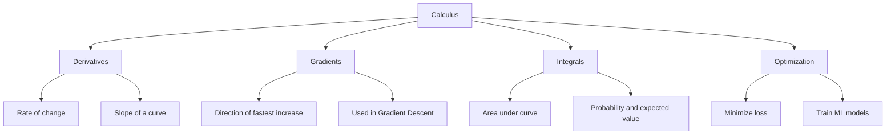
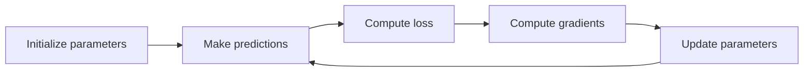
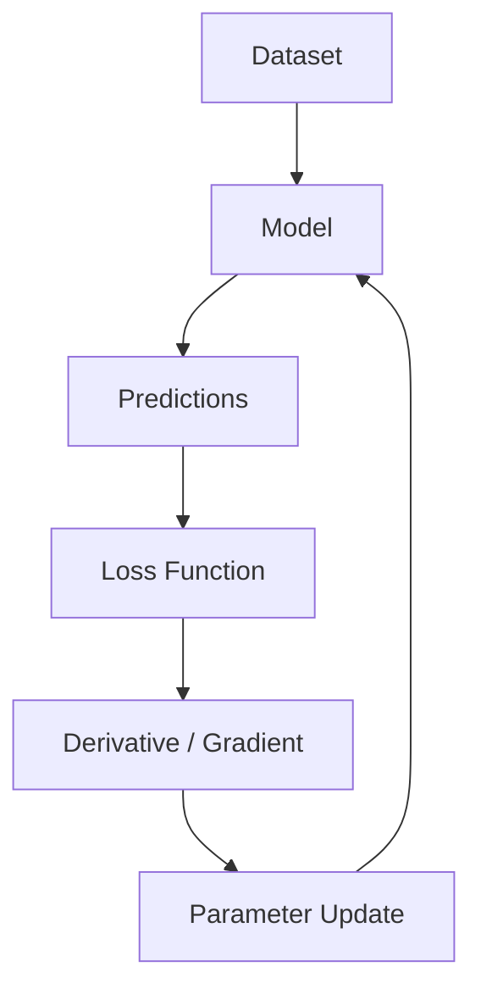

# 008 - Calculus

**Course:** 01 - Math, Statistics and Econometrics
**Module:** Module 01 - Mathematics for AI and Data Science
**Content Group:** Calculus
**Roadmap Source:** Mathematics for AI and Data Science / Calculus
**Lesson Type:** Mathematics
**Order in Module:** 008
**Suggested Duration:** 24 minutes

---

## 1. Summary

This lesson introduces **Calculus** in the context of AI and Data Science.

Calculus helps us understand how quantities change, how models learn, how loss decreases during training, and why optimization methods such as **Gradient Descent** work.

After this lesson, you should understand how calculus connects to:

* Model training
* Loss functions
* Gradients
* Optimization
* Neural networks
* Backpropagation
* Probability and continuous distributions

The goal is not to memorize formulas. The goal is to understand the mathematical language behind machine learning behavior.

---

## 2. Learning Objectives

After completing this lesson, you should be able to:

* Explain **Calculus** in your own words.
* Understand where calculus appears in the AI/Data Science workflow.
* Explain the meaning of derivatives, gradients, and optimization.
* Connect calculus to model training and loss minimization.
* Build a small practical artifact such as a notebook, chart, or mini implementation of Gradient Descent.

---

## 3. Big Picture

Calculus studies **change**.

In AI and Data Science, we often ask:

> If I change the model parameters slightly, how will the error change?

This question is the foundation of model training.



---

## 4. Why Calculus Matters in AI and Data Science

Calculus helps answer questions like:

| Data / ML Question                                      | Calculus Concept               |
| ------------------------------------------------------- | ------------------------------ |
| How does prediction error change when weights change?   | Derivative                     |
| Which direction should the model update its parameters? | Gradient                       |
| How can we minimize loss?                               | Optimization                   |
| How does a neural network learn?                        | Chain rule and backpropagation |
| How do continuous probability distributions work?       | Integrals                      |
| Why is training unstable or slow?                       | Gradient behavior              |

---

## 5. Core Concepts

### 5.1 Function

A function maps an input to an output.

$$
y = f(x)
$$

Example:

$$
f(x) = x^2
$$

If:

$$
x = 3
$$

Then:

$$
f(3) = 3^2 = 9
$$

In machine learning, a model is also a function:

$$
\hat{y} = f(x; \theta)
$$

Where:

* $x$ = input data
* $\theta$ = model parameters
* $\hat{y}$ = prediction

---

### 5.2 Derivative

A derivative tells us how fast a function changes.

For:

$$
f(x) = x^2
$$

The derivative is:

$$
f'(x) = 2x
$$

At $x = 3$:

$$
f'(3) = 2 \times 3 = 6
$$

This means that around $x = 3$, the function is increasing with slope 6.

---

### 5.3 Visual Intuition of Derivative

```text
y
|
|                         *
|                    *
|               *
|          *
|     *
| *
|____________________________ x

The derivative is the slope of the curve at a point.
```

A positive derivative means the function is increasing.

A negative derivative means the function is decreasing.

A derivative close to zero means the function is flat.

---

### 5.4 Derivative and Model Training

Suppose we have a loss function:

$$
L(w) = (w - 3)^2
$$

The goal is to find the value of $w$ that minimizes the loss.

The derivative is:

$$
\frac{dL}{dw} = 2(w - 3)
$$

If $w = 5$:

$$
\frac{dL}{dw} = 2(5 - 3) = 4
$$

The derivative is positive, so we should reduce $w$.

If $w = 1$:

$$
\frac{dL}{dw} = 2(1 - 3) = -4
$$

The derivative is negative, so we should increase $w$.

The minimum occurs when:

$$
\frac{dL}{dw} = 0
$$

So:

$$
2(w - 3) = 0
$$

$$
w = 3
$$

---

## 6. Gradient

A derivative works for one variable.

A gradient works for many variables.

If the loss depends on multiple parameters:

$$
L(w_1, w_2, b)
$$

Then the gradient is:

$$
\nabla L =
\left[
\frac{\partial L}{\partial w_1},
\frac{\partial L}{\partial w_2},
\frac{\partial L}{\partial b}
\right]
$$

The gradient tells us the direction of steepest increase.

To minimize loss, we move in the opposite direction.

---

## 7. Gradient Descent

Gradient Descent is an optimization algorithm used to minimize a loss function.

The update rule is:

$$
w_{\text{new}} = w_{\text{old}} - \alpha \frac{dL}{dw}
$$

Where:

* $w$ = model parameter
* $\alpha$ = learning rate
* $\frac{dL}{dw}$ = derivative of loss with respect to $w$

---

### 7.1 Gradient Descent Loop



---

### 7.2 Intuition

```text
Loss
 ^
 |
 |          *
 |        *
 |      *
 |    *
 |  *
 |_*________________> Parameter

Gradient Descent moves step by step toward the lowest loss.
```

The learning rate controls the step size.

If the learning rate is too small:

```text
Training is slow.
```

If the learning rate is too large:

```text
Training may overshoot or become unstable.
```

---

## 8. Chain Rule

The chain rule explains how changes flow through nested functions.

If:

$$
y = f(g(x))
$$

Then:

$$
\frac{dy}{dx} = \frac{dy}{dg} \cdot \frac{dg}{dx}
$$

In neural networks, each layer depends on the previous layer.

```text
Input -> Layer 1 -> Layer 2 -> Output -> Loss
```

The chain rule allows us to calculate how each weight affects the final loss.

This is the mathematical foundation of **backpropagation**.

---

## 9. Partial Derivatives

A partial derivative measures how a function changes with respect to one variable while keeping other variables fixed.

Example:

$$
f(x, y) = x^2 + y^2
$$

Partial derivative with respect to $x$:

$$
\frac{\partial f}{\partial x} = 2x
$$

Partial derivative with respect to $y$:

$$
\frac{\partial f}{\partial y} = 2y
$$

In machine learning:

$$
L(w_1, w_2, b)
$$

We compute:

$$
\frac{\partial L}{\partial w_1}, \quad
\frac{\partial L}{\partial w_2}, \quad
\frac{\partial L}{\partial b}
$$

Then we update each parameter.

---

## 10. Integral

An integral measures accumulated quantity or area under a curve.

$$
\int_a^b f(x) , dx
$$

In AI and Data Science, integrals appear in:

* Probability density functions
* Expected value
* Continuous distributions
* Area under curves
* Statistical modeling

Example:

If $p(x)$ is a probability density function, then:

$$
\int_{-\infty}^{\infty} p(x) , dx = 1
$$

This means the total probability across all possible values is 1.

---

## 11. Calculus in the ML Workflow



Calculus appears mainly during the training step.

The model uses gradients to decide how to update its parameters.

---

## 12. Example / Demo

### Concept Flow

```text
concept -> small numeric example -> Python check -> visual intuition -> ML use case
```

---

### 12.1 Small Numeric Example

Let:

$$
L(w) = (w - 3)^2
$$

Start with:

$$
w = 10
$$

Learning rate:

$$
\alpha = 0.1
$$

Derivative:

$$
\frac{dL}{dw} = 2(w - 3)
$$

At $w = 10$:

$$
\frac{dL}{dw} = 2(10 - 3) = 14
$$

Update:

$$
w_{\text{new}} = 10 - 0.1 \times 14
$$

$$
w_{\text{new}} = 8.6
$$

The parameter moves closer to the optimal value $w = 3$.

---

### 12.2 Python Check

```python
w = 10
learning_rate = 0.1

for epoch in range(10):
    loss = (w - 3) ** 2
    gradient = 2 * (w - 3)

    w = w - learning_rate * gradient

    print(f"epoch={epoch}, w={w:.4f}, loss={loss:.4f}")
```

Expected behavior:

```text
w moves closer to 3
loss decreases over time
```

---

## 13. Mini Project: Gradient Descent from Scratch

### Project Goal

Build a small notebook that implements Gradient Descent from scratch using Mean Squared Error.

---

### 13.1 Dataset

Use a simple linear dataset:

$$
y = 2x + 1
$$

Example:

| x | y |
| - | - |
| 1 | 3 |
| 2 | 5 |
| 3 | 7 |
| 4 | 9 |

---

### 13.2 Model

Use a simple linear model:

$$
\hat{y} = wx + b
$$

Where:

* $w$ = weight
* $b$ = bias
* $\hat{y}$ = prediction

---

### 13.3 Loss Function

Use Mean Squared Error:

$$
MSE = \frac{1}{n} \sum_{i=1}^{n} (\hat{y}_i - y_i)^2
$$

---

### 13.4 Expected Artifact

Your final notebook should include:

* Dataset
* Model prediction
* MSE loss
* Gradient computation
* Parameter updates
* Loss curve over epochs
* Short explanation of what happened during training

---

## 14. Practical Exercise

### Exercise 1: Manual Calculation

Given:

$$
L(w) = (w - 5)^2
$$

Start with:

$$
w = 9
$$

Learning rate:

$$
\alpha = 0.1
$$

Tasks:

1. Compute the derivative.
2. Compute the new value of $w$ after one update.
3. Explain whether $w$ moved in the correct direction.

---

### Exercise 2: Python Verification

Write 5-10 lines of Python to verify your manual result.

Suggested structure:

```python
w = 9
lr = 0.1

loss = (w - 5) ** 2
gradient = 2 * (w - 5)
w_new = w - lr * gradient

print(loss, gradient, w_new)
```

---

### Exercise 3: ML Connection

Write a short note answering:

```text
Where does calculus appear in machine learning training?
```

Example answer:

```text
Calculus appears when the model calculates gradients of the loss function with respect to model parameters. These gradients are used to update the parameters and reduce prediction error.
```

---

## 15. Common Mistakes

### Mistake 1: Memorizing formulas without intuition

Bad approach:

```text
Derivative = formula to memorize
```

Better approach:

```text
Derivative = how fast something changes
```

---

### Mistake 2: Not connecting calculus to model training

Calculus is not only a math topic. In machine learning, it directly explains how models learn.

---

### Mistake 3: Ignoring the learning rate

A correct gradient with a bad learning rate can still produce poor training.

```text
Small learning rate  -> slow training
Large learning rate  -> unstable training
```

---

### Mistake 4: Forgetting assumptions and limitations

Simple demos often work because the function is smooth and easy to optimize.

Real models may have:

* Many parameters
* Noisy data
* Non-convex loss surfaces
* Vanishing gradients
* Exploding gradients
* Local minima or saddle points

---

## 16. Key Terms

| Term             | Meaning                                                |
| ---------------- | ------------------------------------------------------ |
| Function         | Maps input to output                                   |
| Derivative       | Rate of change of a function                           |
| Gradient         | Vector of partial derivatives                          |
| Chain Rule       | Rule for differentiating nested functions              |
| Integral         | Accumulated area or total quantity                     |
| Loss Function    | Measures prediction error                              |
| Optimization     | Process of minimizing or maximizing a function         |
| Gradient Descent | Algorithm that updates parameters using gradients      |
| Learning Rate    | Step size during parameter updates                     |
| Backpropagation  | Neural network training method based on the chain rule |

---

## 17. AI / Data Science Use Cases

Calculus is used in:

* Linear regression training
* Logistic regression optimization
* Neural network backpropagation
* Deep learning loss minimization
* Gradient boosting intuition
* Probability distributions
* Bayesian inference
* Reinforcement learning optimization
* Embedding model training
* Large language model training

---

## 18. Completion Checklist

* [ ] I can explain **Calculus** in 1-2 minutes.
* [ ] I understand what a derivative represents.
* [ ] I understand what a gradient represents.
* [ ] I can explain why Gradient Descent uses the negative gradient.
* [ ] I can implement a small Gradient Descent example in Python.
* [ ] I can plot a loss curve over epochs.
* [ ] I know where calculus appears in ML/DL training.
* [ ] I have written down at least one caveat, assumption, or follow-up question.

---

## 19. Related Outcome

By completing this lesson, you should better understand the mathematical language behind:

* Vectors
* Optimization
* Gradients
* PCA
* Neural networks
* Backpropagation
* Embeddings
* Loss functions
* Model training behavior

---

## 20. Related Project

### Mini Project: Gradient Descent from Scratch with MSE Loss

Build a notebook that trains a simple linear model:

$$
\hat{y} = wx + b
$$

Using:

$$
MSE = \frac{1}{n} \sum_{i=1}^{n}(\hat{y}_i - y_i)^2
$$

Final deliverables:

* Python notebook
* Manual explanation
* Loss curve chart
* Final learned parameters
* Short reflection on training behavior

---

## 21. Final Summary

**Calculus** is a key milestone in the AI and Data Science learning roadmap.

It helps explain how models learn, why loss decreases, how optimization works, and how neural networks update their parameters.

Do not learn calculus only as abstract formulas. Turn it into something practical:

* A notebook
* A chart
* A small experiment
* A model training demo
* A portfolio note
* A mini API or visualization

The best way to understand calculus for AI is:

```text
formula -> intuition -> numeric example -> Python check -> ML connection
```

---

# Bài luyện tập

## Mục tiêu


## Đề bài


## Yêu cầu hoàn thành

- [ ] 
- [ ] 
- [ ] 

## Kết quả / lời giải


## Ghi chú
