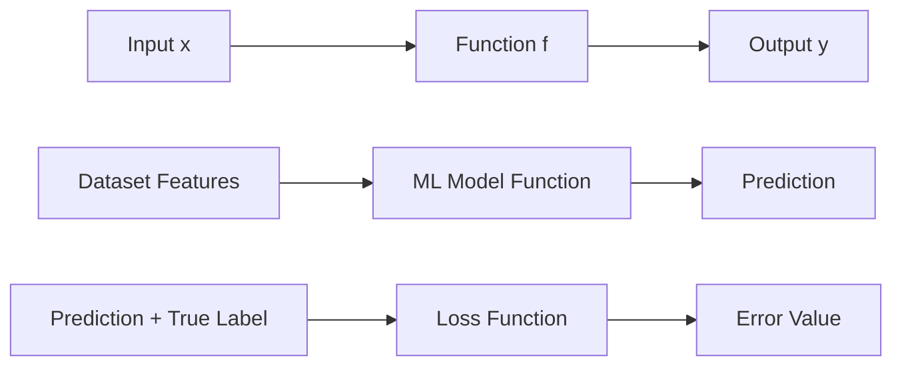
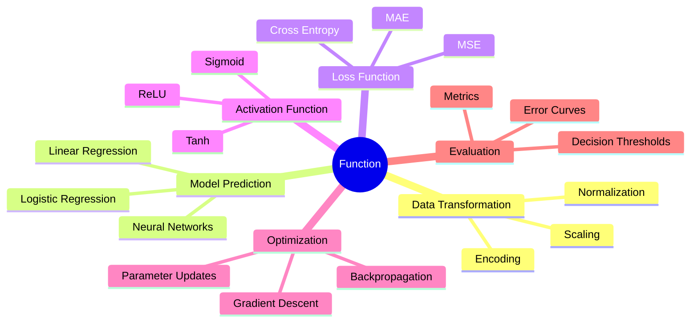
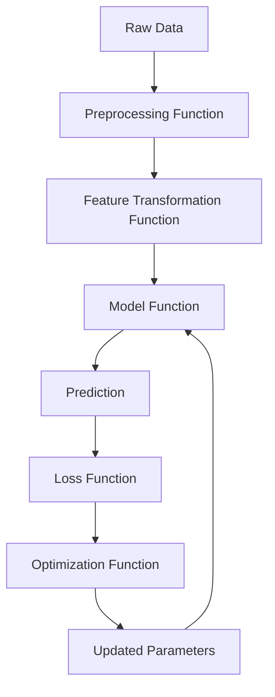
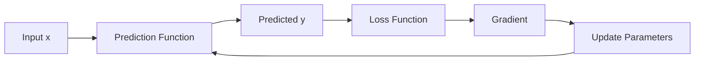

# 009 - Function

**Course:** 01 - Math, Statistics and Econometrics
**Module:** Module 01 - Mathematics for AI and Data Science
**Content Group:** Calculus
**Roadmap Source:** Mathematics for AI and Data Science / Calculus
**Lesson Type:** Mathematics
**Order in Module:** 009
**Suggested Duration:** 24 minutes

---

## 1. Summary

This lesson explains **Functions** in the context of AI and Data Science.

A function is a rule that maps an input to an output. In AI and Data Science, functions appear everywhere: feature transformations, prediction models, loss functions, activation functions, probability functions, and optimization objectives.

After this lesson, you should understand how functions help answer data questions, how they connect to model training, and how they can be turned into a small notebook, chart, metric, API, or portfolio artifact.

---

## 2. Learning Objectives

After completing this lesson, you should be able to:

* Explain what a function is in your own words.
* Identify inputs, outputs, domain, codomain, and range.
* Understand common function types used in AI and Data Science.
* Recognize functions inside ML formulas such as prediction, loss, and activation functions.
* Implement simple functions in Python.
* Visualize a function and interpret its behavior.
* Connect functions to optimization, model training, and gradient descent.

---

## 3. Core Idea

A **function** maps each input to exactly one output.

```text
input x  ->  function f  ->  output y
```

Mathematically:

$$
f(x) = y
$$

Example:

$$
f(x) = 2x + 1
$$

If:

$$
x = 3
$$

Then:

$$
f(3) = 2(3) + 1 = 7
$$

So the function maps `3` to `7`.

---

## 4. Function as a Mapping

A function can be viewed as a machine:

```text
Input data  ->  transformation rule  ->  output result
```

Example:

```text
age = 25  ->  f(age) = age * 2  ->  50
```

In AI and Data Science:

```text
raw data  ->  model function  ->  prediction
```

Example:

```text
house features  ->  price prediction model  ->  predicted price
```

---

## 5. Visual Diagram



---

## 6. Key Concepts

### 6.1 Input

The input is the value given to the function.

Example:

$$
f(x) = x^2
$$

Here, `x` is the input.

If:

$$
x = 4
$$

Then:

$$
f(4) = 16
$$

---

### 6.2 Output

The output is the result produced by the function.

Example:

$$
f(4) = 16
$$

The output is `16`.

---

### 6.3 Domain

The **domain** is the set of valid inputs.

Example:

$$
f(x) = \sqrt{x}
$$

For real numbers, the domain is:

$$
x \ge 0
$$

Because the square root of a negative number is not a real number.

---

### 6.4 Codomain

The **codomain** is the set of possible output values the function is allowed to return.

Example:

$$
f: \mathbb{R} \to \mathbb{R}
$$

This means:

```text
The function takes a real number as input
and returns a real number as output.
```

---

### 6.5 Range

The **range** is the set of actual outputs produced by the function.

Example:

$$
f(x) = x^2
$$

If the domain is all real numbers:

$$
x \in \mathbb{R}
$$

Then the range is:

$$
f(x) \ge 0
$$

Because squaring any real number always gives a non-negative result.

---

## 7. Function Notation

Common notation:

$$
f(x)
$$

This means:

```text
Apply function f to input x.
```

Examples:

$$
f(x) = x + 3
$$

$$
g(x) = x^2
$$

$$
h(x) = \frac{1}{1 + e^{-x}}
$$

In Machine Learning, a model is often written as:

$$
\hat{y} = f(x)
$$

Where:

| Symbol | Meaning          |
| ------ | ---------------- |
| `x`    | Input features   |
| `f`    | Model function   |
| `ŷ`    | Predicted output |

---

## 8. Functions in AI and Data Science

Functions are the mathematical language behind almost every ML component.



---

## 9. Important Function Types

### 9.1 Linear Function

A linear function has the form:

$$
f(x) = ax + b
$$

Example:

$$
f(x) = 2x + 1
$$

This creates a straight line.

In ML, linear regression uses this idea:

$$
\hat{y} = wx + b
$$

Where:

| Symbol | Meaning       |
| ------ | ------------- |
| `w`    | Weight        |
| `x`    | Input feature |
| `b`    | Bias          |
| `ŷ`    | Prediction    |

---

### 9.2 Quadratic Function

A quadratic function has the form:

$$
f(x) = ax^2 + bx + c
$$

Example:

$$
f(x) = x^2
$$

This creates a curve.

Quadratic functions are useful for understanding loss surfaces.

Example MSE loss often forms a bowl-shaped curve:

$$
L(w) = (wx - y)^2
$$

---

### 9.3 Exponential Function

An exponential function has the form:

$$
f(x) = a^x
$$

Example:

$$
f(x) = 2^x
$$

Exponential functions appear in:

* Probability models
* Softmax
* Logistic regression
* Neural network activations
* Growth modeling

---

### 9.4 Logarithmic Function

A logarithmic function is the inverse of an exponential function.

Example:

$$
f(x) = \log(x)
$$

Log functions appear in:

* Cross-entropy loss
* Log-likelihood
* Information theory
* Probability modeling
* Data transformation for skewed features

---

### 9.5 Sigmoid Function

The sigmoid function maps any real number into the range between `0` and `1`.

$$
\sigma(x) = \frac{1}{1 + e^{-x}}
$$

It is commonly used in binary classification.

Example:

```text
input score -> sigmoid -> probability
```

If the output is:

$$
\sigma(x) = 0.87
$$

We may interpret it as:

```text
The model predicts an 87% probability for the positive class.
```

---

### 9.6 ReLU Function

The ReLU function is widely used in neural networks.

$$
f(x) = \max(0, x)
$$

It means:

```text
If x is negative, return 0.
If x is positive, return x.
```

Examples:

$$
f(-3) = 0
$$

$$
f(5) = 5
$$

ReLU helps neural networks learn non-linear patterns.

---

## 10. Function Input and Output Shapes

In AI, functions may take different types of inputs and outputs.

| Function Type    | Example              | Meaning                           |
| ---------------- | -------------------- | --------------------------------- |
| Scalar to scalar | `f(x) = x²`          | One number to one number          |
| Vector to scalar | `f(x) = w · x`       | Many features to one prediction   |
| Vector to vector | `f(x) = Ax`          | Transform one vector into another |
| Matrix to vector | `f(X) = Xw`          | Dataset to predictions            |
| Tensor to tensor | Neural network layer | Deep learning transformation      |

Example:

$$
f: \mathbb{R}^n \to \mathbb{R}
$$

This means:

```text
The function takes an n-dimensional vector
and returns one real number.
```

In ML:

```text
feature vector -> prediction
```

---

## 11. Function Composition

Function composition means applying one function after another.

If:

$$
f(x) = x + 1
$$

And:

$$
g(x) = x^2
$$

Then:

$$
g(f(x)) = (x + 1)^2
$$

In AI pipelines, this is very common.

Example:

```text
raw data -> preprocessing -> model -> prediction -> loss
```

Mathematically:

$$
L(y, f(T(x)))
$$

Where:

| Symbol    | Meaning           |
| --------- | ----------------- |
| `x`       | Raw input         |
| `T(x)`    | Transformed input |
| `f(T(x))` | Model prediction  |
| `L`       | Loss function     |

---

## 12. Function Pipeline in Machine Learning



This loop is the foundation of model training.

---

## 13. Function vs Parameter

A common beginner mistake is confusing variables and parameters.

Example:

$$
f(x) = wx + b
$$

Here:

| Symbol | Role                |
| ------ | ------------------- |
| `x`    | Input variable      |
| `w`    | Learnable parameter |
| `b`    | Learnable parameter |
| `f(x)` | Output prediction   |

During training:

```text
x is given by the dataset.
w and b are adjusted by the learning algorithm.
```

The goal is to find good values of `w` and `b`.

---

## 14. Function in Model Training

A machine learning model can be understood as a function:

$$
\hat{y} = f(x; \theta)
$$

Where:

| Symbol | Meaning          |
| ------ | ---------------- |
| `x`    | Input data       |
| `θ`    | Model parameters |
| `f`    | Model function   |
| `ŷ`    | Prediction       |

The training objective is to find parameters that reduce error:

$$
\theta^* = \arg\min_{\theta} L(y, f(x; \theta))
$$

In simple words:

```text
Find the model parameters that make the loss as small as possible.
```

---

## 15. Example: Linear Prediction Function

Suppose we want to predict exam score from study hours.

Let:

$$
f(x) = 10x + 30
$$

Where:

| Symbol | Meaning              |
| ------ | -------------------- |
| `x`    | Study hours          |
| `f(x)` | Predicted exam score |

If a student studies for 5 hours:

$$
f(5) = 10(5) + 30 = 80
$$

So the predicted score is:

```text
80
```

---

## 16. Small Numeric Example

Given:

$$
f(x) = 3x - 2
$$

Calculate:

$$
f(4)
$$

Solution:

$$
f(4) = 3(4) - 2
$$

$$
f(4) = 12 - 2
$$

$$
f(4) = 10
$$

So:

```text
Input: 4
Output: 10
```

---

## 17. Python Check

```python
def f(x):
    return 3 * x - 2

result = f(4)
print(result)
```

Expected output:

```text
10
```

---

## 18. Visual Intuition with Python

```python
import numpy as np
import matplotlib.pyplot as plt

def f(x):
    return 3 * x - 2

x = np.linspace(-5, 5, 100)
y = f(x)

plt.plot(x, y)
plt.axhline(0)
plt.axvline(0)
plt.title("Function: f(x) = 3x - 2")
plt.xlabel("x")
plt.ylabel("f(x)")
plt.grid(True)
plt.show()
```

What to observe:

* The function is a straight line.
* The slope is `3`.
* The intercept is `-2`.
* When `x` increases, `f(x)` increases.

---

## 19. ML Use Case: Loss Function

A loss function measures how wrong a model prediction is.

Example:

$$
L(y, \hat{y}) = (y - \hat{y})^2
$$

Where:

| Symbol | Meaning         |
| ------ | --------------- |
| `y`    | True value      |
| `ŷ`    | Predicted value |
| `L`    | Loss            |

Suppose:

$$
y = 10
$$

$$
\hat{y} = 7
$$

Then:

$$
L = (10 - 7)^2 = 9
$$

The model error is `9`.

---

## 20. ML Use Case: Activation Function

Neural networks use activation functions to introduce non-linearity.

Without activation functions, a neural network would mostly behave like a linear model.

Example ReLU:

$$
ReLU(x) = \max(0, x)
$$

Python:

```python
def relu(x):
    return max(0, x)

print(relu(-5))
print(relu(3))
```

Expected output:

```text
0
3
```

---

## 21. ML Use Case: Prediction Function

A simple linear regression model:

$$
\hat{y} = wx + b
$$

Python:

```python
def predict(x, w, b):
    return w * x + b

x = 5
w = 10
b = 30

y_pred = predict(x, w, b)
print(y_pred)
```

Expected output:

```text
80
```

This is the same idea as:

```text
study hours -> prediction function -> predicted score
```

---

## 22. Why Functions Matter for AI and Data Science

Functions help us describe:

| AI/Data Science Task | Function View                      |
| -------------------- | ---------------------------------- |
| Data cleaning        | Raw value -> cleaned value         |
| Feature scaling      | Original feature -> scaled feature |
| Regression           | Features -> numeric prediction     |
| Classification       | Features -> class probability      |
| Neural network layer | Input tensor -> output tensor      |
| Loss calculation     | Prediction + label -> error        |
| Optimization         | Parameters -> lower loss           |
| Deployment API       | Request input -> model response    |

---

## 23. Common Mistakes

### Mistake 1: Memorizing the Definition Only

Knowing that a function maps input to output is not enough.

You should also know:

* What the input represents.
* What the output represents.
* Whether the function is linear or non-linear.
* Whether it is used for prediction, loss, transformation, or activation.

---

### Mistake 2: Ignoring the Domain

Some functions are not valid for all inputs.

Example:

$$
f(x) = \log(x)
$$

This function is only valid for:

$$
x > 0
$$

If your data contains `0` or negative values, applying log directly can cause errors.

---

### Mistake 3: Confusing Function Output with Model Accuracy

A model function returns a prediction.

A metric function evaluates prediction quality.

Example:

```text
model function: features -> prediction
metric function: predictions + labels -> score
```

They are related, but they are not the same.

---

### Mistake 4: Forgetting Assumptions

Every function has assumptions.

Example:

A linear function assumes a straight-line relationship.

But real data may be non-linear.

That is why visualization and validation are important.

---

## 24. Practice Exercises

### Exercise 1: Manual Calculation

Given:

$$
f(x) = 2x + 5
$$

Calculate:

$$
f(0), f(2), f(10)
$$

---

### Exercise 2: Python Function

Write a Python function for:

$$
f(x) = x^2 + 3x + 1
$$

Test it with:

```text
x = -2, 0, 2, 5
```

---

### Exercise 3: Plot a Function

Plot:

$$
f(x) = x^2
$$

For:

$$
-10 \le x \le 10
$$

Observe:

* Where is the minimum?
* Is the function linear or non-linear?
* Is the function symmetric?

---

### Exercise 4: ML Connection

Create a small prediction function:

$$
\hat{y} = wx + b
$$

Use:

```text
w = 2
b = 1
x = [1, 2, 3, 4, 5]
```

Compute predictions manually and with Python.

---

### Exercise 5: Loss Function

Given:

```text
y_true = [3, 5, 7]
y_pred = [2, 5, 10]
```

Compute the mean squared error:

$$
MSE = \frac{1}{n}\sum_{i=1}^{n}(y_i - \hat{y}_i)^2
$$

---

## 25. Mini Project: Function Notebook

Create a notebook with the following sections:

```text
1. Define a simple function
2. Calculate outputs by hand
3. Implement the function in Python
4. Plot the function
5. Explain its shape
6. Connect it to an ML use case
7. Add one caveat or limitation
```

Suggested functions:

* Linear function: `f(x) = 2x + 1`
* Quadratic function: `f(x) = x²`
* Sigmoid function: `f(x) = 1 / (1 + e^(-x))`
* ReLU function: `f(x) = max(0, x)`
* Loss function: `L(y, ŷ) = (y - ŷ)²`

---

## 26. Portfolio Artifact Idea

Build a small notebook titled:

```text
Understanding Functions for Machine Learning
```

Include:

* Function definitions
* Manual calculations
* Python implementation
* Function plots
* ML interpretation
* Short reflection

Possible output artifacts:

| Artifact    | Description                                 |
| ----------- | ------------------------------------------- |
| Notebook    | Function examples and plots                 |
| Chart       | Linear, quadratic, sigmoid, and ReLU curves |
| Metric demo | MSE loss calculation                        |
| API demo    | Function as a prediction endpoint           |
| Blog note   | Explaining functions for ML beginners       |

---

## 27. Completion Checklist

* [ ] I can explain what a function is in 1-2 minutes.
* [ ] I can identify input, output, domain, codomain, and range.
* [ ] I can manually calculate function outputs.
* [ ] I can implement a function in Python.
* [ ] I can plot a function.
* [ ] I can explain how functions appear in ML models.
* [ ] I understand the difference between prediction functions and loss functions.
* [ ] I have written at least one caveat, assumption, or follow-up question.
* [ ] I have created a small notebook, chart, metric, API, or portfolio note.

---

## 28. Related Outcome

This lesson supports the following outcome:

```text
Understand the math language behind vectors, optimization, gradients,
PCA, neural networks, embeddings, and machine learning models.
```

Functions are especially important before studying:

* Limits
* Derivatives
* Gradients
* Optimization
* Gradient descent
* Loss functions
* Neural networks
* Backpropagation

---

## 29. Related Project

**Mini Project:** Gradient Descent from Scratch with MSE Loss and a Loss Curve over Epochs.

Connection to this lesson:

```text
prediction function -> loss function -> gradient function -> parameter update
```

Example training loop:



This project helps you understand how functions are used not only for calculation, but also for learning.

---

## 30. Final Summary

A **Function** is one of the most important mathematical ideas in AI and Data Science.

At the simplest level:

```text
input -> function -> output
```

In Machine Learning:

```text
features -> model function -> prediction
```

During training:

```text
prediction -> loss function -> optimization -> better parameters
```

To truly learn functions, do not only memorize definitions. Build a small artifact: a notebook, chart, metric demo, prediction function, API endpoint, or portfolio note.

The goal is to make functions feel practical, visual, and connected to real ML workflows.

---

# Bài luyện tập

## Mục tiêu


## Đề bài


## Yêu cầu hoàn thành

- [ ] 
- [ ] 
- [ ] 

## Kết quả / lời giải


## Ghi chú
