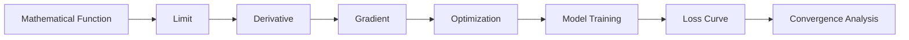

# 010 - Limit

**Course:** 01 - Math, Statistics and Econometrics
**Module:** Module 01 - Mathematics for AI and Data Science
**Content Group:** Calculus
**Roadmap Source:** Mathematics for AI and Data Science / Calculus
**Lesson Type:** Mathematics
**Order in Module:** 010
**Suggested Duration:** 24 minutes

---

## 1. Summary

This lesson explains **limits** in the context of AI and Data Science.

A **limit** describes what value a function approaches when the input gets closer and closer to a specific point. In AI and Data Science, limits are important because they help us understand **gradients, optimization, convergence, loss functions, model training behavior, and continuous change**.

After this lesson, you should understand how limits help answer questions such as:

* What happens to the loss when training continues?
* Does an optimization algorithm converge?
* What value does a function approach near a boundary?
* Why can gradients exist even when we are only looking at very small changes?
* Why do derivatives depend on limits?

---

## 2. Learning Objectives

After this lesson, you should be able to:

* Explain **limits** in your own words.
* Understand why limits are foundational for calculus.
* Recognize how limits appear in machine learning optimization.
* Connect limits to derivatives, gradients, and convergence.
* Build a small Python demo to visualize how a function approaches a value.
* Identify how limits relate to model training and loss minimization.

---

## 3. Main Concept

A **limit** describes the value that a function approaches as the input approaches a certain number.

### Basic Form

```text
As x gets closer to a,
f(x) gets closer to L.
```

Mathematically:

$$
\lim_{x \to a} f(x) = L
$$

This means:

```text
When x approaches a, f(x) approaches L.
```

Important: the function does **not always need to equal** `L` at `x = a`. A limit is about the value being approached, not necessarily the actual value at the point.

---

## 4. Intuition

Imagine walking toward a door.

You may never touch the door exactly, but you can get closer and closer.

That is the idea of a limit.

```text
x values:     1.9   1.99   1.999   2.001   2.01   2.1
              ↓      ↓      ↓       ↓       ↓      ↓
approach:                    x → 2
```

If the output values also approach one stable number, then the function has a limit.

---

## 5. Visual Diagram

```mermaid
flowchart TD
    A[Input x approaches a point] --> B[Function f(x) changes]
    B --> C{Does f(x) approach one stable value?}
    C -->|Yes| D[Limit exists]
    C -->|No| E[Limit does not exist]
    D --> F[Useful for derivatives, gradients, convergence]
    E --> G[Possible discontinuity, instability, or undefined behavior]
```

---

## 6. Simple Example

Consider the function:

$$
f(x) = 2x + 1
$$

Find:

$$
\lim_{x \to 3} (2x + 1)
$$

As `x` gets closer to `3`, the function gets closer to:

$$
2(3) + 1 = 7
$$

So:

$$
\lim_{x \to 3} (2x + 1) = 7
$$

---

## 7. Example with a Hole

Consider:

$$
f(x) = \frac{x^2 - 1}{x - 1}
$$

At `x = 1`, the function is undefined because the denominator becomes zero:

$$
\frac{1^2 - 1}{1 - 1} = \frac{0}{0}
$$

But we can simplify:

$$
x^2 - 1 = (x - 1)(x + 1)
$$

So:

$$
f(x) = \frac{(x - 1)(x + 1)}{x - 1}
$$

For `x ≠ 1`:

$$
f(x) = x + 1
$$

Therefore:

$$
\lim_{x \to 1} \frac{x^2 - 1}{x - 1} = 2
$$

Even though the function is not defined at `x = 1`, the limit still exists.

---

## 8. Limit from the Left and Right

A limit can be approached from two directions.

### Left-hand limit

$$
\lim_{x \to a^-} f(x)
$$

This means `x` approaches `a` from values smaller than `a`.

### Right-hand limit

$$
\lim_{x \to a^+} f(x)
$$

This means `x` approaches `a` from values greater than `a`.

For the full limit to exist:

$$
\lim_{x \to a^-} f(x) = \lim_{x \to a^+} f(x)
$$

If the left and right limits are different, then the limit does not exist.

---

## 9. Coordinate Intuition

```text
Output f(x)
   ^
   |
  4|                         *
  3|                    *
  2|              *
  1|        *
   |
   +--------------------------------> Input x
            0     1     2     3

As x approaches 2,
f(x) approaches a stable value.
```

A limit describes this approaching behavior.

---

## 10. Why Limits Matter in AI and Data Science

Limits are not only abstract math. They are used indirectly in many AI and Data Science concepts.

### 10.1 Derivatives

A derivative is defined using a limit:

$$
f'(x) = \lim_{h \to 0} \frac{f(x+h) - f(x)}{h}
$$

This formula measures the instantaneous rate of change.

In machine learning, this becomes the foundation of **gradients**.

---

### 10.2 Gradient Descent

Gradient descent updates model parameters step by step:

$$
w_{new} = w_{old} - \alpha \nabla L(w)
$$

Where:

* `w` = model parameter
* `α` = learning rate
* `L(w)` = loss function
* `∇L(w)` = gradient of the loss

The gradient comes from calculus, and calculus depends on limits.

---

### 10.3 Convergence

In training, we often ask:

```text
Does the loss approach a stable value?
```

This is a limit-style question.

Example:

```text
Epoch 1: loss = 2.4
Epoch 2: loss = 1.6
Epoch 3: loss = 1.1
Epoch 4: loss = 0.8
Epoch 5: loss = 0.65
...
```

If the loss keeps getting closer to a stable value, we say the training may be **converging**.

---

### 10.4 Numerical Stability

Limits help us understand what happens near dangerous values such as:

* Division by zero
* Very small denominators
* Exploding gradients
* Vanishing gradients
* Overflow and underflow
* Logarithms near zero

Example:

$$
\log(x)
$$

As `x` approaches `0` from the right, the output decreases toward negative infinity:

$$
\lim_{x \to 0^+} \log(x) = -\infty
$$

This is why ML code often adds a small epsilon value:

```python
epsilon = 1e-8
loss = -np.log(prediction + epsilon)
```

---

## 11. Limit in the AI/Data Science Workflow



Limits support the mathematical language behind:

* Linear regression
* Logistic regression
* Neural networks
* Gradient descent
* Backpropagation
* Loss minimization
* Model convergence
* Numerical stability

---

## 12. Small Numeric Demo

Let:

$$
f(x) = \frac{x^2 - 1}{x - 1}
$$

We want to estimate:

$$
\lim_{x \to 1} f(x)
$$

|     x |  f(x) |
| ----: | ----: |
|   0.9 |   1.9 |
|  0.99 |  1.99 |
| 0.999 | 1.999 |
| 1.001 | 2.001 |
|  1.01 |  2.01 |
|   1.1 |   2.1 |

As `x` approaches `1`, `f(x)` approaches `2`.

Therefore:

$$
\lim_{x \to 1} \frac{x^2 - 1}{x - 1} = 2
$$

---

## 13. Python Check

```python
import numpy as np

def f(x):
    return (x**2 - 1) / (x - 1)

x_values = [0.9, 0.99, 0.999, 1.001, 1.01, 1.1]

for x in x_values:
    print(x, f(x))
```

Expected output:

```text
0.9   1.9
0.99  1.99
0.999 1.999
1.001 2.001
1.01  2.01
1.1   2.1
```

The values approach `2`.

---

## 14. Mini Visualization Example

```python
import numpy as np
import matplotlib.pyplot as plt

def f(x):
    return (x**2 - 1) / (x - 1)

x_left = np.linspace(0.5, 0.99, 100)
x_right = np.linspace(1.01, 1.5, 100)

plt.plot(x_left, f(x_left), label="x < 1")
plt.plot(x_right, f(x_right), label="x > 1")
plt.axhline(y=2, linestyle="--", label="Limit = 2")
plt.axvline(x=1, linestyle="--", label="x = 1")

plt.title("Limit of f(x) as x approaches 1")
plt.xlabel("x")
plt.ylabel("f(x)")
plt.legend()
plt.show()
```

This chart shows that even though the function is undefined at `x = 1`, the output approaches `2`.

---

## 15. ML Use Case: Loss Convergence

Suppose we train a model and record the loss:

```python
losses = [2.4, 1.7, 1.2, 0.9, 0.72, 0.63, 0.59, 0.57, 0.56]
```

The loss appears to approach a stable value near `0.55`.

This is a practical limit-style idea:

```text
As training epochs increase,
the loss approaches a lower stable value.
```

In notation:

$$
\lim_{epoch \to \infty} Loss(epoch) = L
$$

Where `L` is the value the training process approaches.

---

## 16. Relationship to Derivatives

Limits are the foundation of derivatives.

A derivative measures how a function changes when the input changes by a tiny amount.

```text
Limit → Derivative → Gradient → Optimization → Model Training
```

For example:

$$
f(x) = x^2
$$

The derivative is:

$$
f'(x) = 2x
$$

This derivative comes from the limit definition:

$$
f'(x) = \lim_{h \to 0} \frac{(x+h)^2 - x^2}{h}
$$

Simplify:

$$
f'(x) = \lim_{h \to 0} \frac{x^2 + 2xh + h^2 - x^2}{h}
$$

$$
f'(x) = \lim_{h \to 0} \frac{2xh + h^2}{h}
$$

$$
f'(x) = \lim_{h \to 0} (2x + h)
$$

As `h → 0`:

$$
f'(x) = 2x
$$

---

## 17. Practical AI Example

For Mean Squared Error:

$$
MSE = \frac{1}{n} \sum_{i=1}^{n}(y_i - \hat{y}_i)^2
$$

During training, we want to reduce this loss.

Gradient descent repeatedly asks:

```text
If I change the parameter a tiny bit,
does the loss go up or down?
```

That “tiny bit” idea comes from limits.

---

## 18. Common Types of Limits

| Type               | Meaning                          | Example                               |
| ------------------ | -------------------------------- | ------------------------------------- |
| Finite limit       | Function approaches a real value | $\lim_{x \to 2}(x+3)=5$               |
| Infinite limit     | Function grows without bound     | $\lim_{x \to 0^+}\frac{1}{x}=+\infty$ |
| One-sided limit    | Approach from left or right      | $\lim_{x \to a^-}f(x)$                |
| Limit at infinity  | Input grows very large           | $\lim_{x \to \infty}\frac{1}{x}=0$    |
| Non-existing limit | Left and right behavior disagree | Step functions                        |

---

## 19. Common Mistakes

### Mistake 1: Thinking the function must be defined at the point

A function can have a limit even if it is undefined at that exact point.

Example:

$$
\lim_{x \to 1} \frac{x^2 - 1}{x - 1} = 2
$$

Even though the function is undefined at `x = 1`.

---

### Mistake 2: Only memorizing formulas

Limits should be understood visually and numerically, not only symbolically.

Good learning flow:

```text
concept → numeric example → Python check → chart → ML use case
```

---

### Mistake 3: Ignoring left-hand and right-hand limits

A limit exists only when both sides approach the same value.

---

### Mistake 4: Forgetting numerical issues in code

In ML, expressions such as these can create instability:

```python
np.log(0)
1 / very_small_number
np.exp(large_number)
```

That is why practical ML code often uses:

```python
epsilon = 1e-8
```

---

## 20. Practice Exercises

### Exercise 1

Find:

$$
\lim_{x \to 2} (3x + 4)
$$

---

### Exercise 2

Find:

$$
\lim_{x \to 0} x^2
$$

---

### Exercise 3

Estimate numerically:

$$
\lim_{x \to 1} \frac{x^2 - 1}{x - 1}
$$

Use values close to `1`, such as:

```text
0.9, 0.99, 0.999, 1.001, 1.01, 1.1
```

---

### Exercise 4

Write 5-10 lines of Python to check the result of Exercise 3.

---

### Exercise 5

Explain in 3-5 sentences how limits relate to gradient descent.

---

## 21. Mini Project

### Project: Gradient Descent from Scratch with MSE Loss

Build a small notebook that demonstrates how limits connect to model training.

Suggested steps:

1. Create a small synthetic dataset.
2. Define a simple linear model:

```text
y_pred = wx + b
```

3. Define MSE loss:

$$
MSE = \frac{1}{n} \sum_{i=1}^{n}(y_i - \hat{y}_i)^2
$$

4. Compute gradients manually.
5. Update parameters with gradient descent.
6. Plot the loss curve over epochs.
7. Explain whether the loss appears to converge.

Expected artifact:

```text
notebook.ipynb
loss_curve.png
short explanation of convergence
```

---

## 22. Portfolio Artifact Idea

Create a small portfolio note titled:

```text
Limits, Gradients, and Loss Convergence in Machine Learning
```

Include:

* A definition of limits
* One numeric example
* One Python demo
* One chart
* Explanation of derivative from limit
* Explanation of gradient descent
* Loss curve from a mini experiment
* One caveat about numerical stability

---

## 23. Completion Checklist

* [ ] I can explain **limits** in 1-2 minutes.
* [ ] I understand the notation $\lim_{x \to a} f(x) = L$.
* [ ] I know that a limit can exist even if the function is undefined at the point.
* [ ] I can explain left-hand and right-hand limits.
* [ ] I can connect limits to derivatives.
* [ ] I can connect derivatives to gradients.
* [ ] I can explain why gradients matter in ML training.
* [ ] I created a small numeric example.
* [ ] I wrote a short Python check.
* [ ] I connected this topic to a dataset, metric, model, experiment, or deployment artifact.
* [ ] I wrote at least one caveat, assumption, or follow-up question.

---

## 24. Related Outcome

This lesson supports the broader outcome:

> Understand the mathematical language behind vectors, optimization, gradients, PCA, neural networks, and embeddings.

Limits are especially important for understanding:

* Calculus notation
* Derivatives
* Gradients
* Optimization
* Backpropagation
* Training convergence
* Numerical stability

---

## 25. Key Takeaways

* A **limit** describes what value a function approaches.
* Limits are the foundation of derivatives.
* Derivatives are the foundation of gradients.
* Gradients are the foundation of optimization.
* Optimization is the foundation of model training.
* In AI and Data Science, limits help explain convergence, loss behavior, and numerical stability.
* Do not only memorize limit formulas. Build small examples, charts, and ML connections.

---

## 26. Final Summary

**Limit** is a core concept in the AI and Data Scientist roadmap because it explains how functions behave near a point or over time.

In machine learning, limits appear behind the scenes in derivatives, gradients, loss minimization, and training convergence. Understanding limits makes it easier to read ML formulas, debug training behavior, and understand why optimization algorithms work.

Turn this lesson into a practical artifact:

```text
small numeric example → Python demo → chart → ML explanation → portfolio note
```

This makes the concept useful, memorable, and connected to real AI/Data Science work.
