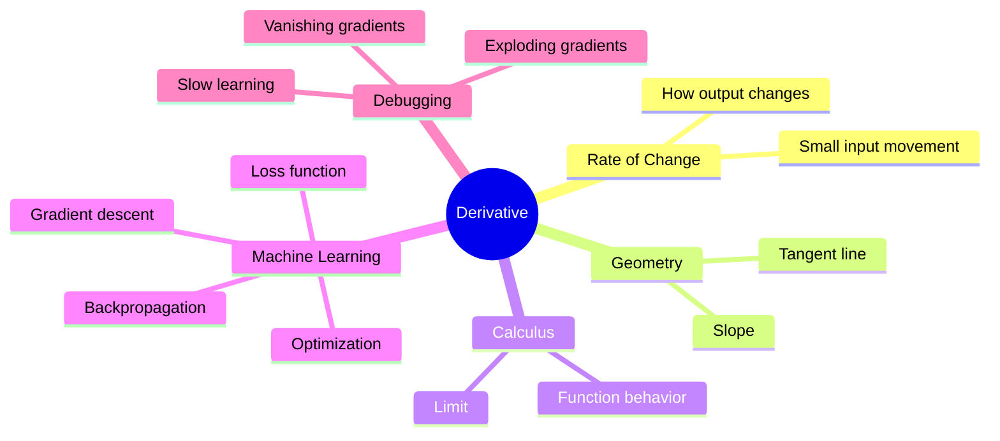
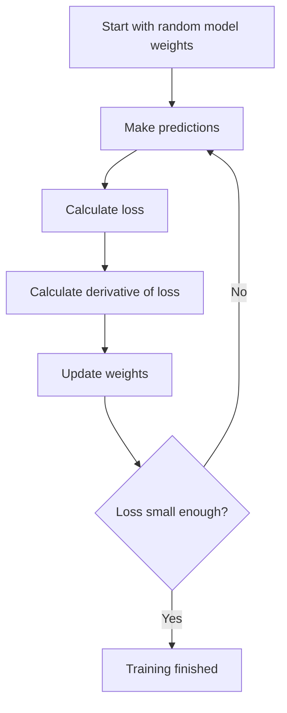
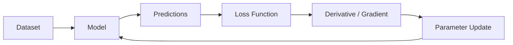

# 011 - Derivative

**Course:** 01 - Math, Statistics and Econometrics
**Module:** Module 01 - Mathematics for AI and Data Science
**Content Group:** Calculus
**Roadmap Source:** Mathematics for AI and Data Science / Calculus
**Lesson Type:** Mathematics
**Order in Module:** 011
**Suggested Duration:** 24 minutes

---

## 1. Summary

This lesson explains **Derivative** in the context of AI and Data Science.

A derivative measures **how fast something changes**. In machine learning, this idea is extremely important because models learn by changing their parameters in the direction that reduces error.

After this lesson, you should understand how derivatives help answer questions such as:

* How does the loss change when a model weight changes?
* Which direction should a model update its parameters?
* Why does gradient descent work?
* Why can training become slow, unstable, or stuck?
* How do neural networks learn through backpropagation?

In AI and Data Science, derivatives connect directly to:

* Optimization
* Gradient descent
* Loss functions
* Model training
* Neural networks
* Backpropagation
* Feature sensitivity
* Error minimization

---

## 2. Learning Objectives

After completing this lesson, you should be able to:

* Explain **Derivative** in your own words.
* Understand the geometric meaning of a derivative as a slope.
* Understand the derivative as an instantaneous rate of change.
* Compute simple derivatives by hand.
* Use Python to approximate a derivative numerically.
* Explain how derivatives are used in machine learning optimization.
* Connect derivatives to gradients, loss functions, and model training behavior.

---

## 3. Core Concepts

### 3.1 What Is a Derivative?

A derivative tells us how much a function output changes when the input changes slightly.

Plain-language idea:

```text
Derivative = rate of change
```

If we have a function:

```text
y = f(x)
```

Then the derivative tells us:

```text
How much y changes when x changes a little bit
```

Mathematically:

```text
f'(x) = change in f(x) / change in x
```

More formally:

```text
f'(x) = lim h -> 0 [f(x + h) - f(x)] / h
```

This means we look at a very small movement in `x` and measure how much the output changes.

---

## 4. Intuition

### 4.1 Derivative as Slope

For a straight line, slope is easy:

```text
slope = rise / run
```

Example:

```text
y = 2x + 1
```

When `x` increases by 1, `y` increases by 2.

So:

```text
Derivative = 2
```

This means the function is increasing at a constant rate.

---

### 4.2 Derivative as Tangent Slope

For a curve, the slope changes from point to point.

Example:

```text
y = x²
```

At different values of `x`, the curve becomes steeper or flatter.

```text
x = 1  -> slope = 2
x = 2  -> slope = 4
x = 3  -> slope = 6
```

So the derivative of:

```text
f(x) = x²
```

is:

```text
f'(x) = 2x
```

---

## 5. Visual Intuition

### 5.1 Tangent Line Illustration

```text
               curve: y = x²
                    *
                 *
              *
           *
        *
     *
  *
-------------------------------- x-axis
        ^
        |
   tangent slope at one point
```

The derivative gives the slope of the tangent line at a specific point.

---

### 5.2 Derivative Concept Map



---

## 6. Why Derivatives Matter in AI and Data Science

In machine learning, we usually define a loss function.

```text
Loss = how wrong the model is
```

The goal is to make the loss smaller.

A model has parameters such as:

```text
weights
biases
```

The derivative tells us:

```text
If we change this weight slightly, will the loss increase or decrease?
```

This is the foundation of optimization.

---

## 7. Machine Learning Example

Suppose we have a simple model:

```text
prediction = weight * x
```

And a loss function:

```text
loss = (prediction - actual)²
```

The model needs to know:

```text
Should weight increase or decrease?
```

The derivative answers this question.

If the derivative is positive:

```text
Increasing the weight increases the loss.
So we should decrease the weight.
```

If the derivative is negative:

```text
Increasing the weight decreases the loss.
So we should increase the weight.
```

This is the basic idea behind gradient descent.

---

## 8. Derivative and Gradient Descent

Gradient descent updates parameters using derivatives.

Formula:

```text
new_weight = old_weight - learning_rate * derivative
```

Meaning:

```text
Move the weight in the direction that reduces the loss.
```

---

### 8.1 Gradient Descent Flow



---

## 9. Small Numeric Example

Let:

```text
f(x) = x²
```

We want to find the derivative at:

```text
x = 3
```

The exact derivative is:

```text
f'(x) = 2x
```

So:

```text
f'(3) = 2 * 3 = 6
```

Interpretation:

```text
At x = 3, the function y = x² is increasing at a rate of 6.
```

---

## 10. Python Check

We can approximate the derivative using a very small value of `h`.

```python
def f(x):
    return x ** 2

x = 3
h = 0.0001

derivative = (f(x + h) - f(x)) / h

print(derivative)
```

Expected output:

```text
Approximately 6
```

This numerical method is called a **finite difference approximation**.

---

## 11. Common Derivative Rules

| Function             | Derivative         |
| -------------------- | ------------------ |
| `f(x) = c`           | `f'(x) = 0`        |
| `f(x) = x`           | `f'(x) = 1`        |
| `f(x) = x²`          | `f'(x) = 2x`       |
| `f(x) = xⁿ`          | `f'(x) = n * xⁿ⁻¹` |
| `f(x) = a * x`       | `f'(x) = a`        |
| `f(x) = f(x) + g(x)` | `f'(x) + g'(x)`    |

---

## 12. Important Rule: Chain Rule

The chain rule is one of the most important rules in machine learning.

If:

```text
y = f(g(x))
```

Then:

```text
dy/dx = dy/dg * dg/dx
```

Plain-language meaning:

```text
If one function depends on another function,
the total change is calculated by multiplying the local changes.
```

This is the mathematical foundation of **backpropagation** in neural networks.

---

## 13. Derivative vs Partial Derivative vs Gradient

### 13.1 Derivative

Used when a function has one input.

```text
f(x) = x²
```

Derivative:

```text
f'(x)
```

---

### 13.2 Partial Derivative

Used when a function has multiple inputs.

Example:

```text
f(x, y) = x² + y²
```

Partial derivatives:

```text
Change with respect to x
Change with respect to y
```

---

### 13.3 Gradient

A gradient is a vector of partial derivatives.

```text
gradient = [partial derivative with respect to x,
            partial derivative with respect to y]
```

In machine learning:

```text
gradient = direction of steepest increase in loss
```

Gradient descent moves in the opposite direction:

```text
move opposite to the gradient
```

---

## 14. AI/Data Science Workflow Connection



Derivatives appear mainly in the **training and optimization stage** of the AI/Data Science workflow.

They help the model improve by telling it how to update its parameters.

---

## 15. Practical Demo Structure

```text
concept -> small numeric example -> Python check -> visual intuition -> ML use case
```

Recommended mini-demo:

1. Define a simple function: `f(x) = x²`
2. Compute the exact derivative: `f'(x) = 2x`
3. Approximate it with Python using finite differences
4. Plot the function and tangent line
5. Connect the idea to gradient descent

---

## 16. Practice Exercise

### Exercise 1: Manual Calculation

Given:

```text
f(x) = x² + 3x + 2
```

Find:

```text
f'(x)
```

Answer:

```text
f'(x) = 2x + 3
```

At:

```text
x = 4
```

The derivative is:

```text
f'(4) = 2 * 4 + 3 = 11
```

Interpretation:

```text
At x = 4, the function is increasing at a rate of 11.
```

---

### Exercise 2: Python Approximation

```python
def f(x):
    return x**2 + 3*x + 2

x = 4
h = 0.0001

approx_derivative = (f(x + h) - f(x)) / h

print(approx_derivative)
```

Expected result:

```text
Approximately 11
```

---

### Exercise 3: Machine Learning Reflection

Write a short note answering:

```text
Where does the derivative appear in machine learning?
```

Example answer:

```text
The derivative appears when calculating how the loss changes with respect to model parameters. 
This helps gradient descent update weights and reduce the loss during training.
```

---

## 17. Mini Project

### Project: Gradient Descent from Scratch with MSE Loss

Build a small notebook that trains a simple linear regression model from scratch.

Model:

```text
y_pred = w * x + b
```

Loss:

```text
MSE = average((y_pred - y_true)²)
```

Goal:

```text
Use derivatives to update w and b until the loss becomes smaller.
```

---

### Suggested Notebook Sections

```text
1. Create a small synthetic dataset
2. Initialize weight and bias
3. Define prediction function
4. Define MSE loss
5. Compute derivatives manually
6. Update parameters using gradient descent
7. Plot loss over epochs
8. Explain what happened
```

---

### Expected Portfolio Artifact

By the end, you should have:

* A notebook
* A loss curve
* A short explanation of gradient descent
* Manual derivative formulas
* A simple working training loop

---

## 18. Common Mistakes

### Mistake 1: Memorizing Rules Without Intuition

Bad approach:

```text
Only memorize f'(x) = 2x
```

Better approach:

```text
Understand that the derivative tells how quickly the function changes.
```

---

### Mistake 2: Confusing Derivative and Function Value

Function value:

```text
f(3) = 9
```

Derivative value:

```text
f'(3) = 6
```

They are different.

```text
f(3) tells us the output.
f'(3) tells us the rate of change at that point.
```

---

### Mistake 3: Ignoring Learning Rate

In gradient descent:

```text
new_weight = old_weight - learning_rate * derivative
```

If the learning rate is too large:

```text
Training may become unstable.
```

If the learning rate is too small:

```text
Training may be too slow.
```

---

### Mistake 4: Not Connecting Derivatives to ML

Derivatives are not just abstract math.

They are used directly in:

* Loss minimization
* Neural network training
* Backpropagation
* Optimizers such as SGD, Adam, and RMSProp
* Debugging training curves

---

## 19. Assumptions, Limitations, and Caveats

### Assumptions

* The function is smooth enough to have a derivative.
* Small changes in input produce meaningful changes in output.
* The loss function is suitable for optimization.

### Limitations

* Some functions are not differentiable at certain points.
* Numerical derivative approximations can be inaccurate if `h` is too large or too small.
* Derivatives show local change, not always the global best solution.

### Caveats in Machine Learning

* A small gradient can mean the model is near a minimum, but it can also mean the model is stuck.
* A large gradient can speed up learning, but it can also cause unstable training.
* Deep neural networks may suffer from vanishing or exploding gradients.

---

## 20. Completion Checklist

* [ ] I can explain **Derivative** in 1-2 minutes.
* [ ] I understand derivative as a rate of change.
* [ ] I understand derivative as the slope of a tangent line.
* [ ] I can compute simple derivatives by hand.
* [ ] I can approximate a derivative using Python.
* [ ] I know how derivatives relate to gradient descent.
* [ ] I know how derivatives relate to loss functions.
* [ ] I have created a small notebook, chart, experiment, or portfolio note.
* [ ] I have written at least one caveat, assumption, or follow-up question.

---

## 21. Related Outcome

This lesson supports the broader outcome:

```text
Understand the math language behind vectors, optimization, gradients, PCA, neural networks, and embeddings.
```

Derivatives are especially important for:

* Optimization
* Gradients
* Neural networks
* Loss functions
* Backpropagation
* Training behavior

---

## 22. Final Summary

**Derivative** is a key milestone in the AI and Data Scientist roadmap.

It helps you understand how functions change, how models learn, and how optimization works. In machine learning, derivatives are used to calculate gradients, update parameters, reduce loss, and debug training behavior.

Do not learn derivatives only as formulas. Turn this topic into a practical artifact:

```text
notebook -> chart -> gradient descent demo -> loss curve -> portfolio explanation
```

A good final artifact for this lesson is:

```text
Gradient Descent from Scratch with MSE Loss and a Loss Curve over Epochs
```
