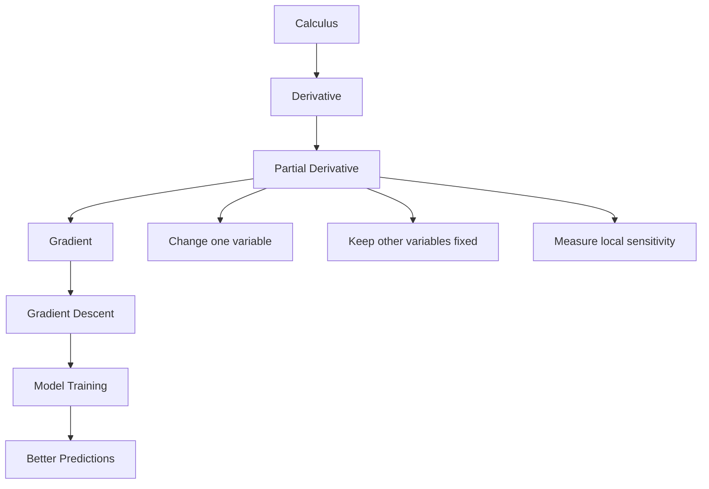
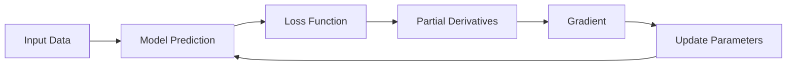
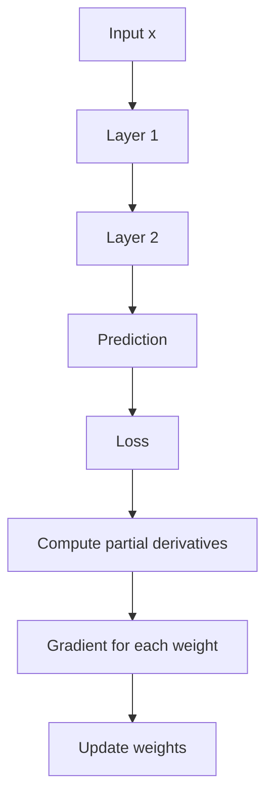
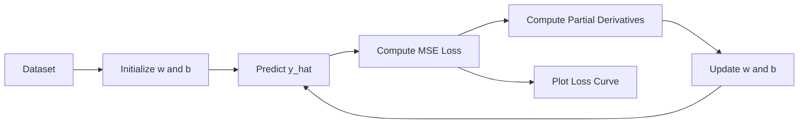

# 012 - Partial Derivative

**Course:** 01 - Math, Statistics and Econometrics
**Module:** Module 01 - Mathematics for AI and Data Science
**Content Group:** Calculus
**Roadmap Source:** Mathematics for AI and Data Science / Calculus
**Lesson Type:** Mathematics
**Order in Module:** 012
**Suggested Duration:** 24 minutes

---

## 1. Summary

This lesson explains **Partial Derivative** in the context of AI and Data Science.

A **partial derivative** measures how a function changes with respect to **one variable**, while keeping all other variables fixed.

In AI and Machine Learning, partial derivatives are essential because most models depend on many variables: weights, biases, input features, hyperparameters, and loss values. To train a model, we need to know how changing each parameter affects the final loss.

In simple terms:

> A partial derivative tells us:
> “If I slightly change this one variable, how much will the output change?”

---

## 2. Learning Objectives

After this lesson, you should be able to:

* Explain partial derivatives in your own words.
* Understand the difference between an ordinary derivative and a partial derivative.
* Compute simple partial derivatives by hand.
* Understand how partial derivatives form a **gradient**.
* Recognize how partial derivatives are used in model training.
* Connect partial derivatives to gradient descent, neural networks, and loss optimization.
* Build a small Python demo to verify partial derivatives numerically.

---

## 3. Why Partial Derivative Matters in AI and Data Science

Many AI and Data Science problems involve functions with multiple inputs.

Examples:

| Context           | Function             | Variables                        |
| ----------------- | -------------------- | -------------------------------- |
| Linear regression | Loss function        | Weight, bias                     |
| Neural network    | Prediction function  | Thousands or millions of weights |
| Image model       | Pixel transformation | Pixel values, filters            |
| Optimization      | Objective function   | Model parameters                 |
| Embedding model   | Similarity score     | Vector dimensions                |
| PCA               | Variance objective   | Projection directions            |

A model usually has many parameters:

```text
model output = f(w1, w2, w3, ..., b)
```

The loss depends on those parameters:

```text
loss = L(w1, w2, w3, ..., b)
```

To improve the model, we ask:

```text
How does the loss change if I change w1?
How does the loss change if I change w2?
How does the loss change if I change b?
```

Each of these questions is answered by a **partial derivative**.

---

## 4. Concept Tree



---

## 5. Ordinary Derivative vs Partial Derivative

### Ordinary Derivative

An ordinary derivative is used when a function has one main input variable.

Example:

```math
f(x) = x^2
```

The derivative is:

```math
\frac{df}{dx} = 2x
```

This means:

```text
When x changes slightly, f(x) changes at a rate of 2x.
```

---

### Partial Derivative

A partial derivative is used when a function has multiple input variables.

Example:

```math
f(x, y) = x^2 + y^2
```

This function depends on both `x` and `y`.

The partial derivative with respect to `x` is:

```math
\frac{\partial f}{\partial x} = 2x
```

The partial derivative with respect to `y` is:

```math
\frac{\partial f}{\partial y} = 2y
```

When calculating:

```math
\frac{\partial f}{\partial x}
```

we treat `y` as a constant.

When calculating:

```math
\frac{\partial f}{\partial y}
```

we treat `x` as a constant.

---

## 6. Intuition

Imagine a mountain surface.

The height of the mountain depends on your position:

```math
z = f(x, y)
```

Where:

* `x` = east-west position
* `y` = north-south position
* `z` = height

A partial derivative answers:

```text
If I move only in the x-direction, how fast does the height change?
If I move only in the y-direction, how fast does the height change?
```

---

## 7. Geometric Intuition

```text
                z = f(x, y)
                    height
                      ^
                      |
                      |
                  ____|____
              ___/         \___
           __/                 \__
          /                       \
         /                         \
        --------------------------------> x
       /
      /
     y
```

The surface depends on two directions: `x` and `y`.

Partial derivatives measure slope along one direction at a time:

```text
∂f/∂x = slope when moving only along x
∂f/∂y = slope when moving only along y
```

---

## 8. Core Notation

For a function:

```math
f(x, y)
```

The partial derivative with respect to `x` is written as:

```math
\frac{\partial f}{\partial x}
```

The partial derivative with respect to `y` is written as:

```math
\frac{\partial f}{\partial y}
```

The symbol:

```math
\partial
```

means “partial change.”

It is different from:

```math
d
```

which is used for ordinary derivatives.

---

## 9. Simple Example

Given:

```math
f(x, y) = 3x^2 + 2xy + y^2
```

Find:

```math
\frac{\partial f}{\partial x}
```

and:

```math
\frac{\partial f}{\partial y}
```

---

### Partial derivative with respect to x

Treat `y` as a constant.

```math
f(x, y) = 3x^2 + 2xy + y^2
```

Differentiate term by term:

```math
\frac{\partial}{\partial x}(3x^2) = 6x
```

```math
\frac{\partial}{\partial x}(2xy) = 2y
```

```math
\frac{\partial}{\partial x}(y^2) = 0
```

So:

```math
\frac{\partial f}{\partial x} = 6x + 2y
```

---

### Partial derivative with respect to y

Treat `x` as a constant.

```math
f(x, y) = 3x^2 + 2xy + y^2
```

Differentiate term by term:

```math
\frac{\partial}{\partial y}(3x^2) = 0
```

```math
\frac{\partial}{\partial y}(2xy) = 2x
```

```math
\frac{\partial}{\partial y}(y^2) = 2y
```

So:

```math
\frac{\partial f}{\partial y} = 2x + 2y
```

---

## 10. Numeric Example

Let:

```math
f(x, y) = 3x^2 + 2xy + y^2
```

At:

```math
x = 2,\quad y = 3
```

We have:

```math
\frac{\partial f}{\partial x} = 6x + 2y
```

Substitute:

```math
\frac{\partial f}{\partial x} = 6(2) + 2(3) = 12 + 6 = 18
```

And:

```math
\frac{\partial f}{\partial y} = 2x + 2y
```

Substitute:

```math
\frac{\partial f}{\partial y} = 2(2) + 2(3) = 4 + 6 = 10
```

So at point `(2, 3)`:

```math
\frac{\partial f}{\partial x} = 18
```

```math
\frac{\partial f}{\partial y} = 10
```

Interpretation:

```text
Near x = 2 and y = 3:
- If x increases slightly, f increases about 18 times that small change.
- If y increases slightly, f increases about 10 times that small change.
```

---

## 11. From Partial Derivatives to Gradient

When we collect all partial derivatives into one vector, we get the **gradient**.

For:

```math
f(x, y)
```

The gradient is:

```math
\nabla f(x, y) =
\begin{bmatrix}
\frac{\partial f}{\partial x} \\
\frac{\partial f}{\partial y}
\end{bmatrix}
```

For:

```math
f(x, y) = 3x^2 + 2xy + y^2
```

We found:

```math
\frac{\partial f}{\partial x} = 6x + 2y
```

```math
\frac{\partial f}{\partial y} = 2x + 2y
```

So:

```math
\nabla f(x, y) =
\begin{bmatrix}
6x + 2y \\
2x + 2y
\end{bmatrix}
```

At `(2, 3)`:

```math
\nabla f(2, 3) =
\begin{bmatrix}
18 \\
10
\end{bmatrix}
```

---

## 12. Gradient Direction

The gradient points in the direction where the function increases fastest.

```text
Gradient = direction of steepest increase
Negative gradient = direction of steepest decrease
```

This is why gradient descent uses:

```math
-\nabla f
```

because model training usually wants to minimize loss.

---

## 13. Gradient Descent Connection

Gradient descent updates model parameters by moving against the gradient.

```math
\theta_{new} = \theta_{old} - \alpha \nabla L(\theta)
```

Where:

| Symbol  | Meaning              |
| ------- | -------------------- |
| `θ`     | Model parameter      |
| `L(θ)`  | Loss function        |
| `∇L(θ)` | Gradient of the loss |
| `α`     | Learning rate        |

In words:

```text
new parameter = old parameter - learning rate × gradient
```

---

## 14. Gradient Descent Flow



This loop is the foundation of training many ML and DL models.

---

## 15. AI / ML Example: Linear Regression

Suppose we have a simple model:

```math
\hat{y} = wx + b
```

Where:

* `w` = weight
* `b` = bias
* `x` = input feature
* `ŷ` = predicted output

The error is:

```math
e = \hat{y} - y
```

Using Mean Squared Error for one data point:

```math
L = (\hat{y} - y)^2
```

Substitute:

```math
L = (wx + b - y)^2
```

Now the loss depends on `w` and `b`.

So we need:

```math
\frac{\partial L}{\partial w}
```

and:

```math
\frac{\partial L}{\partial b}
```

---

### Partial derivative with respect to w

```math
L = (wx + b - y)^2
```

Using the chain rule:

```math
\frac{\partial L}{\partial w}
=
2(wx + b - y)x
```

---

### Partial derivative with respect to b

```math
\frac{\partial L}{\partial b}
=
2(wx + b - y)
```

These two partial derivatives tell us how to update `w` and `b`.

---

## 16. Model Training Interpretation

If:

```math
\frac{\partial L}{\partial w} > 0
```

then increasing `w` increases the loss, so gradient descent decreases `w`.

If:

```math
\frac{\partial L}{\partial w} < 0
```

then increasing `w` decreases the loss, so gradient descent increases `w`.

The same logic applies to `b`.

This is how a model learns.

---

## 17. Python Check

```python
def f(x, y):
    return 3*x**2 + 2*x*y + y**2

x, y = 2.0, 3.0

df_dx = 6*x + 2*y
df_dy = 2*x + 2*y

print("f(x, y):", f(x, y))
print("Partial derivative w.r.t x:", df_dx)
print("Partial derivative w.r.t y:", df_dy)
```

Expected output:

```text
f(x, y): 33.0
Partial derivative w.r.t x: 18.0
Partial derivative w.r.t y: 10.0
```

---

## 18. Numeric Approximation with Finite Difference

A partial derivative can also be approximated numerically.

For `x`:

```math
\frac{\partial f}{\partial x}
\approx
\frac{f(x+h, y) - f(x, y)}{h}
```

For `y`:

```math
\frac{\partial f}{\partial y}
\approx
\frac{f(x, y+h) - f(x, y)}{h}
```

Python example:

```python
def f(x, y):
    return 3*x**2 + 2*x*y + y**2

x, y = 2.0, 3.0
h = 1e-5

approx_dx = (f(x + h, y) - f(x, y)) / h
approx_dy = (f(x, y + h) - f(x, y)) / h

print("Approx ∂f/∂x:", approx_dx)
print("Approx ∂f/∂y:", approx_dy)
```

Expected result should be close to:

```text
Approx ∂f/∂x: 18
Approx ∂f/∂y: 10
```

Small differences happen because computers use finite precision.

---

## 19. Partial Derivative in Neural Networks

A neural network contains many parameters:

```text
weights: w1, w2, w3, ..., wn
biases: b1, b2, b3, ..., bm
```

The loss function depends on all of them:

```math
L = L(w_1, w_2, ..., w_n, b_1, b_2, ..., b_m)
```

Training requires many partial derivatives:

```math
\frac{\partial L}{\partial w_1},
\frac{\partial L}{\partial w_2},
...,
\frac{\partial L}{\partial b_1},
\frac{\partial L}{\partial b_2}
```

These partial derivatives are computed efficiently using **backpropagation**.

---

## 20. Backpropagation Connection

Backpropagation is basically an efficient way to apply the chain rule across a neural network.



Partial derivatives answer:

```text
How much did each weight contribute to the final loss?
```

---

## 21. Practical Data Science Questions It Helps Answer

Partial derivatives help answer questions like:

| Question                                 | Role of Partial Derivative                              |
| ---------------------------------------- | ------------------------------------------------------- |
| Why is my model not learning?            | Gradients may be too small, too large, or unstable      |
| Which parameter affects the loss most?   | Check magnitude of partial derivatives                  |
| Why does loss explode?                   | Gradients may be exploding                              |
| Why does loss stop improving?            | Gradients may be vanishing or learning rate may be poor |
| How should parameters be updated?        | Use gradients from partial derivatives                  |
| How does a feature influence prediction? | Analyze sensitivity with respect to input variables     |

---

## 22. Common Mistakes

### Mistake 1: Forgetting to hold other variables constant

For:

```math
f(x, y) = x^2y
```

When calculating:

```math
\frac{\partial f}{\partial x}
```

`treat y as constant`.

So:

```math
\frac{\partial f}{\partial x} = 2xy
```

Not:

```math
2xy + x^2
```

---

### Mistake 2: Confusing gradient with one partial derivative

A partial derivative is one component.

A gradient is a vector of all partial derivatives.

```math
\frac{\partial f}{\partial x}
```

is one partial derivative.

```math
\nabla f
```

is the full gradient.

---

### Mistake 3: Thinking partial derivatives are only theoretical

They are directly used in:

* Gradient descent
* Neural network training
* Backpropagation
* Logistic regression
* Linear regression
* Optimization
* Deep learning frameworks like PyTorch and TensorFlow

---

### Mistake 4: Ignoring scale

If gradients are too large, training may become unstable.

If gradients are too small, training may become very slow.

This is why learning rate, normalization, initialization, and activation functions matter.

---

## 23. Mini Practice

### Exercise 1

Given:

```math
f(x, y) = x^2 + 4xy + 5y^2
```

Find:

```math
\frac{\partial f}{\partial x}
```

and:

```math
\frac{\partial f}{\partial y}
```

---

### Exercise 2

Given:

```math
f(x, y, z) = xy + yz + z^2
```

Find:

```math
\frac{\partial f}{\partial x}
```

```math
\frac{\partial f}{\partial y}
```

```math
\frac{\partial f}{\partial z}
```

---

### Exercise 3

For a model:

```math
\hat{y} = wx + b
```

and loss:

```math
L = (\hat{y} - y)^2
```

derive:

```math
\frac{\partial L}{\partial w}
```

and:

```math
\frac{\partial L}{\partial b}
```

---

## 24. Answers

### Answer 1

```math
f(x, y) = x^2 + 4xy + 5y^2
```

```math
\frac{\partial f}{\partial x} = 2x + 4y
```

```math
\frac{\partial f}{\partial y} = 4x + 10y
```

---

### Answer 2

```math
f(x, y, z) = xy + yz + z^2
```

```math
\frac{\partial f}{\partial x} = y
```

```math
\frac{\partial f}{\partial y} = x + z
```

```math
\frac{\partial f}{\partial z} = y + 2z
```

---

### Answer 3

```math
\hat{y} = wx + b
```

```math
L = (wx + b - y)^2
```

```math
\frac{\partial L}{\partial w} = 2(wx + b - y)x
```

```math
\frac{\partial L}{\partial b} = 2(wx + b - y)
```

---

## 25. Small Portfolio Artifact

Create a notebook named:

```text
012_partial_derivative_gradient_descent.ipynb
```

Suggested notebook structure:

```text
1. Define a two-variable function f(x, y)
2. Compute partial derivatives by hand
3. Verify with Python
4. Plot the function surface or contour
5. Show gradient direction
6. Connect to MSE loss
7. Implement one step of gradient descent
8. Write observations
```

---

## 26. Mini Project Connection

### Project: Gradient Descent from Scratch with MSE Loss

Goal:

Build a small linear regression trainer from scratch.

Workflow:



Core formulas:

```math
\hat{y} = wx + b
```

```math
L = \frac{1}{n}\sum_{i=1}^{n}(\hat{y}_i - y_i)^2
```

```math
\frac{\partial L}{\partial w}
=
\frac{2}{n}\sum_{i=1}^{n}(\hat{y}_i - y_i)x_i
```

```math
\frac{\partial L}{\partial b}
=
\frac{2}{n}\sum_{i=1}^{n}(\hat{y}_i - y_i)
```

Update rules:

```math
w = w - \alpha \frac{\partial L}{\partial w}
```

```math
b = b - \alpha \frac{\partial L}{\partial b}
```

---

## 27. Checklist

Before finishing this lesson, make sure you can:

* [ ] Explain what a partial derivative means.
* [ ] Explain why other variables are treated as constants.
* [ ] Compute simple partial derivatives by hand.
* [ ] Explain the difference between a partial derivative and a gradient.
* [ ] Connect partial derivatives to gradient descent.
* [ ] Explain how partial derivatives help train ML models.
* [ ] Write a short Python script to verify a partial derivative numerically.
* [ ] Identify one caveat, such as exploding gradients, vanishing gradients, or bad learning rate.

---

## 28. Common Caveats

Partial derivatives are powerful, but they come with assumptions and limitations.

### Caveat 1: Local information only

A partial derivative describes local change near a point.

It does not automatically tell you the global shape of the function.

---

### Caveat 2: Not all functions are smooth

Some functions are not differentiable everywhere.

Example:

```math
f(x) = |x|
```

At:

```math
x = 0
```

the derivative is not well-defined.

In deep learning, activation functions like ReLU also have non-smooth points.

---

### Caveat 3: Numerical gradients can be inaccurate

Finite difference approximation depends on `h`.

If `h` is too large, the approximation is rough.

If `h` is too small, floating-point error can dominate.

---

### Caveat 4: Large gradients can destabilize training

If gradients are too large, parameters may jump too far.

This can cause:

```text
loss explosion
NaN values
unstable training
```

---

### Caveat 5: Small gradients can slow training

If gradients are too small, parameters barely update.

This can cause:

```text
slow learning
vanishing gradient
training plateau
```

---

## 29. Final Summary

A **partial derivative** measures how a multi-variable function changes when only one variable changes and all other variables stay fixed.

In AI and Data Science, partial derivatives are the mathematical foundation behind:

* Gradients
* Gradient descent
* Loss minimization
* Backpropagation
* Neural network training
* Model debugging
* Optimization behavior

The key idea is simple:

```text
Partial derivative = sensitivity of output to one input variable
```

For ML:

```text
Partial derivative = how much one parameter affects the loss
```

The final goal is not just to memorize formulas, but to understand how models learn from data by repeatedly computing gradients and updating parameters.

---

## 30. One-Minute Explanation

A partial derivative tells us how a function changes with respect to one variable while keeping all other variables fixed. This is important in machine learning because a model usually has many parameters, such as weights and biases. The loss function depends on all these parameters, so we need partial derivatives to know how each parameter affects the loss. When we collect all partial derivatives together, we get the gradient. Gradient descent uses this gradient to update the model parameters and reduce the loss over time.
