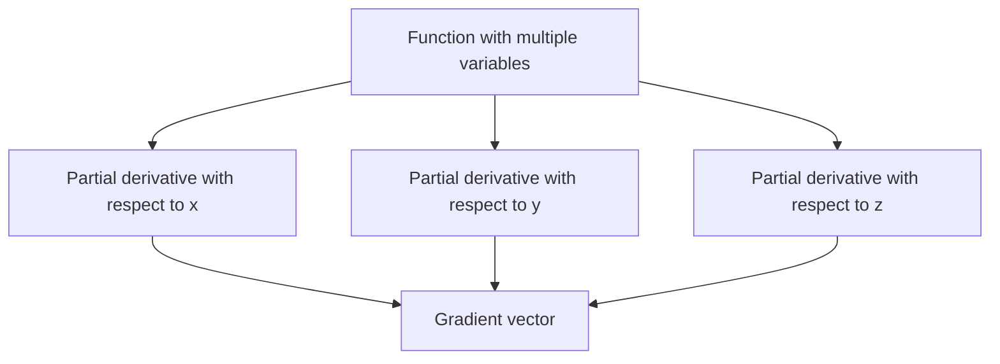
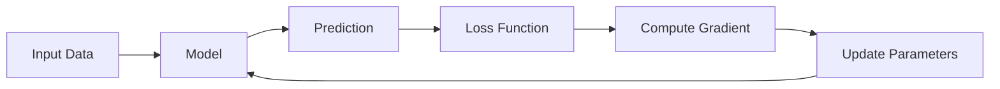
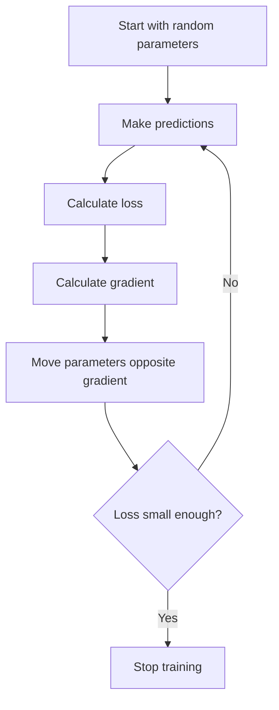
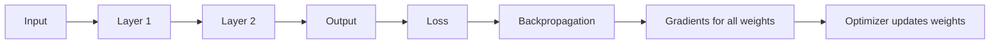

# 013 - Gradient

**Course:** 01 - Math, Statistics and Econometrics
**Module:** Module 01 - Mathematics for AI and Data Science
**Content Group:** Calculus
**Roadmap Source:** Mathematics for AI and Data Science / Calculus
**Lesson Type:** Mathematics
**Order in Module:** 013
**Suggested Duration:** 24 minutes

---

## 1. Summary

This lesson explains **Gradient** in the context of AI and Data Science.

A **gradient** tells us how a function changes when its input variables change. In machine learning, the gradient is one of the most important ideas because it tells a model **how to update its parameters to reduce error**.

In simple terms:

> The gradient points in the direction where the function increases the fastest.

For AI and Data Science, gradients help answer questions such as:

* How should model weights change to reduce loss?
* Why is the training loss going down or not going down?
* Why does gradient descent work?
* Why can neural networks learn from data?
* Why do learning rate, vanishing gradient, and exploding gradient matter?

After this lesson, you should understand how gradients connect calculus to model training, optimization, and neural networks.

---

## 2. Learning Objectives

By the end of this lesson, you should be able to:

* Explain **Gradient** in your own words.
* Understand the relationship between **partial derivatives** and **gradient vectors**.
* Interpret the gradient geometrically.
* Compute a simple gradient by hand.
* Use Python to verify a gradient calculation.
* Explain how gradients are used in **Gradient Descent**.
* Connect gradients to ML/DL training behavior.

---

## 3. Core Concept

### 3.1 What Is a Gradient?

For a function with multiple input variables, the **gradient** is a vector of partial derivatives.

If:

$$
f(x, y)
$$

is a function with two variables, then its gradient is:

$$
\nabla f(x, y) =
\begin{bmatrix}
\frac{\partial f}{\partial x} \
\frac{\partial f}{\partial y}
\end{bmatrix}
$$

Read as:

> The gradient of `f` is a vector containing how `f` changes with respect to each input variable.

---

## 4. Intuition

Imagine you are standing on a hill.

* Your position is represented by variables such as `x` and `y`.
* The height of the hill is represented by `f(x, y)`.
* The gradient tells you the direction where the hill rises the fastest.
* The negative gradient tells you the direction where the hill goes down the fastest.

This is why machine learning uses the **negative gradient** to minimize loss.

```text
Gradient direction        = fastest increase
Negative gradient direction = fastest decrease
```

---

## 5. Simple Example

Suppose we have this function:

$$
f(x, y) = x^2 + y^2
$$

This function forms a bowl-shaped surface.

Now compute the partial derivatives:

$$
\frac{\partial f}{\partial x} = 2x
$$

$$
\frac{\partial f}{\partial y} = 2y
$$

So the gradient is:

$$
\nabla f(x, y) =
\begin{bmatrix}
2x \
2y
\end{bmatrix}
$$

At the point:

$$
(x, y) = (3, 4)
$$

The gradient is:

$$
\nabla f(3, 4) = \begin{bmatrix} 2(3) \ 2(4) \end{bmatrix} = \begin{bmatrix} 6 \ 8 \end{bmatrix}
$$

So:

```text
At point (3, 4), the function increases fastest in direction [6, 8].
```

To minimize the function, we move in the opposite direction:

$$
-\nabla f(3, 4) =
\begin{bmatrix}
-6 \
-8
\end{bmatrix}
$$

---

## 6. Visual Intuition

### 6.1 Bowl Function

The function:

$$
f(x, y) = x^2 + y^2
$$

has its minimum at:

$$
(0, 0)
$$

```text
Higher loss
   ^
   |
   |        *
   |      /   \
   |    /       \
   |  /           \
   | /             \
   +------------------> x, y
        Minimum
        at (0, 0)
```

The gradient points outward because the function increases as we move away from the center.

The negative gradient points inward toward the minimum.

---

## 7. Gradient as a Vector

A gradient is not just a number. It is a **vector**.

For example:

$$
\nabla f(3, 4) =
\begin{bmatrix}
6 \
8
\end{bmatrix}
$$

This vector has:

* Direction: where the function increases fastest
* Magnitude: how fast the function increases

The magnitude is:

$$
|\nabla f(3, 4)| = \sqrt{6^2 + 8^2}
$$

$$
= \sqrt{36 + 64}
$$

$$
= \sqrt{100}
$$

$$
= 10
$$

So the gradient has strength `10` at point `(3, 4)`.

---

## 8. Relationship Between Partial Derivative and Gradient

A **partial derivative** measures change along one variable.

A **gradient** combines all partial derivatives into one vector.



Example:

$$
f(x, y, z) = x^2 + y^2 + z^2
$$

Partial derivatives:

$$
\frac{\partial f}{\partial x} = 2x
$$

$$
\frac{\partial f}{\partial y} = 2y
$$

$$
\frac{\partial f}{\partial z} = 2z
$$

Gradient:

$$
\nabla f(x, y, z) =
\begin{bmatrix}
2x \
2y \
2z
\end{bmatrix}
$$

---

## 9. Gradient in Machine Learning

In machine learning, we usually have:

* A model
* Parameters
* Predictions
* A loss function
* An optimizer

The loss function measures how wrong the model is.

Example:

$$
Loss = \frac{1}{n} \sum_{i=1}^{n}(y_i - \hat{y}_i)^2
$$

The gradient tells us:

> How should each parameter change to reduce the loss?

---

## 10. ML Training Flow



This loop is the foundation of model training.

---

## 11. Gradient Descent

Gradient Descent is an optimization algorithm that updates parameters in the direction of decreasing loss.

The update rule is:

$$
\theta_{new} = \theta_{old} - \alpha \nabla J(\theta)
$$

Where:

| Symbol             | Meaning              |
| ------------------ | -------------------- |
| $\theta$           | Model parameter      |
| $J(\theta)$        | Loss function        |
| $\nabla J(\theta)$ | Gradient of the loss |
| $\alpha$           | Learning rate        |

The minus sign means:

```text
Move opposite to the gradient.
```

Because the gradient points uphill, and we want to go downhill.

---

## 12. Gradient Descent Diagram



---

## 13. Small Numeric Example

Suppose we want to minimize:

$$
f(x) = x^2
$$

The derivative is:

$$
f'(x) = 2x
$$

Start with:

$$
x = 5
$$

Learning rate:

$$
\alpha = 0.1
$$

Gradient:

$$
f'(5) = 2(5) = 10
$$

Update:

$$
x_{new} = x_{old} - \alpha f'(x)
$$

$$
x_{new} = 5 - 0.1(10)
$$

$$
x_{new} = 4
$$

So after one step:

```text
x moves from 5 to 4.
```

The function value changes from:

$$
f(5) = 25
$$

to:

$$
f(4) = 16
$$

The loss decreased.

---

## 14. Python Check

```python
def f(x):
    return x ** 2

def gradient(x):
    return 2 * x

x = 5
learning_rate = 0.1

for step in range(5):
    grad = gradient(x)
    x = x - learning_rate * grad
    loss = f(x)

    print(f"Step {step + 1}: x = {x:.4f}, gradient = {grad:.4f}, loss = {loss:.4f}")
```

Expected output:

```text
Step 1: x = 4.0000, gradient = 10.0000, loss = 16.0000
Step 2: x = 3.2000, gradient = 8.0000, loss = 10.2400
Step 3: x = 2.5600, gradient = 6.4000, loss = 6.5536
Step 4: x = 2.0480, gradient = 5.1200, loss = 4.1943
Step 5: x = 1.6384, gradient = 4.0960, loss = 2.6844
```

The value of `x` moves closer to `0`, and the loss decreases.

---

## 15. Gradient in Linear Regression

For linear regression:

$$
\hat{y} = wx + b
$$

Where:

| Symbol    | Meaning    |
| --------- | ---------- |
| $w$       | Weight     |
| $b$       | Bias       |
| $x$       | Input      |
| $\hat{y}$ | Prediction |

The loss may be:

$$
Loss = (y - \hat{y})^2
$$

During training, we compute gradients:

$$
\frac{\partial Loss}{\partial w}
$$

$$
\frac{\partial Loss}{\partial b}
$$

Then we update:

$$
w = w - \alpha \frac{\partial Loss}{\partial w}
$$

$$
b = b - \alpha \frac{\partial Loss}{\partial b}
$$

This is how the model learns better values for `w` and `b`.

---

## 16. Gradient in Neural Networks

Neural networks have many parameters:

```text
weights + biases = parameters
```

The loss depends on all of them.

So the gradient tells the network how to update each parameter.



This process is called **backpropagation**.

Backpropagation is basically an efficient way to compute gradients in neural networks.

---

## 17. Why Gradient Matters in AI

Gradient is important because it powers:

| Area                   | Role of Gradient                |
| ---------------------- | ------------------------------- |
| Linear Regression      | Update weight and bias          |
| Logistic Regression    | Minimize classification loss    |
| Neural Networks        | Train deep models               |
| CNNs                   | Learn image filters             |
| Transformers           | Learn attention and embeddings  |
| Embeddings             | Adjust vector representations   |
| Reinforcement Learning | Optimize policy parameters      |
| PCA and Optimization   | Understand directions of change |

---

## 18. Common Training Problems Related to Gradients

### 18.1 Learning Rate Too Large

If the learning rate is too large, the model may jump around and fail to converge.

```text
Loss: 10 -> 50 -> 200 -> 1000
```

This means training is unstable.

---

### 18.2 Learning Rate Too Small

If the learning rate is too small, the model learns very slowly.

```text
Loss: 10 -> 9.99 -> 9.98 -> 9.97
```

The model is improving, but too slowly.

---

### 18.3 Vanishing Gradient

Vanishing gradient means gradients become extremely small.

Result:

```text
Weights barely update.
Training becomes very slow.
Deep layers may not learn well.
```

This often appears in deep neural networks.

---

### 18.4 Exploding Gradient

Exploding gradient means gradients become extremely large.

Result:

```text
Weights update too aggressively.
Loss becomes unstable.
Training may produce NaN values.
```

---

## 19. Practical Debugging Signals

| Symptom                             | Possible Gradient-Related Cause                      |
| ----------------------------------- | ---------------------------------------------------- |
| Loss does not decrease              | Gradient is too small, wrong loss, bad learning rate |
| Loss becomes NaN                    | Exploding gradient, unstable computation             |
| Loss decreases very slowly          | Learning rate too small                              |
| Loss jumps up and down              | Learning rate too large                              |
| Model predicts same output          | Poor initialization, weak gradients                  |
| Training works but validation fails | Overfitting, not just gradient issue                 |

---

## 20. Mental Model

Use this simple mental model:

```text
Loss function = landscape
Parameters = your position
Gradient = uphill direction
Negative gradient = downhill direction
Learning rate = step size
Training = repeatedly walking downhill
```

---

## 21. Mini Project

### Project: Gradient Descent from Scratch with MSE Loss

Build a small notebook that trains a linear regression model from scratch.

### Goal

Fit a simple line:

$$
\hat{y} = wx + b
$$

Using Mean Squared Error:

$$
MSE = \frac{1}{n} \sum_{i=1}^{n}(y_i - \hat{y}_i)^2
$$

### Steps

1. Create a small synthetic dataset.
2. Initialize `w` and `b` randomly.
3. Compute predictions.
4. Compute MSE loss.
5. Compute gradients for `w` and `b`.
6. Update parameters using gradient descent.
7. Plot the loss curve over epochs.

### Expected Artifact

Your final artifact should include:

* A notebook
* A loss curve
* Final learned parameters
* A short explanation of how gradients updated the model

---

## 22. Practice Exercise

### Exercise 1

Given:

$$
f(x, y) = 3x^2 + 2y^2
$$

Find:

$$
\nabla f(x, y)
$$

Then evaluate it at:

$$
(x, y) = (2, 3)
$$

---

### Solution

Partial derivative with respect to `x`:

$$
\frac{\partial f}{\partial x} = 6x
$$

Partial derivative with respect to `y`:

$$
\frac{\partial f}{\partial y} = 4y
$$

So:

$$
\nabla f(x, y) =
\begin{bmatrix}
6x \
4y
\end{bmatrix}
$$

At `(2, 3)`:

$$
\nabla f(2, 3) = \begin{bmatrix} 6(2) \ 4(3) \end{bmatrix} = \begin{bmatrix} 12 \ 12 \end{bmatrix}
$$

---

## 23. Common Mistakes

### Mistake 1: Thinking Gradient Is Just One Number

A derivative for one variable is one number.

A gradient for multiple variables is a vector.

---

### Mistake 2: Moving in the Gradient Direction When Minimizing

The gradient points toward increase.

For minimization, move in the opposite direction:

$$
-\nabla f
$$

---

### Mistake 3: Ignoring Learning Rate

Even with a correct gradient, a bad learning rate can break training.

```text
Correct gradient + bad learning rate = bad training behavior
```

---

### Mistake 4: Memorizing Formula Without Building Intuition

The most useful intuition is:

```text
Gradient tells the model how each parameter affects the loss.
```

---

### Mistake 5: Not Validating with a Small Example

Before applying gradient descent to a big model, test the idea on a small function such as:

$$
f(x) = x^2
$$

or:

$$
f(x, y) = x^2 + y^2
$$

---

## 24. Checklist

You have completed this lesson if you can:

* Explain **Gradient** in 1-2 minutes.
* Explain why gradient is a vector.
* Compute a simple gradient by hand.
* Explain why Gradient Descent uses the negative gradient.
* Write a small Python loop for Gradient Descent.
* Connect gradient to loss, model parameters, and optimization.
* Identify at least one gradient-related training problem.
* Create a notebook, chart, or mini experiment using gradients.

---

## 25. Related Outcome

This lesson helps you understand the mathematical language behind:

* Vectors
* Optimization
* Gradients
* PCA
* Neural networks
* Embeddings
* Model training
* Loss functions
* Backpropagation

---

## 26. Related Project

**Mini Project:** Gradient Descent from Scratch with MSE Loss and a Loss Curve over Epochs.

Suggested output:

```text
gradient_descent_from_scratch.ipynb
loss_curve.png
short_explanation.md
```

---

## 27. Final Summary

**Gradient** is a key milestone in the AI and Data Science roadmap.

It connects calculus to real model training.

In machine learning:

```text
Gradient tells the model how to change its parameters.
Gradient Descent uses this information to reduce loss.
Backpropagation computes gradients efficiently in neural networks.
```

Do not only memorize the formula. Turn this topic into a practical artifact:

* A notebook
* A chart
* A small experiment
* A loss curve
* A model training demo
* A portfolio note

The goal is not just to know what a gradient is.

The goal is to understand how models learn.

---

# Bài luyện tập

## Mục tiêu


## Đề bài


## Yêu cầu hoàn thành

- [ ] 
- [ ] 
- [ ] 

## Kết quả / lời giải


## Ghi chú
